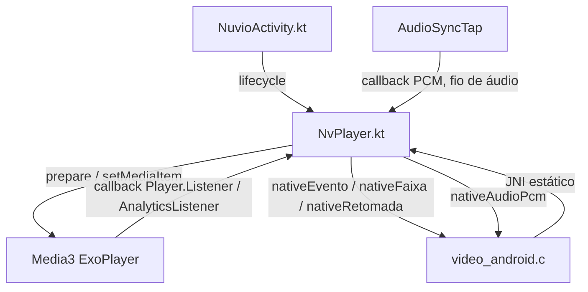

# `android/app/src/main/java/space/nuvio/nativelegacy/NvPlayer.kt` — host Media3 do Android

## Para que serve

Mantém a sessão ExoPlayer e a SurfaceView do Android, com comandos C/JNI e callbacks de volta ao backend.
Serializa comandos pelo Handler principal e rejeita aberturas/eventos superados por sessão/pedido.
Trata retomada, faixas, HDR, cache e tap PCM; somente Android (`android/app/src/main/java/space/nuvio/nativelegacy/NvPlayer.kt:55`, `android/app/src/main/java/space/nuvio/nativelegacy/NvPlayer.kt:74`, `android/app/src/main/java/space/nuvio/nativelegacy/NvPlayer.kt:194`).

## Funções públicas (`@JvmStatic`)

A assinatura JNI deve corresponder a `src/video_android.c:resolverMetodos` (localização exata no grafo). Não há ABI binária compartilhada com .NET: são pontes distintas. As travas explícitas são AtomicInteger para pedidos/liberações e volatile para cache; o restante exige confinamento de fio descrito por função.

| Assinatura Kotlin | Fio, pré-condições e efeitos | Evidência |
|---|---|---|
| `@JvmStatic external fun nativeIniciar()` | Kotlin → C: registra classe e IDs JNI; chamado no início, com fallback se biblioteca ainda não carregada. | `android/app/src/main/java/space/nuvio/nativelegacy/NvPlayer.kt:123` |
| `@JvmStatic external fun nativeEvento(tipo: Int, a: Int, b: Int)` | Kotlin → C: evento e dois inteiros conforme tabela; listeners validam sessão/pedido. | `android/app/src/main/java/space/nuvio/nativelegacy/NvPlayer.kt:124` |
| `@JvmStatic external fun nativeFaixa(tipo: Int, idx: Int, lingua: String, flags: Int, nome: String, mime: String, canais: Int)` | Kotlin → C: uma faixa (tipo, índice, idioma, flags, nome, mime, canais); respeitar 32 por tipo. | `android/app/src/main/java/space/nuvio/nativelegacy/NvPlayer.kt:128` |
| `@JvmStatic external fun nativeFaixasFim(selAudio: Int, selLeg: Int)` | Kotlin → C: publica término da lista e seleções; enviar depois de todas as faixas. | `android/app/src/main/java/space/nuvio/nativelegacy/NvPlayer.kt:129` |
| `@JvmStatic external fun nativeLegenda(texto: String, durMs: Int)` | Kotlin → C: cue de texto e duração estimada; grupo vazio limpa texto; atraso positivo pode postar entrega. | `android/app/src/main/java/space/nuvio/nativelegacy/NvPlayer.kt:130` |
| `@JvmStatic external fun nativePos(ms: Int)` | Kotlin → C: posição em ms no tique de 250 ms da sessão atual. | `android/app/src/main/java/space/nuvio/nativelegacy/NvPlayer.kt:131` |
| `@JvmStatic external fun nativeTela(hdr: Int, dv: Int)` | Kotlin → C: capacidades HDR/DV da tela; não são selos do fluxo reproduzido. | `android/app/src/main/java/space/nuvio/nativelegacy/NvPlayer.kt:132` |
| `@JvmStatic external fun nativeHdr(hdr: String, dv: Int, atmos: Int)` | Kotlin → C: formato do fluxo HDR/DV/Atmos, distinto da capacidade da tela. | `android/app/src/main/java/space/nuvio/nativelegacy/NvPlayer.kt:133` |
| `@JvmStatic external fun nativeRetomada(geracao: Int, aceita: Int)` | Kotlin → C: ACK da geração recebida, aceita 1/0; C ignora geração antiga. | `android/app/src/main/java/space/nuvio/nativelegacy/NvPlayer.kt:134` |
| `@JvmStatic external fun nativeFitPassiva(rede: Long, geracao: Int, origem: String, kbps: IntArray, fimMs: Long)` | Kotlin → C: amostras passivas de rede com token/geração; não é medição ativa. | `android/app/src/main/java/space/nuvio/nativelegacy/NvPlayer.kt:135` |
| `@JvmStatic external fun nativeAudioPcm(pcm: ShortArray, n: Int, ptsUs: Long)` | Kotlin → C: tap no fio de áudio, array PCM e timestamp em microssegundos; copiar durante callback. | `android/app/src/main/java/space/nuvio/nativelegacy/NvPlayer.kt:136` |
| `@JvmStatic external fun nativeAudioEstado(fmt: Int)` | Kotlin → C: estado do áudio PCM/bitstream; não assumir callback no principal. | `android/app/src/main/java/space/nuvio/nativelegacy/NvPlayer.kt:137` |
| `@JvmStatic external fun nativeCache(estado: Int, pedidoMb: Int, limiteMb: Int, usadoMb: Int)` | Kotlin → C: estado/pedido/limite/uso do cache em MB; relatório por sessão. | `android/app/src/main/java/space/nuvio/nativelegacy/NvPlayer.kt:149` |
| `@JvmStatic fun iniciar(activity: Activity, camada: FrameLayout)` | Principal/Activity: guarda Activity e camada, anexa listener de layout, registra JNI e informa tela; Activity/camada válidas. | `android/app/src/main/java/space/nuvio/nativelegacy/NvPlayer.kt:207` |
| `@JvmStatic fun pausarPeloSistema()` | Principal/lifecycle: pausa player existente; não é wrapper assíncrono para fio arbitrário. | `android/app/src/main/java/space/nuvio/nativelegacy/NvPlayer.kt:238` |
| `@JvmStatic fun encerrar()` | Principal/lifecycle: invalida pedidos, libera sessão e retira Surface/camada/Activity. | `android/app/src/main/java/space/nuvio/nativelegacy/NvPlayer.kt:244` |
| `@JvmStatic fun abrir(url: String, cabecalhos: String)` | Qualquer fio: delega abertura com início zero; argumentos devem sobreviver à chamada JNI como Strings Kotlin. | `android/app/src/main/java/space/nuvio/nativelegacy/NvPlayer.kt:257` |
| `@JvmStatic fun abrirPosicao(url: String, cabecalhos: String, inicioMs: Int, geracao: Int)` | Qualquer fio: incrementa pedidos e posta no Handler; descarta abertura superada; início em MILISSEGUNDOS >=0. | `android/app/src/main/java/space/nuvio/nativelegacy/NvPlayer.kt:258` |
| `@JvmStatic fun abrirRetomada(url: String, cabecalhos: String, inicioMs: Int, fracao: Int, geracao: Int)` | Qualquer fio: posta abertura com fracao limitada a 0..9999 (centésimos de ponto percentual) e geração nativa. | `android/app/src/main/java/space/nuvio/nativelegacy/NvPlayer.kt:264` |
| `@JvmStatic fun parar()` | Qualquer fio: invalida pedidos antes de postar liberar; só executa se pedido ainda atual. | `android/app/src/main/java/space/nuvio/nativelegacy/NvPlayer.kt:271` |
| `@JvmStatic fun pausar(p: Int)` | Qualquer fio: posta playWhenReady = (p == 0). | `android/app/src/main/java/space/nuvio/nativelegacy/NvPlayer.kt:275` |
| `@JvmStatic fun buscar(ms: Int)` | Qualquer fio: captura pedido e posta seekTo em ms >=0 somente se ainda atual. | `android/app/src/main/java/space/nuvio/nativelegacy/NvPlayer.kt:276` |
| `@JvmStatic fun volume(pct: Int)` | Qualquer fio: posta volume limitado a 0..100%. | `android/app/src/main/java/space/nuvio/nativelegacy/NvPlayer.kt:280` |
| `@JvmStatic fun cache(mb: Int)` | Qualquer fio: grava cacheMbPedido volatile em 0..1024 MB para próximas aberturas; cache em disco pertence a CacheMidia. | `android/app/src/main/java/space/nuvio/nativelegacy/NvPlayer.kt:283` |
| `@JvmStatic fun ganho(pct: Int)` | Qualquer fio: posta ganho normalizado por GanhoMath e aplica no processador PCM. | `android/app/src/main/java/space/nuvio/nativelegacy/NvPlayer.kt:284` |
| `@JvmStatic fun velocidade(centesimos: Int)` | Qualquer fio: posta velocidade limitada a 25..400 centésimos; não garante suporte com passthrough. | `android/app/src/main/java/space/nuvio/nativelegacy/NvPlayer.kt:289` |
| `@JvmStatic fun janela(x: Int, y: Int, w: Int, h: Int, encaixa: Int)` | Qualquer fio: posta retângulo em coordenadas lógicas 1920x1080; encaixa !=0 preserva proporção. | `android/app/src/main/java/space/nuvio/nativelegacy/NvPlayer.kt:293` |
| `@JvmStatic fun escolher(tipo: Int, idx: Int)` | Qualquer fio: posta escolha; 0 áudio, 1 legenda (-1 desliga), 2 atraso em ms, 3 liga/desliga tap PCM. | `android/app/src/main/java/space/nuvio/nativelegacy/NvPlayer.kt:294` |

## Eventos e ordem

Os números são o contrato com `nativeEvento`; não impor ordem “tocando depois do primeiro quadro”: READY pode emitir EV_TOCANDO antes de onRenderedFirstFrame (`android/app/src/main/java/space/nuvio/nativelegacy/NvPlayer.kt:846`, `android/app/src/main/java/space/nuvio/nativelegacy/NvPlayer.kt:897`).

| Código | Significado e payload |
|---|---|
| 1 | PRONTO, duração em ms; timeline pode reenviar duração. |
| 2 | TOCANDO quando pronto e isPlaying. |
| 3 | PAUSADO quando playWhenReady está falso; buffering não é pausa. |
| 4 | FIM em STATE_ENDED; parar não equivale a fim natural. |
| 5 | ERRO com código de PlaybackException. |
| 6 | TAMANHO, largura corrigida por pixelWidthHeightRatio e altura. |
| 7 | BUFFER, 0 no buffering e 100 no ready. |
| 8 | PRIMEIRO_QUADRO, callback de renderização. |
| 9 | AUDIO_SEM_DECODER. |
| 10 | SUPERFICIE_ESTAVEL após a política de recriação. |

Definições: `android/app/src/main/java/space/nuvio/nativelegacy/NvPlayer.kt:57`; emissores: `android/app/src/main/java/space/nuvio/nativelegacy/NvPlayer.kt:776`, `android/app/src/main/java/space/nuvio/nativelegacy/NvPlayer.kt:845`, `android/app/src/main/java/space/nuvio/nativelegacy/NvPlayer.kt:1006`.

## Estado global (singleton `object`)

| Grupo | Quem escreve / lê | Evidência |
|---|---|---|
| principal, activity/camada/superficie | iniciar/encerrar e janela/recriação escrevem; comandos e desenho da Surface usam. | `android/app/src/main/java/space/nuvio/nativelegacy/NvPlayer.kt:74` |
| liberacoesEmCurso, player, ouvintes | abrirMain/liberar e liberarEmFundo escrevem; abertura verifica liberação. | `android/app/src/main/java/space/nuvio/nativelegacy/NvPlayer.kt:81` |
| pedidos/pedidoAtivo/sessao | Abrir/parar invalidam; atual(minha) e tarefas postadas verificam. | `android/app/src/main/java/space/nuvio/nativelegacy/NvPlayer.kt:90` |
| inicioAtualMs/fracaoAtual/fracaoPendente/geracaoNative | Abertura e aplicarFracao escrevem; READY confirma ou recusa retomada. | `android/app/src/main/java/space/nuvio/nativelegacy/NvPlayer.kt:96` |
| videoW/H, janela e atrasoMs, audios/legendas/assinatura | Listeners e escolherMain escrevem; janela e publicação leem. | `android/app/src/main/java/space/nuvio/nativelegacy/NvPlayer.kt:105` |
| cacheMbPedido/cacheMidia/cacheEstado, ganhoPct/processador/tap | Setter configura próxima abertura; sessão e callbacks de áudio aplicam/relatam. | `android/app/src/main/java/space/nuvio/nativelegacy/NvPlayer.kt:155` |
| hdrRecriado/quadroVisto/soltando/hdrSegundaFeita/estavelEmitido | Listeners/runnables coordenam detach, recriação e estabilidade. | `android/app/src/main/java/space/nuvio/nativelegacy/NvPlayer.kt:688` |

## Grafo de chamadas



Evidências: `android/app/src/main/java/space/nuvio/nativelegacy/NuvioActivity.kt:100`; `src/video_android.c:66`; `android/app/src/main/java/space/nuvio/nativelegacy/NvPlayer.kt:141`; `android/app/src/main/java/space/nuvio/nativelegacy/NvPlayer.kt:452`; `android/app/src/main/java/space/nuvio/nativelegacy/NvPlayer.kt:845`; `android/app/src/main/java/space/nuvio/nativelegacy/NvPlayer.kt:958`.

## Fluxo principal

```mermaid
sequenceDiagram
    C->>Kotlin: abrirRetomada(url, cabs, inicioMs, fracao, geracao)
    Kotlin->>Main: pedidos incrementa; post
    Main->>Main: verificar pedido atual
    Main->>Exo: setMediaItem com início, prepare
    Exo-->>Main: timeline disponível
    Main->>Exo: aplicarFracao antes de pronto quando possível
    Main-->>C: nativeRetomada da geração
    Exo-->>Main: READY ou erro
    Main-->>C: nativeEvento
    Exo-->>Main: onRenderedFirstFrame (independente de TOCANDO)
    Main-->>C: evento 8
    C->>Kotlin: parar invalida pedidos
    Kotlin->>Main: liberar
    Main->>Release: liberarEmFundo conforme fioLivre
```

Ordem: `android/app/src/main/java/space/nuvio/nativelegacy/NvPlayer.kt:258`, `android/app/src/main/java/space/nuvio/nativelegacy/NvPlayer.kt:298`, `android/app/src/main/java/space/nuvio/nativelegacy/NvPlayer.kt:452`, `android/app/src/main/java/space/nuvio/nativelegacy/NvPlayer.kt:566`, `android/app/src/main/java/space/nuvio/nativelegacy/NvPlayer.kt:845`, `android/app/src/main/java/space/nuvio/nativelegacy/NvPlayer.kt:978`.

## IMPACTOS

- **JNI:** nomes, ordem e unidades dos parâmetros devem continuar idênticos em C e Kotlin; ms não são segundos, e fracao 5000 representa 50% (`android/app/src/main/java/space/nuvio/nativelegacy/NvPlayer.kt:258`, `src/video_android.c:585`).
- **Geração:** validar pedido antes do Runnable e sessão nos callbacks; impedir player antigo de alimentar sessão nova (`android/app/src/main/java/space/nuvio/nativelegacy/NvPlayer.kt:194`, `android/app/src/main/java/space/nuvio/nativelegacy/NvPlayer.kt:258`, `android/app/src/main/java/space/nuvio/nativelegacy/NvPlayer.kt:845`).
- **Retomada:** ACK precede PRONTO; percentual depende da timeline e pode cair em fallback C se duração não chegar (`android/app/src/main/java/space/nuvio/nativelegacy/NvPlayer.kt:846`, `android/app/src/main/java/space/nuvio/nativelegacy/NvPlayer.kt:978`).
- **Surface/release:** não destruir superfície ainda usada pelo decoder no principal; respeitar soltarSaida e política MStar/Amlogic. O ramo fioLivre decide liberação em background (`android/app/src/main/java/space/nuvio/nativelegacy/NvPlayer.kt:566`, `android/app/src/main/java/space/nuvio/nativelegacy/NvPlayer.kt:701`, `android/app/src/main/java/space/nuvio/nativelegacy/NvPlayer.kt:738`).
- **Faixas:** manter FAIXAS_MAX=32 e ordem nativeFaixa → nativeFaixasFim; legenda -1 desliga, tipo 3 controla tap PCM (`android/app/src/main/java/space/nuvio/nativelegacy/NvPlayer.kt:71`, `android/app/src/main/java/space/nuvio/nativelegacy/NvPlayer.kt:821`, `android/app/src/main/java/space/nuvio/nativelegacy/NvPlayer.kt:1006`).
- **Cache/ganho:** cacheMbPedido é para aberturas seguintes; CacheMidia possui os arquivos de cache, e ganho acima de 100 depende do caminho PCM (`android/app/src/main/java/space/nuvio/nativelegacy/NvPlayer.kt:154`, `android/app/src/main/java/space/nuvio/nativelegacy/NvPlayer.kt:283`, `android/app/src/main/java/space/nuvio/nativelegacy/NvPlayer.kt:347`).

### Testes

Cobertura por leitura, sem execução nesta rodada.
- `tests/android_superficie_solta.py:1`: Extrai código real de recriação e executa contra dublês JVM com fio de playback ocupado.
- `tests/android_recria_hdr.py:1`: Testa RecriaHdr real para famílias MStar/Amlogic; cobertura adjacente da política.
- `tests/android_window_layout.py:1`: Contrato do layout Android.
- `tests/video_android_retomada.sh:1`: Ponte C de retomada; não prova Media3 real.
- `tests/player_android_retomada.sh:1`: Contrato player/backend de retomada.
- `tests/video_android_cacheboost.sh:1`: Ponte de cache/ganho com JNI falsa.
- `tests/audiosync_android.py:1`: Contrato do tap de áudio.

### O que NÃO tem prova nesta cobertura

Decodificação Media3 real, Surface/HDR físico por modelo, passthrough real, comportamento do HAL durante release e integração JNI completa em TV.

## Regressões já acontecidas

Consulta: `git log --oneline -- android/app/src/main/java/space/nuvio/nativelegacy/NvPlayer.kt`. Assuntos abaixo documentam o histórico; não representam testes executados nesta rodada.

| Hash | Alteração registrada |
|---|---|
| `ccd37565` | android (KM7): sem recriacao, sem log de "recria a superficie" nem a segunda rodada (revisao do Codex) |
| `98929593` | android (KM7 SE, Reddit): decoder Amlogic nao recria a superficie de video |
| `0b8f9290` | android: recriar a superficie de video sem prender o fio principal; tempos de pausa/parada no logcat |
| `ce7bcd0f` | android: retomada so com percentual comeca no ponto salvo, sem seek depois do pronto |
| `2a351b76` | android: aspecto salvo espera a superficie estavel (ultima recriacao HDR/DV) + 300 ms, prazo de 3 s |
| `96854a39` | fonte: automatico nunca escolhe placeholder do addon, 0p vem depois de resolucao conhecida; tela informada em tpk e Android |

Cruzamento com o mapa (relação de investigação, sem atribuir causalidade a hashes sem evidência):

- **#318**: `docs/issues/mapa.json:6795`; `docs/issues/MAPA.md:178`.
- **#357**: `docs/issues/mapa.json:7677`; `docs/issues/MAPA.md:46`.
