# Índice: documentação anti-regressão

Escopo e formato: [PEDIDO.md](PEDIDO.md). Complementação conferida contra o checkout `bed3534c`; documentação por módulo abaixo. Os demais documentos anteriores foram preservados. O índice segue os arquivos presentes, incluindo o complemento `chsegura`.

## Módulos documentados

### 1 — Player e vídeo

| Fonte | Documento | Status |
|---|---|---|
| `src/player.c` | [player.md](player.md) | Documentado |
| `src/video.c` | [video.md](video.md) | Documentado |
| `src/video_android.c` | [video_android.md](video_android.md) | Documentado |
| `src/video_tpk.c` | [video_tpk.md](video_tpk.md) | Documentado |
| `src/video_tizen.c` | [video_tizen.md](video_tizen.md) | Documentado |
| `android/app/src/main/java/space/nuvio/nativelegacy/NvPlayer.kt` | [NvPlayer.md](NvPlayer.md) | Documentado |

### 2 — Fontes e add-ons

| Fonte | Documento | Status |
|---|---|---|
| `src/streams.c` | [streams.md](streams.md) | Documentado |
| `src/stream_parse.c` | [stream_parse.md](stream_parse.md) | Documentado |
| `src/addons.c` | [addons.md](addons.md) | Documentado |
| `src/fonteauto.c` | [fonteauto.md](fonteauto.md) | Documentado |
| `src/fontepref.c` | [fontepref.md](fontepref.md) | Documentado |
| `src/fonteparalela.c` | [fonteparalela.md](fonteparalela.md) | Documentado |
| `src/plugins.c` | [plugins.md](plugins.md) | Documentado |
| `src/pluginjs.c` | [pluginjs.md](pluginjs.md) | Documentado |

### 3 — Home, detalhe e Biblioteca

| Fonte | Documento | Status |
|---|---|---|
| `src/home.c` | [home.md](home.md) | Documentado |
| `src/detail.c` | [detail.md](detail.md) | Documentado |
| `src/biblioteca.c` | [biblioteca.md](biblioteca.md) | Documentado |
| `src/catalogo.c` | [catalogo.md](catalogo.md) | Documentado |

### 4 — Sync e conta

| Fonte | Documento | Status |
|---|---|---|
| `src/sync.c` | [sync.md](sync.md) | Documentado |
| `src/syncprog.c` | [syncprog.md](syncprog.md) | Documentado |
| `src/trakt.c` | [trakt.md](trakt.md) | Documentado |
| `src/simkl.c` | [simkl.md](simkl.md) | Documentado |
| `src/nuvem.c` | [nuvem.md](nuvem.md) | Documentado |
| `src/progresso.c` | [progresso.md](progresso.md) | Documentado |
| `src/vistoep.c` | [vistoep.md](vistoep.md) | Documentado |

### 5 — Entrada e foco

| Fonte | Documento | Status |
|---|---|---|
| `src/segurar.c` | [segurar.md](segurar.md) | Ausente no checkout; lacuna e fluxo existente documentados |
| `src/ctxmenu.c` | [ctxmenu.md](ctxmenu.md) | Documentado |
| `src/ctxlista.c` | [ctxlista.md](ctxlista.md) | Documentado |
| `src/focus.c` | [focus.md](focus.md) | Documentado |
| `src/tpkteclas.c` | [tpkteclas.md](tpkteclas.md) | Documentado |
| `src/chsegura.c` | [chsegura.md](chsegura.md) | Complemento: CH+, distinto de segurar OK |

### 6 — Plataforma

| Fonte | Documento | Status |
|---|---|---|
| `src/main.c` | [main.md](main.md) | Documentado |
| `src/app.c` | [app.md](app.md) | Documentado |
| `src/android.c` | [android.md](android.md) | Documentado |
| `src/tpk.c` | [tpk.md](tpk.md) | Documentado |
| `src/webosver.c` | [webosver.md](webosver.md) | Documentado |
| `src/rede.c` | [rede.md](rede.md) | Documentado |

## Grafo de módulos

Direção: **chamador → chamado**. Recorte de chamadas diretas comprovadas, com linhas na tabela. `VideoAPI` representa a interface compartilhada: os backends são implementações alternativas por alvo, não chamadas entre `video.c` e os outros backends. Ligações de implementação são pontilhadas.

```mermaid
flowchart TD
    subgraph G0["1 — Player e vídeo"]
        player["player"]
        video["video"]
        video_android["video_android"]
        video_tpk["video_tpk"]
        video_tizen["video_tizen"]
        NvPlayer["NvPlayer"]
    end
    subgraph G1["2 — Fontes e add-ons"]
        streams["streams"]
        stream_parse["stream_parse"]
        addons["addons"]
        fonteauto["fonteauto"]
        fontepref["fontepref"]
        fonteparalela["fonteparalela"]
        plugins["plugins"]
        pluginjs["pluginjs"]
    end
    subgraph G2["3 — Home, detalhe e Biblioteca"]
        home["home"]
        detail["detail"]
        biblioteca["biblioteca"]
        catalogo["catalogo"]
    end
    subgraph G3["4 — Sync e conta"]
        sync["sync"]
        syncprog["syncprog"]
        trakt["trakt"]
        simkl["simkl"]
        nuvem["nuvem"]
        progresso["progresso"]
        vistoep["vistoep"]
    end
    subgraph G4["5 — Entrada e foco"]
        segurar["segurar: ausente"]
        ctxmenu["ctxmenu"]
        ctxlista["ctxlista"]
        focus["focus"]
        tpkteclas["tpkteclas"]
        chsegura["chsegura"]
    end
    subgraph G5["6 — Plataforma"]
        main["main"]
        app["app"]
        android["android"]
        tpk["tpk"]
        webosver["webosver"]
        rede["rede"]
    end
    main -->|"app_zap_ativo"| app
    main -->|"cat_quadro"| catalogo
    app -->|"home_evento"| home
    app -->|"detail_abrir"| detail
    app -->|"biblioteca_evento"| biblioteca
    app -->|"player_id_canal"| player
    app -->|"stream_n"| streams
    app -->|"sync_iniciar"| sync
    home -->|"cat_item_exato"| catalogo
    home -->|"detail_progresso"| detail
    home -->|"ctx_abrir"| ctxmenu
    detail -->|"home_fileira_titulos"| home
    detail -->|"cat_item"| catalogo
    biblioteca -->|"cat_item"| catalogo
    biblioteca -->|"ctx_abrir_lista"| ctxmenu
    sync -->|"syncprog_puxar"| syncprog
    sync -->|"trakt_credencial_igual"| trakt
    sync -->|"simkl_ativo"| simkl
    sync -->|"nuvem_url_escapar"| nuvem
    sync -->|"plugins_retrato"| plugins
    sync -->|"vistoep_esquecer"| vistoep
    catalogo -->|"prog_ler"| progresso
    streams -->|"fonteauto_tentativas"| fonteauto
    streams -->|"fonteparalela_prefixo"| fonteparalela
    addons -->|"stream_definir_lista"| streams
    plugins -->|"pj_executar"| pluginjs
    plugins -->|"addons_definir_origem_extra"| addons
    plugins -->|"stream_extrair"| stream_parse
    home -->|"foco_pode_pressao_longa"| focus
    trakt -->|"rede_avisar_401"| rede
    simkl -->|"rede_postar_st"| rede
    player -->|"video_tocar"| VideoAPI["video.h / API video_*"]
    VideoAPI -.->|"webOS / desktop"| video
    VideoAPI -.->|"NV_ANDROID"| video_android
    VideoAPI -.->|"NV_TPK"| video_tpk
    VideoAPI -.->|"Emscripten .wgt"| video_tizen
    video_android -->|"JNI estático"| NvPlayer
    NvPlayer -->|"callbacks native*"| video_android
    addons -->|"callback origem extra"| plugins
    Central["central.c: fora do escopo"] -->|"chs_desce / sobe / quadro"| chsegura
```

### Evidências das arestas

| Chamada | Evidência |
|---|---|
| `main` → `app` | `src/main.c:206` |
| `main` → `catalogo` | `src/main.c:1542` |
| `app` → `home` | `src/app.c:2620` |
| `app` → `detail` | `src/app.c:574` |
| `app` → `biblioteca` | `src/app.c:2611` |
| `app` → `player` | `src/app.c:199` |
| `app` → `streams` | `src/app.c:200` |
| `app` → `sync` | `src/app.c:2046` |
| `home` → `catalogo` | `src/home.c:1041` |
| `home` → `detail` | `src/home.c:65` |
| `home` → `ctxmenu` | `src/home.c:1115` |
| `detail` → `home` | `src/detail.c:1489` |
| `detail` → `catalogo` | `src/detail.c:251` |
| `biblioteca` → `catalogo` | `src/biblioteca.c:532` |
| `biblioteca` → `ctxmenu` | `src/biblioteca.c:903` |
| `sync` → `syncprog` | `src/sync.c:1536` |
| `sync` → `trakt` | `src/sync.c:1830` |
| `sync` → `simkl` | `src/sync.c:1906` |
| `sync` → `nuvem` | `src/sync.c:667` |
| `sync` → `plugins` | `src/sync.c:873` |
| `sync` → `vistoep` | `src/sync.c:2287` |
| `catalogo` → `progresso` | `src/catalogo.c:1426` |
| `streams` → `fonteauto` | `src/streams.c:1431` |
| `streams` → `fonteparalela` | `src/streams.c:1514` |
| `addons` → `streams` | `src/addons.c:505` |
| `plugins` → `pluginjs` | `src/plugins.c:728` |
| `plugins` → `addons` | `src/plugins.c:854` |
| `plugins` → `stream_parse` | `src/plugins.c:731` |
| `home` → `focus` | `src/home.c:1135` |
| `trakt` → `rede` | `src/trakt.c:225` |
| `simkl` → `rede` | `src/simkl.c:361` |
| `player` → `VideoAPI` | `src/player.c:1360` |
| `video_android` → `NvPlayer` | `src/video_android.c:66` |
| `NvPlayer` → `video_android` | `android/app/src/main/java/space/nuvio/nativelegacy/NvPlayer.kt:124` |
| `plugins` → `addons (registro da origem extra)` | `src/plugins.c:854` |
| `central` → `chsegura` | `src/central.c:239` |

As quatro ligações de implementação são comprovadas pelos guardas: `src/video.c:181`, `src/video.c:199`, `src/video_android.c:28`, `src/video_tpk.c:21`, `src/video_tizen.c:81`; detalhes nos respectivos documentos. `segurar` fica sem arestas porque está ausente.

## Feito e pendente

- Documentação dos nove módulos presentes solicitados: `video_tpk`, `video_tizen`, `NvPlayer`, `plugins`, `pluginjs`, `home`, `detail`, `biblioteca`, `catalogo`. Cada um contém API, estado, grafos, impactos, testes e histórico com referências.
- [segurar.md](segurar.md) registra a ausência de `src/segurar.c`/`.h`, os consumidores atuais de OK e a distinção de CH+. **Pendente:** inventário da implementação de `segurar` quando estiver disponível no checkout. A branch citada na #387 não demonstra integração (`docs/issues/mapa.json:9843`, `docs/issues/mapa.json:9854`).
- Testes de produto e validação em TVs não foram executados nesta rodada documental; cada módulo distingue cobertura por leitura e lacunas.
- Os documentos anteriores não foram reauditados integralmente nesta complementação.

## Como manter atualizado

1. Quem alterar um módulo ou seu header atualiza o `.md` correspondente **no mesmo commit**.
2. Rever assinaturas, pré-condições, fios, travas, ownership, buffers e efeitos persistentes.
3. Provar arestas novas por chamada/registro no código e citar `arquivo:linha`; distinguir callback de chamada direta.
4. Atualizar índice, grafo e testes; registrar hash/issue sem confundir conserto em outra branch com integração local.
5. Sem evidência suficiente, escrever **SUSPEITA**. Depois de mudanças, conferir novamente as linhas citadas.

Regra de formato e manutenção: `docs/funcoes/PEDIDO.md:37`.
