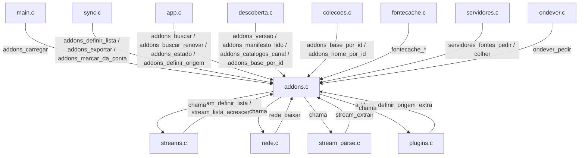
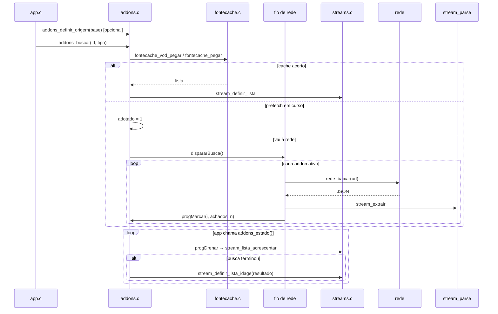

# `src/addons.c` — busca de fontes e legendas nos addons Stremio

## Para que serve

Gerencia a lista de addons Stremio (carregada de `art/addons.txt` ou da conta), dispara a busca de fontes e legendas em fios próprios, publica as respostas por addon na folha (#221) e integra cache de fontes (`fontecache.c`), plugins (`plugins.c`) e servidores pessoais (`servidores.c`). Roda em **todas as plataformas**.

## Funções públicas (`src/addons.h`)

| Assinatura | O que faz | Fio | Pré-condições / efeitos colaterais |
|---|---|---|---|
| `int addons_carregar(const char *dirArte)` | Lê `art/addons.txt` (nome TAB url). | principal (`main.c:1446`) | `addons.c:281`. Zera `perfilLista`, preenche `addon[]`. |
| `int addons_definir_lista(const AddonRemoto *lista, int n)` | Aplica lista vinda da conta; vazio NÃO substitui. | principal (`sync.c:352`, `sync.c:1728`) | `addons.c:374`. Zera `id`/capacidades herdados; dispara `listaMudou()`. |
| `void addons_marcar_da_conta(int perfil)` / `int addons_perfil_da_lista(void)` | Marca/lê de qual perfil veio a lista atual. | principal/sync | `addons.c:276-279`. Atômico. |
| `int addons_exportar(AddonRemoto *saida, int max)` | Copia lista atual para sync empurrar de volta. | principal/sync | `addons.c:444`. |
| `void addons_esquecer(void)` | Reseta lista ao sair da conta. | principal | `addons.c:455`. |
| `int addons_n(void)` / `unsigned addons_versao(void)` | Quantidade/versão da lista. | qualquer | `addons.c:463-466`. |
| `const char *addons_base(int i)` / `addons_id_manifesto(i)` / `addons_nome_por_id(id)` / `addons_base_por_id(id)` | Identificação de addon. | qualquer | `addons.c:471`, `addons.c:2651`. |
| `int addons_tem_catalogo(int i)` | Se addon fornece catálogo. | qualquer | `addons.c:489`. |
| `void addons_definir_origem(const char *base)` | Limita próxima busca a um addon base (canal do guia). | principal | `addons.c:2507`. Consumida por `buscarPedido`. |
| `void addons_definir_origem_extra(...)` / `int addons_origem_extra_ativa(void)` | Plug-in plugins.c como origem adicional. | arranque | `addons.c:2146`. |
| `void addons_buscar(const char *imdb, const char *tipo)` / `void addons_buscar_renovar(...)` | Dispara busca de fontes. | principal (`app.c`) | `addons.c:2626-2627`. Consome origem, consulta cache, cria fio. |
| `void addons_drenar(void)` | Publica respostas parciais na UI. | principal | `addons.c:634`. |
| `int addons_busca_parcial(void)` / `unsigned addons_busca_ms(void)` | Estado/tempo da busca atual. | principal | `addons.c:636-640`. |
| `int addons_faltam(char *nomes, unsigned tam)` / `addons_faltam_tipo(...)` / `addons_faltam_decisivos(...)` | Quantos addons ainda não responderam. | principal | `addons.c:652-689`. |
| `void addons_definir_espera_decisao(int ms)` | Prazo para decidir sem esperar os lentos. | principal | `addons.c:684`. |
| `void addons_inicio_info(...)` / `int addons_pendente_antes(int idx)` / `int addons_pendente_nome(...)` / `int addons_pendente_grupo_min(...)` | Info para a ilha de espera e decisão parcial. | principal | `addons.c:703-756`. |
| `void addons_buscar_legendas(...)` / `addons_legendas_reiniciar(void)` / `int addons_n_legendas(void)` / `const Legenda *addons_legenda(int i)` / `int addons_legendas_copiar(...)` | Busca e acesso às legendas externas. | principal/fio de legenda | `addons.c:1725`, `addons.c:1709`, `addons.c:850-868`. |
| `const char *addons_nome(int i)` / `int addons_ativo(int i)` / `int addons_alternar(int i)` / `int addons_adicionar(...)` | UI da tela de addons. | principal | `addons.c:1320-1356`. |
| `int addons_fornece(int i, int oque)` / `int addons_sondado(int i)` | Capacidades do addon. | qualquer | `addons.c:1323-1313`. |
| `int addons_aceita_id(int i, const char *tipo, const char *id)` | Se addon declara resource "meta" para esse tipo/prefixo. | qualquer | `addons.c:1535`. |
| `void addons_sondar_manifestos(void)` / `void addons_manifesto_lido(int i, const char *corpo)` / `int addons_catalogos_canal(...)` | Leitura de manifesto e capacidades. | fio de sonda/principal | `addons.c:1702`, `addons.c:1697`, `addons.c:1314`. |
| `int addons_motivo_vazio(char *dst, unsigned n)` | Frase explicando por que não veio fonte. | principal | `addons.c:2436`. |
| `unsigned addons_fora_do_ar(char *nome, unsigned tam)` | Sobe quando addon falha sem resposta. | principal | `addons.c:2065`. |
| `AddEstado addons_estado(void)` | Colhe fio, publica resultado, gerencia cache/prefetch/fila. | principal (`app.c`) | `addons.c:492`. **EFEITO COLATERAL**: join no fio, publicação, cache. |
| `int addons_ocupado(void)` | Apenas leitura de estado (sem efeito de `addons_estado`). | qualquer | `addons.c:768`. |
| `void addons_encerrar(void)` | Para fios e limpa estado. | principal | `addons.c:2629`. |

## Estado global (`static` em `addons.c`)

| Variável | Tipo | Quem escreve | Quem lê |
|---|---|---|---|
| `addon[ADD_MAX]` | struct | `addons_carregar`, `addons_definir_lista`, `addons_manifesto_lido` | UI, busca, descoberta, coleções |
| `nAddon` | `int` | mesmas | loops |
| `versaoLista` | `unsigned` | `listaMudou` | `addons_versao`, descoberta |
| `estado` | `_Atomic AddEstado` | fio de busca, `addons_estado`, `buscarPedido` | `addons_estado`, `addons_ocupado` |
| `fio`, `fioVivo` | `pthread_t`/`int` | `dispararBusca`, `addons_estado`, `addons_encerrar` | controle de fio |
| `alvoId[64]`, `alvoTipo[16]`, `alvoBase[]`, `fioBase[]` | char[] | `buscarPedido`, `addons_definir_origem` | fio de busca |
| `resultado`, `nResultado`, `resultadoQuando`, `resultadoCacheavel` | cache do fio | `buscar`, `buscarPedido` | `addons_estado` |
| `fioEscopo` | `FontecacheEscopo` | `buscarPedido` | validação de escopo |
| `perfilLista` | `_Atomic int` | `addons_marcar_da_conta` | `addons_perfil_da_lista` |
| `prog*` (fila, estados, publicados, início) | vários | `progMarcar`, `progDrenar`, `buscarPedido` | publicação por addon |
| `progTrava` | `pthread_mutex_t` | — | fila de chegada |
| `pendId`, `pendTipo`, `pendRenovar`, `pendBase` | char/int | `buscarPedido` | `addons_estado` (fila de pedidos) |
| `adotado` | `int` | `buscarPedido`, `addons_estado` | prefetch |
| `leg*`, `nLegs`, `fioLeg*`, `legTrava`, `legGeracao` | legendas | busca de legendas | UI |
| `foraNome`, `foraSeq`, `foraTrava` | saúde de addon | `foraAnotar` | `addons_fora_do_ar` |

## Grafo de chamadas

## Fluxo principal (abrir título → buscar fontes → publicar)

## IMPACTOS

- **Mexer em `addons_definir_lista`** afeta descoberta, home, coleções, sync. Conferir `tests/syncaddons.c`, `tests/contaoffline.c`, `tests/ordemperfil.c`.
- **Mexer em `addons_buscar`/`buscarPedido`** afeta cache, prefetch, carimbo de alvo, servidores pessoais. Conferir `tests/fontecache_vod.sh`, `tests/fontecache.c`, `tests/emby.c`, `tests/jellyfin.c`, `tests/plex.c`.
- **Mexer em `addons_estado`** afeta sincronismo entre fio de rede e UI; publicação por addon (#221). Conferir `tests/addons_paralelo.c`, `tests/fontes_parcial.c`, `tests/aovivo.c`.
- **Mexer no fio de fontes (`buscar`/`fioFontes`)** afeta timeout, segunda chance (#182), tipo alternativo (#112), logs. Conferir `tests/addons_paralelo.sh`, `tests/rede_sonda.c`.
- **Mexer na busca de legendas** afeta faixas.c, legendasui.c, legextras.c. Conferir `tests/addons_legendas.c`, `tests/addons_legendas.sh`, `tests/legextras.c`.
- **Mexer em `ADD_MAX`** afeta teto de sync e UI. Hoje 64 (#203). Conferir `tests/syncaddons.c` (cenário com 80 addons).
- **NÃO coberto por teste automatizado (SUSPEITA)**: cancelamento de fio entre addons; `adotado` trocado durante prefetch; `addons_estado` com conta/perfil trocado no meio; erro de `pthread_create` em `dispararBusca`.

## Regressões já acontecidas

- **#42** (addons acima de 12 sumiam): teto subiu e ficou igual ao sync. Commits `2288fb87`, `4fbf4cb1`.
- **#112** (canal não abria por tipo errado): segunda consulta com tipo alternativo (`tv`/`channel`). Commit `1c9f7c59`.
- **#182** (addon mudo segurava a busca): segunda chance com `addonstats`. Commits `abc5408e`, `475216c6`.
- **#201** (URLs grandes e extras Stremio): `NV_ADDON_URL_MAX`, `Stream.url`, `stream_extrair` com `videoHash`/`videoSize`. Commits `197468ec`, `4f3a2584`, `522aba65`.
- **#203** (teto de addons da conta): `ADD_MAX` passou para 64. Commit `4fbf4cb1`.
- **#221** (folha enche a cada addon): `progMarcar`, `progDrenar`, `stream_lista_acrescentar`. Commits `1e4cfa8e`, `98607591`, `401f276a`.
- **#283** (canal do guia consultava addons errados): `addons_definir_origem` copiada para `fioBase`. Commits `6de601a5`, `4dd8a137`.
- **#284** ("Melhor para esta TV" sem resolução): envolve `stream_parse.c` e `streams.c`; commits `a63ec982`, `96854a39`.
- **#358** / **#360** (sync de addons e catálogos da conta): em andamento 2.0.5; branch `agente/204-sync-addons`, `agente/204-conta-catalogos`.
- **#392** (ordem da Home ao trocar de perfil): envolve `addons_perfil_da_lista`; conserto `agente/2031-ordemperfil`.
