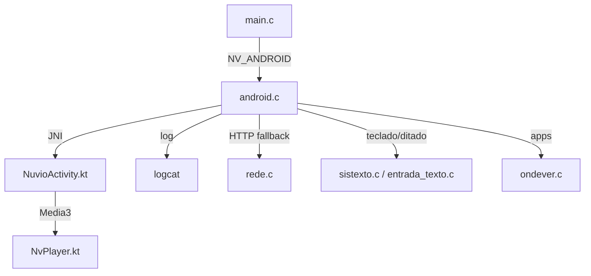
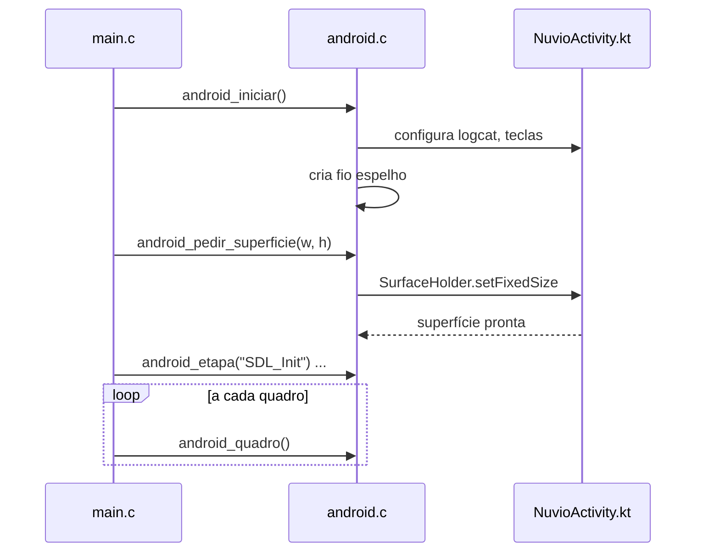

# `src/android.c` — Ponte com o host Android

## Para que serve

Implementa as funções declaradas em `src/android.h` para builds com `-DNV_ANDROID`.
É a ponte entre o núcleo C e a `NuvioActivity` Kotlin: espelha log em logcat,
pede superfície, chama teclado/ditado do sistema, lista apps para "Onde
assistir", faz HTTP pela pilha Java quando a libcurl falha, e vigia o arranque.
Fora de `NV_ANDROID` o `.h` é vazio e nada deste arquivo é compilado.

## Plataformas

- **Android TV / Android mobile**: `-DNV_ANDROID`.
- **Outros alvos**: arquivo não entra no build; `android.h` define nada.

## Funções públicas (de `src/android.h`)

| Função | Linha | O que faz | Pré-condições | Fio | Efeitos colaterais |
|---|---|---|---|---|---|
| `void android_iniciar(void)` | 128 | Espelha stdout/stderr no logcat, ativa `[tv]` no log, pede ao SDL que Voltar chegue ao app. | Chamado no `main()` depois do log redirecionado. | Principal | Cria fio `espelho` (52). |
| `int android_pedir_superficie(int w, int h)` | 146 | Pede à `NuvioActivity` uma `SurfaceHolder` de w×h. | Antes do `SDL_CreateWindow`. | Principal | Pode mudar tamanho da janela SDL. |
| `int android_instalar_apk(const char *caminho)` | 166 | Delega instalação de APK ao host. | Principal | Principal | Abre instalador do sistema. |
| `int android_st_teclado(const char *inicial, int max)` | 213 | Abre teclado do sistema. | Principal | Principal | Eventos chegam via `android_st_evento`. |
| `int android_st_ditar(const char *idioma)` | 216 | Abre ditado do sistema no idioma dado. | Principal | Principal | — |
| `void android_st_fechar(void)` | 219 | Fecha teclado/ditado. | Principal | Principal | — |
| `int android_st_evento(char *dst, size_t n)` | 221 | Consome próximo evento da fila do `NuvioActivity`. | Principal | Principal | Preenche `dst` com texto ou comando. |
| `char *android_listar_apps(void)` | 250 | Lista apps instalados para "Onde assistir". | Principal | Principal | Retorna malloc; chamador dá free. |
| `int android_abrir_app(const char *pacote)` | 295 | Abre app pelo pacote. | Principal | Principal | — |
| `int android_abrir_loja(const char *pacote, const char *nome)` | 298 | Abre loja para o app. | Principal | Principal | — |
| `void android_etapa(const char *nome)` | 392 | Atualiza etapa do vigia de arranque. | Principal | Principal | Escreve em `etapaAtual`. |
| `void android_quadro(void)` | 395 | Contador de quadros apresentados (vigia #266). | Principal | Principal | Incrementa `quadrosFeitos`. |
| `char *android_http(...)` | 304 | HTTP simples via `NuvioActivity.httpPedir` (reserva). | Qualquer fio | Qualquer fio | Aloca corpo; chamador libera. |

## Estado global (static)

| Estado | Linha | Tipo | Semântica | Quem lê/escreve |
|---|---|---|---|---|
| `fdArquivo`, `fdLeitura` | 50 | `int` | Descritores do arquivo de log para espelhar no logcat. | `logaTv`, fio `espelho`. |
| `etapaAtual` | 389 | `const char *volatile` | Etapa atual do arranque (vigia). | `android_etapa` escreve; host Kotlin lê. |
| `quadrosFeitos` | 390 | `volatile long long` | Quadros apresentados. | `android_quadro` incrementa. |

## Grafo de chamadas

Arestas de callback/ponteiro:
- `__wrap_pthread_create` (372) intercepta criação de pthreads no Android para
  fins de diagnóstico.

## Fluxo principal: arranque Android

## IMPACTOS

- **Se mexer no JNI**, confira as assinaturas em `NuvioActivity.kt`:
  - `instalarApk` (usado por `android_instalar_apk`, 166).
  - `httpPedir` (usado por `android_http`, 304).
  - `abrirApp`, `abrirLoja` (usado por `android_abrir_app`/`loja`, 295).
- **Se mexer no log**, o espelho `espelho()` (52) lê do arquivo de log e joga
  no logcat com tag `nuvio`. `fdLeitura` é aberto uma vez; a drenagem na queda
  é `drenarNaQueda` (97).
- **Se mexer no vigia de arranque (#266)**, `etapaAtual` e `quadrosFeitos` são
  lidos pelo host Kotlin para decidir se o app travou. `android_etapa` só deve
  ser chamada do fio principal.
- **Se mexer no HTTP fallback**, `android_http` (304) é usado por `rede.c`
  (`viaAndroid`, 1554) quando a libcurl dlopen falha ou o primeiro request
  falha. Deve devolver corpo alocado e `status` HTTP.
- **Se mexer no teclado do sistema**, o formato dos eventos está documentado em
  `sistexto.c` (ver `android_st_evento`, 221).
- **Tests**: `tests/saidaandroid.sh` e `tests/video_android_cacheboost.sh` tocam
  neste arquivo. Não há teste unitário isolado de todas as funções JNI.

## Regressões já acontecidas

Do `git log --oneline -- src/android.c`:

| Commit | Issue | Resumo | Onde no arquivo |
|---|---|---|---|
| `142ae407` | #318 | relator de queda nativa no Android < 12, encadeado a ART. | 114. |
| `730556e1` | #318 | descarte fora de vez, gputempo só por setprop, fundo da Dinâmica fica com alfa 1. | não diretamente. |
| `a4b580a8` | #318 | desliga as três mudanças de GL da 2.0.1 e registra as trocas de tela. | — |
| `35421d1a` | #266, #332 | login e pedidos simples pelo HttpURLConnection quando a libcurl falha; tempos por etapa no log. | 304. |
| `bcd78417` | #266 | libcurl dlopen + curl_global_init em fio próprio, GL MakeCurrent antes das consultas. | indireto. |
| `73c4ab4c` | #266 | mark curl_global_init and first GL queries so a Shield start hang names its step. | 392. |
| `65871816` | #317 | report startup crashes to log server on next launch. | `android_iniciar` indireto. |
| `4f028913` | #72 | Android: log where previous native crash happened; non-crash exits stop feeding safe mode. | indireto. |
| `af1ab7e3` | — | Android: auto update por APK; selo Dolby Vision nos decoders MediaTek. | — |
| `0f2a5b6c` | — | Android: CH+/CH- trocam canal no guia, som do trailer no detalhe, GPU adaptativa. | — |
