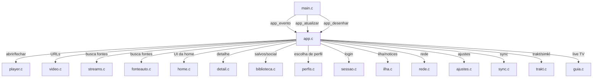
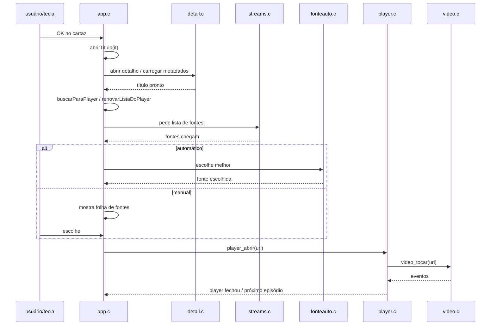
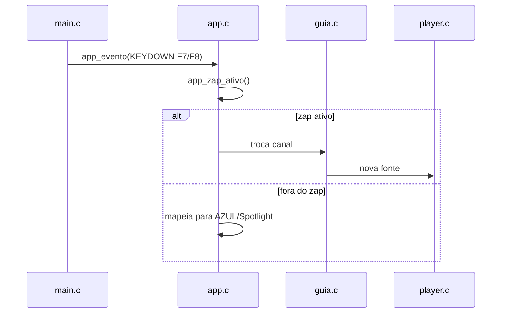

# `src/app.c` — Roteador de telas, player e fontes

## Para que serve

Roteador central do app: mantém a tela atual, a pilha de retorno, orquestra a
abertura de títulos, a escolha de fontes (VOD e live), o player, o perfil e a
home. É quem recebe os eventos SDL de `main.c` e decide qual módulo responde.
Roda em todas as plataformas; as funções públicas estão em `src/app.h`.

## Plataformas

Sem `#ifdef` de plataforma próprio no `.h`; `app.c` usa funções dos módulos de
plataforma (`video.h`, `android.h`, `tpk.h`, `webosver.h`, `rede.h`) conforme
disponíveis no build.

## Funções públicas (de `src/app.h`)

| Função | Linha | O que faz | Pré-condições | Fio | Efeitos colaterais |
|---|---|---|---|---|---|
| `int app_iniciar(const char *dirArte)` | 1949 | Cria a tela inicial (home/login/escolha de perfil) e inicia estados dependentes. | SDL/GL prontos; `dados_iniciar`, `sessao_iniciar`, `perfis_carregar_ativo` já rodaram. | Principal | Monta home, carrega estado da home, pode abrir login. |
| `void app_evento(const SDL_Event *e)` | 2261 | Reage a teclas/toques/mouse. | `app_iniciar` já rodou. | Principal | Troca tela, abre título, dispara fontes, roteia para player. |
| `void app_atualizar(float dt, Uint32 agora)` | 2768 | Atualiza estado por quadro (animações, timeouts, jobs de fonte). | Principal | Principal | Pode disparar busca de fontes, renovar canal, atualizar UI. |
| `void app_desenhar(Uint32 agora)` | 4894 | Desenha a tela corrente e sobreposições. | Principal | Principal | Chama desenho de home/detail/player/etc. |
| `int app_quer_sair(void)` | 5148 | 1 quando o usuário pediu para sair. | Principal | Principal | — |
| `const char *app_tela_nome(void)` | 5150? | Nome curto da tela para log. | Principal | Principal | — |
| `int app_zap_ativo(void)` | 5149 | CH+/CH- devem trocar canal? | Principal | Principal | — |
| `int app_central_pode(void)` | 5153 | A Central de controle pode abrir? | Principal | Principal | — |
| `void app_encerrar(void)` | 5161 | Libera recursos do app antes do shutdown. | Principal | Principal | Cancela jobs de fonte, fecha player, grava estados. |
| `int app_na_home(void)` | 2189 | 1 se a home está na frente. | Principal | Principal | — |
| `int app_no_login(void)` | 2187 | 1 se está na tela de login. | Principal | Principal | — |
| `void app_abrir_titulo(const char *imdb)` | 171 | Porta de teste: abre um título pelo id IMDb. | Principal | Principal | Muda para detalhe/player conforme o título. |

*Nota*: a linha de `app_tela_nome` não apareceu no grep inicial; a definição
está próxima a `app_quer_sair`. SUSPEITA: linha ~5150.

## Estado global (static)

| Estado | Linha | Tipo | Semântica | Quem lê/escreve |
|---|---|---|---|---|
| `tela` | 501 | `Tela` | Tela corrente (`TELA_HOME`, `TELA_PLAYER`, etc.). | `app_evento`, `trocarTela`, `app_na_home`, etc. |
| `sair` | 505 | `int` | Pedido de saída. | `app_evento`, `app_quer_sair`. |
| `abrirTeste` | 170 | `char[64]` | Buffer da porta de teste `app_abrir_titulo`. | `app_abrir_titulo`. |
| `aguardandoFonte` | 175 | `int` | Flag: está esperando fonte para um título. | fluxo de abrir título. |
| `fonteJob`, `fioFonte`, `fioFonteVivo`, `fonteEscolhida` | 249-268 | job, pthread, int, `_Atomic int` | Job de fonte rodando em fio próprio. | `escolherFonte`, `app_atualizar`, `processarFonteJob`. |
| `perfilPendente`, `perfilSucesso`, `perfilCarga`, `perfilGeracao`, `perfilTrava` | 343-347 | dados, int, `_Atomic int`, `_Atomic unsigned`, mutex | Carregamento de perfil em fio próprio. | `carregarPerfil`, `pedirPerfil`, `invalidarPerfil`. |
| `saiuPorEsquerda` | 526 | `int` | Última tecla foi ESQUERDA (usado no sidebar). | `app_evento`. |
| `perfilAntes`, `trocaPerfilDesde` | 539-541 | int, Uint32 | Estado da transição de perfil. | lógica de troca de perfil. |
| `liveStall`, `canalFonteIdx`, `canalFonteDesde`, `canalViaProxy` | 293-299 | struct, int, Uint32, int | Estado do canal ao vivo. | fluxo live TV. |
| `voltaAtiva`, `voltaDesde` | 305-306 | int, Uint32 | Voo da capa do player de volta para a home. | animação de transição. |
| `cwTocarT`, `cwTocarE`, `cwEspera*`, `fioFonte*` | 240-251 | — | Lógica de "Continuar assistindo" e fonte em segundo plano. | vários. |
| `preparo*` | 1129-1131 | int, void* | Guarda/uso do preparo de fonte ao abrir título. | escolha de fonte. |
| `torrentJob`, `fioTorrent`, `torrentSessao` | 1309-1312 | job, pthread, unsigned | Job P2P em fio próprio. | abertura de torrents. |
| `diagDaHome`, `ltdDoGuia`, `socialDoPerfil` | 617-622 | int | Flags de atalhos de teste. | `app_evento`. |

*(Lista resumida; app.c tem ~100+ estáticos. Os acima são os de maior impacto.)*

## Grafo de chamadas

Arestas de callback/ponteiro:
- `escolherFonte`, `escolherFonteCanal`, `escolherFonteStalker` são pthreads
  criados por `iniciarFonteJob` (454) e `pedirFonteJob` (480).
- `carregarPerfil` (349) é pthread criado em `pedirPerfil` (375).

## Fluxo principal: abrir um título e tocar

## Fluxo principal: CH+ / CH- (zap)

## IMPACTOS

- **Se mexer em `app_evento` (2261)**, confira o tratamento de `saiuPorEsquerda`
  (526) e o sidebar, o roteamento de teclas coloridas, e o fato de que
  `TELA_LOGIN` e `TELA_ESCOLHA_PERFIL` bloqueiam TUDO (comentário em app.h:12).
- **Se mexer na escolha de fontes**, a geração `fontePedidoGeracao` (268) é usada
  para cancelar jobs antigos quando o usuário sai da tela. Um job entregue fora
  da geração corrente deve ser ignorado (`processarFonteJob`, 1136).
- **Se mexer no carregamento de perfil**, `perfilGeracao` (346) e `perfilTrava`
  (347) protegem a publicação do snapshot para a UI. `invalidarPerfil` (367) é
  chamado quando a conta/perfil muda.
- **Se mexer no fluxo de live TV**, `liveStall` e `canalFonteIdx` são compartilhados
  entre `app.c` e `guia.c`; um desvio no índice da lista de streams quebra o zap.
- **Se mexer na tela de login**, `app_no_login` (2187) e `app_na_home` (2189)
  afetam a abertura, o esmaecer e o salvamento de captura.
- **A ordem de `app_iniciar` (1949) importa**: ele é chamado depois de
  `sessao_iniciar` e `perfis_carregar_ativo`, mas antes de `addons_carregar`,
  `trakt_carregar` e `desc_iniciar` (main.c:1405-1475).
- **Tests**: `app.c` é compilado implicitamente em muitos testes de screenshot
  que excluem `main.c` (ex.: `tests/player_glass_shot.sh`,
  `tests/ilha_voo_cw.sh`, `tests/sidebaratv_shot.sh`). Testes específicos de
  comportamento do roteador incluem `tests/syncaddons.c`,
  `tests/carrossel_prebusca.c`, `tests/fonteauto.c`.

## Regressões já acontecidas

Do `git log --oneline -- src/app.c` e issues:

| Commit | Issue | Resumo | Onde no arquivo |
|---|---|---|---|
| `c811ec3b` | — | sair do Perfil pelo roteador fecha a página. | evento/perfil. |
| `0447ff7e` | — | pos-play e vertudo abrem o detalhe pelo funil abrirTitulo. | 551. |
| `470866de` | — | porta de teste `abrir:<tt>` copia o alvo antes de esvaziar. | 171. |
| `26d845c6` | #294 | switching profile drops previous profile's catalog from memory. | perfil. |
| `d4358051` | — | poll the video request off the main thread; keep paused frame under exit flight. | fonte. |
| `0db4d426` | — | reorganiza ajustes nativos. | — |
| `f8857643` | — | Retomar sem sessão retida abre direto a fonte que estava tocando. | fonte/retomada. |
| `ad847fe1` | — | detail: open a title without waiting — ficha no longer queued behind previous title's TMDB tail. | abrirTitulo. |
| `1300a466` | — | Back from a title opened inside another returns to the previous one. | pilha de retorno. |
| `e4afe598` | — | abertura e login: arte retro, logo dissolve. | — |
| `b71471bc` | — | invalidar retomada ao trocar conta ou perfil. | perfil. |
