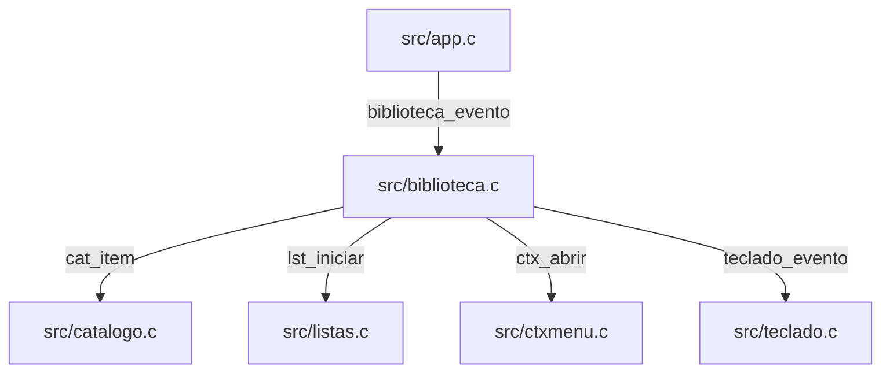

# `src/biblioteca.c` — Salvos, Coleção e Listas

## Para que serve

Filtra conjuntos do usuário e converte células em índices do catálogo.
Mantém preferências por perfil, foco, filtros, listas e gesto de OK.
UI SDL/GL compartilhada entre plataformas; modos reais em `src/biblioteca.c:269`.
A API legada alternar_lista só reconstrói a grade (`src/biblioteca.c:726`).

Base: `bed3534c`. Referências correspondem ao checkout; não há validação física nesta rodada.

## Funções públicas (`src/biblioteca.h`)

Fio principal SDL/GL, sem mutex próprio nestas funções; dependências têm suas próprias travas. Eventos e saídas obrigatórias devem apontar para memória válida. Referências de cada operação abaixo comprovam efeitos; pedidos `pediu_*` são consumíveis, exceto getters explicitamente descritos.

| Assinatura | Contrato, pré-condições e efeitos | Travas locais / evidência |
|---|---|---|
| `int biblioteca_iniciar(void)` | Lê preferências, inicia listas e reconstrói filtro/foco; comprado zera somente na primeira inicialização. | Sem aquisição explícita; auxiliares podem adquirir; `src/biblioteca.c:694`; `src/biblioteca.h:11` |
| `void biblioteca_evento(const SDL_Event *e)` | Processa evento SDL válido; teclado tem prioridade; arma OK longo ou pedido de abrir. | Sem aquisição explícita; auxiliares podem adquirir; `src/biblioteca.c:952`; `src/biblioteca.h:12` |
| `void biblioteca_atualizar(float dt, Uint32 agora)` | Relê preferências, colhe busca, atualiza grade e dispara menu quando OK passa NV_HOLD_MS. | Sem aquisição explícita; auxiliares podem adquirir; `src/biblioteca.c:1063`; `src/biblioteca.h:13` |
| `void biblioteca_desenhar(Uint32 agora)` | Desenha filtros, ações, grade/estado vazio e teclado; requer contexto GL do fio principal. | Sem aquisição explícita; auxiliares podem adquirir; `src/biblioteca.c:2158`; `src/biblioteca.h:14` |
| `int biblioteca_quer_sair(void)` | Consulta flag de saída sem consumi-la. | Sem aquisição explícita; auxiliares podem adquirir; `src/biblioteca.c:734`; `src/biblioteca.h:15` |
| `void biblioteca_encerrar(void)` | Corpo vazio nesta revisão. | Sem aquisição explícita; auxiliares podem adquirir; `src/biblioteca.c:716`; `src/biblioteca.h:16` |
| `int biblioteca_pediu_abrir(int *indiceCatalogo)` | Consome pedido e copia índice do CATÁLOGO (não célula) se saída fornecida. | Sem aquisição explícita; auxiliares podem adquirir; `src/biblioteca.c:736`; `src/biblioteca.h:21` |
| `int biblioteca_na_lista(int indiceCatalogo)` | Consulta CatItem.naLista; não consulta diretamente serviço remoto. | Sem aquisição explícita; auxiliares podem adquirir; `src/biblioteca.c:718`; `src/biblioteca.h:27` |
| `void biblioteca_alternar_lista(int indiceCatalogo)` | Não alterna marca nem faz rede: ignora índice e só reconstrói fora do modo Listas. | Sem aquisição explícita; auxiliares podem adquirir; `src/biblioteca.c:726`; `src/biblioteca.h:28` |
| `int biblioteca_comprado(int indiceCatalogo)` | Consulta vetor local comprado, validando 0 <= índice < CAT_MAX; não comprova compra remota. | Sem aquisição explícita; auxiliares podem adquirir; `src/biblioteca.c:725`; `src/biblioteca.h:29` |

## Estado global (`static`)

| Grupo | Escrita e leitura | Evidência |
|---|---|---|
| modo/tipo/ordem/exibicao/fonte, preferências | lerPref/evento/iniciar escrevem; reconstrução e desenho leem. | `src/biblioteca.c:290` |
| aberta/temAberta, recado[160] e busca | Ações/listas/teclado escrevem; atualizar/desenhar leem. | `src/biblioteca.c:297` |
| filtro[CAT_MAX + SALVOS_MAX], nFiltro, foco/animação | reconstruir/remapear e navegação escrevem; grade lê. | `src/biblioteca.c:307` |
| okDesde, pedido/sair e comprado | Eventos/atualização controlam gesto; pediu_abrir consome; comprado é vetor local. | `src/biblioteca.c:927` |

## Grafo de chamadas

Recorte comprovado. Direção: chamador → chamado; registro de callback é indicado.



Evidências:

- `src/app.c` → `src/biblioteca.c`: `src/app.c:2611`.
- `src/biblioteca.c` → `src/catalogo.c`: `src/biblioteca.c:532`.
- `src/biblioteca.c` → `src/listas.c`: `src/biblioteca.c:702`.
- `src/biblioteca.c` → `src/ctxmenu.c`: `src/biblioteca.c:903`.
- `src/biblioteca.c` → `src/teclado.c`: `src/biblioteca.c:956`.

## Fluxo principal

```mermaid
sequenceDiagram
    App->>Biblioteca: iniciar e reconstruir
    App->>Biblioteca: KEYDOWN OK arma okDesde
    App->>Biblioteca: atualizar verifica NV_HOLD_MS
    alt longo
    Biblioteca->>Menu: menuNaCelula; zera okDesde
    else curto
    App->>Biblioteca: KEYUP chama okNaCelula
    App->>Biblioteca: pediu_abrir consome índice do catálogo
    end
```

Ordem baseada nas entradas públicas e nas chamadas citadas acima.

## IMPACTOS

| Se você mexer em... | Confira... |
|---|---|
| `biblioteca_pediu_abrir` (`src/biblioteca.c:736`) | Não confundir célula filtrada com índice do catálogo; conferir ordenação/listas. |
| `biblioteca_alternar_lista` (`src/biblioteca.c:726`) | Não atribuir rede ou gravação de naLista a essa função: o corpo apenas reconstrói. |
| `biblioteca_evento` (`src/biblioteca.c:952`) | KEYUP deve zerar okDesde. #387 é relato .wgt; conserto de segurar citado em outra branch não está neste checkout. Ver segurar.md. |
| `biblioteca_atualizar` (`src/biblioteca.c:1063`) | Persistir preferências e reconstruir sem perder foco; conferir teclado, estado vazio e conclusão de listas. |
| `biblioteca_comprado` (`src/biblioteca.c:725`) | Limite CAT_MAX e inicialização local não equivalem a compra remota. |

### Testes

Cobertura identificada por leitura; não executada nesta rodada documental.

- `tests/biblioteca_shot.sh:1`: Captura host da tela.
- `tests/salvos_segurar.sh:1`: Painel Salvos: cobertura adjacente de gesto, não prova de KEYUP da Biblioteca .wgt.

### O que NÃO tem prova nesta cobertura

Controle físico de cada TV, composição com vídeo real e todas as combinações concorrentes de conta/perfil. **SUSPEITA:** ausência de outras corridas não pode ser inferida desses testes.

## Regressões já acontecidas

Consulta: `git log --oneline -- src/biblioteca.c`. Assuntos abaixo documentam o histórico; não representam testes executados nesta rodada.

| Hash | Alteração registrada |
|---|---|
| `37a1a868` | fix (#99): ponteiro do Magic Remote nas telas que nao registravam alvos (PASSA rc=0) |
| `a52f7d36` | ui: library art scrolls up to the tab pills, log pause pill never covers the area tabs, Home watched badge reads 'Assistido' |
| `79899cae` | detail: Home focus treatment on every card, outline only with the setting, 1.7.4 quotes component, Left at row start opens the menu |
| `846e0f97` | fix(library): port previous-row fade/viewport onto Glass library |
| `edb3eaa2` | Escala com piso: topo da Biblioteca 120%, Spotlight 130%, barra de pressao longa no cartao |
| `da0986e2` | Biblioteca: faixa de cima navega de lado, segurar OK abre o menu de contexto |

Cruzamento com o mapa (relação de investigação, sem atribuir causalidade a hashes sem evidência):

- **#99**: `docs/issues/mapa.json:2241`; `docs/issues/MAPA.md:557`.
- **#387**: `docs/issues/mapa.json:8256`; `docs/issues/MAPA.md:107`.
