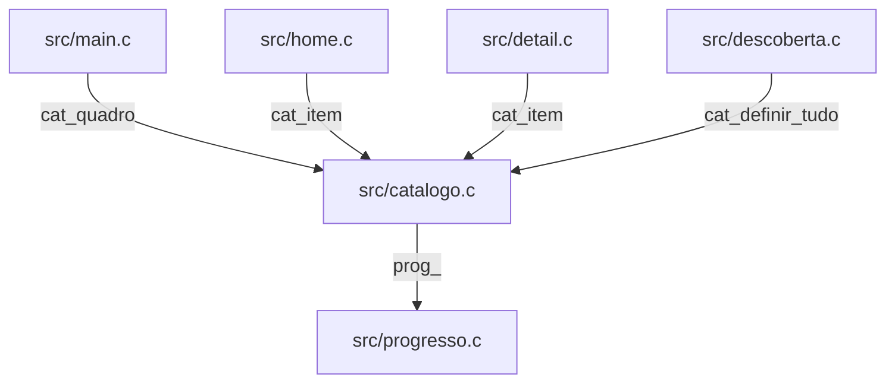
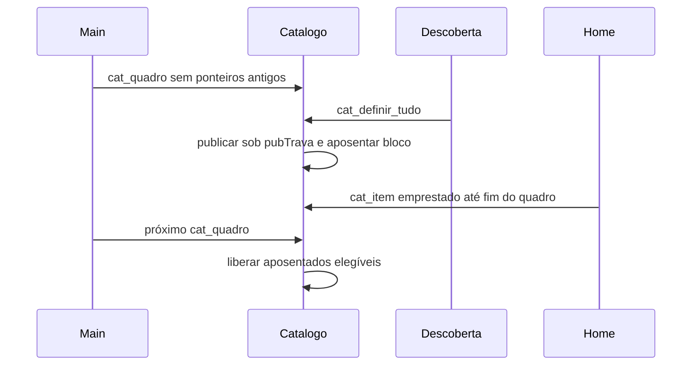

# `src/catalogo.c` — publicação, cache e episódios

## Para que serve

Armazena itens, fileiras, histórico e episódios para telas e serviços de descoberta.
Publica novos blocos e adia liberação até virada do quadro; oferece cópias sob trava para workers.
Código compartilhado, cache binário vinculado a conta/perfil e pasta gravável (`src/catalogo.h:180`, `src/catalogo.h:245`).

Base: `bed3534c`. Referências correspondem ao checkout; não há validação física nesta rodada.

## Funções públicas (`src/catalogo.h`)

Roda no desenho E em fios publicadores. `cat_quadro` é exclusivo do começo do quadro; workers devem preferir cópias sob trava. `pubTrava`, `epTrava` e `histTrava` protegem domínios distintos; ausência de lock no getter não torna ponteiro seguro entre quadros (`src/catalogo.h:245`, `src/catalogo.c:229`, `src/catalogo.c:289`).

| Assinatura | Contrato, pré-condições e efeitos | Travas locais / evidência |
|---|---|---|
| `int cat_carregar(const char *dirArte)` | Lê <dir>/catalogo.txt do pacote; retorna quantidade carregada. | epTrava; `src/catalogo.c:512`; `src/catalogo.h:183` |
| `int cat_gravar_cache(const char *dirArte)` | Grava snapshot binário do catálogo com identidade e tamanhos. | Sem aquisição explícita; auxiliares podem adquirir; `src/catalogo.c:1058`; `src/catalogo.h:210` |
| `int cat_gravar_cache_se_identidade(const char *dirArte, const char *donoEsperado, int perfilEsperado)` | Grava apenas enquanto conta/perfil correspondem ao esperado. | pubTrava; `src/catalogo.c:962`; `src/catalogo.h:211` |
| `int cat_ler_cache(const char *dirArte)` | Valida cache e publica; chamar após cat_carregar; rejeita/apaga identidade incompatível. | Sem aquisição explícita; auxiliares podem adquirir; `src/catalogo.c:1064`; `src/catalogo.h:215` |
| `int cat_apagar_cache(void)` | Apaga arquivo de cache, necessário no logout. | Sem aquisição explícita; auxiliares podem adquirir; `src/catalogo.c:940`; `src/catalogo.h:235` |
| `int cat_do_cache(void)` | Consulta se catálogo visível ainda veio do cache. | Sem aquisição explícita; auxiliares podem adquirir; `src/catalogo.c:1153`; `src/catalogo.h:242` |
| `void cat_cache_substituido(void)` | Limpa flag de origem do cache. | Sem aquisição explícita; auxiliares podem adquirir; `src/catalogo.c:960`; `src/catalogo.h:243` |
| `int cat_n(void)` | Consulta quantidade publicada. | Sem aquisição explícita; auxiliares podem adquirir; `src/catalogo.c:1195`; `src/catalogo.h:245` |
| `const CatItem *cat_item(int i)` | Retorna ponteiro emprestado de índice circular; só vale até fim do quadro. | Sem aquisição explícita; auxiliares podem adquirir; `src/catalogo.c:1203`; `src/catalogo.h:250` |
| `void cat_quadro(void)` | No começo do quadro, sem ponteiro antigo em uso, registra fio principal e libera aposentados elegíveis. | pubTrava; `src/catalogo.c:131`; `src/catalogo.h:260` |
| `int cat_blocos_aposentados(void)` | Consulta número de blocos aguardando liberação. | pubTrava; `src/catalogo.c:143`; `src/catalogo.h:262` |
| `void cat_dir_gravacao(const char *dir)` | Define pasta gravável do progresso, distinta da pasta do pacote. | Sem aquisição explícita; auxiliares podem adquirir; `src/catalogo.c:1250`; `src/catalogo.h:273` |
| `int cat_indice_por_imdb(const char *imdb)` | Busca índice pela identidade base, ignorando sufixo de episódio. | Sem aquisição explícita; auxiliares podem adquirir; `src/catalogo.c:1254`; `src/catalogo.h:275` |
| `int cat_copiar_por_id(const char *id, const char *tipo, CatItem *saida)` | Copia identidade base/tipo sob trava, preferindo cópia com poster; saída obrigatória. | pubTrava; `src/catalogo.c:1718`; `src/catalogo.h:279` |
| `int cat_indice_titulo(const char *imdb, int preferido)` | Mantém índice preferido se ainda representa identidade; senão busca novamente. | Sem aquisição explícita; auxiliares podem adquirir; `src/catalogo.c:1275`; `src/catalogo.h:282` |
| `int cat_indice_vivo(int indice, const char *imdb)` | Revalida índice/identidade após remontagem. | Sem aquisição explícita; auxiliares podem adquirir; `src/catalogo.c:1294`; `src/catalogo.h:287` |
| `int cat_acrescentar(const CatItem *item)` | Acrescenta item por publicação de bloco novo; -1 se catálogo vazio/cheio ou falha. | epTrava, pubTrava; `src/catalogo.c:2033`; `src/catalogo.h:292` |
| `int cat_acrescentar_lote(const CatItem *v, int qtd, int *saidaIdx)` | Acrescenta até CAT_MAX e preenche índices de saída; aposenta bloco anterior. | epTrava, pubTrava; `src/catalogo.c:1940`; `src/catalogo.h:300` |
| `int cat_mesclar_listas(const CatItem *v, int qtd)` | Mescla marcas de listas/coleção por identidade e acrescenta ausentes. | epTrava, pubTrava; `src/catalogo.c:1980`; `src/catalogo.h:306` |
| `void cat_definir_na_lista(int i, int naLista)` | Atualiza marca local sob trava, sem efetuar sync remoto. | pubTrava; `src/catalogo.c:1798`; `src/catalogo.h:311` |
| `int cat_definir_na_lista_imdb(const char *imdb, int naLista)` | Atualiza todas as cópias da identidade e devolve quantidade. | pubTrava; `src/catalogo.c:1807`; `src/catalogo.h:313` |
| `int cat_imdb_na_lista(const char *imdb)` | Consulta se alguma cópia está salva. | pubTrava; `src/catalogo.c:1819`; `src/catalogo.h:314` |
| `int cat_tirar_item_da_fileira(int indice)` | Remove entrada da fileira e ajusta estrutura publicada. | pubTrava; `src/catalogo.c:1535`; `src/catalogo.h:326` |
| `int cat_tirar_continuar(const char *imdb)` | Remove identidade de Continuar assistindo. | pubTrava; `src/catalogo.c:1609`; `src/catalogo.h:331` |
| `void cat_zerar_progresso(int indice)` | Zera progresso do título; conferir consumidores da faixa e persistência. | Sem aquisição explícita; auxiliares podem adquirir; `src/catalogo.c:1621`; `src/catalogo.h:332` |
| `int cat_visto(const CatItem *c)` | Determina estado assistido do item. | Sem aquisição explícita; auxiliares podem adquirir; `src/catalogo.c:432`; `src/catalogo.h:336` |
| `void cat_historico_contexto(const char *usuario, int perfil)` | Troca conta/perfil, limpa histórico e avança geração. | histTrava; `src/catalogo.c:294`; `src/catalogo.h:339` |
| `unsigned long long cat_historico_geracao(void)` | Consulta geração do histórico sob trava. | histTrava; `src/catalogo.c:308`; `src/catalogo.h:340` |
| `int cat_historico_estado_id(const char *imdb, const char *tipo)` | Consulta assistido por identidade/tipo; -1 desconhecido. | histTrava; `src/catalogo.c:385`; `src/catalogo.h:341` |
| `int cat_historico_estado_item(int indice)` | Copia identidade sob pubTrava e consulta histórico fora dela. | pubTrava; `src/catalogo.c:370`; `src/catalogo.h:342` |
| `void cat_historico_definir_id(const char *imdb, const char *tipo, int visto)` | Altera histórico corrente por identidade/tipo. | histTrava; `src/catalogo.c:406`; `src/catalogo.h:343` |
| `int cat_historico_definir_se_geracao(const char *imdb, const char *tipo, int visto, unsigned long long geracao)` | Altera histórico somente se geração ainda corresponde. | histTrava; `src/catalogo.c:412`; `src/catalogo.h:346` |
| `void cat_salvar_progresso(int indice, double posSeg, double durSeg)` | Delega persistência sem episódio explícito. | Sem aquisição explícita; auxiliares podem adquirir; `src/catalogo.c:1641`; `src/catalogo.h:349` |
| `void cat_salvar_progresso_ep(int indice, double posSeg, double durSeg, int temporada, int episodio)` | Persiste progresso e aplica em memória; IDs de servidor têm caminho próprio. | Sem aquisição explícita; auxiliares podem adquirir; `src/catalogo.c:1645`; `src/catalogo.h:350` |
| `void cat_aplicar_progresso(int indice, double posSeg, double durSeg, int temporada, int episodio)` | Aplica posição/duração/episódio em memória, distinto da persistência. | Sem aquisição explícita; auxiliares podem adquirir; `src/catalogo.c:1347`; `src/catalogo.h:355` |
| `void cat_apontar_episodio(int indice, int temporada, int episodio)` | Atualiza episódio alvo do item. | Sem aquisição explícita; auxiliares podem adquirir; `src/catalogo.c:1308`; `src/catalogo.h:359` |
| `void cat_definir(const CatItem *lista, int n)` | Publica lista sem fileiras via cat_definir_tudo. | Sem aquisição explícita; auxiliares podem adquirir; `src/catalogo.c:2060`; `src/catalogo.h:365` |
| `int cat_n_fileiras(void)` | Consulta quantidade de fileiras. | Sem aquisição explícita; auxiliares podem adquirir; `src/catalogo.c:1734`; `src/catalogo.h:427` |
| `const CatFileira *cat_fileira(int r)` | Retorna ponteiro interno ou NULL fora da faixa; não transfere ownership. | Sem aquisição explícita; auxiliares podem adquirir; `src/catalogo.c:1735`; `src/catalogo.h:428` |
| `int cat_home_apenas_fixas(void)` | Verifica presença apenas das fileiras fixas, sem títulos adicionais. | pubTrava; `src/catalogo.c:1739`; `src/catalogo.h:432` |
| `int cat_copiar_fileira(const char *chave, CatItem *itens, int max, CatFileira *meta)` | Copia até max itens e metadados sob trava; saída obrigatória. | pubTrava; `src/catalogo.c:1759`; `src/catalogo.h:433` |
| `void cat_trocar_continuar(const CatItem *lista, int qtd)` | Substitui faixa de Continuar, remapeia fileiras e reaplica progresso. | epTrava, pubTrava; `src/catalogo.c:2247`; `src/catalogo.h:440` |
| `void cat_republicar_fileiras(const CatFileira *fils, int nNovas)` | Atualiza metadados/ordem preservando intervalos das chaves existentes. | pubTrava; `src/catalogo.c:2064`; `src/catalogo.h:458` |
| `unsigned long cat_assinatura(void)` | Obtém assinatura do catálogo atual. | pubTrava; `src/catalogo.c:1187`; `src/catalogo.h:462` |
| `unsigned long cat_assinatura_de(const CatItem *lista, int qtd, const CatFileira *fl, int nf)` | Calcula assinatura dos itens/fileiras recebidos. | Sem aquisição explícita; auxiliares podem adquirir; `src/catalogo.c:1161`; `src/catalogo.h:463` |
| `void cat_definir_tudo(const CatItem *lista, int qtd, const CatFileira *fils, int nFils)` | Prepara e publica itens/fileiras, reaplica progresso e aposenta memória anterior. | epTrava, pubTrava; `src/catalogo.c:2133`; `src/catalogo.h:465` |
| `void cat_definir_episodios(int indiceItem, const CatEp *lista, int n)` | Publica faixa sob epTrava; esgotar arena limpa faixas e avança epGeracao. | epTrava; `src/catalogo.c:2328`; `src/catalogo.h:470` |
| `void cat_atualizar_item(int indice, const CatItem *novo)` | Substitui item apenas se índice ainda corresponde à identidade/tipo recebido. | pubTrava; `src/catalogo.c:1834`; `src/catalogo.h:474` |
| `void cat_atualizar_item_sem_abas(int indice, const CatItem *novo)` | Atualiza metadados preservando abas de temporada atuais contra resposta atrasada. | pubTrava; `src/catalogo.c:1849`; `src/catalogo.h:479` |
| `int cat_copiar_item(int indice, CatItem *saida)` | Copia item sob pubTrava para uso independente, inclusive em worker. | pubTrava; `src/catalogo.c:1869`; `src/catalogo.h:482` |
| `int cat_completar_sinopse(int indice, const char *imdb, const char *sinopse, const char *titulo)` | Preenche sinopse ausente somente na identidade esperada, sem substituir item inteiro. | pubTrava; `src/catalogo.c:1881`; `src/catalogo.h:485` |
| `int cat_aplicar_localizado(int indice, const char *imdb, const char *titulo, const char *sinopse, const char *logo, const char *fundo)` | Atualiza somente texto localizado da identidade esperada. | pubTrava; `src/catalogo.c:1904`; `src/catalogo.h:489` |
| `int cat_similares(int indice, int *saida, int max)` | Seleciona índices por gênero/tipo com fallback até max; não são IDs externos. | Sem aquisição explícita; auxiliares podem adquirir; `src/catalogo.c:2384`; `src/catalogo.h:499` |
| `unsigned cat_revisao(void)` | Consulta contador de mudança de estrutura. | Sem aquisição explícita; auxiliares podem adquirir; `src/catalogo.c:1660`; `src/catalogo.h:503` |
| `unsigned cat_geracao_episodios(void)` | Consulta geração da arena, independente da revisão do catálogo. | Sem aquisição explícita; auxiliares podem adquirir; `src/catalogo.c:251`; `src/catalogo.h:507` |
| `double cat_relogio_ms(void)` | Relógio CLOCK_MONOTONIC em milissegundos, não SDL_GetTicks. | Sem aquisição explícita; auxiliares podem adquirir; `src/catalogo.c:44`; `src/catalogo.h:509` |
| `unsigned cat_revisao_itens(void)` | Consulta contador de alterações de conteúdo. | Sem aquisição explícita; auxiliares podem adquirir; `src/catalogo.c:1661`; `src/catalogo.h:513` |
| `int cat_n_episodios(int indiceItem)` | Consulta tamanho da faixa sob epTrava. | epTrava; `src/catalogo.c:1666`; `src/catalogo.h:514` |
| `const CatEp *cat_episodio(int indiceItem, int i)` | Retorna ponteiro da arena após soltar epTrava; não é cópia protegida contra escrita posterior. | epTrava; `src/catalogo.c:1679`; `src/catalogo.h:515` |
| `int cat_id_stream(int indiceItem, int t, int e, char *dst, unsigned tam)` | Produz ID para addons em dst/tam válidos, respeitando também IDs não IMDb. | Sem aquisição explícita; auxiliares podem adquirir; `src/catalogo.c:1692`; `src/catalogo.h:521` |

## Estado global (`static`)

| Grupo | Escrita e leitura | Evidência |
|---|---|---|
| pubTrava, itens/n, aposentados | Publicadores substituem; cat_quadro libera; cat_item empresta, copiar_* copia. | `src/catalogo.c:34` |
| eps[CAT_EP_MAX], epIni/epQtd/nEps, epTrava | definir_episodios/limpeza escrevem; getters leem sob trava. | `src/catalogo.c:190` |
| catRevisao/epGeracao/catMudancas | Publicação, descarte da arena e mudança de conteúdo avançam contadores distintos. | `src/catalogo.c:233` |
| historico, histBalde, histTrava/histGeracao/histUsuario/histPerfil | Contexto e setters escrevem; consultas e visto leem. | `src/catalogo.c:284` |
| dirGravacao, veioDoCache, fils/nFils | Carga/cache/publicação escrevem; persistência e Home consultam. | `src/catalogo.c:180` |

## Grafo de chamadas

Recorte comprovado. Direção: chamador → chamado; registro de callback é indicado.

Evidências:

- `src/main.c` → `src/catalogo.c`: `src/main.c:1542`.
- `src/home.c` → `src/catalogo.c`: `src/home.c:1038`.
- `src/detail.c` → `src/catalogo.c`: `src/detail.c:251`.
- `src/descoberta.c` → `src/catalogo.c`: `src/descoberta.c:3333`.
- `src/catalogo.c` → `src/progresso.c`: `src/catalogo.c:1426`.

## Fluxo principal

Ordem baseada nas entradas públicas e nas chamadas citadas acima.

## IMPACTOS

| Se você mexer em... | Confira... |
|---|---|
| `cat_quadro` (`src/catalogo.c:131`) | Nunca liberar bloco na publicação seguinte: pode haver várias no mesmo quadro. Workers copiam sob trava. |
| `cat_definir_tudo` (`src/catalogo.c:2133`) | Preservar coerência entre itens/fileiras/progresso; conferir leitores Home/detalhe/player e tempo sob pubTrava. |
| `cat_definir_episodios` (`src/catalogo.c:2328`) | Esgotar CAT_EP_MAX limpa faixas e avança epGeracao; consumidores precisam repedir mesmo sem cat_revisao mudar. |
| `cat_atualizar_item_sem_abas` (`src/catalogo.c:1849`) | Não sobrescrever temporadas novas com resposta de enriquecimento atrasada (#372). |
| `cat_ler_cache` (`src/catalogo.c:1064`) | Mudar CatItem/CatFileira exige validar sizeof/versão; preservar identidade e apagar no logout. |
| `cat_salvar_progresso_ep` (`src/catalogo.c:1645`) | Distinguir persistência de aplicação em memória e preservar IDs de servidor. |
| `cat_historico_definir_se_geracao` (`src/catalogo.c:412`) | Não aplicar histórico de outra conta/perfil após troca de geração. |

### Testes

Cobertura identificada por leitura; não executada nesta rodada documental.

- `tests/catvida.c:1`: Lifetime dos blocos.
- `tests/catcachecorrida.c:1`: Cache e concorrência.
- `tests/herosinopse_corrida.sh:1`: Enriquecimento da sinopse concorrente.
- `tests/localizar_corrida.sh:1`: Texto localizado sem substituir metadados.
- `tests/episodiosdup.sh:1`: Duplicação de episódios.
- `tests/cwremover.sh:1`: Remoção e reflexo em Continuar.

### O que NÃO tem prova nesta cobertura

Controle físico de cada TV, composição com vídeo real e todas as combinações concorrentes de conta/perfil. **SUSPEITA:** ausência de outras corridas não pode ser inferida desses testes.

## Regressões já acontecidas

Consulta: `git log --oneline -- src/catalogo.c`. Assuntos abaixo documentam o histórico; não representam testes executados nesta rodada.

| Hash | Alteração registrada |
|---|---|
| `8eb5ce90` | fix (#372): cauda de enriquecimento do detalhe nao repoe abas de temporada velhas |
| `70acffaf` | localizar: fio do texto localizado copia o item sob a trava e escreve so o texto |
| `2b4234eb` | hero: fio da sinopse copia o item sob a trava e escreve so a sinopse |
| `ca7e7928` | episodios: pagina e player repedem a lista apagada sem a revisao andar (2.0.3) |
| `1a5d1670` | catalogo: trava das faixas de episodio (epTrava), corrida de #203 |
| `c796ca7d` | Home: rows of a removed or disabled add-on leave the screen at once (#319) |

Cruzamento com o mapa (relação de investigação, sem atribuir causalidade a hashes sem evidência):

- **#372**: `docs/issues/mapa.json:8030`; `docs/issues/MAPA.md:28`.
- **#203**: `docs/issues/mapa.json:4534`; `docs/issues/MAPA.md:11`.
