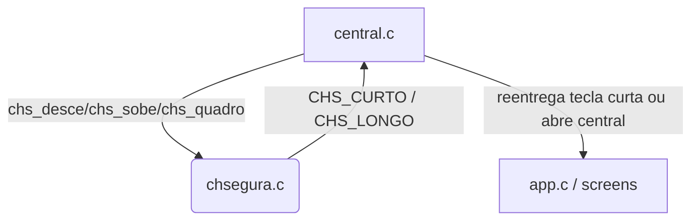
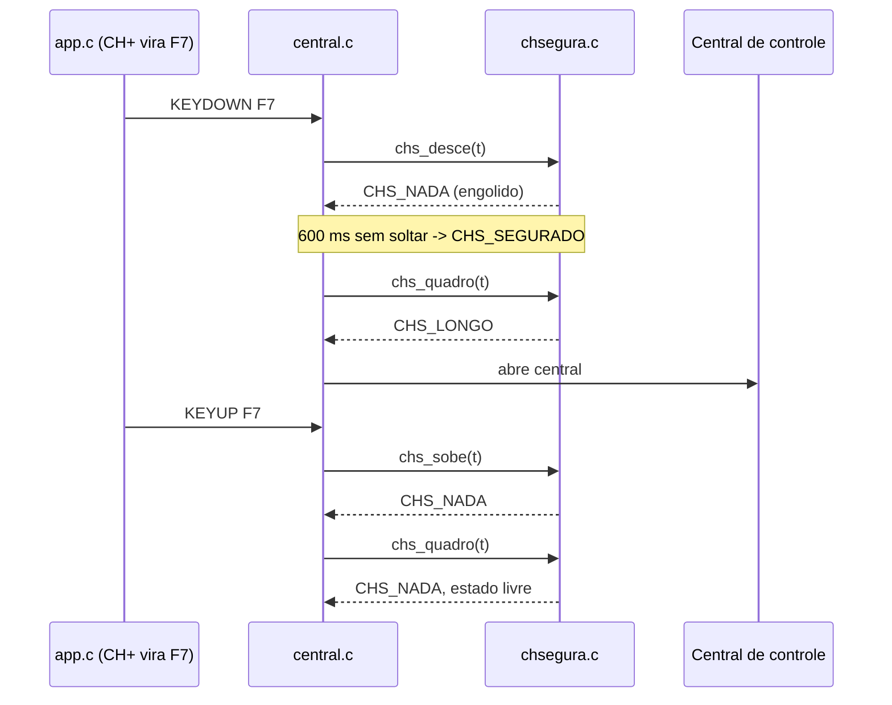
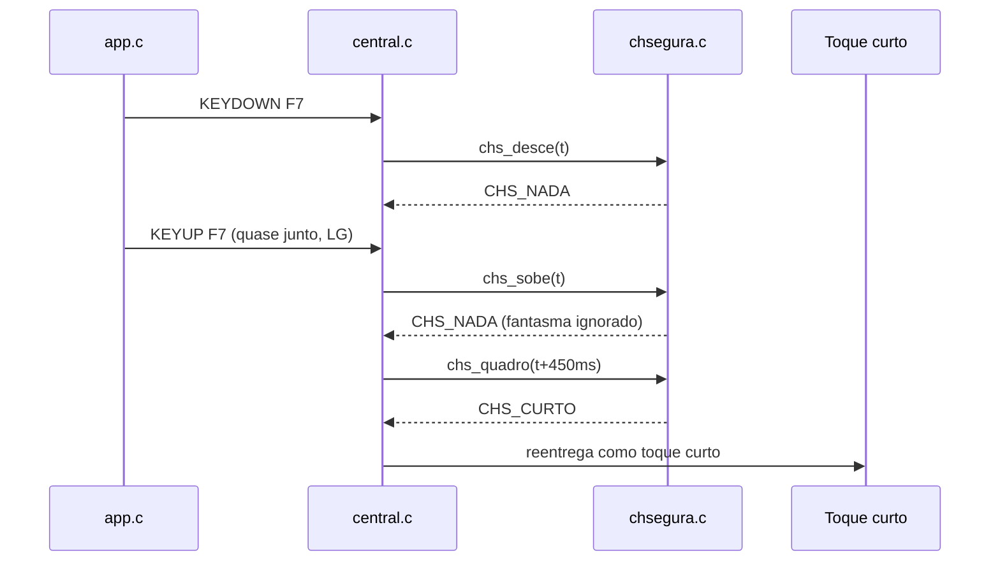

# `src/chsegura.c` — CH+ segurado vs. tocado

## Para que serve

Aritmética pura de estado para distinguir um toque curto de CH+ de um CH+
segurado. O toque curto tem dono (zap com canal na tela, abrir Salvos/Spotlight); o
segurado abre a Central de controle. Como a decisão só é possível depois do
soltar (ou da repetição), o módulo engole o gesto enquanto ele está em curso e
reentrega o toque mais tarde, ou sinaliza o longo no limiar.

Roda em todas as plataformas; é C puro, sem SDL, mas os tempos vêm do relógio do
app (`unsigned` ms). O arquivo não tem `#ifdef` de plataforma: Android, .tpk,
.wgt, webOS e Mac usam a mesma máquina de estados, alimentada por eventos
KEYDOWN/KEYUP já traduzidos (para CH+ virar F7, ver `tpkteclas.c` e
`layout.h:NV_SCANCODE_CHPLUS`).

## Funções públicas (`src/chsegura.h`)

| Assinatura | O que faz | Fio | Pré-condições | Travas | Efeitos colaterais |
|---|---|---|---|---|---|
| `int chs_ocupado(const ChSegura *s)` | Devolve 1 se o gesto está em curso (`estado != CHS_LIVRE`). | qualquer | `s` inicializado ou zero | nenhuma | nenhum |
| `int chs_desce(ChSegura *s, unsigned t)` | Alimenta um KEYDOWN no tempo `t`. No primeiro KEYDOWN passa de `CHS_LIVRE` para `CHS_APERTADO`; em repetições atualiza `tUlt`. Devolve `CHS_LONGO` quando `t - t0 >= CHS_SEGURAR_MS` e ainda não soltou. | principal (chamado por `central.c` a cada evento) | `s` não NULL | nenhuma | muda `estado`, `t0`, `tUlt`, `solto=0` (`src/chsegura.c:6-21`) |
| `int chs_sobe(ChSegura *s, unsigned t)` | Alimenta um KEYUP. Ignora o primeiro KEYUP se ainda não viu uma solta de verdade e `t - tUlt < CHS_FANTASMA_MS` (par "quase junto" do LG). Depois marca `solto=1` e `tSolta=t`. | principal | `s` não NULL | nenhuma | pode setar `viuSolta=1`, `solto=1`, `tSolta` (`src/chsegura.c:24-32`) |
| `int chs_quadro(ChSegura *s, unsigned t)` | Chamado a cada quadro com o tempo atual. Devolve `CHS_CURTO` quando o toque curto deve ser reentregue, `CHS_LONGO` quando o segurado atingiu o limiar, `CHS_NADA` enquanto engole. Também libera o estado quando a emenda/silêncio/esquecimento vence. | principal (`central.c:257`) | `s` não NULL | nenhuma | transita `estado` para `CHS_LIVRE`/`CHS_SEGURADO`; consome o toque uma vez (`src/chsegura.c:34-51`) |

Todas devolvem `CHS_NADA`/`CHS_CURTO`/`CHS_LONGO` (`src/chsegura.h:35`).

## Estado global (static)

Não há estado global no arquivo. O estado fica na struct `ChSegura` que o
caller (hoje só `central.c`) aloca:

- `estado`: `CHS_LIVRE`/`CHS_APERTADO`/`CHS_SEGURADO` (`src/chsegura.h:36`).
- `t0`: tempo do primeiro KEYDOWN (`src/chsegura.c:10`).
- `tUlt`: último KEYDOWN (`src/chsegura.c:16`).
- `tSolta`: KEYUP válido (`src/chsegura.c:30`).
- `solto`: houve KEYUP válido depois do último KEYDOWN (`src/chsegura.c:29`).
- `viuSolta`: sessão já viu um KEYUP de verdade desta tecla (`src/chsegura.c:28`).

Quem lê/escreve:

- `central.c` mantém `static ChSegura chs;` e é o único caller das funções.
- `chs_quadro` devolve o resultado para `central.c` reentregar ou consumir.

## Grafo de chamadas

Arestas de callback/ponteiro: nenhuma. O contrato é uma máquina de estados com
retorno de enum.

## Fluxo principal

## IMPACTOS

- **Se você mexer em `CHS_SEGURAR_MS`**, confira `layout.h:NV_HOLD_MS` (700 ms) e
todos os outros gestos de segurar do app (home.c, ctxmenu.c, ctxlista.c): o CH+
não pode ficar muito mais curto/longos que os outros, senão a pessoa confunde.
- **Se você mexer na lógica de `viuSolta` / fantasma**, confira TVs LG: o BACK
já chega com KEYDOWN+KEYUP quase juntos mesmo segurado. O teste
`tests/central.c:46-55` cobre isso.
- **Se você mexer em `CHS_EMENDA_MS` ou `CHS_SILENCIO_MS`**, confira controles
que enviam pares Up/Down rápidos (X11/EFL no Mac/Linux e, SUSPEITA, algumas
Samsung). `tests/central.c:33-42` cobre pares Up/Down.
- **Limites de buffer**: `ChSegura` cabe na stack; não há heap. `CHS_ESQUECER_MS`
(5 s) garante que um KEYDOWN perdido não trava o CH+ para sempre.
- **Contratos com Kotlin/.NET/JS**: nenhum direto. As plataformas já entregam
CH+ como SDLK_F7 (Android, .tpk, .wgt, webOS) antes de chegar aqui.
- **Testes**:
  - `tests/central.c` (chamado por `tests/central.sh`): toque, segurado, pares
  Up/Down, fantasma, sem KEYUP.
  - `tests/central_rotulos.sh` usa o mesmo fonte para testar UI.
- **O que NÃO tem teste**: comportamento em TV real com controle infravermelho
que perde KEYUP; interação entre CH+ e outros modais abertos; segurado enquanto
o player está em tela cheia.

## Regressões já acontecidas

- Commit `6404df7f` "Add a Control Center opened by holding CH+" — criação do
módulo; o diff introduziu `chsegura.c` e `central.c`. Não há issue no
`docs/issues/mapa.json` mapeada especificamente para este arquivo (a central é
feature nova).
- Não encontrado em `docs/issues/mapa.json` conserto que toque só em
`chsegura.c`. O arquivo é pequeno e estável desde a criação.
