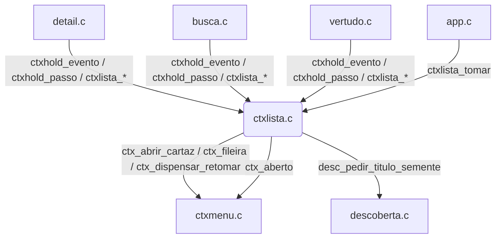
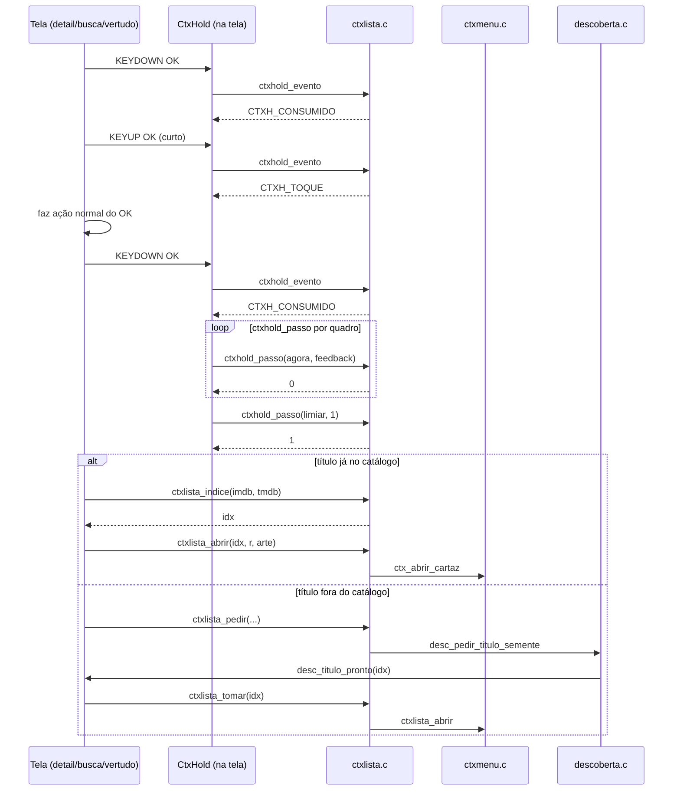

# `src/ctxlista.c` — Segurar OK numa lista de títulos

## Para que serve

Reutiliza a mecânica de "segurar OK" do menu do cartaz (`ctxmenu.c`) para todas
as telas que mostram uma lista/grade de títulos e não são a home: "Ver tudo",
página de coleção, filmografia, lista da saga, recomendações do detalhe,
resultados da Busca e do Spotlight. Em vez de cada tela repetir a lógica de
KEYDOWN/KEYUP/limiar, ela chama `ctxhold_evento()`/`ctxhold_passo()` e, no
limiar, abre o menu do cartaz para o título focado.

Também lida com títulos que ainda não estão no catálogo (crédito de ator, parte
da saga, recomendação): faz o pedido de metadados pelo mesmo caminho de abrir
uma página (`desc_pedir_titulo_semente`) e, quando a resposta chega, abre o
MENU em vez da página (`ctxlista_tomar`).

Roda em todas as plataformas. C puro + SDL2; sem `#ifdef` de plataforma.

## Funções públicas (`src/ctxlista.h`)

### Máquina de hold

| Assinatura | O que faz | Fio | Pré-condições | Travas | Efeitos colaterais |
|---|---|---|---|---|---|
| `int ctxhold_evento(CtxHold *h, const SDL_Event *e, int celulaAceita)` | Alimenta TODO evento de teclado da tela. Devolve `CTXH_CONSUMIDO` (o evento é do gesto), `CTXH_TOQUE` (OK soltou antes do limiar, faça ação normal) ou `CTXH_NADA` (não é do gesto). | principal | `h` inicializado em zero; evento KEYDOWN/KEYUP | nenhuma | arma/desarma `h`; chama `ctxhold_cancelar` se outra tecla (`src/ctxlista.c:22-42`) |
| `int ctxhold_passo(CtxHold *h, Uint32 agora, int feedback)` | Por quadro. Devolve 1 UMA vez quando cruza `NV_HOLD_MS`. | principal | `h` armado | nenhuma | se `ctx_aberto()` cancela; com `feedback` mostra ilha de atividade "Segure para opções" (`src/ctxlista.c:49-58`) |
| `void ctxhold_cancelar(CtxHold *h)` | Cancela o gesto (desarma, zera). | principal | nenhuma | nenhuma | `h->armado=0`, `h->longo=0`, `h->desde=0` (`src/ctxlista.c:60-63`) |
| `float ctxhold_progresso(const CtxHold *h, Uint32 agora)` | 0..1 do hold, para testes ou barra customizada. | qualquer | nenhuma | nenhuma | nenhum (`src/ctxlista.c:44-47`) |

### Abertura do menu para lista

| Assinatura | O que faz | Fio | Pré-condições | Efeitos colaterais |
|---|---|---|---|---|
| `int ctxlista_indice(const char *imdb, long tmdb)` | Busca índice no catálogo por IMDb (com ou sem `:temp:ep`) ou por TMDB. Devolve -1 se ainda não tem. | principal | nenhuma | nenhum (`src/ctxlista.c:65-80`) |
| `int ctxlista_abrir(int idx, GfxRect r, const char *arte)` | Abre o menu do cartaz ao lado do retângulo `r` com a arte. Limpa fileira e dispensar. | principal | `idx` válido | chama `ctx_fileira(NULL,NULL)`, `ctx_dispensar_retomar(0)`, `ctx_abrir_cartaz()` (`src/ctxlista.c:82-88`) |
| `int ctxlista_pedir(...)` | Título fora do catálogo: pede metadados via `desc_pedir_titulo_semente` e guarda retângulo/arte. | principal | descoberta não ocupada; imdb ou tmdb válido | preenche estado `pend` (`src/ctxlista.c:96-105`) |
| `int ctxlista_tomar(int idx)` | Roteador (`app.c`) chama quando `desc_titulo_pronto()` devolve `idx`. Se havia pedido vivo e dentro do prazo, abre o menu. | principal (app.c:2699) | nenhuma | consome `pend.vivo`; pode chamar `ctxlista_abrir` (`src/ctxlista.c:107-114`) |

## Estado global (static)

- `pend`: struct com `vivo`, `desde`, `r`, `arte[1024]` — pedido de título fora
do catálogo (`src/ctxlista.c:94`).

Quem lê/escreve:

- `ctxlista_pedir` preenche.
- `ctxlista_tomar` consome.
- `ctxlista_abrir` usa `r`/`arte` vindos de `pend`.

Não há estado global além de `pend`: o `CtxHold` fica na tela chamadora
(`detail.c`, `busca.c`, `vertudo.c`).

## Grafo de chamadas

Arestas de callback/ponteiro: nenhuma. O fluxo é direto por funções.

## Fluxo principal

## IMPACTOS

- **Se você mexer em `NV_HOLD_MS`** (em `layout.h`), confira `ctxhold_passo` e
`ctxhold_evento`: os 150 ms iniciais são considerados toque, não gesto
(`src/ctxlista.c:16`). Isso evita que um toque rápido vire menu.
- **Se você mexer em `ctxhold_evento`**, confira todas as telas chamadoras: elas
devem tratar `CTXH_CONSUMIDO` (ignorar evento), `CTXH_TOQUE` (fazer ação normal
do OK) e `CTXH_NADA` (passar para a tela). `tests/ctxlista.c:57-72` cobre o
protocolo.
- **Se você adicionar uma nova tela com lista de títulos**, siga o protocolo do
header (`src/ctxlista.h:19-27`): declare `static CtxHold hold;`, chame
`ctxhold_evento` no evento e `ctxhold_passo` no atualizar.
- **Se você mexer em `ctxlista_tomar`**, confira o prazo `CTXL_PRAZO_MS` (20 s):
se o metadado chegar depois, o pedido é engolido e não abre página/menu
(`src/ctxlista.c:111`).
- **Se você mexer em `ctxlista_indice`**, confira que `tmdb:` IDs são
especiais: a função extrai o número depois do prefixo (`src/ctxlista.c:71`).
- **Contratos com Kotlin/.NET/JS**: nenhum. As plataformas entregam SDL events
antes de chegar aqui.
- **Testes**:
  - `tests/ctxlista.c` (`tests/ctxlista.sh`): protocolo do gesto, menu em
  "Ver tudo", página de coleção, resultados da Busca; verifica extensão de
  informações ao lado.
  - `tests/menuep.c`: segurar OK em card de episódio e aba de temporada.
  - `tests/detail_layout.c`, `tests/detail_secoes_shot.c`: usam focus do detail,
  mas o hold do menu passa por `ctxlista`.
- **O que NÃO tem teste**: todas as outras listas mencionadas no header
(filmografia, saga, recomendações do detalhe, Spotlight) — `ctxlista.c` as
suporta, mas não há captura/asserção específica para cada uma; falha de rede no
pedido de metadados; múltiplos holds simultâneos em telas empilhadas.

## Regressões já acontecidas

- Commit `88b7650d` "Hold OK on a title in any list opens the poster context menu"
— criação do módulo. Não há issue específica no `docs/issues/mapa.json` para a
criação; resolveu a lacuna geral de "não tem menu contextual quando abre uma
lista" (mencionado no header, `src/ctxlista.h:5`).
- Não encontradas outras issues no `docs/issues/mapa.json` cujo conserte toque
só em `ctxlista.c`.
