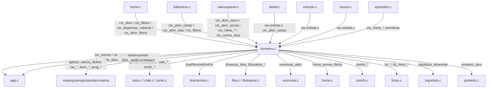
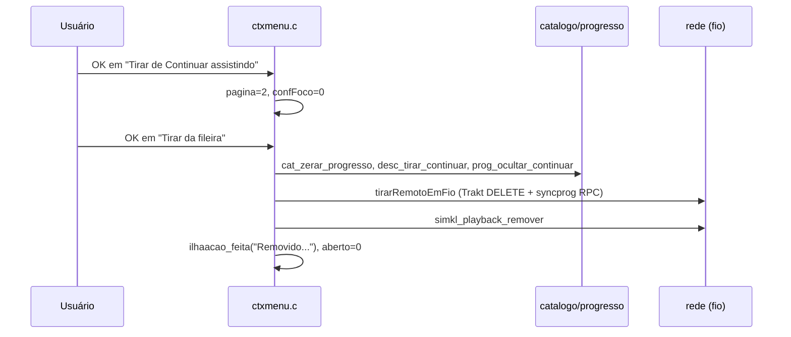

# `src/ctxmenu.c` — Menu de contexto do cartaz

## Para que serve

Menu flutuante ("ilha") aberto segurando OK sobre cards da home, da biblioteca,
de listas, do painel de Salvos/Social e sobre abas de temporada/episódio. As
ações principais são Salvar/Remover dos Salvos, Marcar/Desmarcar como assistido,
Tirar de "Continuar assistindo", Recomendar, Mover para categoria, Estilo da
fileira e extras sociais. O menu compartilha o mesmo desenho (vidro/sólido, linhas
com foco por superfície) para todos os chamadores, evitando que cada tela
reinvente medidas.

Roda em todas as plataformas. Não há `#ifdef` de plataforma no arquivo; a
integração de teclas é SDL2. As escritas no Trakt/Simkl/conta Nuvio são
assíncronas (fio próprio), mas a interface com o usuário é síncrona no fio de
desenho.

## Funções públicas (`src/ctxmenu.h`)

### Abertura / controle do modal

| Assinatura | O que faz | Fio | Pré-condições | Travas | Efeitos colaterais |
|---|---|---|---|---|---|
| `void ctx_abrir(int indice)` | Abre o menu para o item `indice` do catálogo global. Usado pela home. | principal (home.c chama no KEYUP após limiar) | `indice` válido em `cat_n()`; home já chamou `ctx_fileira()` / `ctx_dispensar_retomar()` | nenhuma direta | seta `aberto=1`, `idx`, `foco=0`; pode disparar `lst_abrir()` se lista; pode desenhar dica de hold (`src/ctxmenu.c:548-572`) |
| `void ctx_abrir_cartaz(int indice, GfxRect r, const char *arte)` | Abre para a biblioteca, com retângulo/arte fixos do cartaz (tela virtual 1920x1080). | principal (biblioteca.c) | `r` e `arte` válidos | nenhuma | copia `r`/`arte`; se inválidos, cai no mesmo caminho de `ctx_abrir` (`src/ctxmenu.c:574-586`) |
| `void ctx_abrir_lista(const LstLista *l)` | Abre menu de uma LISTA (Biblioteca > Listas): resumo + ações fixar/home/abrir. | principal | `l` não NULL | nenhuma | copia `lista`, `doLista=1`, chama `lst_abrir()` (`src/ctxmenu.c:588-599`) |
| `void ctx_abrir_fileira(const char *chave, const char *titulo)` | Abre direto no modal de estilo da fileira (pasta de coleção, ranking fechado). | principal | `chave` aceita estilos (`fil_estilos`) | nenhuma | `soFileira=1`, `pagina=1` (`src/ctxmenu.c:610-623`) |
| `void ctx_abrir_salvo(const CatItem *titulo)` | Menu do painel de Salvos. Copia o título; pode não existir no catálogo. | principal (salvospainel.c) | `titulo` com IMDb | nenhuma | `doPainel=1`, `copiaPainel` copiada, normaliza tipo para movie (`src/ctxmenu.c:653-672`) |
| `void ctx_abrir_social(const CatItem *titulo, const CtxExtra *extras, int n)` | Menu nas abas Atividade/Amigos do painel. | principal | `titulo` ou extras válidos | nenhuma | `doPainel=1`, `doSocial=1`, copia extras (`src/ctxmenu.c:674-694`) |
| `int ctx_aberto(void)` | 1 se o menu está aberto. | qualquer | nenhuma | nenhuma | nenhum |
| `void ctx_evento(const SDL_Event *e)` | Roteia KEYDOWN/KEYUP no menu. | principal (app.c entrega quando `ctx_aberto()`) | evento válido | usa estado global do módulo | pode alterar `foco`, `pagina`, chamar `aplicar()`; KEYUP de OK limpa `esperandoSoltura` (`src/ctxmenu.c:1053-1118`) |
| `void ctx_atualizar(float dt, Uint32 agora)` | Molas de animação, watch do SDL_AddEventWatch pela primeira vez, e polling de estado da operação Trakt/Simkl. | principal (app.c:4589) | chamado a cada quadro | nenhuma | anima `anim`, `focoAnim[]`, `infoT`; consome resposta de `trakt_operacao_estado` / `simkl_lista_estado`; aplica espelho local; chama `desc_remontar_fileiras()` (`src/ctxmenu.c:1120-1212`) |
| `void ctx_desenhar(Uint32 agora)` | Desenha o menu, confirmação, estilos, lista ou dica de hold. Camada ampliada (escala.h). | principal (app.c:4716,4723,4827) | GL/texto inicializado | nenhuma | escreve na tela virtual; `infoDesenhada`, `infoCaixa`, `menuCaixa`, `infoLadoUlt` (`src/ctxmenu.c:1812-2088`) |
| `void ctx_fileira(const char *chave, const char *titulo)` | Define a fileira de onde o cartaz veio, para a opção "Estilo da fileira". | principal | chamar antes de `ctx_abrir*` | nenhuma | preenche `filChave[]`, `filTitulo[]` (`src/ctxmenu.c:605-608`) |
| `void ctx_dispensar_retomar(int on)` | Próximo `ctx_abrir` ganha opção "Dispensar" (solta o título da fileira Retomar). | principal | chamar antes de `ctx_abrir` | nenhuma | seta `dispensarPend` (`src/ctxmenu.c:603`) |

### Retorno de pedidos para os chamadores

| Assinatura | O que faz | Fio | Efeitos colaterais |
|---|---|---|---|
| `int ctx_pediu_lista(void)` | 1 uma vez quando escolheu "Abrir lista". | principal | consome `listaPedida` (`src/ctxmenu.c:600`) |
| `int ctx_lista_alterou(void)` | 1 uma vez quando fixou/desafixou ou ligou/desligou Home. | principal | consome `listaAlterou` (`src/ctxmenu.c:601`) |
| `int ctx_pediu_extra(void)` | 1 uma vez com o índice da extra social escolhida. | principal | consome `extraPedido` (`src/ctxmenu.c:696`) |
| `const char *ctx_pediu_categoria(void)` | IMDb do "Mover para categoria" do painel, ou NULL. | principal | consome `pedCategoriaImdb` (`src/ctxmenu.c:710-716`) |
| `int ctx_do_painel(void)` | 1 enquanto o menu aberto é o do painel (app.c desenha por cima). | principal | nenhum (`src/ctxmenu.c:698`) |
| `const CatItem *ctx_titulo(void)` | Título do menu aberto (NULL em lista/estilo/fechado). | principal | nenhum (`src/ctxmenu.c:709`) |
| `int ctx_info_caixa(GfxRect *info, GfxRect *menu, int *lado)` | Devolve as caixas do último quadro desenhado (menu + extensão) e o lado. | principal | nenhum; retorna 0 se `infoDesenhada==0` (`src/ctxmenu.c:702-708`) |

### Primitivas de desenho compartilhadas

| Assinatura | O que faz | Quem usa |
|---|---|---|
| `float ctx_menu_largura(const CtxLinha *l, int n)` | Largura necessária para `n` linhas, teto `CTX_W_MAX` (600). | `episodios.c:187` (`src/ctxmenu.c:1309-1318`) |
| `float ctx_menu_altura(int n)` | Altura da ilha para `n` linhas. | `episodios.c:382` (`src/ctxmenu.c:1319-1321`) |
| `float ctx_menu_ao_lado(GfxRect cartaz, float w)` | Posição X da ilha ao lado do cartaz. | `episodios.c:488` (`src/ctxmenu.c:1322-1329`) |
| `void ctx_menu_veu(float a)` | Véu de tela cheia. | `episodios.c:504` (`src/ctxmenu.c:1330-1332`) |
| `void ctx_menu_ilha(GfxRect p, float raioPx, float a)` | Desenha a folha/ilha. | `episodios.c` (`src/ctxmenu.c:1333`) |
| `void ctx_menu_linha(...)` | Desenha uma linha de opção. | `episodios.c:467` (`src/ctxmenu.c:1334-1337`) |
| `float ctx_menu_passo(void)` | Altura de uma linha + vão. | `episodios.c:421,431` (`src/ctxmenu.c:1338`) |
| `void ctx_menu_desenhar(...)` | Desenha ilha completa com cabeçalho, linhas e alvos de ponteiro. | `episodios.c:509` (`src/ctxmenu.c:1348-1362`) |

### Modo inline (acordeão do painel de Salvos)

| Assinatura | O que faz | Quem usa |
|---|---|---|
| `void ctx_inline_pedir(int on)` | Liga o modo inline no próximo `ctx_abrir_salvo`. | `salvospainel.c:2003` (`src/ctxmenu.c:1741`) |
| `float ctx_inline_t(void)` | Mola 0..1 do modo inline. | `salvospainel.c:2930,2960` (`src/ctxmenu.c:1743`) |
| `float ctx_inline_altura(float w, float faixaH)` | Altura da linha expandida. | `salvospainel.c:2935,2939,2945` (`src/ctxmenu.c:1756-1763`) |
| `void ctx_inline_desenhar(...)` | Desenha a linha expandida (logo, compacto, pilulas). | `salvospainel.c:2952,2979` (`src/ctxmenu.c:1764-1808`) |
| `void ctx_centro_dica(float cx)` | Centro horizontal da barra "Segure OK"; negativo = centro da tela. | `salvospainel.c:2463` (`src/ctxmenu.c:699`) |

## Estado global (static)

O módulo mantém muito estado estático; quase tudo é lido/escrito apenas dentro
do próprio `ctxmenu.c`:

- `aberto`, `idx`, `foco`: menu aberto, índice no catálogo, linha focada (`src/ctxmenu.c:96`).
- `doLista`, `lista`, `listaPedida`, `listaAlterou`: modo lista e pedidos (`src/ctxmenu.c:100-101,600-601`).
- `doPainel`, `copiaPainel`, `doSocial`, `extras[]`, `nExtras`, `extraPedido`, `confExtra`, `pendExtra`: modo painel/social (`src/ctxmenu.c:143-153,696`).
- `pagina`, `soFileira`: 0 = menu, 1 = estilos, 2 = confirmação (`src/ctxmenu.c:259,266`).
- `operacao`, `intencao`, `estadoOperacao`, `opSimkl`, `avisoOp`, `operacaoImdb[]`: máquina de estados da escrita remota (`src/ctxmenu.c:102-113`).
- `holdAtivo`, `holdCancelado`, `holdPronto`, `holdDesde`, `esperandoSoltura`: gesto de hold vindo da home (`src/ctxmenu.c:113,125,126`).
- `dicaCx`, `temCartaz`, `cartazRect`, `cartazArte[]`: geometria do cartaz de origem (`src/ctxmenu.c:157,162-164`).
- `infoT`, `infoH`, `infoDesenhada`, `infoLadoUlt`, `infoCaixa`, `menuCaixa`: extensão de informações (`src/ctxmenu.c:167-169`).
- `ops[]`, `nOps`, `focoAnim[]`: linhas do menu atual (`src/ctxmenu.c:231-233`).
- `estLin[]`, `nEstilos`, `estFoco`, `estTam[]`, `estAnim[]`, `prevAtual/Ant`, `prevRefAtual/Ant`, `prevT`: página de estilos (`src/ctxmenu.c:279-285`).
- `opItem`, `opTinhaRetomada`: cópia do título sob operação (`src/ctxmenu.c:727-728`).

Quem lê/escreve de fora:

- `app.c` chama `ctx_evento`, `ctx_atualizar`, `ctx_desenhar` e lê `ctx_aberto`, `ctx_do_painel`.
- `home.c`, `biblioteca.c`, `salvospainel.c`, `detail.c` (via `ctxlista`), `vertudo.c`, `busca.c` abrem o menu.
- `episodios.c` usa as primitivas de desenho.
- `descoberta.c`/`catalogo.c` são chamados durante `aplicar()`/`espelharAssistido()`.
- `trakt.c`/`simkl.c`/`visto.c`/`tirarremoto.c` são chamados para escritas remotas.

## Grafo de chamadas



Arestas por callback/ponteiro de função:
- `SDL_AddEventWatch(observarHold, NULL)` em `ctx_atualizar` (`src/ctxmenu.c:1124`) — callback do SDL.
- `ponteiro_alvo(..., ponteiroCtxOpcao/ponteiroConfFoco/...)` em `ctx_desenhar`/`desenhaEstilos` (`src/ctxmenu.c:1360,1410,1539,1954,2064`) — alvos de ponteiro.
- `a.desfazer = desfazerAssistido` passado para `ilhaacao_feita` (`src/ctxmenu.c:747`).
- `focar` callback em `ctx_menu_desenhar` (`src/ctxmenu.c:1359`).

## Fluxo principal: KEYDOWN de OK -> menu -> escolha

```mermaid
sequenceDiagram
    participant H as home.c
    participant A as app.c
    participant C as ctxmenu.c
    participant R as rede (Trakt/Simkl)

    H->>C: ctx_fileira(chave, titulo)
    H->>C: ctx_dispensar_retomar(on)
    H->>C: ctx_abrir(indice)
    C->>C: abrirComum(): esperandoSoltura=1
    C->>C: montar(): monta ops[]
    A->>C: ctx_atualizar(dt, agora)
    C->>C: SDL_AddEventWatch(observarHold)
    A->>C: ctx_desenhar(agora)
    Note over C: OK ainda afundado; KEYDOWN ignorado
    A->>C: ctx_evento(KEYUP OK)
    C->>C: esperandoSoltura=0
    A->>C: ctx_evento(KEYDOWN setas)
    C->>C: foco muda
    A->>C: ctx_evento(KEYDOWN OK)
    C->>C: aplicar(): captura intencao
    alt OP_LISTA
        C->>C: salvos_definir
        C->>R: trakt_watchlist_tipo / simkl_lista_tipo (assíncrono)
        C->>C: estadoOperacao=PENDENTE
    else OP_ASSISTIDO
        C->>C: iniciarAssistido()
        C->>D: visto_titulo (fio)
        C->>R: trakt_assistido_tipo / (sem Trakt -> espelho local)
    else OP_TIRAR_CONTINUAR
        C->>C: pagina=2 (confirmacao)
    end
    loop ctx_atualizar até resposta 2xx
        C->>R: trakt_operacao_estado / simkl_lista_estado
        R-->>C: CONFIRMADA/FALHA
        C->>C: espelho local, desc_remontar_fileiras, montar()
    end
```

Fluxo de "Tirar de Continuar assistindo" (a confirmação é mandatória):



## IMPACTOS

- **Se você mexer em `montar()` ou `CTX_MAX`**, confira `juntar()` (`src/ctxmenu.c:366-369`): ele é o único caminho para `ops[]`. Issue #36 foi escrita fora do vetor quando uma quinta opção entrou sem o teto subir. Hoje `CTX_MAX=9` (`src/ctxmenu.c:230`).
- **Se você adicionar uma opção nova**, atualize `CTX_MAX`, `OP_*` enum (`src/ctxmenu.c:235-237`), `pilulaRot()` (`src/ctxmenu.c:1748-1755`) e o switch de ícones em `ctx_desenhar` (`src/ctxmenu.c:2069-2085`). Senão a opção some ou o ícone fica errado.
- **Se você mexer no gesto de hold**, confira `observarHold` (`src/ctxmenu.c:179-201`) e `esperandoSoltura`. Issue: com o modal aberto no limiar, o OK afundado não pode escolher nada — teste `tests/hold.c` cobre isso.
- **Se você mexer em `aplicar()` / `iniciarAssistido()`**, confira a ordem: local primeiro, depois Trakt/Simkl; espelho só depois do 2xx (`src/ctxmenu.c:1170-1212`). Issues #22, #244 e #110 vieram de apagar só local ou de não esperar resposta.
- **Se você mexer na confirmação (pagina 2)**, confira `confFoco` inicial 0 = "Tirar", 1 = "Cancelar"; setas esquerda/direita mudam; Voltar = cancelar (`src/ctxmenu.c:1085-1091`).
- **Se você mexer na página de estilos**, confira `fil_estilos()`, `fil_estilo_linhas()`, `home_previa_fileira()`; o tamanho é segmentado dentro da linha (`src/ctxmenu.c:403-411,1385-1420`).
- **Se você mexer no desenho inline**, confira `modoInline()` (`src/ctxmenu.c:1742`) e `salvospainel.c`: a linha se abre DENTRO do painel, não flutua.
- **Contratos com Kotlin/.NET/JS**: nenhum chamador nativo direto. Toda a interação é via SDL events vindos de `app.c`.
- **Limites de buffer**: `cartazArte[1024]`, `operacaoImdb[16]`, `pedCategoriaImdb[24]`, `filChave[192]`, `filTitulo[96]` (`src/ctxmenu.c:164,112,240,255,256`). `CTX_MAX=9` limita `ops[]` e `focoAnim[]` (`src/ctxmenu.c:230-233`).
- **Testes**:
  - `tests/hold.c`: OK afundado não escolhe, toque novo escolhe, repetição não escolhe, confirmação de "Tirar" funciona, última opção responde.
  - `tests/ctxmenu_semfio.c` (`tests/ctxmenu_semfio.sh`): DELETE/RPC remoto não roda no fio de desenho quando sem pthread.
  - `tests/ctxmenu_contract.sh`: contrato visual da confirmação.
  - `tests/biblioteca_shot.c` (modo "ctx"): menu de cartaz e de lista na Biblioteca.
  - `tests/homelayouts_shot.c`, `tests/carrossel_shot.c`, `tests/ctxinfo_shot.c`, `tests/socialui_shot.c`, `tests/salvos_segurar.c`, `tests/spainel_acordeao_shot.c`, `tests/retomar_dispensar_shot.c`, `tests/menuep.c`: integração do menu em várias telas.
- **O que NÃO tem teste**: falha real de rede com timeout longo; corrida entre duas operações simultâneas no mesmo título; comportamento com conta Nuvio desconectada mas Simkl/Trakt ativo; anúncios de "Desfazer" com ponteiro.

## Regressões já acontecidas

- **Issue #36** — "Remove from continue watching not highlighting": a quarta opção do menu escrevia fora de `ops[]`. Conserto: `87d986be` (v1.0.38) — introduziu `juntar()` e subiu o teto. Referência no código: `src/ctxmenu.c:208-219`.
- **Issue #22** — "Unable to remove items from Continue Watching": apagava só o registro local; o card voltava no ciclo seguinte vindo do Trakt. Consertos: `545dd122` (v1.0.22), `9f57ca70`, `65962f31`, `19b68a33` (v1.0.30). Referência no código: `src/ctxmenu.c:1016-1021`.
- **Issue #110** — "SIMKL no Option for continue list": Simkl passou a ser fonte do Continuar assistindo e destino do "+". Consertos: `ae51d9b0`, `a00f2e23` (v1.4.2). Referência no código: `src/ctxmenu.c:105-108,943-951,1035-1037`.
- **Issue #244** — "Continue Watching: the same episode repeats 5 times and marking it watched does not remove it": carimbo de "removido" e zerar a barra para o card sair na hora. Consertos: `8e7f4098`, `d6495798` (v2.0.0). Referência no código: `src/ctxmenu.c:782-793,1013-1015`.
- **Issue #203** — "Menu bar remain visible during play": up-next pode ser removido; marcação de assistido tira Trakt/syncprog em fio. Consertos: `b8d110de` (v1.7.0), `c40c5480`. Referência no código: `src/ctxmenu.c:476,996-1048`.
- **Issue #99** — "Possibility of having LG magic mouse cursor support": ponteiro no menu do cartaz e na folha de episódios. Consertos incluem `c8eb88dc` (v1.4.2). Referência no código: `src/ctxmenu.c:1214-1233`.
- **Issue #350** — "Major bug": card "Retomar agora" ganhou "Ver detalhes" no menu de segurar. Conserto: `4b8ba24b` (v2.0.3). Referência no código: `src/ctxmenu.c:241-244,560,986-989`.
- Commit `128e3e44` — "fix(ctxmenu): sem fio, o DELETE do Trakt e a RPC desistem com log em vez de rodar no quadro" — garante que sem fio o efeito local continua e a rede não congela.
- Commit `72fc391f` — menu de contexto de lista (Biblioteca > Listas).
- Commit `7f9f470f` / `6e3b8470` — extensão de informações e morph do poster no menu do cartaz.
