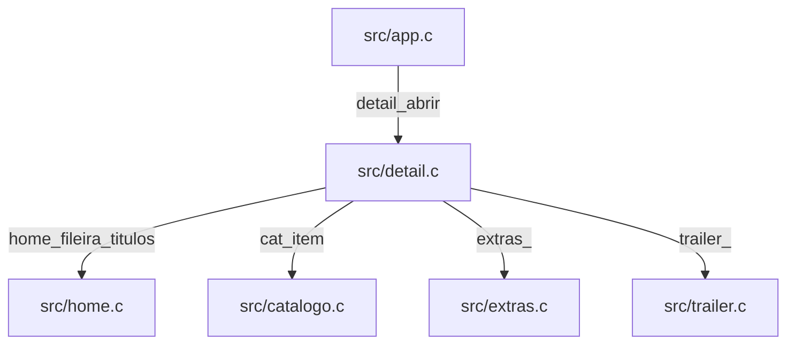

# `src/detail.c` — ficha de título e carrossel

## Para que serve

Abre ficha a partir do HomeItem e coordena temporadas, episódios, pessoas e trailer.
Emite pedidos para o app abrir reprodução, fontes e outros títulos.
UI SDL/GL compartilhada, desenhada após a Home (`src/detail.h:12`, `src/detail.h:413`).

Base: `bed3534c`. Referências correspondem ao checkout; não há validação física nesta rodada.

## Funções públicas (`src/detail.h`)

Fio principal SDL/GL, sem mutex próprio nestas funções; dependências têm suas próprias travas. Eventos e saídas obrigatórias devem apontar para memória válida. Referências de cada operação abaixo comprovam efeitos; pedidos `pediu_*` são consumíveis, exceto getters explicitamente descritos.

| Assinatura | Contrato, pré-condições e efeitos | Travas locais / evidência |
|---|---|---|
| `void detail_abrir(const HomeItem *item)` | Recebe HomeItem válido, inicializa ficha/identidade e pode obter carrossel da Dinâmica na Home. | Sem aquisição explícita; auxiliares podem adquirir; `src/detail.c:1479`; `src/detail.h:12` |
| `void detail_mostrar_pessoa(long tmdb, const char *nome, const char *foto)` | Com detalhe aberto e TMDB positivo, pede dados da pessoa e muda subpainel. | Sem aquisição explícita; auxiliares podem adquirir; `src/detail.c:1471`; `src/detail.h:17` |
| `int detail_aberto(void)` | Consulta existência da ficha, inclusive durante saída. | Sem aquisição explícita; auxiliares podem adquirir; `src/detail.c:1594`; `src/detail.h:18` |
| `void detail_fechar(void)` | Marca saída animada; não libera imediatamente todos os recursos. | Sem aquisição explícita; auxiliares podem adquirir; `src/detail.c:1454`; `src/detail.h:21` |
| `void detail_fechar_seco(void)` | Marca saída e zera t; atualização posterior conclui fechamento. | Sem aquisição explícita; auxiliares podem adquirir; `src/detail.c:1463`; `src/detail.h:23` |
| `int detail_relogio_oculto(void)` | Informa carrossel compacto aberto no nível zero. | Sem aquisição explícita; auxiliares podem adquirir; `src/detail.c:1595`; `src/detail.h:24` |
| `int detail_pediu_social(void)` | Consome pedido social uma vez. | Sem aquisição explícita; auxiliares podem adquirir; `src/detail.c:1596`; `src/detail.h:25` |
| `int detail_pediu_menu(void)` | Consome pedido de menu lateral uma vez. | Sem aquisição explícita; auxiliares podem adquirir; `src/detail.c:7176`; `src/detail.h:26` |
| `void detail_sob_menu(int sim)` | Marca cobertura do menu e desliga/restaura somente som anterior do trailer integrado. | Sem aquisição explícita; auxiliares podem adquirir; `src/detail.c:7181`; `src/detail.h:29` |
| `int detail_sob_menu_ativo(void)` | Consulta cobertura do menu. | Sem aquisição explícita; auxiliares podem adquirir; `src/detail.c:7194`; `src/detail.h:30` |
| `float detail_progresso(void)` | Retorna suave(t) se aberto fora do carrossel; 0 nos demais casos. | Sem aquisição explícita; auxiliares podem adquirir; `src/detail.c:1604`; `src/detail.h:32` |
| `int detail_cobre_tela(void)` | Testa cobertura geométrica e opacidade, inclusive carrossel; não equivale a aberto. | Sem aquisição explícita; auxiliares podem adquirir; `src/detail.c:1720`; `src/detail.h:36` |
| `int detail_assentado(void)` | Exige aberto, sem saída, t > 0.985 e nível zero. | Sem aquisição explícita; auxiliares podem adquirir; `src/detail.c:1700`; `src/detail.h:39` |
| `int detail_indice(void)` | Consulta índice atual do catálogo, revalidado por identidade na atualização. | Sem aquisição explícita; auxiliares podem adquirir; `src/detail.c:7142`; `src/detail.h:44` |
| `int detail_ep_foco(int *temporada, int *episodio)` | Obtém temporada/episódio alvo quando a ficha está aberta. | Sem aquisição explícita; auxiliares podem adquirir; `src/detail.c:1695`; `src/detail.h:46` |
| `int detail_pediu_reproduzir(void)` | Consome flag de reprodução; segunda leitura já retorna zero. | Sem aquisição explícita; auxiliares podem adquirir; `src/detail.c:7143`; `src/detail.h:47` |
| `void detail_pedir_reproduzir(void)` | Arma flag de reprodução. | Sem aquisição explícita; auxiliares podem adquirir; `src/detail.c:7147`; `src/detail.h:48` |
| `int detail_pediu_abrir(void)` | Consome índice de OUTRO título, com -1 como ausência. | Sem aquisição explícita; auxiliares podem adquirir; `src/detail.c:7148`; `src/detail.h:56` |
| `void detail_volta_notar(int novo)` | Guarda título anterior em pilha de 8; evita reinserção durante retorno e remove mais antigo se cheia. | Sem aquisição explícita; auxiliares podem adquirir; `src/detail.c:7149`; `src/detail.h:59` |
| `int detail_pediu_assistido(void)` | Consome pedido de marcação assistido. | Sem aquisição explícita; auxiliares podem adquirir; `src/detail.c:7158`; `src/detail.h:64` |
| `int detail_pediu_amigos(char *imdb, size_t tam)` | Consome pedido e copia IMDb se destino/tamanho válidos. | Sem aquisição explícita; auxiliares podem adquirir; `src/detail.c:7160`; `src/detail.h:65` |
| `int detail_pediu_marcar(void)` | Consome pedido de salvar, sem executar a mutação remota. | Sem aquisição explícita; auxiliares podem adquirir; `src/detail.c:7159`; `src/detail.h:66` |
| `int detail_pediu_fontes(void)` | Consome pedido da folha de fontes. | Sem aquisição explícita; auxiliares podem adquirir; `src/detail.c:7167`; `src/detail.h:67` |
| `int detail_pediu_explorar(void)` | Consome pedido de explorar o título. | Sem aquisição explícita; auxiliares podem adquirir; `src/detail.c:7168`; `src/detail.h:68` |
| `int detail_pediu_do_inicio(void)` | Consome pedido de reprodução desde o início. | Sem aquisição explícita; auxiliares podem adquirir; `src/detail.c:7172`; `src/detail.h:72` |
| `void detail_evento(const SDL_Event *e)` | Roteia evento SDL válido para carrossel/ficha/subpainéis; ignora durante saída. | Sem aquisição explícita; auxiliares podem adquirir; `src/detail.c:2335`; `src/detail.h:411` |
| `void detail_atualizar(float dt, Uint32 agora)` | Atualiza animação, identidade e episódios, colhendo estado de módulos assíncronos. | Sem aquisição explícita; auxiliares podem adquirir; `src/detail.c:3063`; `src/detail.h:412` |
| `void detail_desenhar(Uint32 agora)` | Desenha depois da Home; exige contexto GL; coordena fundo, ficha, trailer e sobreposições. | Sem aquisição explícita; auxiliares podem adquirir; `src/detail.c:7025`; `src/detail.h:413` |

## Estado global (`static`)

| Grupo | Escrita e leitura | Evidência |
|---|---|---|
| item, idx/idxImdb/idxCopia, revistaVista/epGerVista | Abertura/revalidação escrevem; desenho e reprodução leem. | `src/detail.c:168` |
| aberto/saindo/t/nivel, pessoa*, foco e rolagem | Abertura/eventos/atualização escrevem; desenho/getters leem. | `src/detail.c:169` |
| pedAbrir, pedReproduzir e demais pedidos, voltaPilha[8] | Eventos armam, getters consomem; volta_notar registra histórico. | `src/detail.c:206` |
| holdLista, retângulos/artes de foco e carrossel | Evento e callbacks de ponteiro alteram; atualização/desenho usam. | `src/detail.c:199` |

## Grafo de chamadas

Recorte comprovado. Direção: chamador → chamado; registro de callback é indicado.



Evidências:

- `src/app.c` → `src/detail.c`: `src/app.c:574`.
- `src/detail.c` → `src/home.c`: `src/detail.c:1489`.
- `src/detail.c` → `src/catalogo.c`: `src/detail.c:251`.
- `src/detail.c` → `src/extras.c`: `src/detail.c:407`.
- `src/detail.c` → `src/trailer.c`: `src/detail.c:1251`.

## Fluxo principal

```mermaid
sequenceDiagram
    App->>Detalhe: detail_abrir(HomeItem)
    Detalhe->>Home: home_fileira_titulos na Dinâmica
    App->>Detalhe: evento e atualizar
    Detalhe->>Catalogo: revalidar identidade e geração de episódios
    App->>Detalhe: desenhar após Home
    App->>Detalhe: pediu_reproduzir consome pedido
    App->>Detalhe: fechar; continuar atualização de saída
```

Ordem baseada nas entradas públicas e nas chamadas citadas acima.

## IMPACTOS

| Se você mexer em... | Confira... |
|---|---|
| `detail_abrir` (`src/detail.c:1479`) | Preservar identidade e geometria após remontagem; guardar índice isolado não basta. |
| `detail_atualizar` (`src/detail.c:3063`) | Geração de episódios pode mudar sem revisão do catálogo. Repedir faixa e preservar abas novas contra enriquecimento atrasado (#372). |
| `detail_pediu_abrir` (`src/detail.c:7148`) | Sentinela -1 difere dos pedidos booleanos; consumir uma vez. |
| `detail_desenhar` (`src/detail.c:7025`) | Cobertura é geométrica; conferir transparência, relógio e trailer. |
| `detail_sob_menu` (`src/detail.c:7181`) | Restaurar somente som previamente ligado, sem alterar trailer em tela cheia. |

### Testes

Cobertura identificada por leitura; não executada nesta rodada documental.

- `tests/detail_eps.sh:1`: Sintaxe e contratos textuais de episódios.
- `tests/detail_eps_repede.sh:1`: Repedido após descarte da arena.
- `tests/detail_remonta.sh:1`: Revalidação de catálogo.
- `tests/detail_layout.sh:1`: Geometria da ficha.
- `tests/detail_eps_shot.sh:1`: Captura host dos episódios.

### O que NÃO tem prova nesta cobertura

Controle físico de cada TV, composição com vídeo real e todas as combinações concorrentes de conta/perfil. **SUSPEITA:** ausência de outras corridas não pode ser inferida desses testes.

## Regressões já acontecidas

Consulta: `git log --oneline -- src/detail.c`. Assuntos abaixo documentam o histórico; não representam testes executados nesta rodada.

| Hash | Alteração registrada |
|---|---|
| `819df5e8` | carrossel (2.0.3): hero do vizinho sem furar a fila; pre-busca de meta cede |
| `fcaacccf` | carrossel (2.0.3): pre-busca meta e episodios dos vizinhos +1/-1 |
| `2220b019` | fix (#361): URL de cartaz comprida chega inteira ao fundo, detalhe, Salvos e conta |
| `a8eb79a2` | detalhe: sinopse do card de episodio em TXT_CAPTION (22), entrelinha NV_LD_CAPTION |
| `22959d6d` | detalhe: menu do episodio na ilha do menu do cartaz, aba da temporada que se abre em painel, nota com logo |
| `5d646271` | tests (Shield 318.3): CW sem still do episodio e filme assistido com Retomar (FALHAM) |

Cruzamento com o mapa (relação de investigação, sem atribuir causalidade a hashes sem evidência):

- **#361**: `docs/issues/mapa.json:7770`; `docs/issues/MAPA.md:21`.
- **#372**: `docs/issues/mapa.json:8030`; `docs/issues/MAPA.md:28`.
