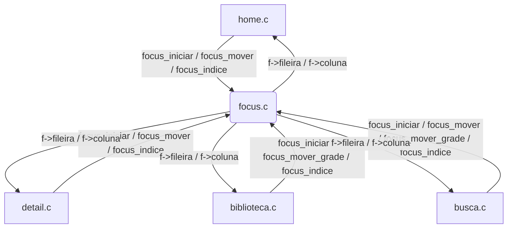
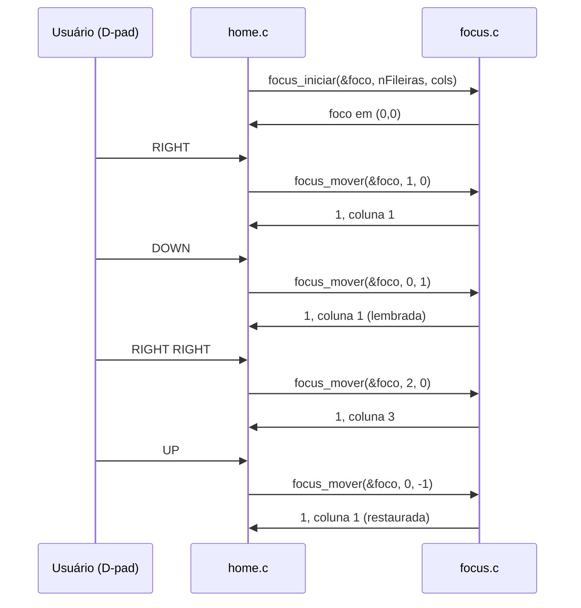

# `src/focus.c` — Gerenciador de foco espacial

## Para que serve

Implementa navegação D-pad em grids/fileiras com duas políticas:

- `focus_mover`: fileiras de conteúdo (home, detail), com memória de coluna por
fileira — ao descer da fileira 1 (coluna 5) para a fileira 2 e voltar, o foco
retorna à coluna 5, não à coluna 0.
- `focus_mover_grade`: grade pura (teclado da busca, biblioteca em modo grid),
onde a coluna deve ser preservada e apenas presa ao fim da fileira destino.
Ambas pulam fileiras vazias (zero colunas).

Roda em todas as plataformas. C puro, sem SDL, sem `#ifdef`.

## Funções públicas (`src/focus.h`)

| Assinatura | O que faz | Fio | Pré-condições | Travas | Efeitos colaterais |
|---|---|---|---|---|---|
| `void focus_iniciar(Foco *f, int nFileiras, const int *nColunas)` | Inicializa a struct com `memset`, limita `nFileiras` a `FOCUS_MAX_FILEIRAS`, copia as colunas. | principal | `f` e `nColunas` não NULL | nenhuma | zera `fileira`/`coluna`, copia `nColunas[]`, zera `colunaLembrada[]` (`src/focus.c:4-9`) |
| `int focus_mover(Foco *f, int dx, int dy)` | Move o foco horizontal/verticalmente, com memória de coluna por fileira. Devolve 1 se moveu. | principal | `f` inicializado | nenhuma | altera `f->fileira`, `f->coluna`, `f->colunaLembrada[]` (`src/focus.c:11-37`) |
| `int focus_mover_grade(Foco *f, int dx, int dy)` | Move na grade pura: mantém coluna ao descer/subir, sem ler `colunaLembrada`. | principal | `f` inicializado | nenhuma | altera `f->fileira`, `f->coluna`; ainda **escreve** `colunaLembrada` para compatibilidade com `focus_mover` (`src/focus.c:39-64`) |
| `int focus_indice(const Foco *f, int fileira, int coluna)` | 1 se o foco está exatamente na célula. | qualquer | nenhuma | nenhuma | nenhum (`src/focus.c:66-68`) |

## Estado global (static)

Não há estado global no arquivo. O estado fica na struct `Foco` alocada pelo
caller (home.c, detail.c, biblioteca.c, busca.c). Campos (`src/focus.h:19-25`):

- `fileira`, `coluna`: posição atual.
- `colunaLembrada[FOCUS_MAX_FILEIRAS]`: última coluna em cada fileira.
- `nFileiras`, `nColunas[]`: dimensões.

`FOCUS_MAX_FILEIRAS` é 700 (`src/focus.h:17`). Quem lê/escreve:

- `focus_iniciar` escreve tudo.
- `focus_mover` lê e escreve `colunaLembrada`.
- `focus_mover_grade` escreve `colunaLembrada` (para o caso de a mesma struct
ser percorrida depois por `focus_mover`), mas não lê.
- As telas (`home.c`, `detail.c`, `biblioteca.c`, `busca.c`) leem `fileira`/`coluna`
para decidir scroll/destaque/animação.

## Grafo de chamadas

Arestas de callback/ponteiro: nenhuma.

## Fluxo principal

## IMPACTOS

- **Se você mexer em `FOCUS_MAX_FILEIRAS`**, confira `tests/home_layout.c:63` e
`tests/fimfileira.c:123,192`: `MAX_FIL` e a grade da Biblioteca devem continuar
cabendo. A mudança de 32 para 700 veio justamente do issue da Biblioteca.
- **Se você mexer em `focus_mover`**, confira que fileiras vazias são puladas
(`src/focus.c:25`). Issue: pousar em fileira sem item fazia o D-pad parecer
travado (`src/focus.h:19-23`, comentário no código).
- **Se você mexer em `focus_mover_grade`**, confira que ela NÃO lê
`colunaLembrada` (comentário `src/focus.c:54-55`). Se passar a ler, o teclado da
busca e a grade da Biblioteca voltam a "pular para letra aleatória" (issue #4).
- **Se você mexer em `focus_iniciar`**, lembre que ele faz `memset` e zera a
memória de coluna. `home.c:2622-2633` e `detail.c:1440-1444` semeiam a coluna
inicial quando necessário.
- **Contratos com Kotlin/.NET/JS**: nenhum.
- **Testes**:
  - `tests/home_layout.c`: `MAX_FIL <= FOCUS_MAX_FILEIRAS`, percorre 16 fileiras
  com `focus_mover`, foco preservado após republicação.
  - `tests/fimfileira.c` (`tests/fimfileira.sh`): foco chega ao fim de cada
  fileira e além; fileiras vazias; republicação concorrente; invariantes de
  coluna dentro de faixa.
  - `tests/espaco.c`: usa `focus_mover_grade`.
- **O que NÃO tem teste**: interação exata entre `focus_mover` e
`focus_mover_grade` quando a mesma struct é usada alternadamente; telas que
ainda não usam focus.c (SUSPEITA: guia, ajustes); foco com entrada de mouse.

## Regressões já acontecidas

- Não encontrado no `docs/issues/mapa.json` uma issue ligada especificamente a
`focus.c`. As melhorias vieram de issues gerais de navegação:
  - `5dc6eda1` "Biblioteca: sem teto de 205; o título recém-salvo nunca é o que
cai" — envolveu `focus.c` no diff por aumentar `FOCUS_MAX_FILEIRAS`.
  - `04c37f87` "Os dez issues abertos, e o que a TV mostrou que a leitura não
mostrava" — menciona `focus.c` no git log, mas não há detalhe no mapa.
- O aumento de `FOCUS_MAX_FILEIRAS` para 700 foi motivado por fileiras
sumirem na Biblioteca quando `nColunas` extrapolava o teto; isso está documentado
no header `src/focus.h:10-16`.
