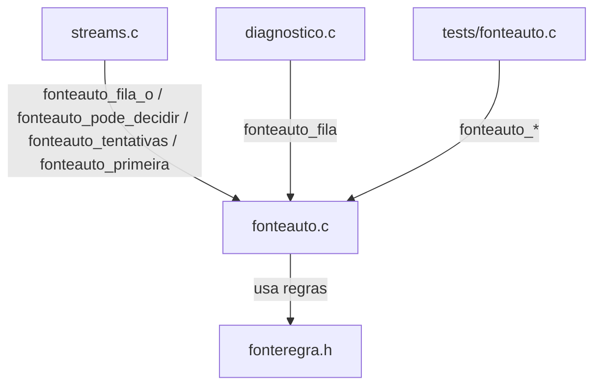
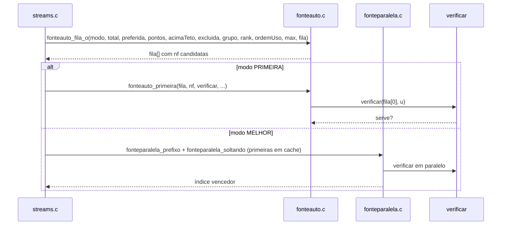

# `src/fonteauto.c` — regra da escolha automática de fonte

## Para que serve

Monta a fila de candidatas para a verificação e decide se a escolha automática pode sair antes de todos os addons responderem. Sem rede, sem SDL e sem a lista de streams — só recebe pontuação/grupos/exclusões e devolve ordem ou decisão booleana. Roda em **todas as plataformas**.

## Funções públicas (`src/fonteauto.h`)

| Assinatura | O que faz | Fio | Pré-condições / efeitos colaterais |
|---|---|---|---|
| `int fonteauto_fila(int modo, int total, int preferida, const long *pontos, const unsigned char *acimaTeto, const unsigned char *excluida, int max, int *fila)` | Monta fila de índices na ordem em que devem ser verificados. | qualquer | `fonteauto.c:81`. Preferida entra primeiro; empate fica o menor índice. |
| `int fonteauto_fila_g(...)` | Mesma fila respeitando grupos de auto-play (#202). | qualquer | `fonteauto.c:74`. |
| `int fonteauto_fila_o(...)` | Filas com ordem dos addons como desempate/estrita. | qualquer | `fonteauto.c:22`. |
| `int fonteauto_tentativas(int modo, int pedidas)` | Quantas URLs conferir. `PRIMEIRA` = 1. | qualquer | `fonteauto.c:87`. |
| `int fonteauto_primeira(const int *fila, int n, FonteVerificar verificar, FonteFalhou falhou, void *u, int *tocadas)` | **BLOQUEIA**: confere fila em série e para na primeira que serve. | fio próprio | `fonteauto.c:92`. Chama `verificar` e opcionalmente `falhou`. |
| `int fonteauto_pode_decidir(const FonteautoParcial *p)` | Decide se a escolha pode sair com a lista parcial. | principal | `fonteauto.c:105`. Não faz rede. |

## Estado global

Nenhum. Todas as funções são puras (recebem tudo por parâmetro).

## Grafo de chamadas

## Fluxo principal (montar fila → verificar)

## IMPACTOS

- **Mexer na ordem da fila** (`fonteauto_fila_o`) muda qual fonte o automático tenta primeiro e, no modo PRIMEIRA, qual única fonte é conferida (#130). Conferir `tests/fonteauto.c`, `tests/fonteauto.sh`, `tests/fonte_qualidade.sh`.
- **Mexer em `fonteauto_pode_decidir`** muda quando o app para de esperar addons (#221, #202). Conferir `tests/fontes_parcial.c`, `tests/autoplay_alvo.c`.
- **Mexer em `fonteauto_tentativas`** afeta cota de debrid no modo PRIMEIRA (#130). Conferir `tests/fonteauto.c`.
- **NÃO coberto por teste automatizado (SUSPEITA)**: empates exóticos com `FR_ORDEM_ESTRITA`; falta de memória nos vetores locais; `prefPendente` + `prazoPassou` combinados.

## Regressões já acontecidas

- **#130** (verificação paralela criava arquivos no debrid): a regra passou a ser série por padrão e `fonteauto_tentativas(PRIMEIRA) == 1`. Commits `7f66bfd3`, `0187b9d5`.
- **#202** (auto-play e espera pelos addons): introduziu `fonteauto_pode_decidir`, grupos e ordem dos addons. Commits `c5dcb769`, `775dbae9`.
- **#221** (decisão com lista parcial): `fonteauto_pode_decidir` integrado a `stream_auto_pode_decidir`. Commits `1e4cfa8e`, `98607591`.
