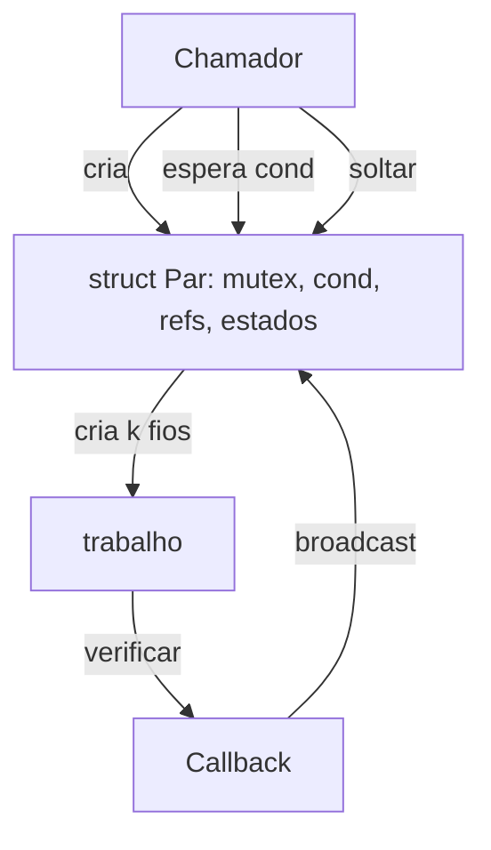
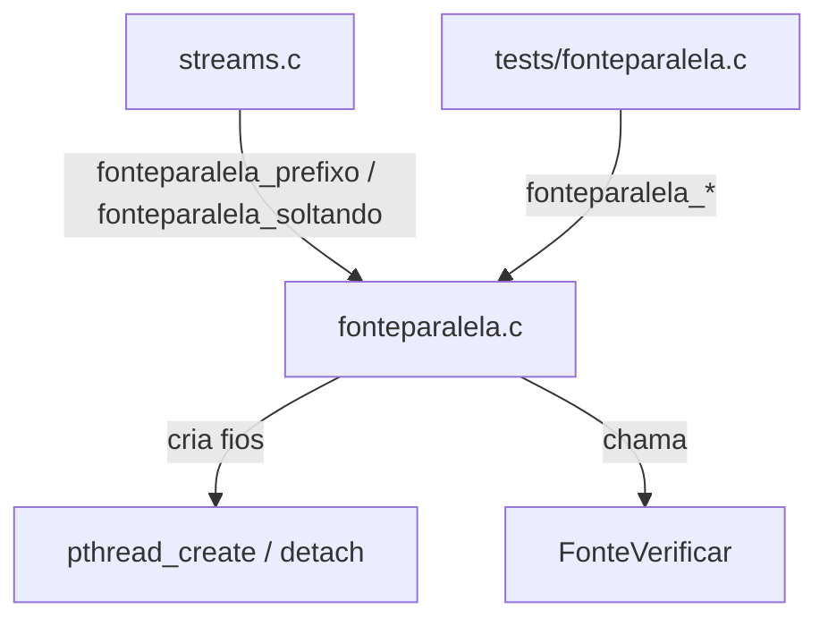

# `src/fonteparalela.c` — verificação paralela de fontes em cache

## Para que serve

Confere as primeiras candidatas da fila **em paralelo**, mas só as que já estão em cache no debrid (não baixam nada). A primeira que serve **na ordem da fila** vence, mesmo que outra responda mais rápido. Usado por `streams.c` dentro de `stream_primeira_boa`. Roda em **todas as plataformas**.

## Funções públicas (`src/fonteparalela.h`)

| Assinatura | O que faz | Fio | Pré-condições / efeitos colaterais |
|---|---|---|---|
| `int fonteparalela(const int *fila, int n, int k, FonteVerificar verificar, FonteFalhou falhou, void *u, int *tocadas, unsigned prazoMs)` | Confere `fila[0..k-1]` em paralelo; devolve primeiro índice que serve ou -1. | fio próprio | `fonteparalela.c:49`. Fios detach; `u` deve viver até o último fio terminar **SUSPEITA** sem `soltarU`. |
| `int fonteparalela_soltando(..., void (*soltarU)(void *u))` | Mesma, com callback para soltar `u` quando nenhum fio usa mais. | fio próprio | `fonteparalela.c:54`. Usado por `streams.c` para `Conferencia` na heap. |
| `int fonteparalela_prefixo(const int *fila, int n, int max, int (*pronta)(int i, void *u), void *u)` | Conta quantas primeiras da fila estão prontas no debrid. | qualquer | `fonteparalela.c:101`. |

## Estado global (`static` em `fonteparalela.c`)

Nenhum estado global persistente. A única memória temporária é a struct `Par` alocada dentro de `fonteparalela_soltando`, compartilhada pelos fios e liberada por referência (`soltar`).

## Concorrência

Cada fio chama `verificar`, atualiza `estado[q]` sob mutex e dá `broadcast`. O chamador espera no `cond` até achar um vencedor ou todos terminarem/prazo estourar. `soltar` destrói o mutex/cond/libera `Par` quando `refs` chega a 0.

## Grafo de chamadas

## IMPACTOS

- **Mexer no número máximo `FONTEPARALELA_MAX`** afeta quantas conexões de verificação simultâneas existem. Hoje 4 (`fonteparalela.h:21`).
- **Mexer no prazo (`prazoMs`)** afete quando uma conferência paralela desiste. `streams.c` usa 20000 ms.
- **Mexer em `fonteparalela_soltando`/`soltar`** afeta lifecycle de `u`. O ASan pegou `u` na pilha sendo lido depois de o fio da UI acabar (`fonteparalela.c:34-36` comentário). Conferir `tests/fonteparalela.c`.
- **NÃO coberto por teste automatizado (SUSPEITA)**: cancelamento atômico durante `fonteparalela`; fuga de `Par` se `pthread_create` falha para todos os `k`; `prazoMs == 0` (espera indefinida) em produção.

## Regressões já acontecidas

- **#130** (verificação paralela criava arquivos no debrid): a solução foi verificar em série por padrão e só paralelizar fontes já em cache. Commit `45deaa14`.
- **ASan/SEGV com `u` na pilha**: introduziu `fonteparalela_soltando` para manter `u` vivo até o último fio. Commit `696afa74`.
- **#323** (crash em "check several sources at once"): envolve verificação paralela; conserto na 2.0.3.
