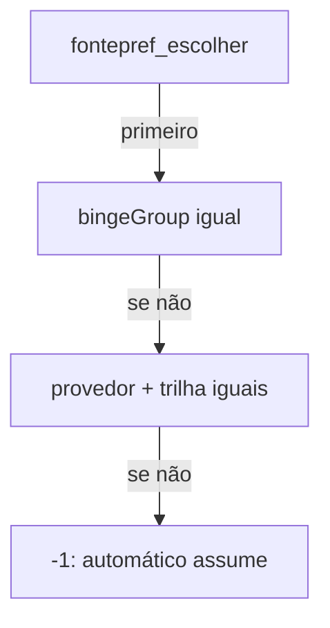
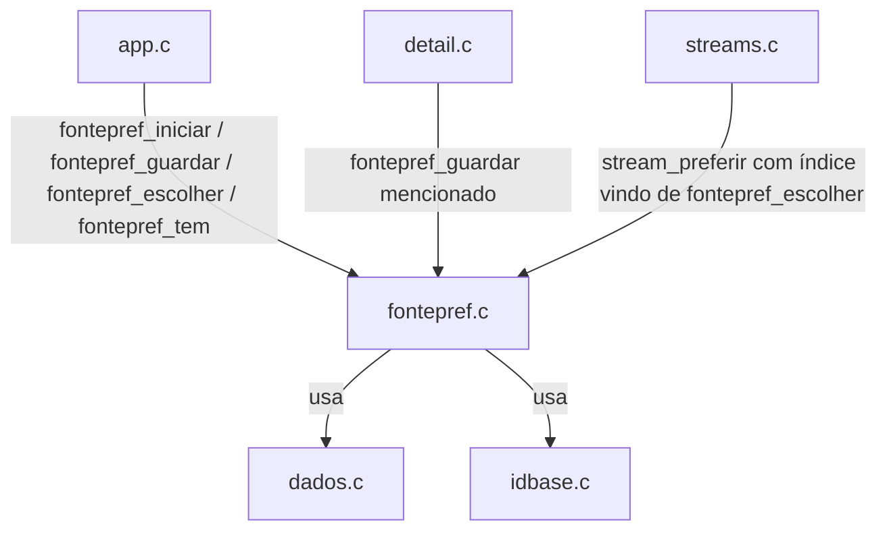

# `src/fontepref.c` — fonte preferida por título/perfil

## Para que serve

Lembra qual fonte a pessoa escolheu na folha, identificando-a por `bingeGroup` (quando o addon declarou) ou por `provedor + trilha de audio`. A preferência é por **título** (série inteira, não episódio) e por **perfil**. Roda em **todas as plataformas**.

## Funções públicas (`src/fontepref.h`)

| Assinatura | O que faz | Fio | Pré-condições / efeitos colaterais |
|---|---|---|---|
| `void fontepref_iniciar(void)` | Lê `fontepref-p<N>.txt` sob demanda. | principal | `fontepref.c:242`. `dados_ler`/`dados_gravar`. |
| `void fontepref_definir_perfil(int perfil)` | Troca perfil; descarrega tabela. | principal | `fontepref.c:285`. |
| `void fontepref_esquecer(void)` | Apaga arquivos de todos os perfis (logout). | principal | `fontepref.c:293`. |
| `void fontepref_id_base(const char *id, char *dst, unsigned tam)` | Extrai id base do título (`tt1234567:2:4` → `tt1234567`). | qualquer | `fontepref.c:185`. |
| `void fontepref_trilha(const Stream *s, char *dst, unsigned tam)` | Monta assinatura de idioma/audio (ex.: "BR+DUB+POR"). | qualquer | `fontepref.c:136`. Normaliza acentos, decodifica bandeiras. |
| `int fontepref_guardar(const char *id, const Stream *s)` | Grava escolha manual. | principal | `fontepref.c:351`. Lê arquivo se necessário; grava via `dados_gravar`. |
| `const FontePref *fontepref_do_titulo(const char *id)` | Preferência do título, ou NULL se venceu. | qualquer | `fontepref.c:329`. Vencida conta como inexistente. |
| `int fontepref_tem(const char *id)` | Booleano para a preferência. | qualquer | `fontepref.c:349`. |
| `int fontepref_escolher(const char *id)` | Índice na lista `Stream` corrente que casa com a preferência. | principal | `fontepref.c:495`. Usado por `streams.c` para `stream_preferir`. |

## Estado global (`static` em `fontepref.c`)

| Variável | Tipo | Quem escreve | Quem lê |
|---|---|---|---|
| `tabela[FONTEPREF_MAX]` | `FontePref[]` | `fontepref_guardar`, `fontepref_iniciar` | `fontepref_do_titulo`, `fontepref_escolher` |
| `nTab` | `int` | `fontepref_iniciar`, `fontepref_guardar`, `fontepref_esquecer`, `fontepref_definir_perfil` | loops |
| `carregado` | `int` | todas as funções de carga | lazy-load |
| `perfil` | `int` | `fontepref_definir_perfil` | `arquivoDoPerfil` |

Não há mutexes: todo o acesso é no fio principal (UI/sync).

## Casamento de preferência

Ordem de prioridade (`fontepref.c:495-502`):
1. `bingeGroup` igual (`porBinge`).
2. `provedor` igual E `trilha` igual (`porTrilha`).
3. `-1` → cai no automático.

## Grafo de chamadas

## IMPACTOS

- **Mexer em `fontepref_trilha`** muda quais fontes são consideradas "a mesma" entre episódios (#56, #57). Conferir `tests/fontepref.c`, `tests/fontepref.sh`, `tests/selos_shot.c`.
- **Mexer em `fontepref_guardar`** afeta persistência e logout. Conferir `tests/dados-persistencia.c`, `tests/conta_logout.c`.
- **Mexer na validade (`FONTEPREF_VALIDADE_S`)** afeta quanto tempo uma escolha antiga continua sendo tentada. Hoje 180 dias (`fontepref.h:140`).
- **Mexer no casamento** (`porBinge`, `porTrilha`) afeta binge group (#310). Conferir `tests/fontepref.c`.
- **NÃO coberto por teste automatizado (SUSPEITA)**: tabela cheia (evicção da mais antiga); leitura de arquivo corrompido com TAB no `rotulo`; perfil negativo; `fontepref_esquecer` sem `dados_apagar`.

## Regressões já acontecidas

- **#56** e **#57** (app não lembrava a fonte escolhida): introduziu o módulo inteiro. Commit `1e6a770e`.
- **bingeGroup** passou a ser lido e guardado: commit `98c5bbfb`.
- **#310** (binge group da fonte automática): pendente 2.0.5; hoje só escolha manual grava. Branch `agente/204-binge`.
