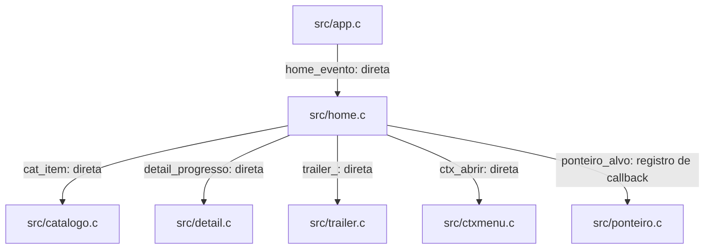
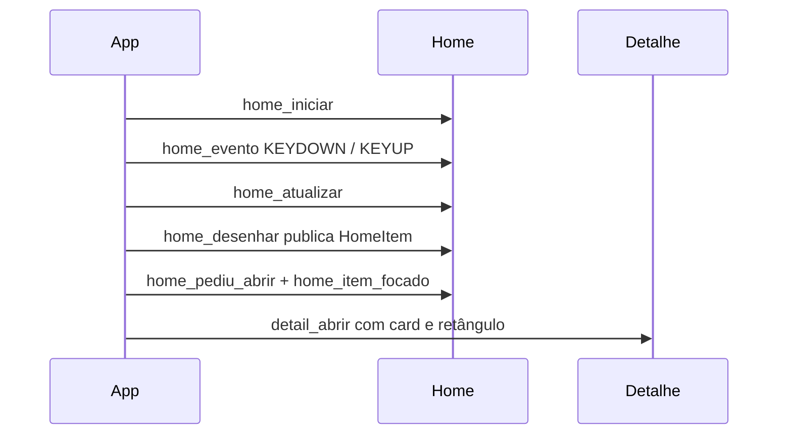

# `src/home.c` — Home, foco, fileiras e trailers

## Para que serve

Monta e desenha fileiras, destaque, retomada e variantes de layout da Home. Converte navegação em pedidos consumidos pelo app e preserva geometria do card para abrir detalhe. É UI SDL/GL compartilhada; condicionais de alvo não criam um backend de vídeo próprio. (`src/home.h:1`).

Base de leitura: `bed3534c`. Referências de linha são desta revisão; histórico e relato de issue não constituem teste executado nesta rodada.

## Funções públicas (`src/home.h`)

Fio principal SDL/GL; sem mutex próprio nas funções de UI. Chamadas a catálogo e serviços podem adquirir travas desses módulos. Evidência: `src/home.c:1733`; estados/travas abaixo.

As assinaturas abaixo são as declarações do header quando disponíveis. As pré-condições específicas constam na coluna de contrato; ponteiros de saída não opcionais devem apontar para armazenamento válido. Getters de ponteiro retornam memória emprestada, não transferem ownership.

| Assinatura | O que faz / pré-condições / efeitos | Travas locais e referência |
|---|---|---|
| `int home_iniciar(const char *dirArte)` | Carrega catálogo, cache e artes; inicializa fileiras e foco. Requer diretório de arte legível. | Sem aquisição explícita nesta função; auxiliares seguem contrato acima; `src/home.c:1733`; `src/home.h:40` |
| `int home_cartao_foco_por_cima(int indice)` | Repinta o cartão focado para o menu; retorna 0 se não corresponde ao último desenho. | Sem aquisição explícita nesta função; auxiliares seguem contrato acima; `src/home.c:5345`; `src/home.h:41` |
| `int home_item_focado(HomeItem *out)` | Copia o HomeItem do último desenho; out deve existir quando há foco válido. | Sem aquisição explícita nesta função; auxiliares seguem contrato acima; `src/home.c:5940`; `src/home.h:42` |
| `int home_n_artes(void)` | Consulta quantidade de backdrops locais. | Sem aquisição explícita nesta função; auxiliares seguem contrato acima; `src/home.c:5946`; `src/home.h:43` |
| `int home_tem_fileiras(void)` | Informa se há fileiras montadas. | Sem aquisição explícita nesta função; auxiliares seguem contrato acima; `src/home.c:2643`; `src/home.h:46` |
| `const char *home_arte(int i)` | Retorna arte local emprestada, ou NULL fora da faixa. | Sem aquisição explícita nesta função; auxiliares seguem contrato acima; `src/home.c:5953`; `src/home.h:47` |
| `const char *home_backdrop(int i)` | Retorna backdrop emprestado do catálogo, ou NULL. | Sem aquisição explícita nesta função; auxiliares seguem contrato acima; `src/home.c:5949`; `src/home.h:48` |
| `void home_evento(const SDL_Event *e)` | Processa SDL, navegação, OK curto/longo e pedidos; requer evento válido. | Sem aquisição explícita nesta função; auxiliares seguem contrato acima; `src/home.c:1771`; `src/home.h:49` |
| `void home_atualizar(float dt, Uint32 agora)` | Sincroniza fileiras, foco, gestos e animações a cada quadro. | Sem aquisição explícita nesta função; auxiliares seguem contrato acima; `src/home.c:2701`; `src/home.h:50` |
| `void home_ir_topo(void)` | Zera rolagem, foco e posição lembrada ao mudar perfil. | Sem aquisição explícita nesta função; auxiliares seguem contrato acima; `src/home.c:2649`; `src/home.h:53` |
| `void home_trailer_passo(int topo, float dt, Uint32 agora)` | Coordena busca, espera, abertura e fechamento do trailer conforme foco e sobreposições. | Sem aquisição explícita nesta função; auxiliares seguem contrato acima; `src/home.c:4453`; `src/home.h:56` |
| `void home_trailer_topo_motivo(const char *motivo)` | Guarda ponteiro do motivo para diagnóstico; manter a string viva até o uso. | Sem aquisição explícita nesta função; auxiliares seguem contrato acima; `src/home.c:4426`; `src/home.h:59` |
| `void home_desenhar(Uint32 agora)` | Desenha fundo, hero e fileiras; publica retângulo e item focado. Requer contexto GL. | Sem aquisição explícita nesta função; auxiliares seguem contrato acima; `src/home.c:5355`; `src/home.h:60` |
| `void home_hero_rect(float *x, float *y, float *w, float *h)` | Escreve o retângulo do último hero nos quatro ponteiros obrigatórios. | Sem aquisição explícita nesta função; auxiliares seguem contrato acima; `src/home.c:3167`; `src/home.h:65` |
| `float home_topo_fracao(void)` | Consulta fração visível do topo na Dinâmica; demais layouts devolvem 1. | Sem aquisição explícita nesta função; auxiliares seguem contrato acima; `src/home.c:3160`; `src/home.h:67` |
| `int home_streaming_barra(const int **pastas)` | Expõe vetor interno de pastas na Dinâmica; saída emprestada. | Sem aquisição explícita nesta função; auxiliares seguem contrato acima; `src/home.c:3153`; `src/home.h:71` |
| `void home_oculta(int oculta)` | Marca Home coberta; bloqueia rotação e pré-busca do destaque no passo de atualização. | Sem aquisição explícita nesta função; auxiliares seguem contrato acima; `src/home.c:2672`; `src/home.h:74` |
| `void home_encerrar(void)` | Função vazia nesta revisão; não libera o acervo. | Sem aquisição explícita nesta função; auxiliares seguem contrato acima; `src/home.c:5890`; `src/home.h:75` |
| `void home_registrar_retorno(int indice, double posSeg, double durSeg)` | Guarda índice e identidade do título interrompido e avança revisão da faixa. | Sem aquisição explícita nesta função; auxiliares seguem contrato acima; `src/home.c:5907`; `src/home.h:78` |
| `int home_proximo_desfocar(const CatItem *ci, const char *arte)` | Decide desfoque do still de próximo episódio a partir de ajustes e progresso. | Sem aquisição explícita nesta função; auxiliares seguem contrato acima; `src/home.c:835`; `src/home.h:81` |
| `int home_retorno_vale(int indice, double posSeg, double durSeg)` | Exige índice não negativo, duração maior que 1 s e progresso entre 1% e o limiar assistido. | Sem aquisição explícita nesta função; auxiliares seguem contrato acima; `src/home.c:5901`; `src/home.h:82` |
| `const char *home_retomar_imdb(void)` | Retorna identidade interna do cartão Retomar agora. | Sem aquisição explícita nesta função; auxiliares seguem contrato acima; `src/home.c:5914`; `src/home.h:84` |
| `void home_retomar_dispensar(void)` | Limpa cartão e avança revisão, sem limpar cw_retido. | Sem aquisição explícita nesta função; auxiliares seguem contrato acima; `src/home.c:5921`; `src/home.h:86` |
| `void home_retomar_esquecer(void)` | Limpa cartão e também cw_retido ao trocar contexto. | Sem aquisição explícita nesta função; auxiliares seguem contrato acima; `src/home.c:5931`; `src/home.h:87` |
| `int home_quer_sair(void)` | Consulta flag de saída, sem consumi-la. | Sem aquisição explícita nesta função; auxiliares seguem contrato acima; `src/home.c:5938`; `src/home.h:88` |
| `int home_pediu_abrir(void)` | Consome pedido de abrir detalhe: ler duas vezes perde o pedido. | Sem aquisição explícita nesta função; auxiliares seguem contrato acima; `src/home.c:5957`; `src/home.h:89` |
| `void home_pedir_abrir(void)` | Arma pedido de abrir detalhe. | Sem aquisição explícita nesta função; auxiliares seguem contrato acima; `src/home.c:5961`; `src/home.h:90` |
| `int home_foco_retomada(void)` | Classifica a fileira focada como retomada; exclui upcoming_section. | Sem aquisição explícita nesta função; auxiliares seguem contrato acima; `src/home.c:5963`; `src/home.h:91` |
| `int home_pediu_tocar(void)` | Consome pedido de reprodução da retomada. | Sem aquisição explícita nesta função; auxiliares seguem contrato acima; `src/home.c:5971`; `src/home.h:92` |
| `int home_pediu_menu(void)` | Consome pedido do menu lateral. | Sem aquisição explícita nesta função; auxiliares seguem contrato acima; `src/home.c:5974`; `src/home.h:93` |
| `int home_pediu_social(void)` | Consome pedido do painel social. | Sem aquisição explícita nesta função; auxiliares seguem contrato acima; `src/home.c:201`; `src/home.h:94` |
| `int home_pediu_pessoa_social(CatItem *saida)` | Consome pedido e copia pessoa se saída não NULL. | Sem aquisição explícita nesta função; auxiliares seguem contrato acima; `src/home.c:197`; `src/home.h:95` |
| `int home_pediu_guia(char *id, int tam)` | Consome pedido e copia id com limite tam quando há destino. | Sem aquisição explícita nesta função; auxiliares seguem contrato acima; `src/home.c:211`; `src/home.h:98` |
| `int home_previa_fileira(const char *chave, int filTipo, int refTipo, GfxRect area, float alfa)` | Desenha prévia com artes reais sem alterar a fileira; requer GL e chave válida. | Sem aquisição explícita nesta função; auxiliares seguem contrato acima; `src/home.c:5053`; `src/home.h:106` |
| `const char *home_rastro_foco(void)` | Formata descrição em buffer estático sobrescrito na próxima chamada. | Sem aquisição explícita nesta função; auxiliares seguem contrato acima; `src/home.c:5892`; `src/home.h:109` |
| `int home_fileira_titulos(int *out, int max, int *pos)` | Copia índices da fileira da Dinâmica até max, devolve posição focada; out deve caber. | Sem aquisição explícita nesta função; auxiliares seguem contrato acima; `src/home.c:5981`; `src/home.h:112` |
| `void home_focar_titulo(int indice)` | Reposiciona foco e rolagem na fileira atual se o título estiver nela. | Sem aquisição explícita nesta função; auxiliares seguem contrato acima; `src/home.c:6012`; `src/home.h:114` |

## Estado global (`static`)

| Grupo | Quem escreve / quem lê e sincronização | Evidência |
|---|---|---|
| bd/pst e nBd/nPst | home_iniciar carrega; desenho e getters consultam. | `src/home.c:167` |
| fileiras/nFileiras, animFoco/revArte, scrollX/Y, foco | Montagem/sincronização/eventos/atualizar escrevem; desenho e prévia leem. | `src/home.c:185` |
| itemFoco/temItemFoco e retângulos | Desenho publica; home_item_focado e transição de detalhe leem. | `src/home.c:253` |
| retomarIndice/retomarId/revisões e pedidos | Registrar/dispensar/esquecer escrevem; sincronização lê; pediu_* consomem flags. | `src/home.c:191` |
| okDesde/okPressionando/okLongDisparado/okConsumirSoltura | Evento arma/solta; atualizar decide gesto e menu. | `src/home.c:295` |
| heroAtual/heroAnterior, heroSet*, heroPendente*, heroTrailer*, heroCinema | Evento/atualização e passo do trailer escrevem; desenho/ocultação consultam. | `src/home.c:330` |

## Grafo de chamadas

Recorte das dependências comprovadas, não inventário de todo utilitário chamado. Arestas de registro, callback e ponteiro estão rotuladas.

Evidências das arestas:

- `src/app.c` → `src/home.c`: `src/app.c:2620`.
- `src/home.c` → `src/catalogo.c`: `src/home.c:1038`.
- `src/home.c` → `src/detail.c`: `src/home.c:5362`.
- `src/home.c` → `src/trailer.c`: `src/home.c:4401`.
- `src/home.c` → `src/ctxmenu.c`: `src/home.c:1115`.
- `src/home.c` → `src/ponteiro.c`: `src/home.c:4200`.

## Fluxo principal

Ordem extraída das funções acima e dos pontos de chamada do grafo; eventos assíncronos não garantem latência nem imagem física.

## IMPACTOS

| Se você mexer em... | Confira... |
|---|---|
| `home_item_focado` (`src/home.c:5940`) | HomeItem vem do desenho: não abrir detalhe antes de haver item/retângulo válido; strings emprestadas não podem atravessar remontagem sem cópia. |
| `home_atualizar` (`src/home.c:2701`) | Fileiras: manter MAX_FIL=64, MAX_CARDS=33 e asserts contra CAT_FIL_MAX/DESC_ITENS_POR_FILEIRA; conferir foco ao republicar catálogo. |
| `home_evento` (`src/home.c:1771`) | OK curto/longo: preservar consumo único da soltura, evitar abrir ficha depois de menu; #387 segue suspeita para esta revisão. |
| `home_trailer_passo` (`src/home.c:4453`) | Home oculta/overlay deve bloquear trailer e rotação; conferir perfil, detalhe, player e foco do hero. |
| `home_retorno_vale` (`src/home.c:5901`) | Retomar agora e ilha compartilham critério; conferir progresso, limiar assistido e próximo episódio. |
| `home_fileira_titulos` (`src/home.c:5981`) | Carrossel: índices são do catálogo, não coluna da fileira; conservar identidade e posição ao voltar. |

### Testes

Cobertura identificada por leitura; testes de produto não foram executados nesta tarefa documental.

| Teste | Cobertura |
|---|---|
| `tests/home.sh` | Layout com dublês de textura. (`tests/home.sh:1`). |
| `tests/homepos.sh` | Posição/foco da Home. (`tests/homepos.sh:1`). |
| `tests/heroidentidade_home.c` | Identidade do destaque após remontagem. (`tests/heroidentidade_home.c:1`). |
| `tests/cwthumb_home.c` | Miniatura de episódio em Continuar. (`tests/cwthumb_home.c:1`). |
| `tests/home-trailer-timer.sh` | Temporização do trailer. (`tests/home-trailer-timer.sh:1`). |
| `tests/hero_vizinhos.sh` | Pré-busca de arte dos vizinhos. (`tests/hero_vizinhos.sh:1`). |

### O que NÃO está demonstrado por esses testes

Gestos do controle e GPU de cada TV, reprodução física do trailer e todos os cruzamentos de layouts/perfis.

## Regressões já acontecidas

Histórico consultado com `git log --oneline -- src/home.c`. Linhas abaixo reproduzem o assunto do commit; merge não é prova adicional de correção. Implementação atual: `src/home.c:1`.

| Hash | Alteração registrada |
|---|---|
| `a7811ac3` | fix (2.0.3, hero): aquece a arte dos vizinhos +-1 do hero, tambem virando a mao |
| `6b3aaae1` | fix (Shield 318.3): card do Continuar com o still do episodio; filme assistido diz Reproduzir |
| `778d3cd9` | hero: home escondida atras da escolha de perfil nao gira; diagnostico da pre-busca so quando o motivo muda |
| `3d8f5a1d` | hero: pre-busca passa a sair com a busca do trailer, sinopse dos candidatos rasos preenchida em segundo plano |
| `4b8ba24b` | fix(home): 'Ver detalhes' in the Continue Watching card menu when OK plays (#350) |
| `51854908` | vidro: contorno do cartaz segue o raio do poster (era encolhido por menor/h) |
| `668f6298` | home: logo do destaque junto com a arte, e pre-busca do proximo do carrossel |
| `8ab1b19b` | hero (#327): hero no longer depends on a drawn catalog row |

### Cruzamento com issues

- **#350**: `docs/issues/mapa.json:7542`; `docs/issues/MAPA.md:13`. Relação de investigação/contrato; só associar um hash ao conserto quando o assunto ou registro da issue o explicita.
- **#387**: `docs/issues/mapa.json:8256`; `docs/issues/MAPA.md:107`. Relação de investigação/contrato; só associar um hash ao conserto quando o assunto ou registro da issue o explicita.
- **SUSPEITA #387:** registro de uma correção em outra branch não demonstra que `segurar.c` exista aqui. Ver [segurar.md](segurar.md).
