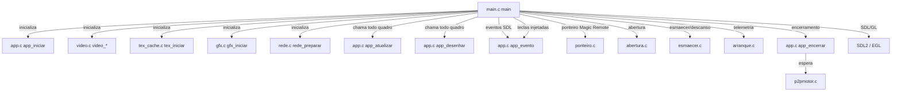
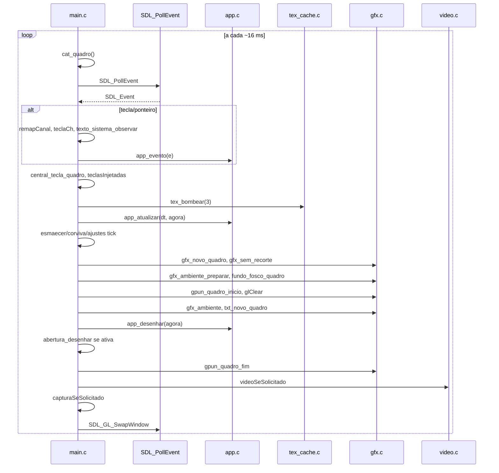

# `src/main.c` — Bootstrap, loop principal e telemetria

## Para que serve

Bootstrap único do processo: inicializa SDL/GL, cria a janela, monta a pilha de
módulos, roda o laço de quadros e faz o encerramento limpo. Roda em todas as
plataformas (webOS, Samsung `.tpk`/`.wgt`, Android, Mac/Linux preview), com
ramificações por `#ifdef` para cada alvo.

## Plataformas

- **webOS (LG)**: `!defined(NV_SEM_WEBOS)` — Wayland, cursor ligado, tecla Back
  própria, declaração de superfície não-opaca (`set_opaque_region`).
- **Samsung `.tpk`**: `NV_TPK` — SDL "dummy"; o contexto GL real vive no host
  .NET e é chamado via `tpk_gl_*` (ver `docs/funcoes/tpk.md`).
- **Samsung `.wgt` / Tizen WASM**: `__EMSCRIPTEN__` — laço cede ao navegador por
  `requestAnimationFrame`, IDBFS para persistência.
- **Android**: `NV_ANDROID` — superfície controlada pelo host Kotlin/JNI,
  configs EGL de reserva, vigia de arranque.
- **Mac/Linux desktop**: `__APPLE__` / `NV_LINUX_DESKTOP` — previa sem
  fullscreen, sem vsync no Mac.

## Funções públicas

`main.c` não tem `.h`. A única função visível é `main()`:

| Função | Linha | O que faz | Fio | Efeitos colaterais |
|---|---|---|---|---|
| `int main(int argc, char **argv)` | 764 | Bootstrap completo e laço de quadros. | Principal do processo | Cria janela/GL, inicia todos os módulos, redireciona log, grava `/tmp/nuvio-fps.txt`, desliga limpo. |

Todas as outras funções são `static` e só existem para organizar o arquivo.

## Estado global (static) no main.c

| Estado | Linha | Tipo | Semântica | Quem lê/escreve |
|---|---|---|---|---|
| `sinalTerminou` | 139 | `volatile sig_atomic_t` | Flag do SIGTERM. | Handler `aoSinalTerminar` escreve; laço principal lê (1532). |
| `soltarEm`, `soltarTecla` | 353-354 | `Uint32`, `SDL_Keycode` | KEYUP agendado de tecla injetada `hold`. | `teclasInjetadas` (360). |
| `soltarMouseEm`, `soltarMouse` | 357-358 | `Uint32`, `SDL_Event` | BUTTONUP agendado de toque injetado `clicar:...:hold`. | `teclasInjetadas` (360), `ponteiro_evento`. |
| `capW`, `capH` | 494 | `int` | Tamanho real do drawable (retina/TV 4K). | `capturaSeSolicitado` lê; inicializado no arranque (1253). |
| `p2pTesteUrl`, `p2pTesteEstado`, `p2pTesteHash`, `p2pTesteT0` | 501-504 | array, `_Atomic int`, array, `struct timespec` | Porta de teste do motor P2P (`p2p:<hash>` em `/tmp/nuvio-video`). | `videoSeSolicitado` / `p2pTesteFio`. |
| `pedVidTam`, `pedVidMtime`, `pedVidFioOk` | 550-552 | `_Atomic long`, `_Atomic long`, `_Atomic int` | Sondagem de `/tmp/nuvio-video` fora do fio principal. | Fio `pedVidFio` escreve; `videoSeSolicitado` lê (575). |
| `nvPrimeiroQuadroFeito` | 689 | `int` | Marca o primeiro SwapWindow. | Laço principal escreve (1884); Tizen/wasm lê. |

## Grafo de chamadas

Arestas de callback/ponteiro:
- `aoMudarIdiomaAuto` (107) registrado em `ajustes_idioma_auto_iniciar` (1458).
- `entregarCh` (244) passado para `central_tecla_quadro` (1661) e
  `teclasInjetadas` (1662).

## Fluxo principal do laço de quadros

## IMPACTOS

- **Se mexer no laço de eventos**, confira:
  - `remapCanal` (193) normaliza CH+/CH- em F7/F8 para todos os alvos.
  - `teclaCh` (237) e `central_tecla` (1626) decidem segurado vs. curto.
  - No webOS o Back vem como scancode 482 e é convertido em `SDLK_AC_BACK`
    (1652); no Tizen `.wgt` o Escape vira `SDLK_AC_BACK` (1617).
- **Se mexer na telemetria de quadro**, o relatório a cada 3 s alimenta
  `desempenho.c`, `/tmp/nuvio-fps.txt` e o painel de registro. O pior quadro
  só é considerado depois de 20 quadros (1701), e o teto de animação é 100 ms
  (1697).
- **Se mexer no arranque GL**, as fallbacks de configuração EGL são
  diferentes em cada alvo:
  - webOS/Linux: `nv_janela_simples`/`nv_contexto_simples` (726, 736).
  - Android: loop próprio com RGBA8888/RGB888/RGB565 (1061).
  - `.tpk`: falha de contexto sai do processo (1176).
- **A ordem de inicialização importa**: `dados_iniciar` (953) vem antes do
  4K/4K automático (996) e antes de `app_iniciar` (1415); `rede_preparar` (1305)
  vem antes de `tex_iniciar` e `app_iniciar`.
- **Tests**: muitos testes de screenshot compilam `src/*.c` **menos**
  `src/main.c` (ex.: `tests/player_glass_shot.sh`, `tests/text_camadas.sh`).
  Não há teste unitário isolado do `main.c`; o arranque é coberto por
  `tests/arranque_pendente.sh` e pelos testes de shot que usam a pilha
  inicializada.

## Regressões já acontecidas

Do `git log --oneline -- src/main.c` e `docs/issues/mapa.json`:

| Commit | Issue | Resumo | Onde no arquivo |
|---|---|---|---|
| `e6da2772` | #408 | webOS: erro de E/S no starfish não descarta versão lida do nyx. | caminho defensivo webOS no arranque. |
| `9a17b810` | #317 | main.c inclui `dlfcn.h` no caminho defensivo também no `.tpk`. | 709. |
| `d40bc0ce` | — | SIGTERM: só o 1º sinal arma o alarm(4); o 2º não corta a folga da saída normal. | 139-154. |
| `0a4edaf8` | — | SIGALRM watchdog só write+_exit; re-arm para saída normal e cancela no fim. | 140-145, 2178-2197. |
| `f111b013` | — | SIGTERM sai pelo encerramento normal. | 122-155. |
| `937f8e6b` | #317, #211 | webOS: breadcrumb antes do main e early crash handler. | arranque_etapa. |
| `15e6d285` | #317 | arranque defensivo no webOS. | 947-1166. |
| `65871816` | #317 | relatar quedas de arranque ao servidor no próximo lançamento. | 1306. |
| `a1d5e039` | #266 | boot watchdog, EGL fallback, back sempre sai no Android. | 1054-1195. |
| `bcd78417` | #266 | libcurl dlopen + curl_global_init em fio próprio, GL MakeCurrent antes das consultas. | `rede_preparar` (1305) indireto. |
| `7131b97b` | #223 | `hostDaUrl` em `rede.c` não loga credenciais — main.c usa `rede_url_publica` para logar URL de vídeo (605). | 605. |
| `80bb3dd2` | #216 | main: porta de teste `tocar:/arrastar:`. | 440-457. |
| `2de0c2ec` | #28 | Resolução 4K vira ajuste, desligado por padrão. | 996-1031. |
| `e33b89a0` | #99 | `SDL_ShowCursor` ligado no webOS para o Magic Remote funcionar. | 1098-1102. |
| `699e244e` | #60/#61/#62 | próxima fonte do watchdog pula URL igual à atual. | não diretamente em main.c. |
| `5eb8bd2e` | — | home arranca mais rápido: conexão reusada etc. | inicialização de rede. |
| `9689b898` | — | pilha dos workers de 8 MB para 2 MB. | não diretamente em main.c. |
