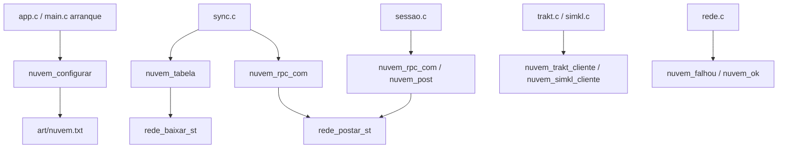
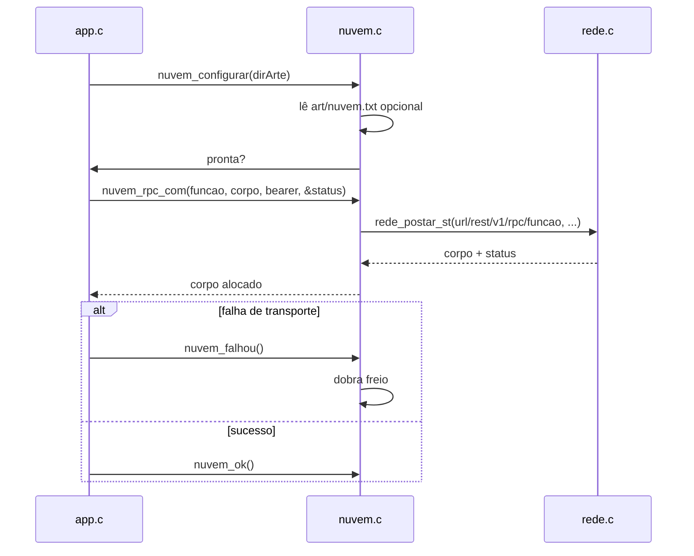

# nuvem.c — Transporte do Supabase

## Para que serve

Camada de transporte para o backend Supabase: lê URL/chave anônima de compilação ou de `art/nuvem.txt`, monta POST/GET com cabeçalhos `apikey` e `Authorization: Bearer`, e oferece freio exponencial compartilhado para falhas de rede. Não conhece sessão (token de usuário vem de fora). Roda em todas as plataformas; não há `#ifdef` de plataforma.

## Funções públicas

| Assinatura | O que faz | Fio | Pré-condições | Travas | Efeitos colaterais |
|---|---|---|---|---|---|
| `int nuvem_configurar(const char *dirArte)` | Lê `art/nuvem.txt` e sobrescreve valores de compilação. | Principal | Arranque. | nenhuma | Modifica `url`, `anon`, `baseLogin`, etc. (`nuvem.c:51-81`). |
| `int nuvem_pronta(void)` | 1 se há url e chave. | Qualquer | — | nenhuma | — |
| `const char *nuvem_url(void)` / `nuvem_anon()` / `nuvem_base_login()` / `nuvem_trakt_cliente()` / `nuvem_trakt_segredo()` / `nuvem_simkl_cliente()` / `nuvem_simkl_app()` | Getters das configurações. | Qualquer | — | nenhuma | — |
| `char *nuvem_post(...)` | POST genérico com Bearer. | Qualquer (rede bloqueia) | `nuvem_pronta()`; `caminho` não nulo. | nenhuma | Chama `rede_postar_st`; devolve corpo alocado. |
| `const char *nuvem_ultimo_erro(void)` | Último erro de transporte do fio. | Qualquer | — | nenhuma | Delega para `rede_ultimo_erro()`. |
| `char *nuvem_rpc_com(...)` | Atalho para `/rest/v1/rpc/<funcao>`. | Qualquer | — | nenhuma | `nuvem.c:113-119`. |
| `char *nuvem_tabela(...)` | GET em `/rest/v1/<tabela>?<consulta>`. | Qualquer | — | nenhuma | Chama `rede_baixar_st`. |
| `void nuvem_url_escapar(...)` | Escapa valor para query URL. | Qualquer | — | nenhuma | Escreve em `dst`. |
| `int nuvem_erro_ausente(const char *corpoErro)` | 1 se erro é PGRST202/205 ou "Could not find". | Qualquer | — | nenhuma | — |
| `void nuvem_falhou(void)` | Ativa/amplia freio exponencial. | Qualquer | — | nenhuma | Atualiza `falhas`, `freioAte`. |
| `void nuvem_ok(void)` | Reseta freio. | Qualquer | — | nenhuma | `falhas = 0`, `freioAte = 0`. |
| `int nuvem_freio_ativo(void)` | 1 quando freio ainda vale. | Qualquer | — | nenhuma | Compara `freioAte` com `time(NULL)`. |

## Estado global

| Variável | Tipo | Quem escreve | Quem lê |
|---|---|---|---|
| `url[300]`, `anon[1200]`, `baseLogin[300]` | `static char[]` | `nuvem_configurar` (e defaults de compilação) | getters; `nuvem_post`, `nuvem_tabela` |
| `traktCliente[128]`, `traktSegredo[128]`, `simklCliente[200]`, `simklApp[80]` | `static char[]` | `nuvem_configurar` | getters; `trakt.c`, `simkl.c` |
| `freioAte` | `static long` | `nuvem_falhou`, `nuvem_ok` | `nuvem_freio_ativo` |
| `falhas` | `static int` | `nuvem_falhou`, `nuvem_ok` | `nuvem_falhou` |

## Grafo de chamadas (flowchart)

## Fluxo principal (sequenceDiagram)

## IMPACTOS

- **Se mexer em `nuvem_configurar`**: normaliza barra no fim de `url` e `baseLogin` (`nuvem.c:67-70`). Sem url/chue vazios o login/sync ficam desligados e isso é logado (`nuvem.c:72-77`).
- **Se mexer em `nuvem_post` / `nuvem_tabela`**: usam Bearer = anon quando bearer é vazio (`nuvem.c:105`, `153`). O cabeçalho `Content-Type: application/json` é posto por `rede_postar`, não aqui.
- **Se mexer em `nuvem_url_escapar`**: tamanho `tam` limita; sem isto ids com `+` ou `&` quebram filtros (`nuvem.h:63-65`).
- **Se mexer no freio**: backoff exponencial `5s → 300s` (`nuvem.c:41-42`); `nuvem_freio_ativo` é consultado por `sync_iniciar`/`sync_periodico`.
- **Contratos com Kotlin/.NET/JS**: não há neste módulo.
- **Testes**: não há teste dedicado a `nuvem.c`.

## Regressões já acontecidas

- **#223** — Login no Android 11: `nuvem.c` passou a expor erro do curl e fallback de CA embutido (commit `665646f6`).
- **Conta e sync**: este arquivo nasceu junto com a migração para multi-dono (commit `08bd144a`).
