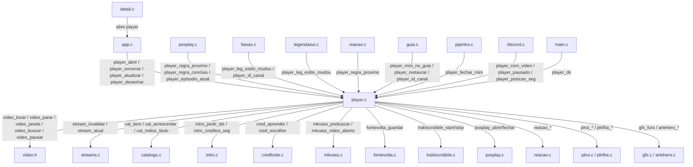

# `src/player.c` — tela de reprodução nativa

## Para que serve

Tela de reprodução do Nuvio no app nativo. Recebe um índice do catálogo (ou um URL direto), abre o pipeline de vídeo, desenha o OSD (controles, barra de tempo, selos, legendas), gerencia pausa, avanço, modos de proporção, próximo episódio, canais ao vivo (com guia/zap) e o mini-player (PiP) para TV ao vivo. Roda em **todas as plataformas**: LG webOS, Samsung .tpk/.wgt, Android e Mac/Linux (com stub de vídeo). A diferença entre plataformas fica quase toda em `video*.c`; este arquivo só fala com a interface `video.h`.

## Funções públicas (`src/player.h`)

| Assinatura | O que faz | Fio | Pré-condições / efeitos colaterais |
|---|---|---|---|
| `void player_abrir(int indiceCatalogo, const char *url)` | Abre a tela de player para o título do catálogo. Copia o item (proteção contra remontagem), fecha trailer anterior, escolhe episódio inicial, lê preferências de aspecto/legenda, chama `video_tocar()` se houver URL. | principal (`app.c:1857`, `app.c:4311`) | `player_dir()` já deve ter sido chamado (`main.c:980`). Escreve estado global `aberto`, `itemFixo`, `comVideo`, etc. (`player.c:1271`–`1387`). |
| `void player_definir_episodio(int temporada, int episodio)` | Define T/E em exibição; invalida lista de streams se o alvo mudou (`player.c:746`–`750`). | principal | Chamado após `player_abrir`; ainda durante `abrindoSessao` não descarta streams da abertura. |
| `void player_do_inicio(void)` | Marca "começar do zero" para a sessão atual. | principal | Seta `semRetomada = 1` (`player.c:685`). |
| `double player_regra_retomada_inicial(...)` | Decide se um percentual salvo é coerente com posição/duração locais. | principal (chamado internamente) | Usado por `player_definir_episodio` no Android (`player.c:706`). |
| `void player_episodio_atual(int *t, int *e)` | Devolve T/E atuais. | qualquer leitor | Só lê `epT`/`epE` (`player.c:582`). |
| `int player_indice(void)` | Índice vivo do catálogo, re-resolvido por IMDb. | qualquer | `idxAtual()` pode chamar `cat_acrescentar` se o título sumiu (`player.c:406`–`427`). |
| `const char *player_linha_episodio(void)` | "T1E1 · Nome do episódio". | qualquer | Lê `linhaEp` montado em `player_definir_episodio` (`player.c:754`–`764`). |
| `int player_pediu_fontes(void)` | Consome pedido de abrir a folha de fontes (OK longo no loading). | principal (app.c lê) | Zera `pedFontes` ao ler (`player.c:601`). |
| `void player_definir_motivo_inicio(const char *texto)` | Texto explicativo no cartão "Abrindo fonte". | rede/qualquer | Escreve `motivoInicio[112]` (`player.c:596`). |
| `int player_pediu_ajustes_fonte(void)` | Consome pedido de ir a Ajustes > Fontes. | principal | Zera `pedAjFonte` (`player.c:599`). |
| `Uint32 player_aberto_ha_ms(void)` | Tempo desde `player_abertoEm`. | qualquer | Lê `abertoEm` (`player.c:600`). |
| `int player_pediu_proximo(int *t, int *e)` | Próximo episódio escolhido pelo usuário no posplay. | principal | Zera `pedProxT`/`pedProxE` (`player.c:602`). |
| `const CatEp *player_proximo_episodio(void)` | Próximo episódio pela regra do catálogo. | qualquer | Chama `prox_indice_seguinte` (`player.c:607`–`613`). |
| `int player_regra_proximo(double posSeg, double durSeg, double cred)` | Regra se o cartão "Próximo episódio" deve subir. | principal (`reacao.c:53`) | Usada também por `player_regra_concluiu` (`player.c:2230`). |
| `float player_base_legenda(...)` | Sobe a legenda quando o cartão de próximo episódio está no ar. | desenho (`player.c:3735`) | Só lê `posplay_sobre_video()`. |
| `int player_duracao_suspeita(...)` | Pipeline diz duração muito menor que catálogo. | principal | Usado em `player_atualizar`. |
| `int player_regra_concluiu(...)` | Episódio deve ser marcado como assistido ao sair. | principal (`posplay.c:2450`) | Usa a mesma regra do cartão + folga (`player.c:2221`). |
| `void player_erro_fonte(void)` / `player_erro_fonte_motivo(...)` | Marca fonte como falhou; mostra cartão com título/dica customizados. | principal/rede | Escreve `erroFonte`, zera `tocando`, `visivel`, `prebuscaUrl` (`player.c:638`–`648`). |
| `void player_toast(...)` / `player_toast_ex(...)` | Aviso curto no alto da tela. | qualquer | Escreve `toastTexto`, `toastAte` (`player.c:1249`–`1256`). |
| `void player_limpar_erro_fonte(void)` | Fonte morta voltou a entregar; desfalha. | principal (`app.c`) | Reseta `erroFonte = 0`, `tocando = 1` (`player.c:661`). |
| `void player_definir_tentativa(int n, int max)` | Mostra "Fonte N de M" na ilha. | principal (`app.c`) | Escreve `tentativaN/M` (`player.c:637`). |
| `int player_fonte_falhou(void)` | Leitura para watchdog de canal. | principal (`app.c`) | Lê `erroFonte` (`player.c:664`). |
| `int player_tem_video(void)` / `player_com_video(void)` | Sessão abriu vídeo / vídeo real pronto no pipeline. | qualquer | `comVideo && !retido && video_pronto()` (`player.c:1581`). |
| `void player_fundo_fora_do_furo(...)` | Pinta arte/logo fora do buraco do vídeo. | desenho (`player.c:4240`) | Usado quando recuado para créditos ou sem vídeo. |
| `int player_pediu_faixas(void)` | CIMA no player abre folha de áudio/legendas. | principal | Zera `pedFaixas` (`player.c:1579`). |
| `int player_carregando(void)` | Tela existe mas pipeline ainda não entregou. | qualquer | `esperandoFonte || (comVideo && !video_pronto())` (`player.c:1604`). |
| `int player_controles_visiveis(void)` / `player_foco_na_barra(void)` / `player_so_barra(void)` / `float player_fileira(void)` | Estado do OSD para `app.c`/testes. | desenho | Lê `visivel`, `barraFoco`, `soBarra`, `fileira`. |
| `float player_posicao_seg(void)` | Posição lida do pipeline (segundos). | desenho/principal | Lê `posSeg`. |
| `int player_pausado(void)` / `player_pausa_pessoa(void)` | Pausa espelhada / pausa pedida pelo usuário. | qualquer | `!tocando` e `pausaPessoa` (`player.c:1583`–`1587`). |
| `float player_osd_brilho(void)` | Fator de cor do OSD. | desenho | Calculado em `player_atualizar`. |
| `float player_duracao_seg(void)` | Duração do pipeline, ou reserva/catálogo. | desenho | Lê `duracaoSeg`. |
| `int player_eh_canal(void)` | Sessão é canal ao vivo. | qualquer | `canalSessao` (`player.c:1589`). |
| `int player_duracao_midia(double *seg)` | Duração real do backend (StreamFit). | principal (`app.c:726`) | Só quando não é canal, `comVideo`, `video_ativo()` e `video_pronto()`. |
| `void player_definir_fonte(const char *url)` | Liga a URL numa sessão já aberta. | principal (`app.c:860` etc.) | Pode fazer pre-busca ASS (`mkvass_prebuscar`), ou tocar direto (`tocarFonte`) (`player.c:1543`–`1559`). |
| `void player_voltar_a_esperar(void)` | Desfaz fonte atual e volta ao loading. | principal (`app.c:893`) | Para vídeo, limpa MKV/legenda, seta `esperandoFonte = 1` (`player.c:1562`–`1576`). |
| `int player_aberto(void)` / `player_quer_sair(void)` | Tela existe / Back foi apertado. | qualquer | Lê `aberto`/`pediuSair`. |
| `int player_pediu_guia(void)` / `player_pediu_guia_cheio(void)` / `player_pediu_zap(void)` / `player_pediu_recarregar(void)` | Pedidos de canal ao vivo. | principal (`app.c`) | Leitura consome flags (`player.c:578`–`581`). |
| `const char *player_id_canal(void)` | IMDb/ID do canal congelado na abertura. | qualquer | `canalSessao ? itemCanal.imdb : ""` (`player.c:465`). |
| `void player_marcar_canal(const CatItem *it)` | Marca sessão como canal e congela item. | principal (`app.c`) | Copia para `itemCanal` (`player.c:486`–`490`). |
| `void player_evento(const SDL_Event *e)` | Entrada de teclado/controle no player. | principal (`app.c:2556`) | Consome eventos SDL; escreve pedidos (`player.c:2661`–`2910`). |
| `void player_atualizar(float dt, Uint32 agora)` | Lógica por quadro. | principal (`app.c:4519`) | Atualiza posição, buffering, avanço, controles, DV, posplay, zap, etc. (`player.c:2926`–`3360`). |
| `void player_desenhar(Uint32 agora)` | Desenha fundo, OSD, controles, furo do vídeo. | principal (`app.c:4834`) | Usa `gfx_furo`, `plrui`, `plrilha`, etc. (`player.c:4258`–`4468`). |
| `void player_encerrar(void)` | Fecha a sessão: salva progresso, para vídeo, limpa estados. | principal (`app.c:1855`) | Chama `fontevolta_guardar`, `servidores_reproducao_fim`, `video_parar`, `trakt_marcar` (scrobble de saída), etc. (`player.c:1845`–`1899`). |
| `void player_preparar_retencao(void)` / `int player_suspender(void)` / `int player_retido(void)` / `int player_retomar_retido(...)` | Retém o pipeline ao sair para retomada rápida. | principal (`app.c:4464` etc.) | Pausa o vídeo, marca `retido`, guarda URL/conta (`player.c:1874`–`1929`). |
| `int player_minimizavel(void)` / `player_minimizar(void)` / `player_mini_ativo(void)` / `player_restaurar(void)` / `player_fechar_mini(void)` / `player_mini_desenhar(...)` | Mini-player de canal. | principal (`app.c`) | Alterna `mini`, chama `video_janela` para retângulo pequeno (`player.c:1986`–`2101`). |
| `void player_mini_no_guia(...)` / `player_mini_no_guia_ativo(void)` / `player_minimizar_para_guia(...)` / `player_janela_animando(...)` | Preview do canal dentro do guia. | principal (`guia.c`) | Anima `janDe` → `janPara` com degraus ao pipeline (`player.c:2110`–`2185`). |
| `int player_aspecto(void)` / `player_aspecto_rotulo(...)` / `player_aspecto_definir(...)` / `player_aspecto_ciclar(void)` | Modos de proporção. | principal/desenho | Persiste em `dirPrefs/player.txt` (`player.c:877`–`1269`). |
| `VideoLegendaEstilo *player_leg_estilo(void)` / `player_leg_estilo_mudou(void)` / `player_leg_estilo_tocou(...)` / `player_leg_estilo_tocado(...)` | Preferências de legenda. | principal (`faixas.c`, `legendasui.c`) | Aplica via `video_legenda_estilo` e persiste (`player.c:966`–`975`). |
| `void player_dir(const char *dir)` | Diretório de dados para persistência. | `main.c:980` | Escreve `dirPrefs[512]` (`player.c:896`). |
| `int player_velocidade_efetiva(void)` | Velocidade medida do pipeline. | desenho/principal (`posplay.c:314`) | Lê `velMed.efetiva` (`player.c:326`). |

## Estado global (`static` em `player.c`)

| Variável | Tipo | Quem escreve | Quem lê |
|---|---|---|---|
| `aberto`, `saindo`, `pediuSair` | `int` | `player_abrir`, `player_encerrar`, eventos SDL | `player_aberto`, `player_quer_sair`, `app.c` |
| `idx`, `idxVivo`, `temFixo`, `itemFixo`, `canalSessao`, `itemCanal` | `int`/`CatItem` | `player_abrir`, `idxAtual`, `player_marcar_canal` | `item()`, `player_id_canal`, `player_indice` |
| `comVideo` | `int` | `player_abrir`, `tocarFonte`, `player_definir_fonte` | `player_tem_video`, `player_com_video`, desenho |
| `tocando`, `pausaPessoa`, `retomandoSalto` | `int` | eventos SDL, `video_tocando` espelhado | `player_pausado`, lógica do OSD |
| `posSeg`, `posVis`, `posVisV`, `posVisSolto` | `float` | `player_atualizar` (também `video_pos` indireto), avanço segurado | desenho, posplay, legendas |
| `duracaoSeg` | `float` | `player_abrir` (catálogo/reserva), `video_duracao` | desenho, posplay, regras |
| `visivel`, `anim`, `soBarra`, `cheio`, `fileira` | `int`/`float` | eventos SDL, temporizador de esconder | desenho, `player_controles_visiveis` |
| `barraFoco`, `botao`, `focoB[]` | `int`/`float` | eventos SDL | desenho dos controles |
| `aspecto` | `int` | `player_abrir` lê prefs, `player_aspecto_definir` | `player_aspecto`, desenho, `aplicarAspecto` |
| `legEstilo`, `legTocado` | `VideoLegendaEstilo`/`int` | `faixas.c`, `legendasui.c`, prefs | `player_leg_estilo`, `video_legenda_estilo` |
| `esperandoFonte`, `prebuscaUrl`, `prebuscaDesde` | `int`/`char`/`Uint32` | `player_abrir`, `player_definir_fonte`, `mkvass_prebuscar` callback | `player_carregando`, `player_atualizar` |
| `erroFonte`, `erroTitulo[160]`, `erroDica[160]`, `erroBotao` | `int`/`char` | `player_erro_fonte`, `player_limpar_erro_fonte` | desenho do cartão |
| `mini`, `querMini`, `miniGuia`, `janAtiva`, `janT`, `janDe`, `janPara`, `janAgora` | int/rects | `player_abrir`, `player_minimizar`, animação | `player_mini_ativo`, `player_janela_animando`, desenho |
| `retido`, `retidoVoo`, `prepararRetencao`, `retidoDesde`, `retidoConta`, `retidoUrl` | int/flags | `player_preparar_retencao`, `player_suspender`, `player_validar_retido` | `player_retido`, `home_trailer_passo` |
| `encolhe`, `encolheAlvo`, `encolheT`, `encolheEm` | `float`/`Uint32` | `posplay.c`, `player_atualizar` | `aplicarAspecto` (recuo para créditos) |
| `tentativaN`, `tentativaM` | `int` | `player_definir_tentativa` (`app.c`) | desenho da ilha de abertura |
| `epT`, `epE`, `linhaEp[220]` | `int`/`char` | `player_definir_episodio` | `player_episodio_atual`, `player_linha_episodio` |
| `pgDesde`, `inicioImagem`, `abertoEm`, `loadEm` | `Uint32` | `player_abrir`, `player_atualizar` | marcos de performance, guia parental |
| `pedGuia`, `pedZap`, `pedGuiaCheio`, `pedRecarregar`, `zapEst`, `bannerAV`, `botaoAV`, `infoAV`, `avErroFoco`, `avLat0`, `avAtraso`, `avPausaDesde`, `epgIdx` | int/structs | eventos SDL, `player_atualizar` | lógica de canal/guia |
| `velMed` | `VelMedidor` | `player_atualizar` mede contra relógio | `player_velocidade_efetiva` |
| `relLeg` | `Relogio` | `player_atualizar` amostra posição | `posLegenda()` interpola para legendas |

**Travas:** este arquivo não possui mutexes próprios. Todo o estado é acessado apenas no fio principal (`player_evento`, `player_atualizar`, `player_desenhar`). A única exceção são os hooks de shot (`NV_SHOT_HOOKS`), usados só em testes.

## Grafo de chamadas



## Fluxo principal: abrir → carregar → tocar → sair

```mermaid
sequenceDiagram
    participant App as app.c
    participant P as player.c
    participant V as video.h
    participant S as streams.c
    participant PP as posplay.c
    App->>P: player_abrir(idx, NULL)
    P->>P: copia item, fecha trailer, lê prefs
    P->>P: player_definir_episodio(T, E)
    App->>S: busca fonte
    App->>P: player_definir_fonte(url)
    alt MKV com legenda ASS
        P->>P: prebuscaUrl = url; esperandoFonte = 1
        P->>MKV: mkvass_prebuscar(url, callback)
        MKV-->>P: callback conclui
        P->>P: esperandoFonte = 0
    end
    P->>V: video_tocar(url)
    V-->>P: eventos LS2/ nativos
    loop player_atualizar por quadro
        P->>V: video_pos, video_pronto, video_tocando
        P->>P: atualiza posSeg, duracaoSeg, controles
    end
    alt Fim do título
        P->>PP: posplay_abrir
        PP-->>P: player_pediu_proximo
        P->>P: player_aprender_creditos
    end
    App->>P: player_encerrar
    P->>P: lembrarFonte, salvar progresso
    P->>V: video_parar
```

## Fluxo: tecla no player

```mermaid
sequenceDiagram
    participant App as app.c
    participant P as player.c
    participant V as video.h
    App->>P: player_evento(SDL_KEYDOWN)
    alt OK no PLAY
        P->>V: video_pausar(!pausaPessoa)
        P->>P: pausaPessoa = !pausaPessoa
    else DIREITA na barra (avanco segurado)
        P->>P: scrubbing = 1; scrubDir = +1
        P->>P: posSeg avança em degraus
    else CIMA / BAIXO
        P->>P: move foco entre barra/botões
    else CH+ / CH- (canal)
        P->>P: zapEst.pend += delta
        P->>P: pedZap consome no debounce
    end
```

## IMPACTOS — se mexer em X, confira Y

| Se mexer em... | Conferir em... | Por quê |
|---|---|---|
| `player_abrir` (cópia do `CatItem`, `itemFixo`, `idxVivo`) | `detail.c`, `home.c`, `cat_*` | A remontagem do catálogo durante reprodução muda índices. A cópia protege contra progresso/gravação no título errado (`player.c:1304`–`1316`, issue #151/#190). |
| `player_definir_episodio` | `streams.c` | `stream_invalidar("episode changed")` é a única guarda contra tocar a fonte do episódio anterior quando T/E mudam (`player.c:746`–`750`, issue #101). |
| `aplicarAspecto` / `aspectoRect` / `video_janela_fonte` | `video.c`, `video_tpk.c`, `video_android.c` | Plano de hardware não descarta excedente — retângulo fora do painel apaga a imagem. O cálculo inverteu-se: fonte menor + destino na tela (`player.c:1128`–`1213`, comentário do erro medido). |
| Modos de proporção (`PLR_ASP_*`) | `video_recorte_fonte()` de cada plataforma | Se a plataforma não recorta, modos que precisam de recorte devem ser omitidos (`player.c:1244`–`1247`); no Tizen só Original e Esticar são oferecidos. |
| `player_preparar_retencao` / `player_suspender` | `home.c` (home_trailer_passo), `ilha.c` | Enquanto retido, o trailer do destaque da home não toca (`player.c:221`). No Android sem retenção, o voo da ilha nasce do quadro parado (`player.c:234`–`240`). |
| `player_encerrar` e salvamento de progresso | `traktscrobble.c`, `syncprog.c`, `servidores.c` | Ordem: salvar posição **antes** de `video_parar`, senão perde-se o instante final (`player.c:1694`–`1697`). |
| `player_atualizar` / regras de buffering | `app.c` watchdog de canal ao vivo | `player_carregando()` e `video_bufferando_ms()` separam "abre devagar" de "fonte morreu sem erro" (`app.c`, `video.h:117`). |
| `player_toast` / `toastAte` | Desenho do OSD | A mesma pilula é usada por aviso de aspecto e de áudio não suportado; cor e ícone não podem conflitar (`player.c:1249`). |
| `legEstilo` / `legTocado` | `faixas.c`, `legendasui.c`, `video_legenda_estilo` | "O que a pessoa mexeu vence o arquivo ASS" (`player.h:248`–`263`). Mudar a semântica quebra a prioridade cor/nome. |
| `player_regra_proximo` / `player_regra_concluiu` | `posplay.c`, `traktscrobble.c` | Issue #100: dois números diferentes para "assistido" faziam o Trakt não marcar episódios curtos. Agora é um só número (`player.c:2221`–`2230`). |

### Testes que cobrem partes deste módulo

| Teste | O que cobre |
|---|---|
| `tests/player.sh` / `tests/player_regression.c` | Ciclo básico de abrir/fechar, estados do player, controles. |
| `tests/player_glass_shot.c` | Captura de estado de tela sem pipeline real (OSD glass). |
| `tests/player_seekr_status_shot.c` | Estados fixos do Seekr. |
| `tests/legendas_shot.c` | Desenho de legendas e preferências do player. |
| `tests/faixas_estilo_shot.c` | Folha de faixas alterando estilo de legenda. |
| `tests/trailer-native-state.c` | Player compartilhando pipeline com trailer. |
| `tests/seekr_*.c/sh` | Avanço segurado e miniaturas. |

### O que NÃO tem teste automatizado

- Comportamento real de pipeline em TV (loadCompleted, buffering, eventos LS2/AVPlay/Media3).
- Modos de proporção com recorte de fonte (precisa de tela).
- Dolby Vision / HDR10 e a tela de DV (`dvtela.h`).
- Retenção ao sair e retomada rápida (`player_preparar_retencao`).
- Mini-player de canal e animação de janela.

## Regressões já acontecidas

| Issue / hash | Descrição | Onde tocou |
|---|---|---|
| `#100` | "Próximo episódio" e Trakt discordavam no "assistido". Conserto unificou `player_regra_concluiu` com `player_regra_proximo` + 60s de folga. | `player.c:2221`–`2230` |
| `#112` | Canal ao vivo sem fonte mostrava frase genérica. Adicionou `player_erro_fonte_motivo` com título/dica customizados. | `player.c:644`–`648` |
| `#122` | Legenda embutida não aparecia na Samsung. Conserto afeta `video_tpk.c`/`video_tizen.c`, mas player consome `video_legenda_nativa`. | `player.c` indireto via `video.h` |
| `#151` / `#190` | Catálogo remontava durante reprodução e trocava título/arte/progresso. Conserto: cópia do item em `player_abrir` e `idxAtual`. | `player.c:1304`–`1316`, `player.c:406`–`427` |
| `#203` | Tela do Dolby Vision em MKV na LG. Lógica de cobertura e recuo interage com `video_dv_*`. | `player.c:1480`–`1538` |
| `#305` | CIMA no topo dos controles esconde a interface. Regra no evento SDL. | `player.c:2926`–`2950` (provável; confirmar linha exata) |
| `32fd3452` | MP4 nunca abre a tela DV; sonda de não-MKV desiste na hora. | `player.c:1482` (`video_dv_candidato`) |
| `98e6cf90` | Avanço segurado contínuo; posição visual segue mola. | `player.c:193`–`202`, `player.c:2926`–`3000` |
| `ce7bcd0f` | Android: retomada só com percentual sem seek tardio. | `player.c:1454`–`1456` (`video_tocar_retomada`) |
| `570e2080` | Android: aspecto salvo só entra após primeiro quadro + 300ms. | `player.c:1142`–`1145` (`aspPendente`) |

> SUSPEITA: a linha exata do evento de #305 não foi confirmada por grep direto; o intervalo acima é onde a lógica de controle de visibilidade mora.
