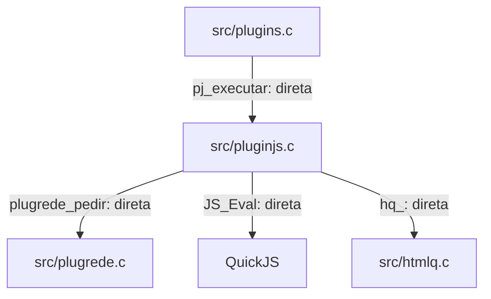
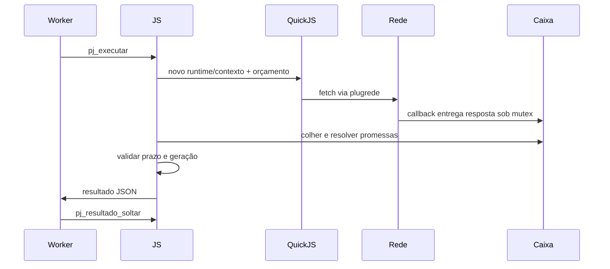

# `src/pluginjs.c` — execução isolada de scrapers QuickJS

## Para que serve

Executa um scraper por runtime, com promessas, timers, fetch e DOM limitado. O JS permanece no fio chamador; rede entrega resultados por caixa sincronizada. Código compartilhado com limites condicionais por plataforma, sem acesso direto à UI. (`src/pluginjs.h:1`).

Base de leitura: `bed3534c`. Referências de linha são desta revisão; histórico e relato de issue não constituem teste executado nesta rodada.

## Funções públicas (`src/pluginjs.h`)

Executor em fio com pilha de `pj_pilha()`. JS/contexto pertencem a esse fio; callbacks de rede usam mutex/cond da Caixa. Orçamentos globais usam atômicos. Evidência: `src/pluginjs.c:930`; estados/travas abaixo.

As assinaturas abaixo são as declarações do header quando disponíveis. As pré-condições específicas constam na coluna de contrato; ponteiros de saída não opcionais devem apontar para armazenamento válido. Getters de ponteiro retornam memória emprestada, não transferem ownership.

| Assinatura | O que faz / pré-condições / efeitos | Travas locais e referência |
|---|---|---|
| `int pj_executar(const PjPedido *p, PjResultado *r)` | BLOQUEIA: cria runtime isolado, executa getStreams e laço de promessas; pedido e resultado obrigatórios, código vivo até retornar. | `e.cx->m` (Caixa); auxiliares também usam `poolM`; `src/pluginjs.c:930`; `src/pluginjs.h:70` |
| `void pj_resultado_soltar(PjResultado *r)` | Libera r->json e zera ponteiro; aceita NULL, não libera a struct. | Sem aquisição explícita nesta função; auxiliares seguem contrato acima; `src/pluginjs.c:1112`; `src/pluginjs.h:71` |
| `size_t pj_pilha(void)` | Devolve 4 MiB para pilha do fio executor. | Sem aquisição explícita nesta função; auxiliares seguem contrato acima; `src/pluginjs.c:48`; `src/pluginjs.h:72` |
| `void pj_orcamento_definir(size_t heap, size_t rede)` | Altera tetos globais atômicos; zero mantém valor atual. | Sem aquisição explícita nesta função; auxiliares seguem contrato acima; `src/pluginjs.c:79`; `src/pluginjs.h:76` |
| `size_t pj_orcamento_heap_uso(void)` | Consulta bytes reservados globalmente para heap/DOM. | Sem aquisição explícita nesta função; auxiliares seguem contrato acima; `src/pluginjs.c:83`; `src/pluginjs.h:77` |
| `size_t pj_orcamento_rede_uso(void)` | Consulta bytes reservados globalmente para respostas em voo. | Sem aquisição explícita nesta função; auxiliares seguem contrato acima; `src/pluginjs.c:84`; `src/pluginjs.h:78` |
| `size_t pj_orcamento_heap_pico(void)` | Consulta pico global de heap. | Sem aquisição explícita nesta função; auxiliares seguem contrato acima; `src/pluginjs.c:85`; `src/pluginjs.h:80` |
| `void pj_orcamento_zerar_pico(void)` | Reinicia pico no uso corrente, não necessariamente zero. | Sem aquisição explícita nesta função; auxiliares seguem contrato acima; `src/pluginjs.c:86`; `src/pluginjs.h:81` |

## Estado global (`static`)

| Grupo | Quem escreve / quem lê e sincronização | Evidência |
|---|---|---|
| heapTeto/redeTeto e heapUso/redeUso/heapPico | Configuração, reservar/devolver e alocador usam atômicos; getters observam. | `src/pluginjs.c:57` |
| Caixa/Job e Ex (estado POR EXECUÇÃO, não singleton) | pj_executar detém runtime/contexto; entrega de rede altera fila sob mutex e contagem refs; término marca morta antes de soltar. | `src/pluginjs.c:136` |

Pool global adicional: `poolM`, `poolC`, `poolIni/poolFim`, `poolFios/poolFalhou`. `despachar` enfileira/cria workers e `fioRede` retira sob `poolM`; entrega usa mutex da Caixa. Limite `PJ_FIOS_REDE=6` (`src/pluginjs.c:33`, `src/pluginjs.c:201`, `src/pluginjs.c:206`, `src/pluginjs.c:220`). O callback `jobParar` é registrado em `RedePedido.parar` (`src/pluginjs.c:193`).

## Grafo de chamadas

Recorte das dependências comprovadas, não inventário de todo utilitário chamado. Arestas de registro, callback e ponteiro estão rotuladas.

Evidências das arestas:

- `src/plugins.c` → `src/pluginjs.c`: `src/plugins.c:728`.
- `src/pluginjs.c` → `src/plugrede.c`: `src/pluginjs.c:194`.
- `src/pluginjs.c` → `QuickJS`: `src/pluginjs.c:391`.
- `src/pluginjs.c` → `src/htmlq.c`: `src/pluginjs.c:672`.

## Fluxo principal

Ordem extraída das funções acima e dos pontos de chamada do grafo; eventos assíncronos não garantem latência nem imagem física.

## IMPACTOS

| Se você mexer em... | Confira... |
|---|---|
| `pj_executar` (`src/pluginjs.c:930`) | Pedido e callbacks devem viver até retorno; JS é exclusivo do executor. Cada runtime precisa de pilha 4 MiB, não executar inline num worker pequeno. |
| `pj_orcamento_definir` (`src/pluginjs.c:79`) | Orçamento agregado inclui runtimes/DOM e reservas de rede. Manter verificação antes de alocar e devolução em todos os caminhos de erro. |
| `pj_executar` (`src/pluginjs.c:930`) | Término deve cancelar fetches, marcar Caixa morta e respeitar refs; resposta tardia não acessa JS já liberado. |
| `pj_resultado_soltar` (`src/pluginjs.c:1112`) | Ownership: JSON sai alocado; consumidor deve soltar mesmo em erro. Geração é revalidada também na entrega final. |

### Testes

Cobertura identificada por leitura; testes de produto não foram executados nesta tarefa documental.

| Teste | Cobertura |
|---|---|
| `tests/pluginjs.c` | Ambiente JS, promessas/timers, limites globais, fetch, cancelamento/geração. (`tests/pluginjs.c:1`). |
| `tests/pluginjs.sh` | Runner com servidor local e QuickJS. (`tests/pluginjs.sh:1`). |

### O que NÃO está demonstrado por esses testes

Compatibilidade completa com Node/navegador e todo scraper de terceiros; pressão de memória e rede em hardware real.

## Regressões já acontecidas

Histórico consultado com `git log --oneline -- src/pluginjs.c`. Linhas abaixo reproduzem o assunto do commit; merge não é prova adicional de correção. Implementação atual: `src/pluginjs.c:1`.

| Hash | Alteração registrada |
|---|---|
| `5cf568fb` | plugins: wait for network budget held by other plugins instead of failing |
| `9fde2473` | F09 plugins: QuickJS engine on N01 transport with global budgets |

### Cruzamento com issues

- **#134**: `docs/issues/mapa.json:3040`; `docs/issues/MAPA.md:591`. Relação de investigação/contrato; só associar um hash ao conserto quando o assunto ou registro da issue o explicita.
