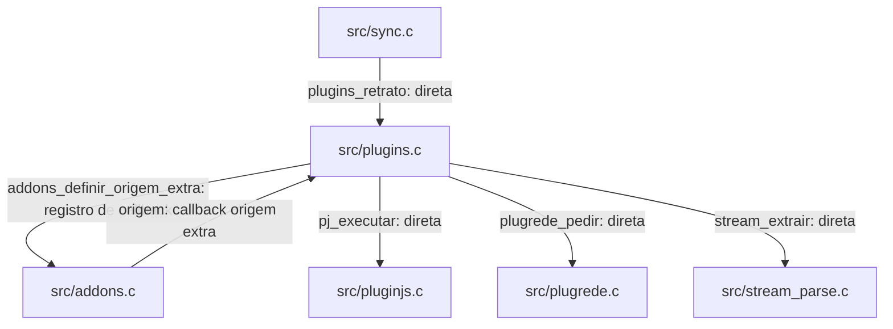

# `src/plugins.c` — repositórios de fontes Nuvio

## Para que serve

Mantém repositórios, manifestos, escolhas de scrapers e estado por conta/perfil. Liga uma origem adicional à consulta de addons, executando JS por pluginjs. Código compartilhado entre plataformas; disponibilidade depende de `plugrede_capacidades`, e o paralelismo cai para 2 em Emscripten, webOS e NV_TPK40, contra 3 nos demais. (`src/plugins.c:1`).

Base de leitura: `bed3534c`. Referências de linha são desta revisão; histórico e relato de issue não constituem teste executado nesta rodada.

## Funções públicas (`src/plugins.h`)

UI para edição/inicialização; sync para retrato/ACK; consulta em fio de trabalho (bloqueante). `trava` protege E; `gravaTrava` ordena gravações fora dela; geração/flags usam atômicos. Evidência: `src/plugins.c:342`; estados/travas abaixo.

As assinaturas abaixo são as declarações do header quando disponíveis. As pré-condições específicas constam na coluna de contrato; ponteiros de saída não opcionais devem apontar para armazenamento válido. Getters de ponteiro retornam memória emprestada, não transferem ownership.

| Assinatura | O que faz / pré-condições / efeitos | Travas locais e referência |
|---|---|---|
| `void plugins_iniciar(void)` | Avança geração, carrega estado de conta/perfil e inicia atualização se ligado/disponível. | trava; `src/plugins.c:342`; `src/plugins.h:24` |
| `void plugins_perfil_mudou(void)` | Compara conta/perfil e reinicializa somente quando mudaram. | trava; `src/plugins.c:354`; `src/plugins.h:25` |
| `int plugins_disponivel(void)` | Consulta PR_CAP_REDE de plugrede; não testa execução de scraper. | Sem aquisição explícita nesta função; auxiliares seguem contrato acima; `src/plugins.c:81`; `src/plugins.h:26` |
| `int plugins_ligado(void)` | Consulta espelho atômico e disponibilidade. | Sem aquisição explícita nesta função; auxiliares seguem contrato acima; `src/plugins.c:361`; `src/plugins.h:27` |
| `void plugins_definir_ligado(int ligado)` | Altera flag local, grava estado e pode iniciar atualização. | trava; `src/plugins.c:362`; `src/plugins.h:28` |
| `unsigned plugins_geracao(void)` | Consulta geração atômica para rejeitar respostas antigas. | Sem aquisição explícita nesta função; auxiliares seguem contrato acima; `src/plugins.c:75`; `src/plugins.h:29` |
| `int plugins_n_repos(void)` | Consulta quantidade sob trava. | trava; `src/plugins.c:434`; `src/plugins.h:33` |
| `int plugins_repo(int i, PlugRepo *saida)` | Copia repositório válido; saída obrigatória se índice válido. | trava; `src/plugins.c:435`; `src/plugins.h:34` |
| `int plugins_repo_scrapers(int i, int *ligados)` | Conta scrapers do repositório e escreve ativos se ponteiro fornecido. | trava; `src/plugins.c:449`; `src/plugins.h:35` |
| `int plugins_repo_estado(int i)` | Consulta estado do manifesto, 0 fora da faixa. | trava; `src/plugins.c:442`; `src/plugins.h:36` |
| `int plugins_alternar_repo(int i)` | Alterna ativo, avança revisão, marca pendente e grava. | trava; `src/plugins.c:495`; `src/plugins.h:37` |
| `int plugins_scraper(int i, int j, PlugScraper *saida)` | Copia scraper do repositório; saída obrigatória se encontrado. | trava; `src/plugins.c:462`; `src/plugins.h:39` |
| `int plugins_alternar_scraper(int i, int j)` | Alterna escolha local por manifesto/id e grava; -1 se inexistente. | trava; `src/plugins.c:476`; `src/plugins.h:40` |
| `int plugins_remover_repo(int i)` | Remove e reindexa scrapers; marca edição pendente mesmo ao remover último. | trava; `src/plugins.c:507`; `src/plugins.h:41` |
| `int plugins_adicionar_repo(const char *url)` | Valida HTTP(S), tamanho e whitespace; normaliza manifesto; retorna 1/0/-1/-2. | trava; `src/plugins.c:520`; `src/plugins.h:44` |
| `void plugins_atualizar(void)` | Dispara fio de manifesto sem bloquear até conclusão; impede duplicação por atômico. | Sem aquisição explícita nesta função; auxiliares seguem contrato acima; `src/plugins.c:420`; `src/plugins.h:46` |
| `int plugins_atualizando(void)` | Consulta flag atômica de atualização. | Sem aquisição explícita nesta função; auxiliares seguem contrato acima; `src/plugins.c:430`; `src/plugins.h:47` |
| `void plugins_retrato(PlugRetrato *s)` | Copia lista, revisão, geração e pendência sob trava; saída obrigatória. | trava; `src/plugins.c:544`; `src/plugins.h:64` |
| `int plugins_confirmar(unsigned rev, unsigned geracao)` | Limpa pendência e grava somente se revisão e geração coincidem com ACK. | trava; `src/plugins.c:556`; `src/plugins.h:65` |
| `int plugins_definir_da_conta(const PlugRepo *lista, int n, unsigned geracao)` | Aplica lista remota apenas sem edição pendente e na mesma geração; zero é lista válida. | trava; `src/plugins.c:564`; `src/plugins.h:66` |
| `int plugins_pendente(void)` | Consulta pendência sob trava. | trava; `src/plugins.c:554`; `src/plugins.h:67` |
| `int plugins_ler_conta(const char *json, PlugRepo *saida, int max)` | Interpreta array PostgREST em vetor até max; retorna -1 para formato rejeitado. | Sem aquisição explícita nesta função; auxiliares seguem contrato acima; `src/plugins.c:597`; `src/plugins.h:70` |
| `void plugins_esquecer(void)` | Avança geração, limpa memória e apaga estados de perfis 1..32 da conta anterior. | trava; `src/plugins.c:620`; `src/plugins.h:71` |
| `int plugins_consultar(const char *id, const char *tipo, int (*cancelado)(void *), void *ctx, void (*aviso)(void *u, int k, const char *nome, int estado, const void *fontes, int n), void *avisoU, Stream **saida)` | BLOQUEIA: resolve ID, executa scrapers em fios com pilha própria, agrega Stream; chamador libera *saida. | r, trava; `src/plugins.c:755`; `src/plugins.h:80` |
| `void plugins_ligar_aos_addons(void)` | Registra callbacks origem e plugins_ligado na busca de addons. | Sem aquisição explícita nesta função; auxiliares seguem contrato acima; `src/plugins.c:854`; `src/plugins.h:86` |

## Estado global (`static`)

| Grupo | Quem escreve / quem lê e sincronização | Evidência |
|---|---|---|
| E, ctxUsuario/ctxPerfil | carregar e editores escrevem sob trava; getters/retrato/consulta copiam sob mesma trava. | `src/plugins.c:58` |
| geracao, ligadoAt, atualizando, grupo/grupoUma | Troca de contexto avança geração/grupo; consulta e atualização verificam atômicos. | `src/plugins.c:61` |
| gravaSeq/gravaFeita e gravaTrava | Serialização numera escrita; escritor descarta sequência velha. | `src/plugins.c:69` |
| tmCache[64], tmProx | tmdbDe consulta/atualiza cache sob trava. | `src/plugins.c:638` |

## Grafo de chamadas

Recorte das dependências comprovadas, não inventário de todo utilitário chamado. Arestas de registro, callback e ponteiro estão rotuladas.



Evidências das arestas:

- `src/sync.c` → `src/plugins.c`: `src/sync.c:873`.
- `src/plugins.c` → `src/addons.c`: `src/plugins.c:854`.
- `src/addons.c` → `src/plugins.c`: registro em `src/plugins.c:854`, armazenamento em `src/addons.c:2146`, chamada indireta `o->f` em `src/addons.c:2187`.
- `src/plugins.c` → `src/pluginjs.c`: `src/plugins.c:728`.
- `src/plugins.c` → `src/plugrede.c`: `src/plugins.c:237`.
- `src/plugins.c` → `src/stream_parse.c`: `src/plugins.c:731`.

## Fluxo principal

```mermaid
sequenceDiagram
    App->>Plugins: plugins_ligar_aos_addons
    Addons->>Plugins: origem extra (callback)
    Plugins->>Worker: rodarScrapers com pilha pj_pilha
    Worker->>JS: pj_executar
    Worker->>Addons: aviso (callback parcial)
    Plugins->>Plugins: join, validar geração, agregar
    Plugins->>Addons: Stream malloc; chamador libera
```

Ordem extraída das funções acima e dos pontos de chamada do grafo; eventos assíncronos não garantem latência nem imagem física.

## IMPACTOS

| Se você mexer em... | Confira... |
|---|---|
| `plugins_confirmar` (`src/plugins.c:556`) | ACK: só confirmar após sucesso remoto com a mesma revisão E geração; edição durante push deve continuar pendente. |
| `plugins_definir_da_conta` (`src/plugins.c:564`) | Array vazio significa remoção remota válida; erro/HTML não é lista vazia. Pendência local vence leitura remota. |
| `plugins_consultar` (`src/plugins.c:755`) | Cancelamento 1 descarta; 2 corta e conserva concluídos. Callback aviso ocorre em workers e não pode tocar UI diretamente; *saida é malloc. |
| `plugins_perfil_mudou` (`src/plugins.c:354`) | Troca de conta/perfil deve avançar RedeGrupo e impedir resultados tardios; conferir sync/perfis. |
| `plugins_adicionar_repo` (`src/plugins.c:520`) | Limites: 24 repos, 160 scrapers; URL recusada >=590 bytes. Manifesto 256 KiB, código 2 MiB, cache 6 h; rodada 30 s, scraper 20 s. |
| `plugins_esquecer` (`src/plugins.c:620`) | Persistência por conta/perfil: remoção de último repo precisa subir como lista vazia; logout apaga os arquivos locais associados. |

### Testes

Cobertura identificada por leitura; testes de produto não foram executados nesta tarefa documental.

| Teste | Cobertura |
|---|---|
| `tests/plugins_fontes.c` | Manifesto/código/QuickJS/Stream contra servidor local; ACK, array vazio, cancelamento e troca de contexto. (`tests/plugins_fontes.c:1`). |
| `tests/plugins_fontes.sh` | Compila e executa suíte de fontes com servidor local. (`tests/plugins_fontes.sh:1`). |

### O que NÃO está demonstrado por esses testes

Compatibilidade com todo scraper externo, conta remota real e recursos de todas as TVs.

## Regressões já acontecidas

Histórico consultado com `git log --oneline -- src/plugins.c`. Linhas abaixo reproduzem o assunto do commit; merge não é prova adicional de correção. Implementação atual: `src/plugins.c:1`.

| Hash | Alteração registrada |
|---|---|
| `77b2c6a4` | F09 plugins: repo list with ACK sync, sources-sheet origin, Settings screen |

### Cruzamento com issues

- **#134**: `docs/issues/mapa.json:3040`; `docs/issues/MAPA.md:591`. Relação de investigação/contrato; só associar um hash ao conserto quando o assunto ou registro da issue o explicita.
