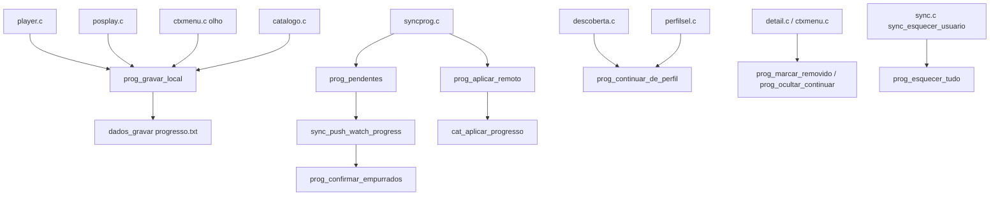

# progresso.c — Registro local de progresso de reprodução

## Para que serve

Guarda localmente o ponto de reprodução de cada título (filme/série/episódio), com chave compatível com o app web, timestamp `last_watched` e flag de pendência para push. É a fonte da fileira "Continuar assistindo" quando não há Trakt/Simkl ativo. Roda em todas as plataformas.

## Funções públicas

| Assinatura | O que faz | Fio | Pré-condições | Travas | Efeitos colaterais |
|---|---|---|---|---|---|
| `void prog_chave(...)` | Monta `progress_key` no formato web (`tt123_s4e9`). | Qualquer | — | nenhuma | — |
| `void prog_content_id(...)` | Corta id composto no primeiro ':' após `idbase_len`. | Qualquer | — | nenhuma | — |
| `int prog_ler(...)` | Registros do perfil ativo do mais novo para o mais antigo. | Principal/sync | — | `tranca` | Carrega disco se necessário. |
| `int prog_continuar_de_perfil(...)` | Item não terminado mais recente de um perfil. | Principal | — | `tranca` | Usado pela escolha de perfil. |
| `int prog_por_chave(...)` | Copia registro ativo com essa chave. | Principal/sync | — | `tranca` | — |
| `int prog_gravar_local(...)` | Grava progresso local (player, olho, pos-play). | Principal | `imdb` válido; tempos finitos; `durSeg > 1`. | `tranca` | Grava `progresso.txt`; marca pendente; `progresso.c:271-300`. |
| `int prog_aplicar_remoto(...)` | Aplica linha remota (pendente local vence; senão mais novo). | Fio principal (via syncprog_aplicar) | — | `tranca` | Pode gravar `progresso.txt`; `progresso.c:302-329`. |
| `int prog_pendentes(...)` | Devolve pendentes do perfil ativo. | Fio de sync | — | `tranca` | — |
| `void prog_confirmar_empurrados(...)` | Quita pendentes enviados que ainda têm mesmos valores. | Fio de sync | — | `tranca` | Grava `progresso.txt`; `progresso.c:331-348`. |
| `void prog_marcar_empurrados(...)` | Quita pendentes por chave (compatibilidade). | Qualquer | — | `tranca` | `progresso.c:352-364`. |
| `void prog_remover(...)` | Apaga registro local. | Principal | — | `tranca` | `progresso.c:366-374`. |
| `void prog_marcar_removido(...)` | Marca obra como removida de "Continuar assistindo" em memória. | Principal | — | `tranca` | `removidos[]` em RAM (não disco). |
| `int prog_removido_vence(...)` | 1 se remoção local vence item remoto. | Principal | — | `tranca` | — |
| `void prog_ocultar_continuar(...)` | Oculta obra em disco (`cwoculto.txt`). | Principal | — | `tranca` | Grava arquivo; `progresso.c:500-519`. |
| `int prog_oculto_vence(...)` | 1 se obra continua oculta. | Principal | — | `tranca` | — |
| `int prog_oculto_soltar(...)` | Apaga ocultação se instante mais novo. | Principal | — | `tranca` | Grava `cwoculto.txt`. |
| `void prog_esquecer_tudo(void)` | Apaga todo progresso e ocultos. | Principal | Logout. | `tranca` | Apaga `progresso.txt`, `cwoculto.txt`; zera cache. |
| `void prog_invalidar(void)` | Descarta cache em memória. | Principal | Troca de perfil/dados_dir. | `tranca` | — |
| `long long prog_agora_ms(void)` | Relógio em ms. | Qualquer | — | nenhuma | Pode usar relógio injetado. |
| `void prog_definir_relogio(...)` | Injeta relógio para testes. | Teste | — | nenhuma | — |

## Estado global

| Variável | Tipo | Quem escreve | Quem lê |
|---|---|---|---|
| `regs[PROG_MAX]` | `static ProgRegistro[480]` | `prog_gravar_local`, `prog_aplicar_remoto`, carregamento | `prog_ler`, `prog_por_chave`, `prog_pendentes`, `prog_continuar_de_perfil` |
| `nRegs` | `static int` | carregamento, funções de escrita | leituras |
| `carregado` | `static int` | carregamento, `prog_invalidar`, `prog_esquecer_tudo` | `carregar()` |
| `relogio` | `static fn pointer` | `prog_definir_relogio` | `prog_agora_ms` |
| `removidos[]`, `nRemovidos` | `static struct[]` | `prog_marcar_removido` | `prog_removido_vence` |
| `ocultos[]`, `nOcultos`, `ocultosCarregado` | `static struct[]` | `prog_ocultar_continuar`, carregamento | `prog_oculto_vence`, `prog_oculto_soltar` |

## Grafo de chamadas (flowchart)



## Fluxo principal (sequenceDiagram)

```mermaid
sequenceDiagram
    participant P as player.c
    participant R as progresso.c
    participant D as dados.c
    participant S as syncprog.c
    participant C as catalogo.c
    P->>R: prog_gravar_local(imdb, t, e, pos, dur)
    R->>R: prog_content_id / prog_chave
    R->>R: lastWatchedMs = agora; pendente=1
    R->>D: dados_gravar("progresso.txt")
    S->>R: prog_pendentes()
    R-->>S: vetor de pendentes
    S->>S: sync_push_watch_progress
    S->>R: prog_confirmar_empurrados(enviados, n)
    R->>D: regrava progresso.txt se mudou
    S->>R: syncprog_aplicar()
    R->>R: prog_aplicar_remoto(r)
    R->>C: cat_aplicar_progresso()
```

## IMPACTOS

- **Se mexer no formato do arquivo**: novo formato tem cabeçalho `#nvprog2` e 10 colunas tab (`progresso.c:14-15`, `105-117`); formato antigo é migrado e marcado como pendente (`progresso.c:80-102`).
- **Se mexer em `prog_gravar_local`**: recusa `durSeg <= 1` e tempos não finitos (`progresso.c:21-23`, `275`); `jfid_e(imdb)` ignora personal-server ids (`progresso.c:276`).
- **Se mexer em `prog_aplicar_remoto`**: regra "pendente local vence; senão mais novo; empate mantém local" (`progresso.c:318-320`).
- **Se mexer em `abrirVaga`**: quando cheio, remove a linha não pendente mais antiga; pendentes nunca saem (`progresso.c:175-183`).
- **Se mexer em `removidos`/`ocultos`**: `removidos` é só RAM (janela de DELETE em voo); `ocultos` persiste em `cwoculto.txt` (`progresso.c:388-391`, `458`). Ambos podem ser vencidos por um registro local mais novo (`progresso.c:439-442`, `526-530`).
- **Se mexer em `PROG_MAX`**: afeta consumo de memória e tamanho do arquivo; hoje 480.
- **Contratos com Kotlin/.NET/JS**: não há neste módulo.
- **Testes**: `tests/vistoep_corrida.sh` indireto; `tests/progresso.c`? Não localizado. Não há teste unitário direto para `progresso.c`.

## Regressões já acontecidas

- **#22** — Tirar de "Continuar assistindo" voltava: `prog_marcar_removido` e lógica de vencer remoto (commits `e63abe98`, `dd02279b`).
- **#203** — Ocultar "a seguir" de Continuar assistindo em disco (`cwoculto.txt`) (commit `b8d110de`).
- **Formatação da chave web**: migração do formato antigo e uso de `prog_chave` para evitar duplicatas no servidor (commits `dd02279b`, `47859dab`).
