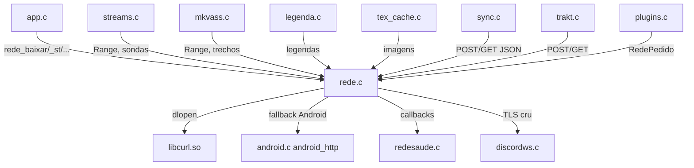
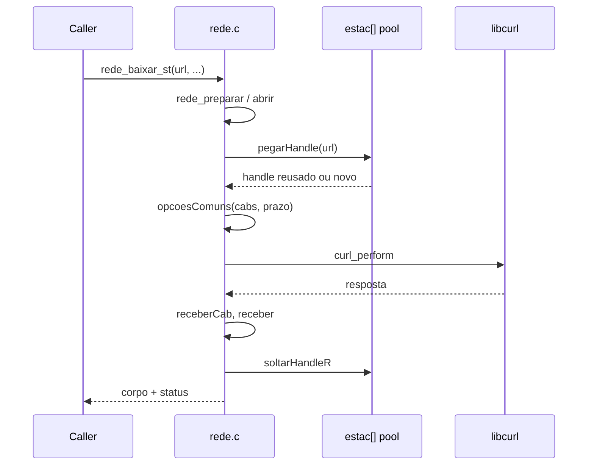

# `src/rede.c` — HTTP/HTTPS e TLS

## Para que serve

Camada de rede HTTP(S) do app. Carrega a libcurl do aparelho por `dlopen`
(nativos) ou usa XHR síncrono do Emscripten (Tizen `.wgt`). Oferece duas
famílias de API:

1. **API antiga/bloqueante**: `rede_baixar*`, `rede_postar*`, `rede_url_final*`,
   `rede_baixar_trecho*` — usada pela maior parte do app.
2. **API nova aditiva (`RedePedido`)**: `rede_pedir`, `rede_grupo_*`,
   `rede_job_*` — usada por workers/plugins, com cancelamento, deadlines,
   limites de bytes e callbacks.

## Plataformas

- **Nativos (webOS, Android, .tpk, Mac, Linux)**: usa libcurl por `dlopen`
  (`curl_*` resolvidos dinamicamente). A inicialização da libcurl
  (`curl_global_init`) é feita num fio próprio (`fioCurl`) para não travar o
  arranque (#266).
- **Tizen `.wgt` / Emscripten (`__EMSCRIPTEN__`)**: XHR síncrono via JS. A
  API `RedePedido` retorna `REDE_INDISPONIVEL` (298). TLS não verificável da
  mesma forma; funções TLS (`rede_tls_*`) devolvem NULL/-1.
- **Tizen 4/5 `.tpk` (`NV_TPK40`)**: sem `_Thread_local`; o estado por fio vive
  em `pthread_key` via `rede_teto_ptr()` (161, 223-224).

## Funções públicas (de `src/rede.h`)

*(Resumo das principais; o `.h` tem ~80 declarações.)*

### API nova (`RedePedido`)

| Função | Linha | O que faz | Fio | Efeitos colaterais |
|---|---|---|---|---|
| `unsigned rede_pedido_capacidades(void)` | 85 / 297 | Máscara de recursos da API nova. | Qualquer | — |
| `int rede_pedir(const RedePedido *p, RedeResposta *r)` | 86 / 298 | Executa um pedido bloqueante; respeita deadline, limites, redirects, cancelamento. | NÃO é o fio de desenho | Preenche `r`; chamador chama `rede_resposta_limpar`. |
| `void rede_resposta_limpar(RedeResposta *r)` | 87 / 99 | Libera `corpo`/`cabecalhos` alocados. | Qualquer | — |
| `RedeGrupo *rede_grupo_criar(void)` | 97 / 33 | Cria grupo de jobs. | Qualquer | — |
| `void rede_grupo_soltar(RedeGrupo *g)` | 98 / 40 | Libera grupo. | Qualquer | — |
| `uint64_t rede_grupo_avancar(RedeGrupo *g)` | 99 / 45 | Invalida jobs antigos do grupo. | Qualquer | — |
| `void rede_grupo_cancelar(RedeGrupo *g)` | 100 / 55 | Cancela todos os jobs do grupo. | Qualquer | — |
| `RedeJob *rede_job_criar(RedeGrupo *g)` | 101 / 60 | Cria job num grupo. | Qualquer | — |
| `void rede_job_reter/soltar/cancelar` | 102-104 / 72-78 | Refcount/cancelamento de job. | Qualquer | — |

### API antiga (bloqueante)

| Função | Nativo | Wasm | O que faz |
|---|---|---|---|
| `char *rede_baixar(url, segundos)` | 1625 | 409 | GET para string terminada em NUL. |
| `char *rede_baixar_bin(..., tam)` | 1621 | 414 | GET binário. |
| `char *rede_baixar_com(url, seg, cabs)` | 1674 | 419 | GET com cabeçalhos. |
| `char *rede_baixar_st(url, seg, cabs, status)` | 1678 | 432 | GET com status HTTP. |
| `char *rede_baixar_st_retry(..., retryAfter)` | 1700 | 437 | GET com Retry-After. |
| `char *rede_baixar_etag(..., etag)` | 1705 | 403 | GET com ETag. |
| `char *rede_baixar_medido*`, `bin_medido*` | 3030+ | 293+ | GET com medição por requisição. |
| `char *rede_postar(url, seg, cabs, corpo)` | 2048 | 256 | POST JSON. |
| `char *rede_apagar(url, seg, cabs, status)` | 2055 | 271 | DELETE com status. |
| `char *rede_postar_st(...)` | 2145 | 494 | POST com status. |
| `char *rede_postar_seguro_st(...)` | 2168 | 514 | OAuth POST dedicado. |
| `int rede_url_final(url, seg, dst, tam)` | 1997 | 590 | Resolve redirects. |
| `int rede_url_final_cab(...)` | 1923 | 560 | Resolve redirects com cabeçalhos. |
| `int rede_url_final_tipo(...)` | 1928 | 565 | Resolve redirects + mime/corpo. |
| `char *rede_baixar_trecho(url, seg, ini, fim, tam)` | 3025 | 168 | Range simples. |
| `char *rede_baixar_trecho_st(..., status, erro, final)` | 2912 | 188 | Range com status/erro/final. |
| `char *rede_baixar_trecho64_final/cab` | 2615 / 2708 | — | Range 64 bits para demuxer DTS. |
| `long rede_corte_host(url)` | 2875 | 196 | Teto aprendido para host que corta Range. |
| `int rede_resto_recusado(void)` | 2763 | 201 | Último Range teve resto recusado. |
| `void rede_lateral(int sim)` | 2805 | 213 | Marca fio como leitura lateral ao vídeo. |
| `int rede_medir_vazao(...)` | 2260 / 2294 | 636 | Mede throughput descartando bytes. |
| `void rede_vazao_espera(ms)` | 2186 | 634 | Prazo para primeiro byte nas medições. |
| `void rede_avisar_401(f)` | 797 / 324 | 363 | Callback de 401. |
| `void rede_avisar_saude(f)` | 800 / 327 | 370 | Callback de saúde da rede. |
| `void rede_avisar_host(f)` | 803 / 329 | 375 | Callback por host. |
| `void rede_preparar(void)` | 1613 / 1610 | 296 | Carrega libcurl AGORA. |
| `void rede_discord_ca(path)` | 2089 | 511 | CA bundle para Discord OAuth/Gateway. |
| `RedeTls *rede_tls_abrir(...)` | 2405 | 700 | TLS cru para WebSocket. |
| `int rede_tls_enviar/receber/fechar` | 2453+ | 701+ | — |
| `const char *rede_ultimo_erro(void)` | nativo | 401 | Último erro de transporte do fio. |
| `const char *rede_url_publica(...)` | nativo | 409 | URL segura para log. |
| `const char *rede_url_log(...)` | nativo | 419 | URL de imagem/meta para log. |
| `int rede_segmento_suspeito(...)` | nativo | 421 | Critério de segmento suspeito. |
| `int rede_aquecer_lote(...)` | nativo | 409 | DNS/TCP/TLS warmup. |

*Nota*: as colunas mostram a linha aproximada da implementação nativa (>=705)
e da implementação wasm (<705).

### Estado por fio

| Estado | Nativo | Wasm | Semântica |
|---|---|---|---|
| `rede_teto` | 226 `extern _Thread_local` / `rede_teto_ptr()` para `NV_TPK40` | 215-216 | Teto de bytes da transferência corrente. |

## Estado global (static) importante

### Emscripten/WASM (linhas ~1–704)

| Estado | Linha | Tipo | Semântica |
|---|---|---|---|
| `fioChave`, `fioUma`, `fioReserva` | 143-147 | pthread key/once/reserva | Estado por fio (teto, cancelamento, etc.). |
| `redeLimiteLocal`, `redeCancelLocal`, `redeLimitouLocal`, `redeCancelouLocal`, `redeBytesLocal` | 177-181 | `_Thread_local` | Estado corrente do fio. |
| `redeFinalDst`, `redeFinalTam` | 293-294 / 729-730 | `_Thread_local` | Buffer para URL final. |
| `aviso401`, `avisoSaude`, `avisoHost` | 323-329 / 796-803 | callbacks | Ouvintes registrados. |

### Nativo libcurl (linhas ~705+)

| Estado | Linha | Tipo | Semântica |
|---|---|---|---|
| `curl_*` (init, setopt, perform, cleanup, global, slist_*) | 805-826 | ponteiros de função | libcurl carregada por `dlopen`. |
| `pronto` | 853 | `int` | 1 quando a libcurl foi carregada. |
| `handleChave`, `handleUma` | 873-874 | pthread key/once | Cache de handles curl por fio. |
| `discordCa` | 726 | `char[600]` | Caminho do CA bundle do Discord. |
| `redeCurlLocal`, `redeErroTxt`, `redeErroBuf` | 711-722 | `_Thread_local` | Estado/erro do fio. |
| `ociosoMaxMs` | 908 | `unsigned long` | Tempo máximo de ociosidade de conexão. |
| `usoHost` | 912 | `_Thread_local UsoHost[]` | Últimos hosts usados (reuse). |
| `estac[]`, `estacTrava` | 973-974 | `Estac[]`, mutex | Pool de handles curl estacionados por host. |
| `abrirTrava` | 1293 | mutex | Protege carga da libcurl/OpenSSL. |
| `sslTravas`, `nSslTravas` | 1318-1319 | `pthread_mutex_t **`, int | Travas OpenSSL (#92, SIGSEGV com muito HTTPS). |
| `fioIniciado`, `esgotou`, `curlRuim` | 1501-1553 | int | Estado do fio de inicialização curl. |
| `corteHost[]`, `corteProx`, `corteTrava` | 2766-2768 | `CorteHost[]`, int, mutex | Aprendizado de hosts que cortam Range. |
| `calmaHost[]`, `calmaProx`, `calmaTrava` | 2801-2803 | `CalmaHost[]`, int, mutex | Pausa em hosts que recusam conexão (#385/#308). |
| `vazEsperaMs` | 2185 | `unsigned long` | Prazo para primeiro byte em medições. |

## Grafo de chamadas



## Fluxo principal: GET bloqueante nativo



## Fluxo principal: Range cortado / leitura lateral

```mermaid
sequenceDiagram
    participant MK as mkvass.c
    participant R as rede.c
    participant L as libcurl

    MK->>R: rede_lateral(1)
    loop até completar ou desistir
        MK->>R: rede_baixar_trecho_st(ini, fim)
        R->>R: calmaFalta? se em pausa, retorna erro
        R->>L: Range
        alt conexão recusada (curl 6/7/35)
            R->>R: calmaAbrir(url, erro)
            R-->>MK: erro, sem repetir
        else corpo veio menor
            R->>R: corteAprender; ajusta teto
            R-->>MK: bytes; MK pede resto
        end
    end
```

## IMPACTOS

- **Se mexer no carregamento da libcurl**, `rede_preparar` (1613) chama
  `abrirReal` (1396) que faz `dlopen` e resolve símbolos. Em Android isso roda
  num fio próprio (`fioCurl`, 1502). `curl_global_init` não é segura entre
  fios; por isso a preparação é feita antes de qualquer fio de rede nascer.
- **Se mexer no pool de handles**, `pegarHandle` (1014) e `estacionar` (984)
  reusam conexões por host. `hostOcioso` (950) decide se a conexão ainda vale.
  `ociosoMaxMs` (908) é o timeout de ociosidade.
- **Se mexer em Range / mkvass**, `rede_baixar_trecho_st` (2912) implementa o
  laco de "corpo cortado": um 206 que fecha antes do fim não é falha; o host
  que corta ganha teto lembrado (`rede_corte_host`, 2875) e pausa na recusa
  (`rede_lateral`, 2805).
- **Se mexer na URL de log**, `rede_url_publica` e `rede_url_log` cortam
  credenciais do caminho. `rede_url_log` mantém segmentos seguros como
  `/t/p/w500/abc.jpg` do TMDB e redige JWT/chaves (usado em logs do app).
- **Se mexer no fallback Android**, `viaAndroid` (1554) chama
  `android_http` quando a libcurl não carrega ou o primeiro request falha.
  Deve manter o mesmo contrato de alocação e status.
- **Se mexer no TLS/OpenSSL**, `prepararOpenSSL` (1336) instala travas
  OpenSSL (#92). Sem isso muito HTTPS simultâneo dava SIGSEGV.
- **Se mexer na API `RedePedido`**, no wasm ela retorna `REDE_INDISPONIVEL`
  (298). Não pode ser usada para I/O no `.wgt`.
- **Tests**: `tests/rede_sonda.sh`, `tests/mkv_caps.sh`, `tests/legref.sh`,
  `tests/mkvass.sh`, `tests/faixasmkv.sh`, `tests/streamfit_paralelo.sh`,
  `tests/discord_tls.c`, `tests/redesaude.c`, `tests/redeurl_log.sh`.

## Regressões já acontecidas

Do `git log --oneline -- src/rede.c` e issues:

| Commit | Issue | Resumo | Onde no arquivo |
|---|---|---|---|
| `4151683c` | #385 | host que recusa conexão põe leitura lateral em pausa — sem 5 Ranges, sem sonda por cima. | 2805, 2912. |
| `7131b97b` | #223 | `hostDaUrl` strips userinfo para logs Android nunca imprimirem credenciais. | 916. |
| `5f6a3da6` | — | `RedePedido` per-call request API with deadlines and caps. | 85+. |
| `99ecb284` | #92 | 206 cortado no meio fica; host que corta ganha teto e conexão extra. | 2912. |
| `eca438de` | — | conexão parada não espera o prazo inteiro; diagnóstico mostra média e pior pedido por fonte. | pool. |
| `310d2393` | #92 | falha de rede do mkvass não devolve faixa à TV de vez. | 2912. |
| `81eb2b1a` | — | OpenSSL 1.0 sem trava: SIGSEGV com muito HTTPS. | 1336. |
| `6e4997a3` | — | liga o reuso de conexão que nunca tinha ligado. | estac[]. |
| `665646f6` | #223 | Login Android 11: surface curl error, embedded CA fallback, discard half sessions. | Android. |
| `ee632dc8` | #290 | Tizen .tpk: fallback para TV CA store quando discord-ca.pem não está no pacote. | 2089. |
| `ad091d87` | — | URL de imagem/meta sai redigida no log. | rede_url_log. |
