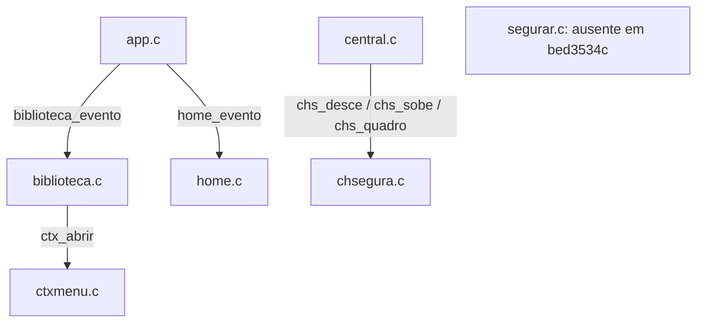
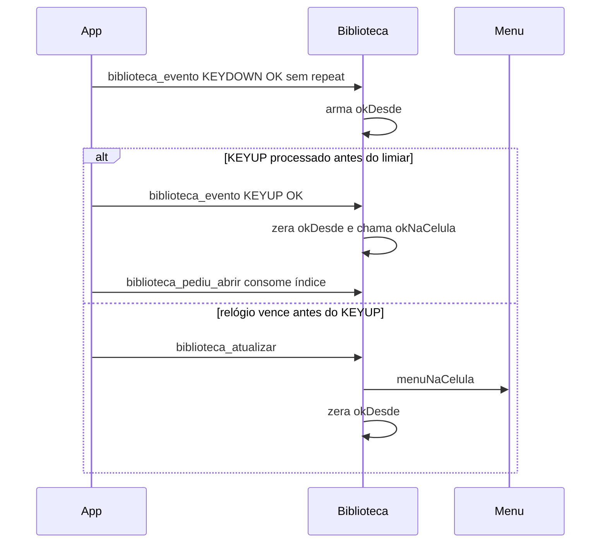

# `src/segurar.c` — módulo solicitado ausente neste checkout

## Para que serve

O pedido inclui `src/segurar.c` (`docs/funcoes/PEDIDO.md:15`), mas nem esse
arquivo nem `src/segurar.h` existem na revisão `bed3534c` examinada.
O mapa registra trabalho de OK longo na branch `agente/205-segurar`, ligado
à #387; isso não prova integração nesta árvore (`docs/issues/mapa.json:9843`).
Este documento registra a lacuna e o fluxo existente, sem inventar uma API.

## Funções públicas

Não há header ou implementação de `segurar` nesta árvore. Conferido com
`git ls-tree -r HEAD -- src/segurar.c src/segurar.h` e busca de arquivos.
`git log --oneline -- src/segurar.c src/segurar.h` também não retornou histórico
alcançável no HEAD consultado. Essas ausências não têm arquivo:linha possível.

O módulo **distinto** `chsegura.c` trata CH+ curto/longo e está documentado em
[chsegura.md](chsegura.md): recebe `ChSegura *` do chamador, com limiar de
600 ms (`src/chsegura.h:29`, `src/chsegura.h:38`). Não renomear `segurar` para
`chsegura` no índice: o OK de Biblioteca usa estado local e limiar de 700 ms
(`src/biblioteca.c:952`, `src/biblioteca.c:1079`, `src/layout.h:119`).

## Estado global

Não há `static` de um módulo `segurar` a inventariar. Nos consumidores atuais:

- Home: `okDesde`, `okPressionando`, `okLongDisparado`, `okConsumirSoltura`
  são locais à tela; eventos e atualização os alteram (`src/home.c:295`).
- Biblioteca: `biblioteca_evento` arma/zera `okDesde`; `biblioteca_atualizar`
  dispara `menuNaCelula` e zera o relógio. Caminho do fio principal SDL,
  sem mutex próprio (`src/biblioteca.c:952`, `src/biblioteca.c:1063`).
- CH+ usa outro estado, alimentado por `central.c` via `chs_desce`,
  `chs_sobe`, `chs_quadro` (`src/central.c:239`, `src/central.c:248`,
  `src/central.c:257`).

## Grafo de chamadas

As arestas abaixo são do código existente; o nó ausente não recebe chamadas.

Evidências: `src/biblioteca.c:920`, `src/central.c:239`; chamadas do app estão
no grafo de [biblioteca.md](biblioteca.md) e [home.md](home.md), com linhas.
Não há callback de `segurar` comprovável nesta revisão.

## Fluxo principal existente: OK da Biblioteca

Ordem: `src/biblioteca.c:952`, `src/biblioteca.c:1063`,
`src/biblioteca.c:736`. Isto descreve o código, não uma reprodução física da #387.

## IMPACTOS

- Se centralizar o gesto, conferir **KEYDOWN → quadro → KEYUP**, repetição,
  foco que muda e soltura consumida: Home e Biblioteca mantêm contratos
  próprios (`src/home.c:1771`, `src/biblioteca.c:952`).
- Se mudar `NV_HOLD_MS`, conferir todos os consumidores do limiar e não
  confundir com os tempos de CH+ (`src/layout.h:119`, `src/chsegura.h:29`).
- **SUSPEITA #387:** KEYUP atrasado/ausente ou diferente do KEYDOWN pode
  transformar toque em longo. O mapa discute hipóteses e vídeo; não há prova
  de causa neste checkout (`docs/issues/MAPA.md:367`).
- Ao integrar `segurar.c`, substituir este documento pelo inventário real
  de `.h`, estado, travas e callbacks, e atualizar o status do índice
  (`docs/funcoes/PEDIDO.md:18`).

### Testes

- `tests/salvos_segurar.c:1` / `tests/salvos_segurar.sh:1`: gesto do painel
  Salvos; não comprova tratamento de OK da Biblioteca no .wgt.
- `tests/central.c:1` / `tests/central.sh:1`: máquina de CH+, distinta de OK.
- `tests/biblioteca_shot.c:1` / `tests/biblioteca_shot.sh:1`: captura da tela,
  sem prova do KEYUP de controle Samsung.
- `tests/segurar.sh` não existe nesta árvore. A citação no mapa é evidência
  histórica de outra branch, não teste disponível aqui (`docs/issues/mapa.json:9854`).

Sem teste demonstrado nesta revisão: reprodução física de #387 e ajudante
`segurar.c`. Nenhum teste de produto foi executado nesta tarefa documental.

## Regressões já acontecidas

- **#387:** `03213598` (r1) e `0f98379f` aparecem no registro de trabalho da
  branch `agente/205-segurar`; não foram encontrados como histórico do arquivo
  alcançável neste HEAD (`docs/issues/mapa.json:9843`, `docs/issues/mapa.json:9854`,
  `docs/issues/MAPA.md:886`). Não marcar o conserto como integrado.
- **CH+, módulo distinto:** `6404df7f`, “Add a Control Center opened by holding
  CH+”, aparece em `git log --oneline -- src/chsegura.c`; contrato em
  `src/chsegura.h:1`. Não é conserto comprovado de #387.
