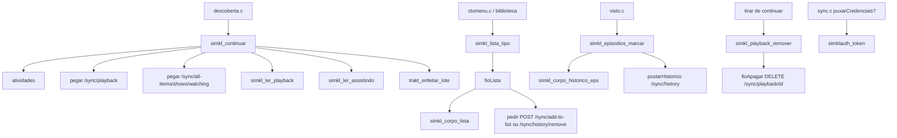
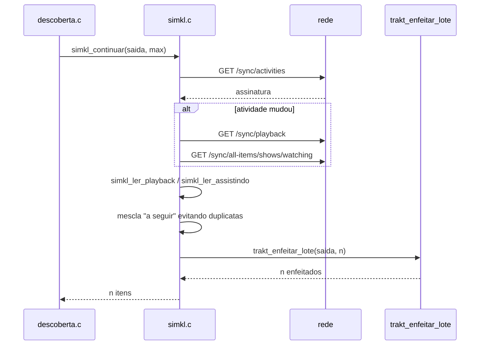

# simkl.c — Integração com Simkl

## Para que serve

Paralelo do `trakt.c` para Simkl: alimenta a fileira "Continuar assistindo" com itens pausados + "a seguir", fornece a watchlist (Plan to Watch) e permite escrever de volta o "+" (adicionar à lista), o "-" (tirar), a marcação de episódios/histórico e remoção de playback. Roda em todas as plataformas (webOS, Android, Tizen .tpk/.wgt); não há `#ifdef` de plataforma.

## Funções públicas

| Assinatura | O que faz | Fio | Pré-condições | Travas | Efeitos colaterais |
|---|---|---|---|---|---|
| `int simkl_ativo(void)` | 1 se há token do Simkl (`simklauth_token()`). | Qualquer | — | nenhuma | — |
| `const char *simkl_aviso_sem_vinculo(int querSimkl)` | Retorna `SIMKL_VINCULE` quando apropriado. | Principal | — | nenhuma | — |
| `int simkl_ler_playback(const char*, CatItem*, long long*, int)` | Lê corpo de `/sync/playback`. | Pura | Testes/leitura. | nenhuma | Preenche `dst` e `ids`. |
| `int simkl_ler_assistindo(const char*, CatItem*, int)` | Lê corpo de `/sync/all-items/shows/watching` (próximo episódio). | Pura | — | nenhuma | Preenche `dst`. |
| `int simkl_ler_plantowatch(...)` | Lê corpo de `plantowatch`. | Pura | — | nenhuma | Preenche `dst` com `naLista=1`. |
| `int simkl_corpo_lista(...)` / `simkl_rota_lista(...)` | Monta corpo/rota do +/- na lista. | Pura | — | nenhuma | Usado por `fioLista`. |
| `int simkl_continuar(CatItem*, int)` | Preenche "Continuar assistindo" do Simkl. | Fio de descoberta (bloqueia) | Token ativo. | `trava` | Preenche `play[]`, `proxIds[]`; chama `trakt_enfeitar_lote`. |
| `int simkl_e_a_seguir(const char *id)` | 1 se id é "a seguir" da última leitura. | Principal | — | `trava` | — |
| `int simkl_plantowatch(CatItem*, int)` | Preenche Plan to Watch. | Fio de descoberta (bloqueia) | Token ativo. | `trava` | Atualiza `ptw[]`. |
| `int simkl_na_plantowatch(const char *imdb)` | 1 se obra está na watchlist conhecida. | Principal | — | `trava` | — |
| `int simkl_lista_tipo(...)` | Adiciona/tira da Plan to Watch num fio. | Principal | — | `trava` | Dispara `fioLista`; estado `listaEstado`. |
| `int simkl_lista_estado(void)` | Estado da última escrita (0/1/2/3). | Principal | — | nenhuma | — |
| `int simkl_playback_remover(const char *imdb)` | DELETE `/sync/playback/<id>` num fio. | Principal | — | `trava` para leitura do id | Dispara `fioApagar`. |
| `int simkl_corpo_historico_eps(...)` / `_titulo(...)` / `simkl_rota_historico(...)` | Montam corpo/rota de marcação de histórico. | Pura | — | nenhuma | — |
| `int simkl_episodios_marcar(...)` | POST histórico em lote (síncrono). | Fio de trabalho | — | `travaCorpo` | Chama `postarHistorico`. |
| `int simkl_titulo_marcar(...)` | POST histórico título inteiro (síncrono). | Fio de trabalho | — | nenhuma | Chama `postarHistorico`. |
| `void simkl_esquecer(void)` | Limpa caches (logout/desvincular). | Principal | — | `trava` | Zera `nPlay`, `nProx`, `nPtw`, corpos guardados. |

## Estado global

| Variável | Tipo | Quem escreve | Quem lê |
|---|---|---|---|
| `play[]`, `nPlay` | `static struct[]` | `simkl_continuar`, `fioApagar` | `simkl_playback_remover`, `simkl_e_a_seguir` |
| `proxIds[][]`, `nProx` | `static char[][]` | `simkl_continuar` | `simkl_e_a_seguir` |
| `ptw[][]`, `nPtw` | `static char[][]` | `simkl_plantowatch`, `ptwMarcar` | `simkl_na_plantowatch` |
| `corpoPlay`, `corpoAssist`, `corpoPtwFilmes`, `corpoPtwSeries` | `static char*` | Cache de atividades | `simkl_continuar`, `simkl_plantowatch` |
| `assCw`, `assPtw` | `static unsigned long` | `atividades` + caches | decide se refaz download |
| `listaEstado`, `listaFioVivo`, `alvoId`, `alvoTipo`, `alvoAdicionar` | `static` | `simkl_lista_tipo` / `fioLista` | UI/espelhamento |

## Grafo de chamadas (flowchart)

## Fluxo principal (sequenceDiagram)

## IMPACTOS

- **Se mexer em `simkl_continuar`**: cache por `/sync/activities`; igual à assinatura anterior usa corpos guardados (`simkl.c:460-484`). Meia resposta não é guardada.
- **Se mexer em leitores puros**: `simkl_ler_playback` ignora item sem `ids.imdb` (`simkl.c:97`); para anime só usa numeração TVDB (`simkl.c:127-128`); progresso vem em porcentagem 0-100 (`simkl.c:146`).
- **Se mexer em `simkl_corpo_historico_titulo`**: desmarcar série SEM lista de temporadas retorna 0 para não apagar o histórico inteiro do Simkl (`simkl.c:322-326`).
- **Se mexer em `simkl_lista_tipo`**: "-" só manda se o título está no `ptw[]` conhecido; senão recusa para não apagar biblioteca (`simkl.c:647-652`).
- **Se mexer em `postarHistorico`**: sucesso 2xx com `"not_found"` contendo `"ids"` é tratado como falha (`simkl.c:687-688`).
- **Contratos com Kotlin/.NET/JS**: não há neste módulo.
- **Testes**: `tests/vistoep_corrida.sh` indireto; `tests/trakt_ep_cinemeta.sh` não cobre Simkl. Não há teste específico de Simkl.

## Regressões já acontecidas

- **#110** — Simkl como fonte de "Continuar assistindo" e destino do "+" (commit `ae51d9b0`).
- **#244/#243** — Um card por obra; remoção de playback; nota real (commit `8e7f4098`, tocou Simkl no enfeite).
- **Marcação em lote** (commits `7714dc8b`, `3990b12e`): `simkl_episodios_marcar` e `simkl_titulo_marcar`.
