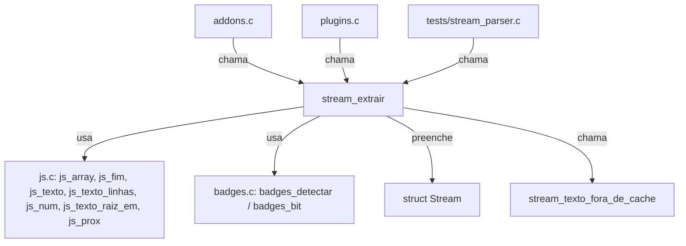
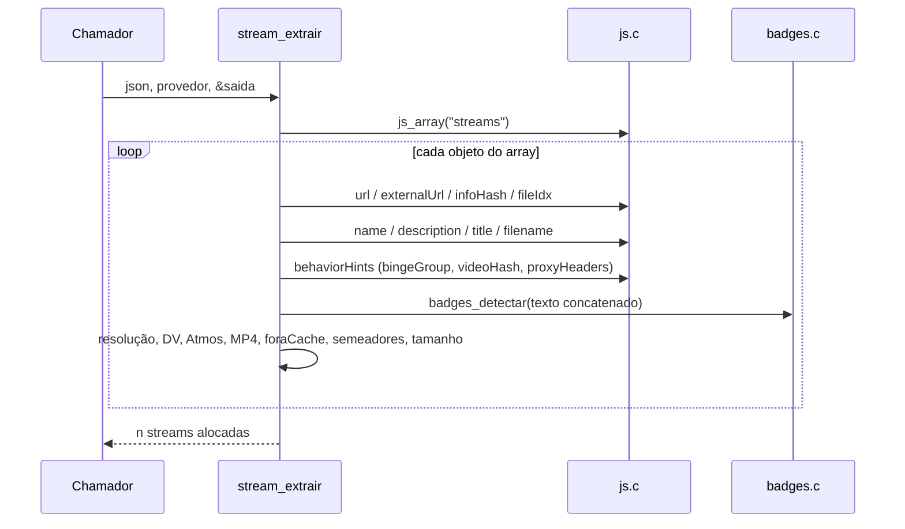

# `src/stream_parse.c` — parser JSON das respostas de stream

## Para que serve

Converte o JSON `{"streams":[...]}` do protocolo Stremio em vetor de `Stream`. Sem rede, sem SDL, sem estado global: puro parser. Roda em **todas as plataformas**; o mesmo código serve testes unitários e o app nativo.

## Funções públicas (`src/streams.h`)

| Assinatura | O que faz | Fio | Pré-condições / efeitos colaterais |
|---|---|---|---|
| `int stream_extrair(const char *json, const char *provedor, Stream **saida)` | Parser principal. Aloca `*saida` com `malloc`/`realloc`; devolve número de streams ou -1 em falta de memória. | qualquer | `stream_parse.c:286`. `saida` é escrito; chamador libera. |
| `int stream_texto_fora_de_cache(const char *texto)` | Detecta marcadores "fora de cache" no texto do addon. | qualquer | `stream_parse.c:220`. Usado pelo parser para preencher `Stream.foraCache`. |

Todas as outras funções são `static`.

## Estado global

Nenhum. `stream_extrair` e `stream_texto_fora_de_cache` são funções puras (sem `static` mutável). O único estado é temporário na pilha/filaho do parser.

## Parsing interno (`static`)

| Função | Linha | Responsabilidade |
|---|---|---|
| `tamanhoMB` | 14 | Converte double para `long`, com guardas de `isfinite`/overflow. |
| `valorRaiz` | 20 | Procura chave de profundidade 1 exata no objeto atual; ignora strings/objetos aninhados. |
| `bytesExatos` | 48 | Lê `behaviorHints.videoSize` como inteiro decimal (string ou número), com limite `STREAMFIT_BYTES_MAX`. |
| `contem` | 68 | `strncasecmp` simples. |
| `fhdNoNome` / `ehSepFhd` / `prefixoSoSimbolos` / `ehRotuloSep` | 81-138 | Reconhece "FHD"/"Full HD" como rótulo solto do `name` (#402), sem confundir com URL/grupo de release/letra de outro alfabeto. |
| `token` | 141 | Busca token isolado (alfanumérico como fronteira), usado para DV/HDR/Atmos/MP4. |
| `lerProxyHeaders` | 163 | Lê `behaviorHints.proxyHeaders.request` e grava no formato `"Nome: valor\n"` em `Stream.cabecalhos`. |
| `lerFontesP2P` | 232 | Lê `sources[]` de torrent e formata trackers/dht em `Stream.fontes`. |
| `lerSemeadores` | 269 | Extrai número de seeds do texto do addon (emoji 👤👥👱 ou palavras "Seeders"/"seeds"). |

## Grafo de chamadas

## Fluxo de parsing

## IMPACTOS

- **Mexer no reconhecimento de resolução** (`stream_parse.c:355-371`) muda agrupamento da folha e escolha automática. Conferir `tests/stream_parser.c`, `tests/fhd402.sh`, `tests/fonte_qualidade.sh`.
- **Mexer em `lerProxyHeaders`** afeta addons que exigem Referer/Origin/User-Agent (#201). Conferir `tests/stream_parser.c` com casos de `proxyHeaders.request`.
- **Mexer em `lerFontesP2P` / torrent** afeta `p2p.c`, `debrid.c` e cartão "nenhuma fonte serve". Conferir `tests/p2p.c`, `tests/debrid.c`.
- **Mexer em `bytesExatos` / `videoSize`** afeta StreamFit e extras de legenda (#201). Conferir `tests/streamfit_parser.c`, `tests/legextras.c`.
- **Mexer em `fhdNoNome`** afeta #402. Conferir `tests/fhd402.c` e `tests/fhd402.sh`.
- **NÃO coberto por teste automatizado (SUSPEITA)**: JSON malformado que quebra `js_fim`; campos com escapes `"` dentro de `name`; `externalUrl` como única fonte.

## Regressões já acontecidas

- **#201** (URL de addon/legenda grandes, cabeçalhos proxy, extras): `Stream.url` passou para 4096, `Stream.cabecalhos` para 512, parser passou a ler `proxyHeaders.request`. Commits `4f3a2584`, `522aba65`.
- **#402** (FHD sem número caía em "Outras"): conserto iterativo em `fhdNoNome`. Commits `f4d8f3ab`, `e0142da8`, `b639eab0`, `dae8dc7a`, `824e9e9d`, `b781dae1`, `eb9f3226`. Teste `tests/fhd402.sh`.
- **#221** / cache de metadados: `stream_extrair` é chamado a cada resposta de addon; `Stream.tamanhoBytes` separado do tamanho estimado.
