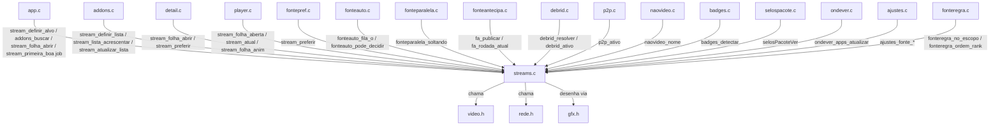
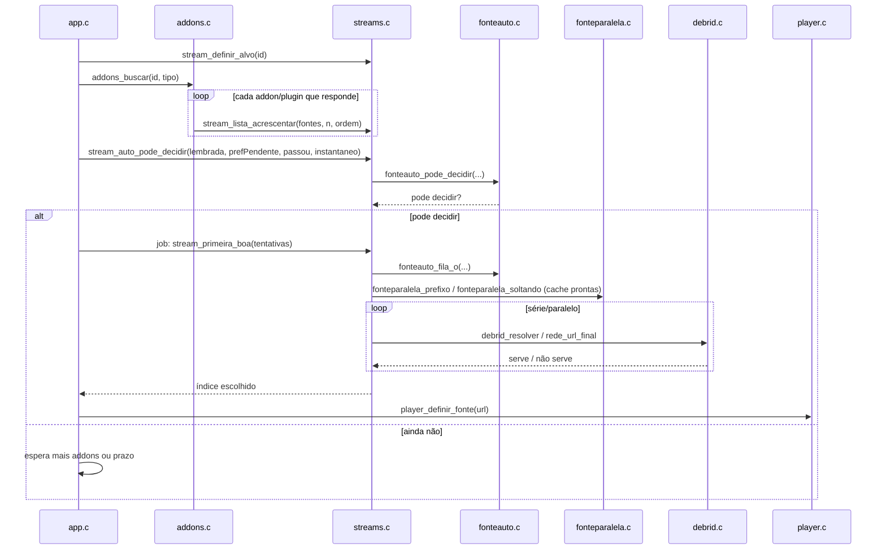

# `src/streams.c` — lista, folha e escolha automática de fontes

## Para que serve

Guarda a lista de fontes (`Stream`) devolvida pelos addons/plugins para o título aberto, decide qual fonte o automático deve tocar, desenha a folha de fontes e coordena a verificação de URL. Roda em **todas as plataformas** (LG webOS, Samsung .tpk/.wgt, Android, Mac/Linux); a plataforma só influencia pontuação (ex.: MP4 primeiro na LG) e a capacidade de forçar SDR no botão da folha.

## Funções públicas (`src/streams.h`)

| Assinatura | O que faz | Fio | Pré-condições / efeitos colaterais |
|---|---|---|---|
| `int stream_extrair(const char *json, const char *provedor, Stream **saida)` | Parser de JSON de stream do addon (sem rede). Aloca `*saida`; devolve número de fontes ou -1. | qualquer (parser puro) | `stream_parse.c:286`. Chamador libera `*saida`. |
| `void stream_definir_atual(int indice)` / `int stream_atual(void)` | Marca / lê qual fonte está tocando agora. | principal | `streams.c:308-309`. |
| `void stream_folha_contexto(const char *texto)` | Define o kicker/contexto da folha ("Silo  T2E5"). | principal | `streams.c:385`. |
| `void stream_folha_nome(const char *nome)` / `stream_folha_item(int indice)` / `stream_folha_canal(int sim)` | Configura título, índice do catálogo e modo canal da folha. | principal | `streams.c:2087`, `streams.c:2283-2284`. |
| `int stream_folha_recarregar(void)` | Consome pedido de recarregar (botão da folha). | principal | `streams.c:386`. |
| `float stream_folha_anim(void)` | Progresso 0..1 da abertura da folha. | desenho | `streams.c:2679`. |
| `void stream_definir_lista(const Stream *lista, int n)` | Substitui a lista atual por uma resposta completa de addon. | principal/fio de publicação (`addons.c` chama) | `streams.c:440`. Pega `verTrava`, reseta excluídas, zera `preferida`, herda carimbo `alvoPedido`. |
| `void stream_definir_lista_idade(...)` | Igual, mas preserva idade da resposta original (cache). | rede/publicação | `streams.c:446`. |
| `void stream_lista_acrescentar(const Stream *lista, int n, int ordemAddon)` | Adiciona fontes de um addon sem resetar índices (#221). | fio de rede (via `addons.c:progDrenar`) | `streams.c:505`. Pega `verTrava`, realoca `lista`/`chave`/`exib`. |
| `int stream_ordem_addon(int i)` | Devolve a ordem de exibição do addon da fonte `i`. | qualquer | `streams.c:563`. |
| `int stream_auto_pode_decidir(...)` | Diz se a escolha automática pode sair agora ou deve esperar mais addons (#221, #202). | principal (`app.c:225`) | `streams.c:1578`. Pega `verTrava`, consulta `addons_pendente_*`, aloca pontos/flags. |
| `int stream_grupo_regra(int i)` / `int stream_regra_bloqueou(void)` | Grupo de auto-play da fonte `i`; se alguma regra bloqueou tudo. | principal/verificação | `streams.c:986`, `streams.c:991`. |
| `int stream_n_candidatas(void)` | Quantas fontes ainda não foram excluídas pelo automático. | principal | `streams.c:1626`. |
| `void stream_definir_alvo(const char *id)` / `int stream_lista_do_alvo(const char *id)` | Carimbo de qual episódio/título a lista pertence (#101). | principal | `streams.c:301-307`. |
| `void stream_invalidar(const char *porque)` | Descarta a lista e loga o motivo. | principal | `streams.c:488`. |
| `int stream_n(void)` / `const Stream *stream_item(int i)` | Tamanho e acesso à lista. | qualquer | `streams.c:567-571`. Pega `verTrava`. |
| `int stream_selos_ha(...)` / `float stream_selos_fileira(...)` | Desenha fileira de selos do pacote ativo. | desenho/fio de selos | `streams.c:2970-2971`. |
| `int stream_automatico(void)` | Índice da fonte que o automático escolheria agora. | principal | `streams.c:1959`. Pega `verTrava`. |
| `int stream_proxima_sem_perda(int atual)` | Próxima candidata não pior que `atual` (mesma resolução/DV). | principal | `streams.c:1945`. |
| `int stream_automatico_canal(void)` | Automático para canal ao vivo (sem regras de auto-play). | principal | `streams.c:1960`. |
| `int stream_automatico_disponivel(int indice)` / `stream_automatico_excluir(int)` / `stream_automatico_excluir_irmas(int)` | Gerência de candidatas que falharam. | rede/principal | `streams.c:347-383`. Pega `autoExclTrava`/`verTrava`. |
| `void stream_preferir(int indice)` / `int stream_preferida(void)` | Fonte lembrada (vinda de `fontepref`) entra na frente da fila. | principal | `streams.c:320-321`. |
| `Uint32 stream_idade_ms(void)` | Idade da lista em ms. | qualquer | `streams.c:436`. |
| `int stream_primeira_boa(int tentativas)` | **BLOQUEIA**: verifica URLs em série/paralelo até achar uma que serve. | fio próprio (`app.c:399`) | `streams.c:1422`. Pega `verTrava`, chama `fonteauto_*`, `fonteparalela_*`, `debrid_resolver`, `naovideo`. |
| `int stream_antecipada(int *estado)` | Índice da fonte que pode tocar enquanto ainda confere. | principal/rede | `streams.c:1279`. |
| `int stream_urls_para_aquecer(char dst[][256], int max)` | Hosts das primeiras fontes para pré-aquecer conexão. | principal | `streams.c:1257`. |
| `int stream_url_serve(const char *url, const char *cabecalhos)` | Verificação avulsa de URL (bloqueia). | fio próprio | `streams.c:1217`. |
| `int stream_texto_fora_de_cache(const char *texto)` | Detecta "fora de cache" no texto do addon. | parser/testes | `stream_parse.c:220`. |
| `long stream_pontos(const Stream *s)` | Pontuação da regra automática para uma fonte. | qualquer | `streams.c:862`. |
| `int stream_e_mp4(const Stream *s)` | Se a fonte é MP4 progressivo. | qualquer | `streams.c:406`. |
| `void stream_definir_tela(int hdr, int dv)` / `int stream_cabe_no_teto(const Stream *s)` | Informa capacidade da tela e se a fonte cabe no teto de qualidade. | principal | `streams.c:689`, `streams.c:1001`. |
| `unsigned stream_lista_geracao(void)` / `int stream_qtd_torrents(void)` / `int stream_resolver_escolhida(...)` | Gerência de torrents sem URL (P2P/debrid). | principal/fio | `streams.c:1297`, `streams.c:1289`, `streams.c:273`. |
| `int stream_canal_primeira_viva(int tentativas)` / `stream_canal_classe_escolhida()` / `stream_canal_proxima(int)` / `stream_canal_prazo_longo(int)` | Verificação paralela de playlists de canal ao vivo. | fio próprio | `streams.c:1784-1878`. |
| `void stream_folha_abrir(void)` | Abre a folha de fontes. | principal | `streams.c:2633`. Reset filtros, chama `fitAbrir`, loga contagem. |
| `int stream_folha_aberta(void)` / `int stream_folha_n(void)` / `void stream_folha_evento(...)` / `void stream_folha_atualizar(...)` / `void stream_folha_desenhar(...)` | UI da folha. | principal/desenho | `streams.c:2678`, `streams.c:2722`, `streams.c:2723`, `streams.c:2785`, `streams.c:3089`. |
| `int stream_folha_escolheu(int *escolhido)` | Consome escolha manual na folha. | principal | `streams.c:2820`. |
| `void stream_fit_duracao(...)` / `stream_fit_fonte_metadados(...)` / `stream_fit_folha_estado(...)` / `stream_fit_abrindo(...)` | Integração com StreamFit (runtime/evidência de rede). | principal/UI | `streams.c:152`, `streams.c:176`, `streams.c:3574`. |

## Estado global (`static` em `streams.c`)

| Variável | Tipo | Quem escreve | Quem lê |
|---|---|---|---|
| `lista` | `Stream *` | `stream_definir_lista`, `stream_lista_acrescentar`, `stream_atualizar_lista` | quase todas as funções |
| `n` | `int` | mesmas | `stream_n`, `stream_item`, loops |
| `chave`, `exib` | `unsigned *`, `int *` | `stream_definir_lista`, `stream_lista_acrescentar`, ordenação | `ORD` macro, montagem da folha |
| `automaticasExcluidas[AUTO_EXCL_MAX]` | `int[]` | `stream_automatico_excluir` | `stream_automatico_disponivel` |
| `autoExclTrava` | `pthread_mutex_t` | — | protege excluídas |
| `verTrava` | `pthread_mutex_t` | — | protege lista/índices contra fios de verificação |
| `listaGeracao` | `unsigned` | `stream_definir_lista` | `stream_primeira_boa` descarta escrita em lista trocada |
| `atual` | `int` | `stream_definir_atual`, `stream_atualizar_lista` | folha, automático |
| `preferida` | `int` | `stream_preferir`, `stream_atualizar_lista` | fila de verificação |
| `alvoPedido`, `alvoLista` | `char[64]` | `stream_definir_alvo`, `stream_definir_lista` | validação de alvo (#101) |
| `fitDur[FIT_DUR_SLOTS]`, `fitMetaFonte`, `fitFoto*` | vários | `stream_fit_duracao`, `fitAbrir` | folha StreamFit |
| `fitMetaTrava` | `pthread_mutex_t` | — | protege cache de runtime |
| `aberta`, `foco`, `grupo`, `escolha`, `anim`, `rolagem`, `velRol` | UI | eventos/atualizar da folha | desenho |
| `soMp4`, `soCache`, `soDub`, `filtro`, `provedores[13][96]` | filtros/estado | botões da folha | `passaFiltro`, `nFiltrados` |
| `canalFolha`, `melhorFolha`, `classeEscolhida` | int | folha / canal vivo | lógica de canal |
| `descartadosSemDebrid` | `int` | `stream_definir_lista`, `stream_lista_acrescentar` | mensagem de folha vazia |
| `regraBloqueou` | `int` | `stream_primeira_boa`, `stream_auto_pode_decidir` | `stream_regra_bloqueou` |
| `telaHdr`, `telaDv` | `int` | `stream_definir_tela` | `cabeNoTeto`, pontuação |

## Grafo de chamadas

## Fluxo principal (abrir título → fonte automática → tocar)

## IMPACTOS

- **Mexer na pontuação (`pontos`, `qualidade`, `nivelHdr`)** afeta `stream_automatico`, `stream_primeira_boa`, `diagnostico.c` e a folha. Conferir com `tests/fonteauto.c`, `tests/fonte_qualidade.sh`, `tests/diagnostico.c`.
- **Mexer na ordem de exibição (`chave`, `exib`, `ORD`)** afeta desempate do automático e foco da folha. Conferir com `tests/fontes_lista.sh` (#132), `tests/fontes_parcial.c` (#221).
- **Mexer em `stream_definir_lista`/`stream_lista_acrescentar`** afeta cache de idade, carimbo de alvo (#101), selos e descarte de torrent sem debrid. Conferir `tests/streams_idade.c`, `tests/autoplay_alvo.c`.
- **Mexer na verificação (`stream_primeira_boa`)** afeta cota de debrid (#130), pré-aquecer (`aquecer.c`), tocar-enquanto-confere (`fonteantecipa.h`). Conferir `tests/fonteparalela.c`, `tests/fonteauto.sh`, `tests/streamfit_paralelo.c`.
- **Mexer na folha** afeta player, detalhe, selos, StreamFit, ondever. Conferir `tests/fontes_lista.c`, `tests/streamfit_folha_shot.c`, `tests/ondever_folha.c`.
- **Mexer em tamanhos de campos de `Stream`** afeta parser, alocação e layout. `Stream.url` é 4096 por links assinados longos (#201); `Stream.descricao` 2048; `Stream.cabecalhos` 512.
- **NÃO coberto por teste automatizado (SUSPEITA)**: interação real de cancelamento de `fonteparalela_soltando` com geração trocada; falha de `malloc` nos vetores de `stream_primeira_boa`; degradação de folha em Tizen 5 com muitos addons.

## Regressões já acontecidas

- **#130** (verificação paralela criava arquivos no debrid): consertada por verificação em série e, depois, `fonteparalela` só para fontes já em cache. Commits: `7f66bfd3`, `45deaa14`, `46a340a3`. Ver `fonteauto.h`, `fonteparalela.h`.
- **#132** (só 1 fonte listada): log de contagem na folha e teste `tests/fontes_lista.sh`. Commit `cd440320`.
- **#144** (SDR/HDR na folha), **#158**, **#182** (segunda tentativa para addon mudo): commits `abc5408e`, `475216c6`.
- **#198**, **#202** (auto-play, espera pelos addons, regras): commits `9768862e`, `c5dcb769`, `df492356`.
- **#201** (URL de addon/legenda grande, cabeçalhos proxy, extras Stremio): commits `4f3a2584`, `522aba65`, `197468ec`. `stream_parse.c:163-219` lê `proxyHeaders.request`.
- **#221** (folha enche a cada addon, escolha automática sem esperar o mais lento): commits `1e4cfa8e`, `98607591`, `401f276a`.
- **#283** (canal enfileirado no zap mantém add-on de origem): commits `6de601a5`, `4dd8a137`.
- **#284** ("Melhor para esta TV" sem resolução): commits `a63ec982`, `96854a39`.
- **#313** (DTS/TrueHD na Samsung): commit `f45ddc14` detecta e avisa; não converte ainda.
- **#402** (FHD sem número caía em "Outras"): conserto em `stream_parse.c:116-138` e `badges.c`; teste `tests/fhd402.sh`. Commits `f4d8f3ab`, `eb9f3226`.
- **#310** (binge group da fonte automática): pendente 2.0.5; a escolha manual já aplica; falta lembrar a do automático. Branch `agente/204-binge`.
