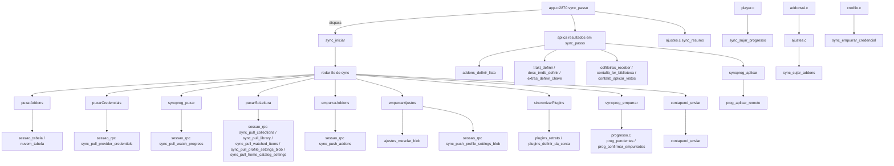
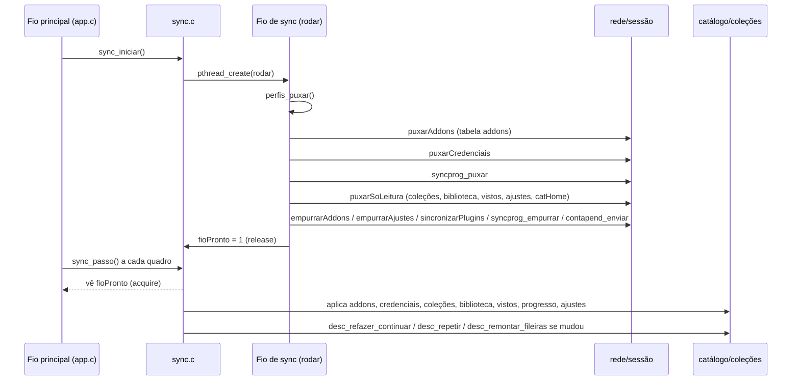

# sync.c — Ciclo de sincronização com a conta Nuvio

## Para que serve

Sincroniza o app nativo com a conta Nuvio: puxa addons, credenciais de serviços (Trakt, TMDB, mdblist, debrid), progresso de reprodução, perfis, biblioteca, coleções, catálogos da home e ajustes do perfil; empurra de volta addons, progresso local, ajustes locais e o jornal de vistos/salvos. Roda em todas as plataformas (webOS, Android, Tizen .tpk/.wgt); não há `#ifdef` de plataforma neste arquivo.

## Funções públicas

| Assinatura | O que faz | Fio | Pré-condições | Travas | Efeitos colaterais |
|---|---|---|---|---|---|
| `void sync_iniciar(void)` | Dispara um ciclo completo de sync num fio próprio. | Principal | `sessao_logada()` deve ser verdadeiro; senão retorna em `sync.c:1623`. | `addonsTrava` (copia lista local pendente) | Cria `pthread_t fio`, detacha; escreve `estado`, `fioVivo`, `perfilDoCiclo`, `usuarioDoCiclo`; `sync.c:1654`. |
| `SyncEstado sync_estado(void)` | Devolve estado do ciclo (`SYNC_PARADO/RODANDO/PRONTO/FALHOU`). | Qualquer | — | nenhuma (leitura simples de `estado`) | — |
| `const char *sync_resumo(void)` | Monta linha traduzida para a tela de ajustes. | Principal/quadro | — | `resumoTrava` | Lê `resumoDados`; não altera estado. |
| `void sync_sujar_progresso(void)` | Marca progresso local como sujo para empurrar no próximo ciclo. | Principal | — | nenhuma | `sujoProgresso = 1`; `sync.c:2030`. |
| `void sync_sujar_addons(void)` | Captura lista atual de addons e grava pendência em disco. | Principal | `sessao_logada()`; `addonsNome()` válido. | `addonsTrava` | Grava `conta-addons-pend-*.txt`; `sync.c:2031-2068`. |
| `unsigned sync_ultimo_ok(void)` | MS do último ciclo bem-sucedido. | Principal | — | nenhuma | — |
| `void sync_passo(unsigned agoraMs)` | Recolhe resultado do fio e aplica no app (addons, credenciais, coleções, biblioteca, vistos, progresso, ajustes). | Principal | Chamado a cada quadro por `app.c:2870`. | `addonsTrava` em `addonsBaseDefinir` | Altera catálogo, coleções, ordem da home, ajustes, progresso; dispara remontagem. |
| `int sync_periodico(unsigned agoraMs)` | Dispara ciclo automático se passou `SYNC_INTERVALO_MS` (5 min). | Principal | — | nenhuma | Pode chamar `sync_iniciar()`; `sync.c:1663-1675`. |
| `void sync_esquecer_usuario(void)` | Apaga todo dado local da conta que saiu. | Principal | Chamado junto de `sessao_sair()`; `sync.h:90-102`. | `addonsTrava` em `addonsEsquecer` | Apaga arquivos, libera blobs, zera estado; `sync.c:2260-2382`. |
| `void sync_reaplicar_ajustes(void)` | Faz o próximo ciclo aplicar blob de ajustes da conta. | Principal | Login/troca de perfil. | nenhuma | `aplicarAjustes = 1`; apaga `ajustes-locais.txt`; `sync.c:2165-2186`. |
| `void sync_trocar_perfil(int antes)` | Guarda ajustes do perfil que sai e restaura do que entra. | Principal | `perfis_ativo()` já é o novo. | nenhuma | Grava `ajustes-locais-p<N>.txt`; chama `sync_reaplicar_ajustes`; `sync.c:2203-2243`. |
| `int sync_perfil_pronto(void)` | 1 quando o último ciclo aplicado é do perfil ativo e nenhum ciclo está no ar. | Principal | — | nenhuma | — |
| `void sync_proteger_ajustes_locais(void)` | Marca ajustes locais para subir e bloqueia reaplicação do blob. | Principal | Chamado quando usuário mexe em ajuste. | nenhuma | Grava `ajustes-locais.txt`; `sujoAjustes = 1`; `sync.c:2249-2258`. |
| `int sync_empurrar_credencial(const char *provider, const char *credJson)` | Envia credencial de serviço para a conta. | Qualquer (idealmente fio próprio via `credfio.c`) | — | `credTrava` | Grava `cred-recusada.txt` em caso de 400 "Unsupported provider"; `sync.c:2124-2163`. |
| `int sync_servidor_fora(void)` | HTTP da falha transitoria do último ciclo (0 = respondeu). | Principal | — | nenhuma | — |
| `int sync_usando_copia(void)` | 1 quando o último ciclo usou cópia local (`contacache.c`). | Principal | — | nenhuma | — |
| `long sync_copia_quando(void)` | Epoch da cópia em uso. | Principal | — | nenhuma | — |
| `int sync_addons_fora(void)` | 0 = addons da conta; 1 = da cópia; 2 = falhou sem cópia. | Principal | — | nenhuma | — |
| `void sync_encerrar(void)` | No-op. | — | — | — | — |

## Estado global

| Variável | Tipo | Quem escreve | Quem lê |
|---|---|---|---|
| `estado` | `static SyncEstado` | Fio de sync (`rodar`) e `sync_iniciar` | `sync_estado`, fio da descoberta (`desc_montando` espera), `ajustes.c`, `app.c`, `perfilsel.c`, `main.c` |
| `fioVivo`, `fioPronto` | `static int`/`volatile int` | Fio de sync escreve `fioPronto` com `__ATOMIC_RELEASE`; `sync_iniciar` liga `fioVivo` | `sync_passo` lê `fioPronto` com `__ATOMIC_ACQUIRE` |
| `resumoDados` | `static SyncResumo` | Fio de sync via `resumoPublicar` (sob `resumoTrava`) | `sync_resumo` (sob `resumoTrava`) |
| `ultimoOk` | `static unsigned` | `sync_passo` quando ciclo termina bem | `sync_periodico`, `app.c` |
| `sujoProgresso`, `sujoAjustes` | `static int` | Principal (`player.c`, `ajustes.c`) | Fio de sync (`rodar`) |
| `addonsRem[]`, `nAddonsRem`, `temAddonsRem` | `static AddonRemoto[]` | Fio de sync preenche; `sync_passo` consome | `sync_passo` |
| `addonsFila` (pendências) | `static AddonsPendencia*` | `sync_sujar_addons`, `addonsRestaurar`, `addonsEncerrar` | `sync_iniciar`, `addonsPendentes` |
| `ajustesBlob` | `static char*` | Fio de sync (`puxarAjustesPerfil`); `empurrarAjustes` substitui | `sync_passo` aplica; `empurrarAjustes` costura |
| `catHomeBlob`, `colBlob`, `bibBlob`, `vistosBlob` | `static char*` | Fio de sync preenche | `sync_passo` consome e libera |
| `foraHttp`, `usandoCopia`, `copiaQuando`, `addonsFora` | `static int`/`long` | `sync_passo` publica do ciclo | `sync_servidor_fora`, `sync_usando_copia`, etc. |
| `perfilDoCiclo`, `perfilAplicado`, `cicloInterrompido`, `pedidoComFioVivo` | `static int` | `sync_iniciar` e fio/resultado | `sync_passo` decide descarte/repetição |
| `traktTok[]`, `tmdbKey[]`, `mdbKey[]` | `static char[]` | Fio de sync (`puxarCredenciais`) | `sync_passo` aplica |
| `credRecusada[][16]`, `nCredRecusadas` | `static char[][]` | `sync_empurrar_credencial` | Própria função (memo de 400) |

## Grafo de chamadas (flowchart)

Arestas por callback/ponteiro: `rede_avisar_401(avisoHttp401)` registrado em `trakt_definir`/`trakt_carregar` (em `trakt.c`), mas não diretamente aqui.

## Fluxo principal (sequenceDiagram)

## IMPACTOS

- **Se mexer na ordem das RPCs em `rodar`**: o push deve vir DEPOIS do pull do mesmo ciclo (`sync.c:1538-1542`). Empurrar antes de puxar faz o aparelho sobrescrever na conta o que ele mesmo mandou.
- **Se mexer em `addonsMesclar`/`empurrarAddons`**: o push de addons é mescla de três vias com a leitura da conta deste ciclo (`sync.c:732-776`). Nunca subir lista vazia: apaga addons da pessoa em todos os aparelhos (`sync.c:785-788`). A união não pode truncar em `SY_ADD_MAX` (`sync.c:769`).
- **Se mexer em `empurrarAjustes`**: só sobe se houver blob da conta (`ajustesBlob != NULL`) e só costura chaves que já existem (`sync.c:1286-1296`). Sem base, não manda nada.
- **Se mexer em `sync_sujar_addons`**: quando `addonsDeFora > 0` a edição local não sobe para não apagar da conta addons que não cabem nesta TV (`sync.c:2037-2044`).
- **Se mexer em `sync_esquecer_usuario`**: qualquer coisa que sobreviva ao logout vaza dados da conta anterior. A ordem não importa muito, mas o conjunto sim (`sync.c:2262`).
- **Se mexer em `sync_passo` perfil/conta**: ciclo de perfil trocado no meio é descartado e dispara novo `sync_iniciar()` (`sync.c:1762-1784`).
- **Contratos com Kotlin/.NET/JS**: não há neste módulo.
- **Testes**: `tests/sync_resumo_corrida.sh`, `tests/syncordem.sh`, `tests/vistoep_corrida.sh`. Não há teste automático cobrindo `sync_esquecer_usuario`, `sync_empurrar_credencial` nem o caminho de servidor fora/cópia.

## Regressões já acontecidas

- **#19** — "Random Profile Data Appears Briefly Before My Trakt Profile Loads": ciclo inicial puxava perfil 1 antes da escolha. Corrigido em `rodar` (`sync.c:1485-1494`) parando o ciclo se `perfis_precisa_escolher()`.
- **#22** — Tirar de "Continuar assistindo" voltava: `syncprog_remover` adicionado em `syncprog.c:196` (commit `545dd122`).
- **#85** — Ajustes do perfil não subiam: `sync_proteger_ajustes_locais` e `empurrarAjustes` (commits `317cb179`, `04844fb9`).
- **#199** — "a seguir" da conta Nuvio: `puxarVistos` e `contalib_aplicar_vistos` em `sync_passo` (commit `149f1235`).
- **#203** — Corridas entre fios e URL grande de addon: porteiras `fioPronto`/`addonsCedo` com release/acquire; `SY_URL_LEITURA`; `SY_ADD_MAX` 64 (commits `197468ec`, `4fbf4cb1`, `b3be79d7`).
- **#215** — Servidor da conta fora do ar deixava app sem dados: fallback para `contacache` em `soLeituraDaCopia`/`guardarOuCopia`.
- **#233** — "Nuvio account isn't synced by app": biblioteca/coleções/vistos eram contados e jogados fora; agora guardam blobs e aplicam no fio principal (commit `141d4785`, `e7e2cb3b`).
- **#312** — Resumo do sync não traduzia na hora: `SyncResumo` guarda números, texto é traduzido em `sync_resumo` (commit `1c60454d`).
- **#360** — "Sync addons" com mescla três vias e botão adiado para 2.0.5 (commits `46507ea5`, `be6c07b7`, `e2f1eede` em `agente/204-sync-addons`).
- **#378** — Blob de ajustes marcado com perfil errado: `ajustesBlobPerfil`, `ajustesBlobGeracao`, idiomas da conta sem sobreposição (commits `59733d54`, `04844fb9`, `f75ec81a`).
- **#392** — Lista de addons de outro perfil: `addons_perfil_da_lista()` e refaz registro quando perfil muda (commits `96e5de44`, `1d4b5e97`).
