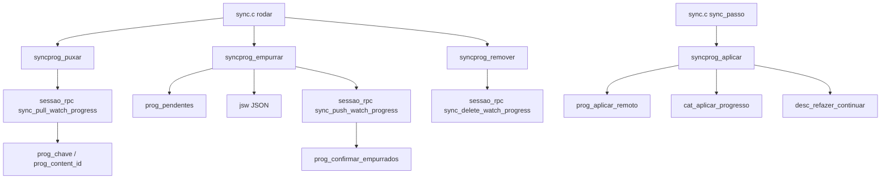
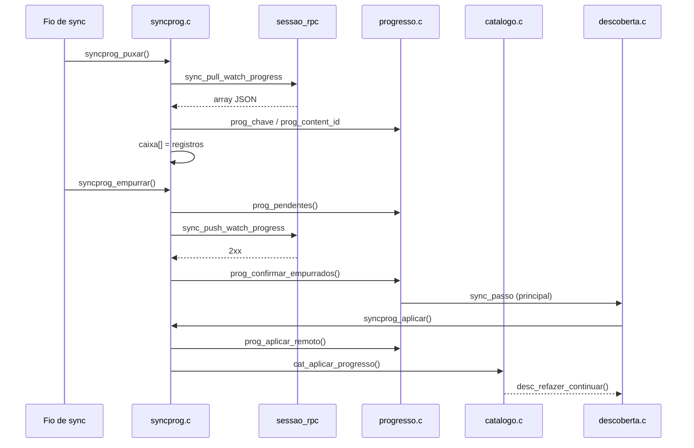

# syncprog.c — Progresso de reprodução para a conta

## Para que serve

Isola o pull/push do progresso de reprodução do ciclo geral de sync. Lê as linhas remotas do perfil ativo, empurra as pendentes locais e aplica-as no fio principal via `progresso.c`. Permite testar a lógica de progresso sem subir todo o ciclo de sync. Roda em todas as plataformas.

## Funções públicas

| Assinatura | O que faz | Fio | Pré-condições | Travas | Efeitos colaterais |
|---|---|---|---|---|---|
| `int syncprog_puxar(void)` | Faz `sync_pull_watch_progress` e preenche `caixa[]` com linhas do perfil ativo. | Fio de sync | `sessao_rpc` disponível; `perfis_ativo()` válido. | nenhuma própria; usa `sessao_rpc` (rede) | Preenche `caixa[]`, `nCaixa`; `syncprog.c:74-131`. |
| `int syncprog_empurrar(void)` | Faz `sync_push_watch_progress` com pendentes do perfil ativo. | Fio de sync | Deve haver pendentes (`prog_pendentes`). | nenhuma própria | Chama `prog_confirmar_empurrados` em caso de 2xx; `syncprog.c:133-186`. |
| `int syncprog_aplicar(int *casaram)` | Fio principal: aplica caixa puxada, decidindo pendente local vence / mais novo vence. | Principal | Chamado em `sync_passo`. | nenhuma | Chama `prog_aplicar_remoto` e `cat_aplicar_progresso`; esvazia `caixa`; `syncprog.c:220-239`. |
| `int syncprog_puxadas(void)` | Quantas linhas há na caixa (para resumo). | Qualquer | — | nenhuma | — |
| `int syncprog_remover(const char *chave)` | Faz `sync_delete_watch_progress` pela chave. | Fio de sync | — | nenhuma | `syncprog.c:196-216`. |
| `void syncprog_esquecer(void)` | Esvazia a caixa. | Principal | Logout/troca de perfil. | nenhuma | `nCaixa = 0`; `syncprog.c:243`. |

## Estado global

| Variável | Tipo | Quem escreve | Quem lê |
|---|---|---|---|
| `caixa[SP_MAX]` | `static ProgRegistro[240]` | `syncprog_puxar` | `syncprog_aplicar`, `syncprog_puxadas` |
| `nCaixa` | `static int` | `syncprog_puxar`, `syncprog_aplicar`, `syncprog_esquecer` | `syncprog_puxadas`, `syncprog_aplicar` |

## Grafo de chamadas (flowchart)

## Fluxo principal (sequenceDiagram)

## IMPACTOS

- **Se mexer no formato da RPC**: o formato de linha é o MESMO do app web (`watchProgressSyncService.js`): `content_id`, `content_type`, `video_id`, `season`, `episode`, `position`, `duration`, `last_watched`, `progress_key` (`syncprog.h:6-10`).
- **Se mexer em `syncprog_puxar`**: `position_ms`/`duration_ms` ganham de `position`/`duration` (`syncprog.c:97-100`); posições são convertidas de ms para segundos (`syncprog.c:101-102`).
- **Se mexer em `syncprog_aplicar`**: a regra "pendente local vence" vive em `prog_aplicar_remoto`, não aqui. A caixa é filtrada pelo perfil ativo (`syncprog.c:225`).
- **Se mexer em `syncprog_empurrar`**: linhas com `durSeg < 60` são ignoradas (`syncprog.c:151`). Nunca empurra vazio.
- **Se mexer em `syncprog_remover`**: usa `progress_key` (`prog_chave`), não `content_id`. Mandar o id apagaria todos os episódios da série (`syncprog.c:193-195`).
- **Contratos com Kotlin/.NET/JS**: não há neste módulo.
- **Testes**: `tests/vistoep_corrida.sh` indireto; não há teste específico de `syncprog.c`.

## Regressões já acontecidas

- **#22** — Tirar de "Continuar assistindo" voltava: adicionado `syncprog_remover` e chamado no ciclo (commit `545dd122`).
- **Issues de progresso duplicado/forkeado**: commits `dd02279b` e `47859dab` — "Watch progress stops forking rows on the server, rolling back after a pull, and hiding without Trakt" / "Paginate watched movies and preserve newer progress during sync".
- **Marcação em lote** (`7714dc8b`, `3990b12e`): integração com `vistoep.c` e escrita para Trakt/Simkl/conta.
