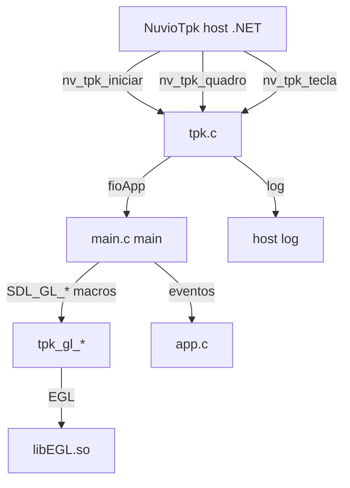

# `src/tpk.c` — Host bridge Samsung Tizen `.tpk`

## Para que serve

Ponte entre o núcleo C do Nuvio e o host .NET `NuvioTpk` no Samsung Tizen 6+.
O host .NET é dono do processo, cria o `GLWindow` e o contexto EGL, e chama
`nv_tpk_quadro()` a cada vsync no fio NUI. O C do Nuvio roda o `main()` de
sempre num fio próprio (`fioApp`), e o contexto EGL é emprestado para esse fio a
cada quadro. Também suporta o legado Tizen 4/5 via `NV_TPK40`, com um caminho de
rastro de etapas em arquivo.

## Plataformas

- **Samsung Tizen 6+ nativo `.tpk`**: `NV_TPK` (definido por `tools/tpk.sh`).
- **Samsung Tizen 4/5 nativo `.tpk`**: `NV_TPK40` (além de `NV_TPK`).
- **Outros alvos**: arquivo não entra no build; `tpk.h` define nada.

## Funções públicas

As funções chamadas pelo host .NET não estão no `.h` do C, mas no contrato com
o host:

| Função | Linha | O que faz | Pré-condições | Fio | Efeitos colaterais |
|---|---|---|---|---|---|
| `int nv_tpk_iniciar(const char *arte, const char *dados, int w, int h)` | 153 | Inicia o fio do app C e aguarda sincronismo com o NUI. | Chamado pelo host .NET uma vez. | Host NUI | Cria `fioApp`, grava etapas. |
| `int nv_tpk_quadro(void)` | 227 | Entrega um vsync ao app: passa o contexto EGL para o fio do C e espera ele desenhar. | Chamado a cada vsync pelo host .NET. | Host NUI | Troca contexto EGL, sinaliza condição. |
| `void nv_tpk_log(const char *linha)` | 194 | Log para o host .NET escrever na TV. | Qualquer fio | Qualquer fio | Envia linha ao host. |
| `int nv_tpk_terminou(void)` | 203 | 1 quando o app pediu saída. | Host NUI lê. | Host NUI | — |
| `void nv_tpk_config(int espera, int zero)` | 215 | Configura timeout do swap e se o SwapWindow é zero. | Host NUI | Host NUI | Atualiza `esperaMs`/`swapZero`. |
| `void nv_tpk_tecla(const char *nome, int apertou)` | 335 | Entrega tecla do host .NET. | Host NUI | Host NUI | Gera `SDL_Event` e chama `app_evento`. |
| `void *tpk_gl_criar(void)` | 288 | Retorna o contexto EGL real (usado pelo macro `SDL_GL_CreateContext`). | Fio do app C | Fio do app C | — |
| `void tpk_gl_trocar(void)` | 301 | Faz o swap/context share (macro `SDL_GL_SwapWindow`). | Fio do app C | Fio do app C | Sinaliza NUI. |
| `void tpk_tamanho(int *w, int *h)` | 307 | Retorna tamanho da tela. | Qualquer fio | Qualquer fio | — |
| `int tpk_gl_atributo(SDL_GLattr a, int *v)` | 312 | Lê atributo GL do contexto real. | Qualquer fio | Qualquer fio | — |
| `int tpk_egl_carregar(void)` | 77 | Carrega `libEGL.so` e resolve símbolos. | Arranque. | Host NUI | Preenche funções EGL. |
| `void nv_tpk40_etapa(const char *linha)` | 47 | Rastro de etapas no Tizen 4/5. | `NV_TPK40`. | Qualquer fio | Escreve em `data/tpk-etapas.txt`. |

## Estado global (static)

| Estado | Linha | Tipo | Semântica | Quem lê/escreve |
|---|---|---|---|---|
| `etapasArq`, `etapasAnt` | 46 | `char[600]` | Caminhos do rastro de etapas. | `nv_tpk40_etapa`, `etapasAnteriorParaLog`. |
| `trava`, `mudou` | 105-106 | pthread mutex/cond | Sincronismo entre fio NUI e fio do app. | `appEsperaVez`, `nv_tpk_quadro`, `tpk_gl_trocar`. |
| `vez`, `iniciado`, `terminou`, `pendente`, `appEsperando`, `nuiCorrente` | 107 | int | Estado da troca de vez. | ambos os fios. |
| `dpy`, `sup`, `ctx` | 108-110 | EGLDisplay/Surface/Context | Recursos GL do host. | `tpk_egl_carregar`, `tpk_gl_criar`, `nv_tpk_quadro`. |
| `telaW`, `telaH` | 111 | int | Resolução reportada pelo host. | `nv_tpk_iniciar`, `tpk_tamanho`. |
| `dirArte`, `erro` | 112-113 | char arrays | Caminho da arte e mensagem de erro. | `nv_tpk_iniciar`. |
| `esperaMs`, `swapZero` | 116 | int, int | Configuração de swap. | `nv_tpk_config`. |
| `nQuadros`, `nPulados` | 117 | unsigned | Contadores de desempenho. | `nv_tpk_quadro`. |

## Grafo de chamadas



## Fluxo principal: um quadro no `.tpk`

```mermaid
sequenceDiagram
    participant NUI as Host NUI
    participant T as tpk.c
    participant APP as fioApp / main.c

    NUI->>T: nv_tpk_quadro()
    T->>T: lock; vez = VEZ_APP
    T->>APP: signal
    APP->>T: tpk_gl_criar (MakeCurrent)
    APP->>APP: desenha um quadro
    APP->>T: tpk_gl_trocar (SwapWindow)
    T->>T: vez = VEZ_NUI
    T->>NUI: signal; return
```

## IMPACTOS

- **Se mexer no sincronismo NUI ↔ app**, a condição `mudou` e a variável `vez`
  (107) são a raiz de deadlocks conhecidos. O app só pode desenhar quando a vez
  é `VEZ_APP`; o NUI só chama `nv_tpk_quadro` quando a vez é `VEZ_NUI`.
- **Se mexer no contexto EGL**, `tpk_gl_criar` (288) e `tpk_gl_trocar` (301)
  são os únicos lugares que fazem `eglMakeCurrent`/`eglSwapBuffers` no fio do
  app. O `SDL_GL_CreateContext` e `SDL_GL_SwapWindow` viram macros em `tpk.h`.
- **Se mexer no Tizen 4/5 (`NV_TPK40`)**, o rastro de etapas em
  `data/tpk-etapas.txt` (47) é crítico para diagnosticar carregamento da
  `.so`. `rede.c` não usa `_Thread_local` nesse build.
- **Se mexer no tamanho da tela**, `tpk_tamanho` (307) alimenta
  `SDL_GL_GetDrawableSize`; o host decide `w`/`h` e passa no `nv_tpk_iniciar`.
- **Se mexer na entrega de teclas**, `nv_tpk_tecla` (335) usa a mesma tabela de
  `tpkteclas.c`; o CH+/CH- é mapeado em `main.c:remapCanal`.
- **Tests**: `tests/tpk-escolha.c` testa lógica de escolha relacionada ao
  `video_tpk.c`. Não há teste unitário isolado do bridge EGL.

## Regressões já acontecidas

Do `git log --oneline -- src/tpk.c`:

| Commit | Issue | Resumo | Onde no arquivo |
|---|---|---|---|
| `e4ae3c67` | #180, #137 | Tizen 4/5: libnuvio.so própria sem TLS, carregador que recusa o que não sabe, rastro de etapas. | 47, 153. |
| `455b30b3` | — | app completo no Tizen 4/5, faixas e legenda, troca de contexto sem travar. | 105-335. |
| `63df5c58` | — | host Tizen 4/5 (NuvioTpk40) assinado Partner que diz se a TV carrega a .so. | 153. |
| `3186105f` | — | Samsung .tpk nativo (Tizen 6+): app C num host .NET com GLWindow. | 153. |
| `9ca29519` | — | tpk 4/5: curl error buffers pela struct por fio, não _Thread_local. | `NV_TPK40` indireto. |
| `ee632dc8` | #290 | fall back to TV CA store when discord-ca.pem is not packaged. | indireto (rede.c). |
| `0b85e71d` | — | samsung: one key table for .tpk and Mac simulator. | teclas. |
| `2f752c39` | — | samsung: CH+/CH- zap e são reservados pelo host. | teclas. |
| `266dce13` | #137 | tpk canário GPU: nível de GPU adaptativo, perfil PTV_TPK, GLES3 com descarte. | GPU. |
| `50ba9279` | #241 | tpk: experimental Settings toggle for trailer zoom. | 215. |
| `830100b1` | #178 | when another app takes TV video, close trailer and stop autoplay trailers. | indireto. |
| `6db8177f` | — | tpk: numbers always with a dot (LC_NUMERIC=C). | locale. |
