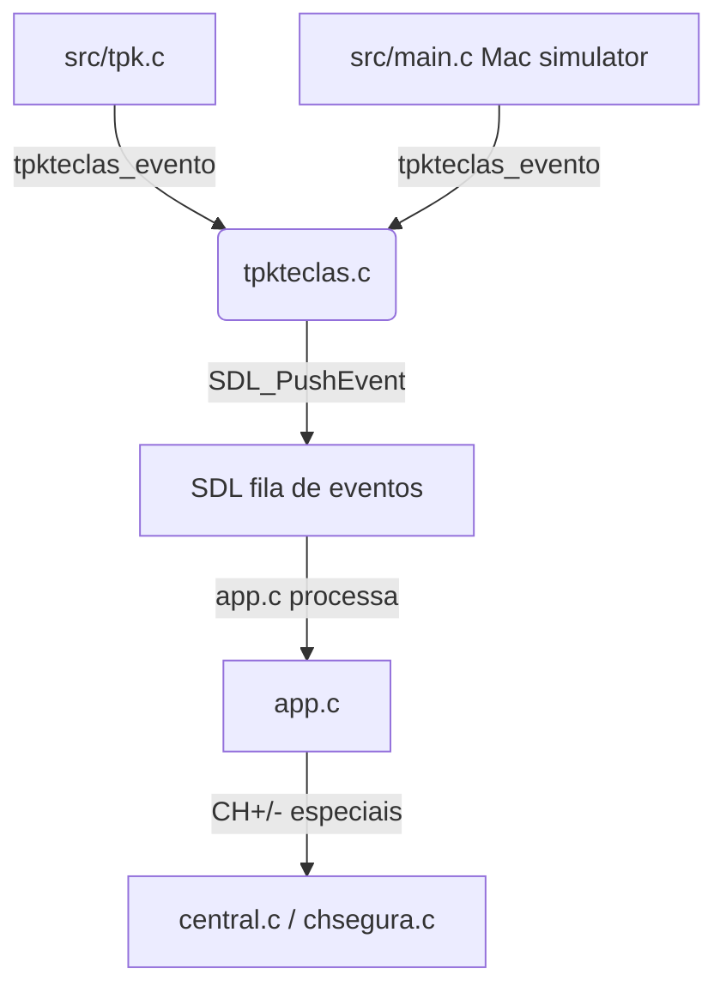
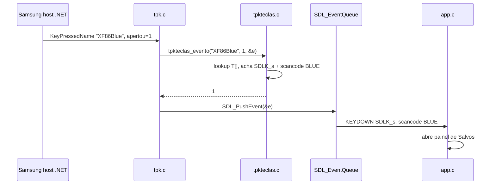

# `src/tpkteclas.c` — Tradução de teclas Samsung para SDL

## Para que serve

Converte o nome textual das teclas do controle Samsung (vindo do host .NET no
pacote .tpk, ou do simulador Mac lendo `/tmp/nuvio-key`) em eventos SDL2
(KEYDOWN/KEYUP). Garante que o .tpk e o simulador Mac usem a MESMA tabela,
para evitar que a tecla Azul/CH+/Guia/Spotlight se comportem diferente no
desenvolvimento e na TV.

Roda no Samsung .tpk (`NV_TPK`) e no Mac simulator. O arquivo não tem
`#ifdef`; ele é compilado em ambos. A diferença é quem chama:
- `src/tpk.c:340` (host .NET na TV) chama `tpkteclas_evento` e faz
`SDL_PushEvent`.
- `src/main.c:466,473` (Mac simulator, lê `/tmp/nuvio-key`) chama
`tpkteclas_evento` e entrega o evento.

## Funções públicas (`src/tpkteclas.h`)

| Assinatura | O que faz | Fio | Pré-condições | Travas | Efeitos colaterais |
|---|---|---|---|---|---|
| `int tpkteclas_evento(const char *nome, int apertou, SDL_Event *e)` | Converte nome da tecla Samsung em `SDL_Event` KEYDOWN/KEYUP. Devolve 1 se mapeou, 0 se não. | principal (tpk.c/main.c) | `nome` e `e` não NULL | nenhuma | preenche `e->type`, `e->key.state`, `e->key.keysym.sym`, `e->key.keysym.scancode`; loga "[tecla] tpk sem mapa" se não achou (`src/tpkteclas.c:7-59`) |

## Estado global (static)

Não há estado global. A tabela `T[]` é `static const` dentro da função
(`src/tpkteclas.c:16-40`).

## Mapeamentos importantes

| Nome Samsung | SDL | Observação |
|---|---|---|
| `Up/Down/Left/Right` | setas SDLK | padrão |
| `Return/KP_Enter/Select` | SDLK_RETURN | OK |
| `XF86Back/Escape/BackSpace` | SDLK_AC_BACK | Voltar |
| `XF86PlayBack/XF86AudioPlay/Pause/PlayPause` | SDLK_PAUSE | play/pause alterna no player |
| `XF86AudioStop` | SDLK_AC_BACK | Stop vira Voltar |
| `XF86AudioRewind/Forward/Next/Prev/NextChapter/PreviousChapter` | setas | seek |
| `XF86RaiseChannel/LowerChannel` | SDLK_F7/F8 | CH+/-; `main.c` depois os vira em CH+/- de verdade com canal na tela |
| `XF86Blue` | SDLK_s (scancode `NV_SCANCODE_BLUE`) | Salvos |
| `XF86Red/Green` | SDLK_F9 | painel de log |
| `XF86ChannelGuide/ChannelList` | SDLK_F10 | Guia de TV do app |
| `XF86BTVoice/XF86Search` | SDLK_F6 | Spotlight/voz |
| `XF86Yellow` | SDLK_F5 | abre Spotlight sem voz |
| dígitos `0`..`9` | próprio ASCII | canal direto |

A AZUL é mapeada para o scancode `NV_SCANCODE_BLUE`, não só a letra "s"
(`src/tpkteclas.c:58`), para o app reconhecer como botão de cor real.

## Grafo de chamadas

Arestas de callback/ponteiro: nenhuma.

## Fluxo principal

## IMPACTOS

- **Se você adicionar/remover um nome na tabela `T[]`**, confira:
  - `tools/tizen-shell.html` (Samsung .wgt) usa a mesma conversão manualmente;
  - `src/main.c` (simulador Mac) injeta os mesmos nomes via `/tmp/nuvio-key`;
  - `src/tpk.c` (host .NET) já usa esta função.
- **Se você mudar `XF86Blue`**, a AZUL do controle e a AZUL do app devem
continuar iguais. O scancode `NV_SCANCODE_BLUE` é o contrato (`src/tpkteclas.c:58`).
- **Se você mudar CH+ (`XF86RaiseChannel`)**, confira `main.c`: ele converte
F7/F8 em CH+/- de verdade com canal na tela ou em Salvos/Spotlight fora disso
(`src/tpkteclas.c:25-28`).
- **Se você mudar Guia (`XF86ChannelGuide`)**, confira que o botão Guia do
controle Samsung abre o Guia do APP (F10), não o da TV (`src/tpkteclas.c:33`).
- **Se você mudar os nomes de Stop/Rewind/Forward**, confira player.c: as
setas fazem seek, Pause alterna play/pause, Stop vira Voltar.
- **Limites de buffer**: nenhum; só lê strings de entrada e compara com tabela.
- **Testes**: não há teste unitário dedicado a `tpkteclas.c`. O comportamento é
coberto indiretamente por:
  - `tests/tpk-roi.sh` (se ainda existir; SUSPEITA: não verificado o conteúdo);
  - testes de integração com .tpk real.
- **O que NÃO tem teste**: mapeamento de cada nome da tabela em todos os
controles Samsung (Q80A, D1, etc.); nomes não listados caem no log e retornam 0.

## Regressões já acontecidas

- Commit `0b85e71d` "samsung: one key table for the .tpk and the Mac simulator;
Guide button opens the app's TV Guide" — unificou a tabela em `tpkteclas.c` e
arrumou CH+/Guia/Azul/Vermelha. O comentário no início do arquivo
(`src/tpkteclas.c:7-14`) cita que a Azul/CH+ digitando "s" passou dois consertos
sem ninguém ver em 05/10/2026.
- Não encontrado no `docs/issues/mapa.json` uma issue ligada exclusivamente a
`tpkteclas.c`.
