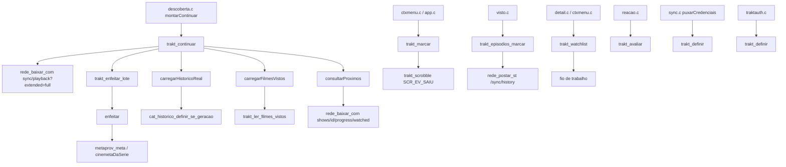
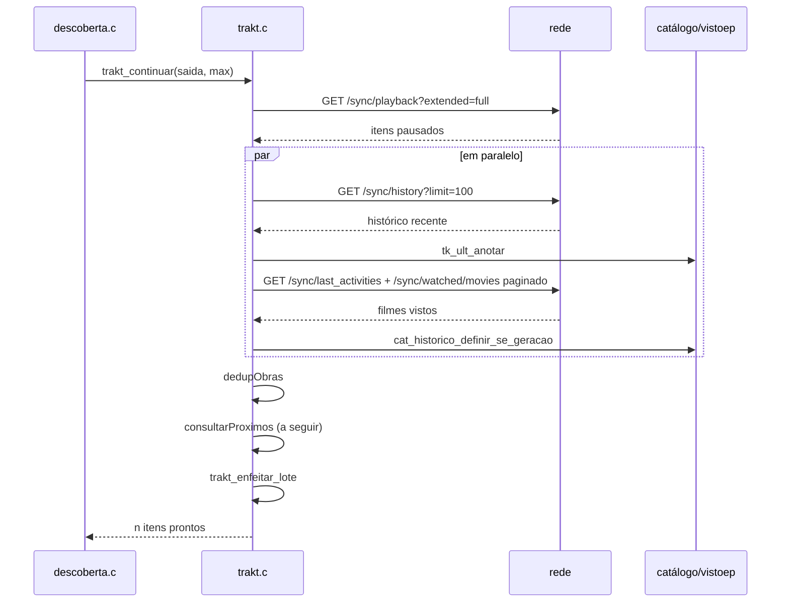

# trakt.c — Integração com Trakt.tv

## Para que serve

Fornece ao app a fileira "Continuar assistindo", a watchlist, a coleção, o histórico de filmes vistos, o feed social de amigos, estatísticas do perfil e a escrita de progresso/scrobble/avaliação/marcação de episódios no Trakt.tv. Roda em todas as plataformas (webOS, Android, Tizen .tpk/.wgt); não há `#ifdef` de plataforma.

## Funções públicas

| Assinatura | O que faz | Fio | Pré-condições | Travas | Efeitos colaterais |
|---|---|---|---|---|---|
| `int trakt_carregar(const char *dirArte)` | Lê `art/trakt.txt` (token TAB clientId). | Principal | Arranque. | `travaCred` | Preenche `token`/`cliente`; `trakt.c:260-289`. |
| `int trakt_cabecalhos(...)` | Monta cabeçalhos autenticados (4 posições). | Qualquer | Credencial carregada e sessão não morta. | `travaCred` | Escreve em buffers do chamador. |
| `int trakt_cabecalhos_publicos(...)` | Monta cabeçalhos só com chave do aplicativo (3 posições). | Qualquer | Há client id compilado ou do vinculo. | nenhuma | `trakt.c:252-258`. |
| `int trakt_ativo(void)` | 1 quando há credencial. | Qualquer | — | `travaCred` | — |
| `unsigned long long trakt_credencial_geracao(void)` | Geração atual da credencial. | Qualquer | — | `travaCred` | — |
| `int trakt_historico_aplicar(...)` | Aplica visto no catálogo se geração ainda for atual. | Fio de trabalho | Chamado pelo fio que processa resposta. | `travaCred` + `cat_historico_definir_se_geracao` | Altera mapa de vistos do catálogo. |
| `int trakt_recusada(void)` | 1 quando última resposta foi 401. | Qualquer | — | atomics (`credRecusada`) | — |
| `void trakt_sessao_morta(void)` | Marca sessão como morta (refresh falhou). | Principal/rede | — | `travaCred` | — |
| `int trakt_sessao_e_morta(void)` | 1 quando sessão morta. | Qualquer | — | nenhuma | — |
| `int trakt_definir(const char *token, const char *clientId)` | Define credencial vinda da conta. | Principal | — | `travaCred` | Reseta `sessaoMorta`, regeneração, chama `rede_avisar_401`; `trakt.c:208-229`. |
| `int trakt_credencial_igual(...)` | 1 se token/client id são os mesmos. | Principal | — | `travaCred` | — |
| `void trakt_esquecer(void)` | Limpa credencial e caches. | Principal | Logout. | `travaCred`, `playTrava` | Zera `ult[]`, `play[]`, `proxMem`, `tentadas`, etc. |
| `int trakt_enfeitar_lote(CatItem*, int)` | Completa arte/sinopse/nota/duração; compacta inválidos. | Fio de descoberta (bloqueia) | Vetor preenchido com imdb/tipo/progresso. | `tentadasTrava`, `fichaTrava` | Altera os `CatItem` passados. |
| `int trakt_continuar(CatItem*, int)` | Preenche "Continuar assistindo" do Trakt. | Fio de descoberta (bloqueia) | Credencial ativa. | `playTrava`, `proxTrava`, `proxMemTrava`, `travaCred` | Preenche `saida`, `play[]`, `ult[]`, `proxIds[]`. |
| `int trakt_playback_remover(const char *imdb)` | DELETE `/sync/playback/<id>` por todos os ids da chave. | Fio de menu (tirar remoto) | — | `playTrava` para leitura dos ids | Chama `rede_apagar`. |
| `int trakt_episodios_marcar(...)` | POST/DELETE `/sync/history` em lote. | Fio de trabalho | — | nenhuma | Chama `rede_postar_st`. |
| `int trakt_e_a_seguir(const char *id)` | 1 se id é um item "a seguir" da última leitura. | Principal | — | nenhuma (dados imutáveis após leitura) | — |
| `int trakt_continuar_falhou(void)` | 1 se última `trakt_continuar` não teve resposta. | Principal | — | `continuarFalhou` (volatile) | — |
| `int trakt_progresso_ocultar(const char *imdb, int ocultar)` | Oculta/reexibe série no progresso do Trakt. | Fio de trabalho | — | nenhuma | POST `/users/hidden/progress_watched`. |
| `int trakt_social(CatItem*, int)` | Feed de atividade dos amigos/seguidos. | Fio de descoberta (bloqueia) | Credencial ativa. | `travaCred` | Preenche `saida`. |
| `int trakt_perfil(PerfilDados*)` | Estatísticas mensais do perfil. | Fio de trabalho | Credencial ativa. | `travaCred` | Preenche `saida`. |
| `void trakt_marcar(const char *imdb, double posSeg, double durSeg)` | Envia scrobble pause ao Trakt (não bloqueia). | Principal | — | nenhuma | Chama `trakt_scrobble(SCR_EV_SAIU, ...)`, que envia num fio próprio. |
| `int trakt_scrobble(int evento, ...)` | Scrobble start/pause/stop. | Principal | — | nenhuma | `traktscrobble.h` função de fio. |
| `int trakt_lista(...)` / `trakt_lista_cresc(...)` | Watchlist/coleção. | Fio de descoberta (bloqueia) | — | `travaLista` | Pagina até `TRAKT_LISTA_MAX` 400 itens. |
| `void trakt_watchlist(const char *imdb, int adicionar)` | Adiciona/tira da watchlist num fio. | Principal | — | `travaLista` | Estado `listaEstado`. |
| `void trakt_assistido(const char *imdb, int marcar)` | Marca/desmarca título como assistido no histórico. | Principal | — | `travaHistorico` | `historicoEstado`. |
| `int trakt_ler_filmes_vistos(const char *corpo)` | Lê `/sync/watched/movies` e marca vistos no catálogo. | Fio de descoberta | — | `travaCred` | Altera mapa de vistos. |
| `int trakt_avaliar(...)` | Nota 1-10 em `/sync/ratings`. | Principal | — | nenhuma | Chama `reacao.c`? Não; envia ao Trakt. |

## Estado global

| Variável | Tipo | Quem escreve | Quem lê |
|---|---|---|---|
| `token[128]`, `cliente[80]` | `static char[]` | `trakt_definir`, `trakt_carregar` | todas as funções de rede |
| `ligado`, `sessaoMorta` | `static int` | `trakt_definir`, `trakt_esquecer`, `trakt_sessao_morta` | `trakt_ativo`, cabeçalhos |
| `credGeracao` | `static unsigned long long` | `trakt_definir`, `trakt_esquecer` | `trakt_credencial_geracao`, `historicoPedidoAtual` |
| `credRecusada` | `static volatile int` | `avisoHttp401` | `trakt_recusada` |
| `play[]`, `nPlay` | `static struct[]` | `trakt_continuar` | `trakt_playback_remover` |
| `ult[]`, `nUlt` | `static TkUltimo[]` | `carregarHistoricoReal` | `consultarProximos`, `trakt_continuar` |
| `proxIds[][]`, `nProxIds` | `static char[][]` | `trakt_continuar` | `trakt_e_a_seguir` |
| `filmesAtiv[40]`, `filmesAtivMapa` | `static` | `carregarFilmesVistos` | ele mesmo (cache de atividade) |
| `tentadas[]`, `fichas[]` | caches | `enfeitar` | `enfeitar` |
| `listaEstado`, `historicoEstado` | `static volatile int` | `trakt_watchlist`, `trakt_assistido` e fios | UI que espelha estado |

## Grafo de chamadas (flowchart)

Arestas por callback: `rede_avisar_401(avisoHttp401)` registrado em `trakt_definir` e `trakt_carregar` (`trakt.c:225`, `287`).

## Fluxo principal (sequenceDiagram)

## IMPACTOS

- **Se mexer em `trakt_continuar`**: mantém ordem "mais recente primeiro" por `retomadoMs` (`trakt.c:1575-1580`); `max` limita itens e "a seguir" pode substituir o mais antigo.
- **Se mexer em `dedupObras`**: pausas múltiplas da mesma obra são unificadas e todos os ids de playback são migrados para a chave que ficou (`trakt.c:1355-1378`).
- **Se mexer em `trakt_playback_remover`**: apaga TODOS os registros de playback da chave (`trakt.c:872-907`); esquece id só se o servidor aceitou.
- **Se mexer em `enfeitar`**: falha de Cinemeta NÃO apaga item que já tem poster do metahub (`trakt.c:651`, `736`); "a seguir" só entra se episódio existir (`trakt.c:589-600`).
- **Se mexer em caches (`tentadas`, `fichas`, `proxMem`)**: TTL e tamanhos fixos (`TK_FICHA_TTL_S 900`, `TK_FICHA_MAX 24`, `TK_FICHA_BYTES 256KB`, `TK_PROX_MEM 64`). Aumentar `sizeof(CatItem)` quebra cache em disco — por isso `play[]`/`ult[]` são tabelas laterais.
- **Se mexer em `trakt_definir`**: vinculo feito nesta TV ganha do que a conta manda (`sync.c:1815-1833`); `trakt_definir` reseta `credRecusada` e `sessaoMorta`.
- **Contratos com Kotlin/.NET/JS**: não há neste módulo.
- **Testes**: `tests/vistoep_corrida.sh` (marcação/desmarcação), `tests/trakt_ep_cinemeta.sh`. Não há teste para `trakt_perfil`, `trakt_social`, `trakt_scrobble`, nem para limites de paginação.

## Regressões já acontecidas

- **#22** — Remover de "Continuar assistindo" não funcionava: guarda do id do registro de playback e `trakt_playback_remover` (commits `8e7f4098`, `545dd122`).
- **#127** — Ordenação de "Continuar assistindo" passou a valer (commit `563ccc81`).
- **#151** — Trakt sem resposta não esvazia fileira: `continuarFalhou` (commit `b274752b`).
- **#179** — Scrobble start/pause/stop de verdade (commits `3ae82b79`, `83032b2a`).
- **#199** — "a seguir" dos vistos da conta Nuvio (commit `149f1235`).
- **#203** — Up-next pode ser removido e fica oculto por perfil (commit `b8d110de`).
- **#212** — Mapa completo de filmes vistos do Trakt (commits `5f5174ad`, `7a5896fa`).
- **#213** — "a seguir" respeita `next_episode` do Trakt e deduplica playback (commits `28064cae`, `a29e123d`).
- **#243** — Nota real do IMDb em vez de "14" (commits `ccfe01a8`, `8e7f4098`).
- **#244** — Um card por obra; remove todos os registros de playback (commit `8e7f4098`).
- **#356** — Up-next não sumia quando ficha Nuvio não lista episódio (commit `d47a78c8`).
