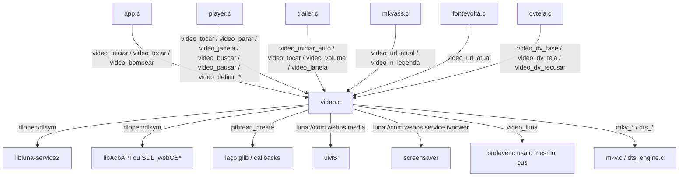
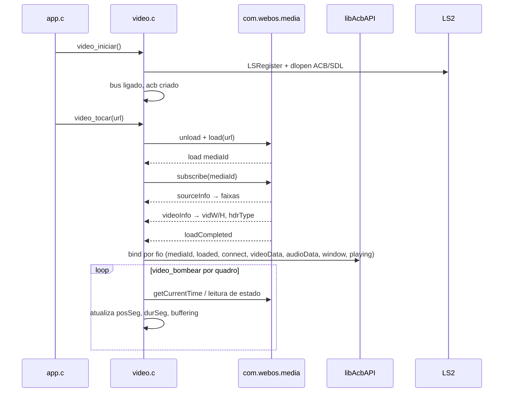

# `src/video.c` — pipeline de vídeo webOS (LG)

## Para que serve

Camada de pipeline de vídeo para **LG webOS**. Abstrai o serviço `com.webos.media` (uMS) via LS2 e a libAcbAPI (webOS 4) ou janela exportada da SDL (webOS 5+). Em outras plataformas o arquivo vira stub (Mac/Linux desktop) e as funções reais vivem em `video_android.c`, `video_tpk.c` ou `video_tizen.c`. O módulo não desenha: posiciona um plano de hardware atrás da superfície GL e abre um furo transparente (`gfx_furo`) para que o vídeo apareça.

## Plataformas

- Compilado em todo alvo, mas o **corpo real** (`#ifndef __EMSCRIPTEN__` + `!NV_TPK && !NV_ANDROID`) só é ativo na **webOS**.
- Mac/Linux: stub a partir de `video.c:259`.
- Samsung .tpk: `video_tpk.c` fornece as implementações.
- Samsung .wgt (Tizen): `video_tizen.c`.
- Android: `video_android.c`.

## Funções públicas (`src/video.h`)

| Assinatura | O que faz | Fio / pré-condições | Efeitos colaterais |
|---|---|---|---|
| `int video_iniciar(void)` | Registra o app no barramento LS2, sobe laço de eventos, carrega libAcbAPI/SDL exportada. | principal no início do app; `main.c` | Escreve `ligado`, `bus`, `acb`, `expWin`, etc. (`video.c:1641`–`1730`). |
| `int video_iniciar_auto(void)` | Mesmo, mas desiste após poucas recusas (para trailer). | `trailer.c:294` | Usa `lsreg_pode_tentar` (`video.c:1644`). |
| `int video_registro_negado(void)` | LS2 negou registro por PERMISSION nesta sessão. | leitura | Lê `regNegado` (`video.c:1639`). |
| `int video_tocar(const char *url)` | Inicia o load no uMS: `unload`, `load`, `subscribe`, `selectTrack`, `play`. | principal | Incrementa `sessao`, limpa `midia`, dispara `aoCarregar` (`video.c:1700`–`1750` aprox.). |
| `int video_tocar_posicao(...)` / `video_tocar_retomada(...)` | **Android apenas** (`video.h:37`–`47`); stub no webOS. | — | — |
| `void video_bombear(void)` | Chamado uma vez por quadro. Trata reconexão, recovery de pipeline morto, seek pendente, bind do ACB, sonda MKV. | principal (`app.c`) | Pode chamar `video_tocar` internamente para recarregar; lê/escreve `recuperando`, `recon*`, `bindPendente`, etc. (`video.c:1830`–`2100` aprox.). |
| `void video_parar(void)` | Para e descarrega o pipeline atual. | principal | Envia `unload`, limpa `midia`, reseta estado (`video.c:1760`–`1800` aprox.). |
| `void video_pausar(int pausado)` | Envia `pause`/`play` ao uMS. | principal | Seta `pausaPedida` (`video.c:2250` aprox.). |
| `void video_buscar(double segundos)` | Seek absoluto. Enfileirado e reaplicado por `video_bombear` se necessário. | principal | Escreve `seekAlvo`, `seekEm` (`video.c:2200` aprox.). |
| `void video_janela(int x, int y, int w, int h)` | Destino do plano de vídeo (coordenadas 1920x1080). | principal | Guarda `janX/Y/W/H`; só aplica no bind ACB ou no primeiro `playing` (`video.c:2150` aprox.). |
| `void video_janela_fonte(int sx, sy, sw, sh, int dx, dy, dw, dh)` | Recorte da fonte + destino. Zoom do player. | principal (`player.c`) | Guarda `fonX/Y/W/H`, `dstX/Y/W/H`; reaplica no bind ou no `playing` (`video.c:2150`). |
| `int video_recorte_fonte(void)` | webOS sempre retorna 1 (suporta recorte via ACB/SDL exportada). | leitura | `1` no ramo real, `1` no stub Mac (`video.c:358`). |
| `void video_recorte_reaplicar(void)` | Reenvia último recorte sem dedup. | principal (`trailer.c`) | Chama `acbJanelaCustom` ou `sdlExpRecorte` (`video.c:907`–`922`). |
| `void video_escala_definir(int sw, int sh)` | Tamanho do drawable para escalar destino. | `main.c` / `app.c` | Escreve `escW`/`escH` (`video.c:517`). |
| `const char *video_url_atual(void)` | URL da fonte em reprodução. | leitura (`mkvass.c`, `fontevolta.c`) | Lê `urlAtual[4096]` (`video.c:200`). |
| `double video_pos(void)` | Posição em segundos (currentTime/1000). | leitura | Lê `posSeg` escrito pelo callback LS2 (`video.c:1379`). |
| `double video_duracao(void)` | Duração total em segundos. | leitura | Lê `durSeg` (`video.c:1396`). |
| `double video_creditos(void)` | Início dos créditos pelo capítulo final do Matroska. | leitura | Lê resultado da sonda MKV (`mkv.h`). |
| `double video_buffer_fim(void)` | Até onde o buffer cobre (segundos). | leitura | Lê `bufferSeg` (`video.c:1241`). |
| `unsigned video_bufferando_ms(void)` | Tempo desde `bufferingStart` sem `bufferingEnd`. | leitura (`app.c`) | Lê `bufferandoDesde` (`video.c:1255`). |
| `void video_definir_dv(int dv)` | Fonte escolhida afirma Dolby Vision. | principal, **antes** de `video_tocar` | Escreve `dvPedido` (`video.c:564`). |
| `void video_definir_cabecalhos(const char *cabs)` | Cabeçalhos HTTP para o uMS (proxyHeaders). | principal, antes de tocar | Copia para `cabsHttp[512]` (`video.c:590`). |
| `void video_definir_mp4(int ehMp4)` | Evita sonda MKV em MP4. | principal, antes de tocar | Escreve `fonteMp4` (`video.c:229`). |
| `void video_definir_reconexao(int sim)` | Habilita reconexão automática na próxima abertura. | principal (`player.c`) | Escreve `reconProxima` (`video.c:599`). |
| `void video_definir_modo_live(int modo)` | Modo de live para canais (#158). | principal | Escreve `modoLoad` (`video.c:1502`). |
| `int video_modo_live_consumir(void)` | Consome e zera `modoLoad`. | principal | Lido no `load` (`video.c:1503`). |
| `int video_reconectando(void)` | Número da tentativa de reconexão em curso. | leitura (`player.c`) | Lê `reconProxima`/`reconIniciou` (`video.c:157`). |
| `int video_tocando(void)` | Pipeline reportou `playing`. | leitura | Lê `tocando` (`video.c:1267`). |
| `int video_pausa_confirmada(void)` | Pausa foi confirmada pelo backend. | leitura | Lê `pausaConfirmada` (`video.c:1296`). |
| `int video_pronto(void)` | `loadCompleted` chegou. | leitura (`player.c`) | Lê `pronto` (`video.c:1223`). |
| `int video_ativo(void)` | Existe `mediaId` (load aceito). | leitura | Lê `ligado && midia[0]` (`video.c:1509` aprox.). |
| `int video_falhou(void)` | Erro real não-recuperável na fonte atual. | leitura | Lê `falhou` (`video.c:1375`). |
| `const char *video_erro_texto(void)` | Último erro do pipeline. | leitura | Lê `erroTexto[96]` (`video.c:1318`). |
| `int video_decoder_anunciou(void)` | `videoInfo` chegou. | leitura | Lê `viuVideo` (`video.c:1145`). |
| `int video_dts_legenda_desenhar(...)` | Desenha legenda do caminho DTS convertido. | desenho (`player.c`) | Chama `dts_overlay_draw` (`video.c:114`). |
| `int video_dv_ativo(void)` / `video_dv_recuo_consumir(void)` / `video_dv_fase(...)` / `video_dv_candidato(...)` / `video_dv_tela(...)` / `video_dv_recusar(...)` / `video_dv_segurar(...)` | Máquina de Dolby Vision em MKV. | principal/desenho | Manipulam estáticos `dv*`, `dtsSessao`, `dtsModoDv`, etc. (`video.c:39`–`90`, `dvtela.c`). |
| `int video_iniciando(void)` | Caminho próprio DV/DTS carregou mas ainda não tocou. | leitura | Lê estado do demux (`video.c:233`). |
| `int video_fonte_tocou(void)` | Fonte atual já tocou nesta sessão webOS. | leitura | Lê `fonteTocou` (`video.c:88`). |
| `const char *video_dts_saida(void)` | Arquivo de saída da conversão DTS. | leitura | Lê `dtsSaida[64]` (`video.c:92`). |
| `int video_audio_nao_suportado(void)` | uMS erroCode 200 (áudio sem suporte). | leitura | Lê `audioNaoSup` (`video.c:1343`). |
| `int video_seek_desistiu(void)` | Seek recusado 3x; segue de onde está. | leitura | Lê `seekRetry` (`video.c:1356`–`1369`). |
| `int video_terminou(void)` | `endOfStream` chegou. | leitura | Lê `terminou` (`video.c:1298`). |
| `int video_conflito_recurso(void)` | Outro app tomou o vídeo (.tpk sabe disso). | leitura | Sempre 0 no webOS (`video.c:321`). |
| `int video_n_audio(void)` / `video_n_legenda(void)` / `video_audio(i)` / `video_legenda(i)` | Lista de faixas do `sourceInfo`. | leitura | Lê `faixaAudio[]`, `faixaLeg[]`, `nAudio`, `nLeg` (`video.c:559`–`560`). |
| `int video_mkv_sondado(void)` / `void video_sondar_mkv_agora(void)` | Estado da sonda do cabeçalho Matroska. | rede/principal | Dispara fio `lerMkv` (`video.c:252`–`253`, `mkvPendente`). |
| `int video_audio_atual(void)` / `video_legenda_atual(void)` | Faixas selecionadas. | leitura | Lê `audioAtual`, `legAtual` (`video.c:560`). |
| `int video_faixa_dts(const VideoFaixa *f)` | Detecta DTS/DTS-HD/DTS:X por texto. | leitura | Código puro (`video.c:94`–`105`). |
| `int video_dts_estado(void)` | Estado do áudio DTS (nativo/convertido/falhou). | leitura (`player.c`) | Decide entre `dtsEstado` e `video_faixa_dts` (`video.c:109`–`113`). |
| `void video_escolher_audio(int i)` / `video_escolher_legenda(int i)` | Envia `selectTrack` ao uMS. | principal (`player.c`, `faixas.c`) | Escreve `audioAtual`/`legAtual`; reaplica legenda externa URL (`video.c:2300` aprox.). |
| `int video_legenda_nativa(char *dst, int tam)` | **Não usado no webOS** (uMS desenha legenda). Stub. | — | — |
| `void video_legenda_externa(const char *url)` | URL de legenda do OpenSubtitles/addon. | principal | Guarda `legUrlAtual[1024]`, envia `setSubtitleSource` (`video.c:2400` aprox.). |
| `void video_legenda_estilo(const VideoLegendaEstilo *e)` | Aplica estilo de legenda no uMS. | principal (`player.c`) | Envia `setSubtitlePosition`/etc. (`video.c:2500` aprox.). |
| `int video_tem_atmos(void)` / `video_tem_dolby_vision(void)` / `video_hdr(void)` | Selos de áudio/HDR. | leitura | Lê `vidAtmos`, `vidHdr`, `vidDV` (`video.c:1170`–`1180`). |
| `int video_largura(void)` / `video_altura(void)` | Dimensões do quadro decodificado. | leitura | Lê `vidW`, `vidH` (`video.c:1147`–`1148`). |
| `void video_forcar_sdr(void)` / `int video_pode_forcar_sdr(void)` | Recuperação "tela preta" desligando HDR/DV. | principal | No webOS seta `semDVForcado` e recarrega (`video.c:2550` aprox.). |
| `void video_velocidade(int centesimos)` | Playback speed (uMS `setPlayRate`). | principal | Escreve `velPedida` (`video.c:2700` aprox.). |

## Estado global (`static` em `video.c`)

| Grupo | Variáveis | Quem escreve | Quem lê |
|---|---|---|---|
| **Pipeline LS2** | `bus`, `laco`, `fio`, `ligado`, `regNegado`, `regEstado` | `video_iniciar` | todos os `lsChamar`, `video_bombear` |
| **ACB / SDL exportada** | `acb`, `expWin[64]`, `acbTipoAtual`, `tipoJogador`, `tipoSink` | `video_iniciar`, `acbConfigurarTipo`, `prenderPlano` | `video_janela*`, bind |
| **Sessão** | `sessao`, `midia[64]`, `urlAtual[4096]` | `video_tocar`, callbacks LS2 | validação de callback (`minhaSessao != sessao`) |
| **Janela** | `janX/Y/W/H`, `escW/H`, `fonX/Y/W/H`, `dstX/Y/W/H` | `video_janela`, `video_janela_fonte`, `escDst` | bind ACB, `recorteNoPrimeiroQuadro` |
| **Vídeo info** | `vidW/H`, `vidTaxa`, `vidBits`, `vidHdr[24]`, `vidAtmos`, `vidDV`, `vuiPrim/Trans/Matriz`, `sei*` | callback `videoInfo` (`eventoPayload`) | `video_largura`, `video_altura`, `video_hdr` |
| **Faixas** | `faixaAudio[NV_FAIXA_MAX]`, `faixaLeg[]`, `nAudio`, `nLeg`, `audioAtual`, `legAtual` | callback `sourceInfo`, `video_escolher_*` | `player.c`, `faixas.c` |
| **Posição/duração** | `posSeg`, `durSeg`, `bufferSeg` | callbacks `currentTime`, `duration`, `bufferRange` | `video_pos`, `video_duracao`, `video_buffer_fim` |
| **Estado playback** | `tocando`, `pronto`, `falhou`, `terminou`, `pausaPedida`, `pausaConfirmada`, `audioNaoSup` | callbacks LS2 + `video_pausar` | getters |
| **Seek/recovery** | `seekAlvo`, `seekEm`, `seekRetryEm`, `recuperando`, `retomarEm`, `audioAoCarregar`, `legAoCarregar`, `legUrlAoCarregar[1024]` | `video_buscar`, `eventoPayload` (erro), `video_bombear` | recarregamento automático |
| **Reconexão** | `reconProxima`, `reconPermitida`, `reconIniciou`, `reconErroPend`, `reconErroRede`, `reconAudio/Leg`, `reconLegUrl[1024]` | `video_definir_reconexao`, callback erro, `video_bombear` | `video_reconectando`, decisão de recarregar |
| **MKV/legendas** | `mkvPendente`, `fonteMp4`, `mkvRetry*`, `fioMkv`, `mkvFioSessao`, `legUrlAtual[1024]`, `cabsHttp[512]` | `video_definir_*`, `video_bombear`, callback `sourceInfo`, fio `lerMkv` | sonda, faixas, capítulos |
| **Velocidade** | `velPedida`, `velEnviada`, `velRecusada` | `video_velocidade`, `video_bombear`, callback | `player_velocidade_efetiva` |
| **Dolby Vision / DTS** | `dv*`, `dtsSessao`, `dtsModoDv`, `dvAudio*`, `dvMem*`, `fonteTocou`, `semDVForcado` | `video_definir_dv`, `video_tocar`, callbacks, fio DTS | `video_dv_*`, `video_dts_*`, `dvtela.c` |

**Travas:** não há mutexes neste arquivo. Os callbacks do LS2 rodam no fio do laço glib; `video_bombear` (fio principal) consome o estado. O código aceita leituras levemente desatualizadas de `posSeg`, `bufferSeg`, `bufferandoDesde` por um quadro — intencional.

## Grafo de chamadas (webOS real)



## Fluxo principal: abertura webOS



## Fluxo: erro → recuperação / reconexão

```mermaid
sequenceDiagram
    participant UMS as uMS
    participant V as video.c
    participant App as app.c
    UMS-->>V: errorText != "No Error"
    alt errorCode 200
        V->>V: audioNaoSup = 1
    else "is not running"
        V->>V: recuperando = 1; retomarEm = posSeg
    else erro de rede
        V->>V: reconErroPend = 1
    end
    App->>V: video_bombear()
    alt recuperando
        V->>V: video_tocar(urlAtual)
        UMS-->>V: loadCompleted
        V->>V: reaplica audio/legenda/posição
    else reconexão
        V->>V: aguarda teto, recarrega mesma URL
    end
```

## IMPACTOS

| Se mexer em... | Conferir em... | Motivo |
|---|---|---|
| `video_iniciar` / dlopen / registro LS2 | `lsregistro.c`, `main.c` | Recusa de LS2 por PERMISSION gera `video_registro_negado()` e o player mostra mensagem específica em vez de "fonte falhou" (`video.c:1655`–`1670`, issue dos registros 1720–1774). |
| `video_tocar` / `aoCarregar` | `video_bombear`, bind ACB | Ordem do load: `unload` → `load` → `subscribe` → `selectTrack` → `play`. O `selectTrack` de vídeo é opcional no modo live (`modoLoad`) — removê-lo resolveu canais que nunca anunciavam decoder (#158, `video.c:1538`). |
| `video_janela` / `video_janela_fonte` | `player.c:aplicarAspecto` | O ACB e a SDL exportada só aplicam janela **depois** do `loadCompleted`/`playing`. Enviar antes é aceito sem efeito. O `fonX >= 0` indica recorte; `dst*` é o destino final (`video.c:882`–`921`). |
| `video_escala_definir` | `main.c` | O destino do plano é escalado de 1920x1080 para o drawable real; a fonte (recorte) NÃO escala (`video.c:518`–`526`, issue #176). |
| `eventoPayload` / parsing JSON | `js.h` | Usa `numeroDe()` para evitar ler `currentTime` do objeto externo — bug anterior deixava a barra em 0:00 (`video.c:653`–`663`). |
| `video_bombear` / reconexão | `video_reconexao.h`, `player.c` | Erro de rede vs erro fatal: `nv_recon_rede_ums` decide. Mudar a classificação afeta o watchdog de canal ao vivo (`video.c:1373`). |
| `video_definir_modo_live` / `modoLoad` | canais ao vivo | Modo 1/2 remove `selectTrack` e/ou enxuga payload. Testar em canal com VDEC lento (#158). |
| `video_legenda_estilo` | `player.c`, `faixas.c` | uMS aceita qualquer `charEdgeType` com `returnValue:true`; confiança só vem de teste visual na TV (`video.h:334`–`338`). |
| Sonda MKV (`lerMkv`) | `mkv.c`, `capmkv.c`, `player.c` | Disparada pelo `sourceInfo` quando há legendas sem idioma OU arquivo é MKV; traz idiomas, codecs e capítulos. MP4 desliga (`video.c:1140`–`1141`). |
| DTS / `video_faixa_dts` / `iniciarDts` | `dts_engine.c`, `dts_tv.c` | Conversão local de DTS para AAC/AC3. Em webOS 26+, converte ANTES do errorCode 200 (`20be462c`). |
| Dolby Vision (`dv*`) | `dvtela.c`, `dts_engine.c` | `video_dv_candidato` decide se entra na tela de DV; `video_dv_segurar` segura troca até seek do ponto salvo. Ordem com seek importa (`player.c:1482`, `video.c:72`–`83`). |
| `video_forcar_sdr` | `player.c` | `semDVForcado` é pegajoso pela sessão: recuperação automática não devolve DV depois de tela preta (`video.c:552`–`555`). |

### Testes

| Teste | Cobertura |
|---|---|
| `tests/mkvass.sh` / `tests/video_url.c` | URL atual e sonda MKV básica. |
| `tests/seekretry.c` | Lógica de seek recusado (`video_seekretry.h`). |
| `tests/tizen-avplay-contract.cjs` | Verifica que `video_bombear()` é chamada uma vez no update do Tizen (não webOS, mas contrato). |
| `tools/teste-avplay.c` | Teste manual de abertura/seek/faixas. |

### Sem teste automatizado

- Bind real do ACB / janela exportada SDL.
- Eventos LS2 reais (`loadCompleted`, `playing`, `errorText`).
- Dolby Vision / HDR10 / SDR na TV.
- Conversão DTS local (`dts_engine.c` tem testes próprios, mas integração com `video.c` não).

## Regressões

| Hash / issue | Descrição | Onde tocou |
|---|---|---|
| `#158` | Canal ao vivo LG C4: dado chega, decoder nunca anuncia. Modo live remove `selectTrack` e payload enxuto. | `video.c:1502`–`1543` |
| `#176` | Plano de vídeo não escala no drawable 4K. Adicionou `video_escala_definir` e `nv_video_escalar`. | `video.c:517`–`526` |
| `#246` | Seek na retomada derrubava fonte. Adicionou `video_seek_desistiu` e `seekRetry` (`nv_seek_recusado`/`nv_seek_ok`). | `video.c:1356`–`1369` |
| `#92` | Legenda ASS: pipeline não dá idioma. Sonda MKV e `mkv_casar_legendas`. | `video.c:1121`–`1141` |
| `#203` | Dolby Vision em MKV. Caminho próprio com demux, tela de cobertura, recuo. | `video.c:39`–`90`, `video.c:842`–`868` |
| `#313` | DTS para AC3/AAC. `video_faixa_dts`, `iniciarDts`, `dtsEstado`. | `video.c:109`–`118`, `video.c:584`–`589` |
| `a8048e0d` | Seek Failure na retomada não derruba mais a fonte (#246). | `video.c:1356` |
| `80c60e1c` | Dolby Vision for MKV through our demux (experimental). | `video.c:47`–`49`, `video.c:842` |
| `bf4f82ea` | Fallback de DV MKV mantém fonte e aviso. | `video.c:845`–`855` |
