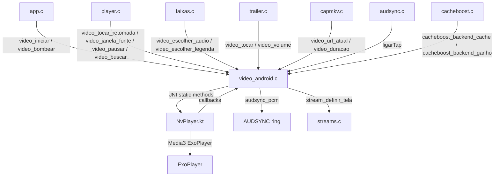
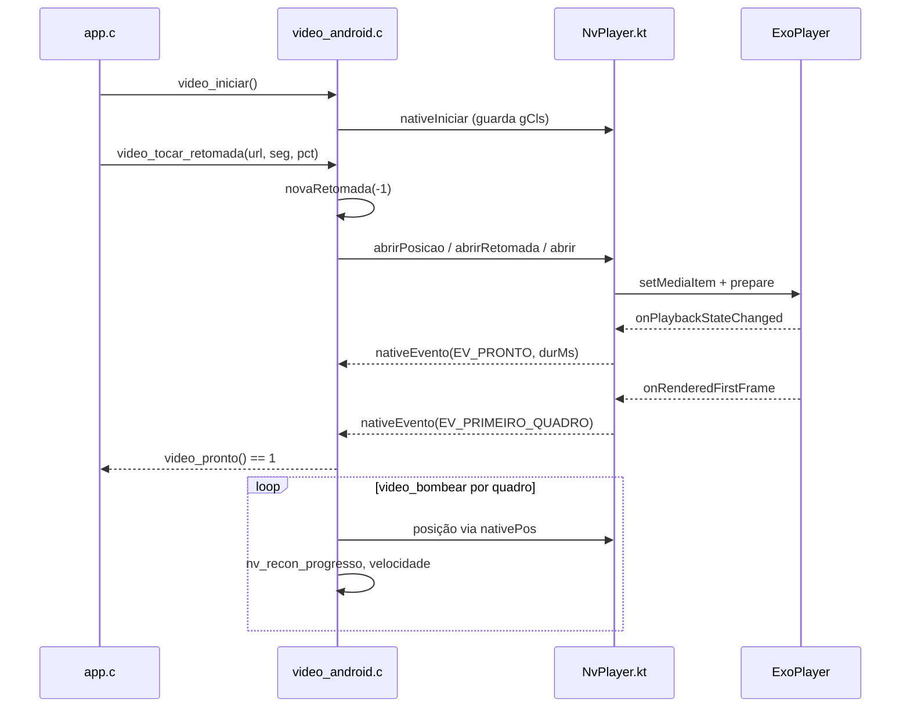

# `src/video_android.c` — pipeline de vídeo Android (Media3 ExoPlayer)

## Para que serve

Implementação da interface `video.h` para **Android TV** (`#ifdef NV_ANDROID`). O C delega toda a reprodução ao objeto Kotlin `NvPlayer` via JNI; o Kotlin usa **Media3 ExoPlayer** numa `SurfaceView` atrás da `SDLSurface` do app. O C mantém apenas o estado que o resto do app lê (posição, faixas, buffering, falhas). O contrato é simétrico ao do `.tpk` da Samsung: o C chama métodos estáticos; o Kotlin avisa o que acontece por `native*` callbacks de qualquer fio.

## Plataforma

- Compilado apenas quando `NV_ANDROID` está definido.
- Mac/Linux/webOS/Tizen usam outras implementações.
- Requer `NvPlayer.kt` no mesmo app e a classe carregável pelo `ClassLoader` da `Activity`.

## Funções públicas (`src/video.h`)

| Assinatura | O que faz | Fio / pré-condições | Efeitos colaterais |
|---|---|---|---|
| `int video_iniciar(void)` | Anexa JNI e resolve métodos da classe `NvPlayer`. | principal (`main.c`) | Cria `travaLeg`; chama `garantirPonte` (`video_android.c:509`–`514`). |
| `int video_iniciar_auto(void)` | Wrapper para `video_iniciar`. | `trailer.c:294` | — |
| `int video_registro_negado(void)` | Sempre 0 no Android. | — | — |
| `int video_tocar(const char *url)` | Abre URL no ExoPlayer do início. | principal (`player.c`) | Chama `video_tocar_posicao(url, 0)` (`video_android.c:612`). |
| `int video_tocar_posicao(const char *url, double segundos)` | Abre com seek em ms (e geração). | principal (`player.c`) | Chama `video_tocar_retomada` com percentual 0 (`video_android.c:602`). |
| `int video_tocar_retomada(const char *url, double segundos, double pct)` | Abre com segundos OU percentual (centésimos de ponto). | principal (`player.c:1454`) | Reseta sessão/reconexão; chama `abrirSessao` (`video_android.c:585`–`601`). |
| `int video_retomada_inicial_estado(void)` | Estado da retomada: 0 pendente, 1 aceito, -1 fallback. | leitura (`player.c`) | Lê com `travaRetomada` (`video_android.c:413`–`419`). |
| `void video_bombear(void)` | Por quadro: reaplica velocidade, progresso de reconexão, seek pós-reconexão, decide erro/reconectar. | principal (`app.c:4519`) | Pode chamar `abrirSessao` e `kInt(mBuscar)` (`video_android.c:619`–`663`). |
| `void video_parar(void)` | Para e limpa sessão. | principal (`player_encerrar`) | Reseta `sessao`, `ativo`, chama `mParar` (`video_android.c:664`–`672`). |
| `void video_pausar(int p)` | Envia pause/play ao Kotlin. | principal | Atualiza `pausaPedida`, zera `pausaVista` (`video_android.c:673`). |
| `void video_volume(int pct)` | Volume do pipeline (0..100). | principal (`trailer.c`) | `kInt(mVolume, pct)` (`video_android.c:679`). |
| `void video_buscar(double s)` | Seek absoluto em segundos. | principal | Converte para ms, atualiza `posMs`, chama `mBuscar` (`video_android.c:680`–`684`). |
| `void video_janela(int x, int y, int w, int h)` | Posiciona a `SurfaceView` no layout (encaixa proporcional). | principal (`player.c`) | `janelaKt(x,y,w,h,1)` (`video_android.c:695`). |
| `void video_janela_fonte(int sx, sy, sw, sh, int dx, dy, dw, dh)` | Recorte de fonte ampliado para layout do Android. | principal (`player.c:aplicarAspecto`) | Calcula retângulo ampliado e origem negativa; `janelaKt(...,0)` (`video_android.c:705`–`728`). |
| `int video_recorte_fonte(void)` | Sempre 1 no Android. | leitura | `1` (`video_android.c:729`). |
| `void video_recorte_reaplicar(void)` | Reenvia último recorte calculado. | principal (`trailer.c`) | `janelaKt(ultX,ultY,ultW,ultH,0)` (`video_android.c:730`). |
| `void video_escala_definir(int sw, int sh)` | No-op; Kotlin escala de 1920x1080 internamente. | principal | — (`video_android.c:732`). |
| `const char *video_url_atual(void)` | URL em reprodução. | leitura | Lê `urlAtual[4096]` (`video_android.c:734`). |
| `double video_pos(void)` / `video_duracao(void)` | Posição/duração em segundos. | leitura | Lê `posMs`/`durMs` (`video_android.c:735`–`736`). |
| `double video_creditos(void)` | Capítulos MKV via `capmkv_creditos`. | leitura | `capmkv_creditos(video_duracao())` (`video_android.c:738`). |
| `double video_buffer_fim(void)` | Sempre 0 (ExoPlayer não expõe). | — | `0` (`video_android.c:739`). |
| `unsigned video_bufferando_ms(void)` | Tempo em buffering (não durante reconexão). | leitura (`app.c`) | Lê `bufferando`/`bufferDesde` (`video_android.c:740`–`744`). |
| `void video_definir_dv(int dv)` | No-op no Android; DV é detectado pelo Format. | principal | — (`video_android.c:745`). |
| `void video_definir_cabecalhos(const char *c)` | Guarda cabeçalhos HTTP. | principal (`player.c`) | Copia para `cabecalhos[2048]` (`video_android.c:746`). |
| `void video_definir_mp4(int m)` | No-op; não há sonda MKV ativa. | principal | — (`video_android.c:747`). |
| `void video_definir_reconexao(int sim)` | Habilita reconexão para a próxima abertura. | principal (`player.c`) | Escreve `reconProxima` (`video_android.c:614`). |
| `int video_reconectando(void)` | Número da tentativa ativa. | leitura | Lê `nv_recon_ativa` (`video_android.c:615`–`617`). |
| `int video_tocando(void)` / `video_pronto(void)` / `video_ativo(void)` / `video_falhou(void)` / `video_terminou(void)` | Estados do playback. | leitura | Lê flags atualizadas por `nativeEvento`. `video_pronto` exige primeiro quadro (EV_PRIMEIRO_QUADRO) ou prazo de 3s (`video_android.c:751`–`757`). |
| `int video_pausa_confirmada(void)` | Pausa pedida e confirmada pelo evento 3. | leitura | `pausaPedida && pausaVista` etc. (`video_android.c:674`–`677`). |
| `int video_superficie_estavel(void)` | Última recriação da Surface terminou. | leitura | Lê `superficieEstavel` (`video_android.c:759`). |
| `int video_audio_nao_suportado(void)` | Nenhuma faixa de áudio com decoder no aparelho. | leitura | Lê `semDecoderAudio` (`video_android.c:761`). |
| `int video_seek_desistiu(void)` | Sempre 0 no Android. | — | `0` (`video_android.c:762`). |
| `int video_conflito_recurso(void)` | Foco de áudio perdido = pausa. | leitura | Lê `conflito` (`video_android.c:765`). |
| `const char *video_erro_texto(void)` | Último erro do player. | leitura | Lê `erroTxt[64]` (`video_android.c:766`). |
| `int video_decoder_anunciou(void)` | Sempre 1 no Android. | — | `1` (`video_android.c:768`). |
| `int video_n_audio(void)` / `video_audio(i)` / `video_n_legenda(void)` / `video_legenda(i)` / `video_audio_atual(void)` / `video_legenda_atual(void)` | Faixas do ExoPlayer. | leitura | Lê arrays escritos por `nativeFaixa`/`nativeFaixasFim`. |
| `int video_mkv_sondado(void)` / `video_sondar_mkv_agora(void)` | Sempre 2 / no-op; libass ainda não entrou. | leitura | `2` (`video_android.c:777`). |
| `int video_legenda_ordinal_mkv(int i)` | Ordinal da faixa de legenda. | leitura | Lê `faixaLeg[i].ordinalMkv` (`video_android.c:774`). |
| `void video_escolher_audio(int i)` / `video_escolher_legenda(int i)` | Envia faixa escolhida ao Kotlin. | principal (`player.c`, `faixas.c`) | `kInt(mEscolher, tipo, numero)`; limpa legenda nativa (`video_android.c:781`–`802`). |
| `int video_legenda_nativa(char *d, int tam)` | Texto do cue embutido entregue pelo Kotlin. | desenho (`player.c`) | Lê `legTexto` sob `travaLeg` (`video_android.c:803`–`811`). |
| `void video_legenda_externa(const char *u)` | No-op; legenda externa é baixada e desenhada em C. | — | — (`video_android.c:812`). |
| `void video_legenda_estilo(const VideoLegendaEstilo *e)` | Envia atraso de legenda ao Kotlin. | principal (`player.c`) | `kInt(mEscolher, 2, atrasoMs)` (`video_android.c:815`–`825`). |
| `int video_tem_atmos(void)` / `video_tem_dolby_vision(void)` / `const char *video_hdr(void)` | Selos do Format. | leitura | Lê `atmosAtual`, `dvAtual`, `hdrAtual` (`video_android.c:826`–`828`). |
| `int video_largura(void)` / `video_altura(void)` | Dimensões do vídeo. | leitura | Lê `largura`/`altura` (`video_android.c:829`–`830`). |
| `void video_velocidade(int c)` | Playback speed (centésimos). | principal (`player.c`) | Escreve `velPedida`; `video_bombear` envia (`video_android.c:833`). |
| `int video_velocidade_suportada(void)` | Método `velocidade` existe e não foi recusado. | leitura | `mVelocidade != NULL && !velRecusada` (`video_android.c:832`). |

## Callbacks JNI (Kotlin → C)

| Função nativa | Kotlin chama quando | Efeito |
|---|---|---|
| `Java_space_nuvio_nativelegacy_NvPlayer_nativeIniciar` | `NvPlayer.iniciar()` | Guarda `gCls` global ref e resolve `jmethodID` (`video_android.c:92`–`97`). |
| `nativeAudioEstado(fmt)` | Formato de entrada do sink (PCM/bitstream). | Liga `audsync_backend` e informa `cacheboost_ganho_relato` (`video_android.c:103`–`119`). |
| `nativeAudioPcm(pcm, n, pts)` | Fio de reprodução; amostras de áudio PCM. | Copia para anel do `audsync.c` (`video_android.c:122`–`129`). |
| `nativeFaixa(tipo, idx, lingua, flags, nome, mime, canais)` | Lista de faixas conhecida. | Preenche `novasA`/`novasL` (`video_android.c:320`–`356`). |
| `nativeFaixasFim(selAudio, selLeg)` | Fim da lista. | Publica arrays; aplica preferência; restaura reconexão (`video_android.c:358`–`387`). |
| `nativeLegenda(texto, durMs)` | Cue de legenda embutido no ar. | Guarda em `legTexto` com validade (`video_android.c:391`–`400`). |
| `nativePos(ms)` | Progresso do player. | Atualiza `posMs` (`video_android.c:402`–`405`). |
| `nativeRetomada(geracao, aceita)` | Resultado da abertura com retomada. | Atualiza `retomadaInicialEstado` se geracao casar (`video_android.c:407`–`412`). |
| `nativeTela(hdr, dv)` | Capacidades da tela. | `stream_definir_tela` (`video_android.c:446`–`451`). |
| `nativeHdr(hdr, dv, atmos)` | Formato de vídeo/áudio detectado. | Atualiza `hdrAtual`, `dvAtual`, `atmosAtual` (`video_android.c:453`–`464`). |
| `nativeCache(estado, pedido, limite, usado)` | Estado do cache F07. | `cacheboost_cache_relato` (`video_android.c:469`–`478`). |
| `nativeEvento(tipo, a, b)` | Eventos 1–10 do ExoPlayer. | Atualiza `tocando`, `prontoLoad`, `primeiroQuadro`, `falhou`, etc. (`video_android.c:484`–`506`). |
| `nativeFitPassiva(...)` | F03 StreamFit passivo. | Repassa a `streamfitpassiva.c`. |

## Estado global (`static` em `video_android.c`)

| Grupo | Variáveis | Quem escreve | Quem lê |
|---|---|---|---|
| **JNI** | `gCls`, `mAbrir`, `mParar`, `mPausar`, `mBuscar`, `mVolume`, `mJanela`, `mEscolher`, `mAbrirPosicao`, `mAbrirRetomada`, `mCache`, `mGanho`, `mVelocidade` | `nativeIniciar`, `resolverMetodos` | todas as funções `kInt`/`kSemArg` |
| **Sessão** | `sessao`, `urlAtual[4096]`, `cabecalhos[2048]`, `ativo`, `prontoLoad`, `primeiroQuadro`, `falhou`, `terminou`, `tocando`, `largura`, `altura`, `conflito`, `semDecoderAudio` | `abrirSessao`, `video_parar`, callbacks | getters |
| **Posição/duração** | `posMs`, `durMs`, `bufferando`, `bufferDesde`, `tocandoDesde` | callbacks `nativePos`, `nativeEvento` | `video_pos`, `video_duracao`, `video_bufferando_ms` |
| **Faixas** | `faixaAudio[MAX_FAIXAS]`, `faixaLeg[MAX_FAIXAS]`, `nAudio`, `nLeg`, `audioAtual`, `legAtual`, `novasA/L`, `nNovasA/L` | `nativeFaixa`, `nativeFaixasFim`, `video_escolher_*` | `video_audio`, `video_legenda`, etc. |
| **Legenda nativa** | `legTexto[1024]`, `legAte`, `travaLeg` | `nativeLegenda` | `video_legenda_nativa` |
| **Retomada** | `retomadaInicialEstado`, `travaRetomada`, `geracao` | `nativeRetomada`, `novaRetomada` | `video_retomada_inicial_estado` |
| **Reconexão** | `recon`, `reconProxima`, `reconPermitida`, `reconIniciou`, `reconErroPend`, `reconErroCod`, `reconAudio`, `reconLeg`, `reconFaixasPend`, `reconBuscarMs` | `video_definir_reconexao`, `video_tocar_*`, `nativeEvento`, `video_bombear` | `video_reconectando` |
| **Janela** | `ultX/Y/W/H`, `temUlt` | `video_janela_fonte`, `video_recorte_reaplicar` | `video_recorte_reaplicar` |
| **Velocidade** | `velPedida`, `velEnviada`, `velRecusada` | `video_velocidade`, `video_bombear`, `video_parar` | `video_velocidade_atual` |
| **HDR/Atmos/DV** | `hdrAtual`, `dvAtual`, `atmosAtual` | `nativeHdr` | `video_hdr`, `video_tem_*` |
| **F06/F07** | `cacheArmado`, `cacheSessao`, `cacheEnviado`, `ganhoEnviado`, `playerSessao` | `cacheboost_backend_cache`, `abrirSessao`, `cacheboost_backend_ganho` | controle de cache e volume boost |

**Travas:** `travaRetomada` (pthread mutex) protege `sessao`/`retomadaInicialEstado`. `travaLeg` (SDL mutex) protege `legTexto`/`legAte`. O restante do estado é volátil e acessado apenas no fio principal do C (leituras toleram atraso de um quadro).

## Grafo de chamadas

## Fluxo principal: abrir → eventos → tocar

## IMPACTOS

| Se mexer em... | Conferir em... | Por quê |
|---|---|---|
| `video_tocar_retomada` / `abrirSessao` | `NvPlayer.kt:abrirPosicao/abrirRetomada` | A geração (StreamFit) e o estado de retomada viajam pela JNI. Casca antiga sem `abrirRetomada` cai em `abrirPosicao` ou `abrir`; o C detecta `ExceptionCheck` e usa fallback (`video_android.c:551`–`573`). |
| `video_janela` vs `video_janela_fonte` | `player.c:aplicarAspecto` | `video_janela` encaixa (tarja); `video_janela_fonte` amplia o recorte para fora da tela e o pai da `SurfaceView` recorta. Diferente do Tizen, origem negativa é válida (`video_android.c:695`–`728`). |
| `video_pronto` | `player_com_video` | Só fica pronto após EV_PRIMEIRO_QUADRO ou 3s de áudio sem vídeo. Mudar isso afeta quando o furo do GL abre (`video_android.c:751`–`757`). |
| `video_velocidade` / `video_velocidade_bloqueada` | `player.c` / `cacheboost.c` | Com áudio em passthrough, o ExoPlayer não consegue mudar velocidade (medido). A linha deve esmaecer (`video_android.c:836`–`841`). |
| `nativeEvento` | `NvPlayer.kt` | Ordem dos eventos importa: EV_PAUSADO confirma `pausaVista` apenas se `pausaPedida` estava setado (`video_android.c:489`). EV_ERRO não seta `falhou` direto — `video_bombear` decide reconectar (`video_android.c:491`–`494`). |
| `nativeAudioEstado` / `nativeAudioPcm` | `audsync.c`, `cacheboost.c` | PCM → reforço de volume disponível; bitstream → cacheboost capado a 100% (`video_android.c:111`–`118`). |
| `nativeFaixa` / `nativeFaixasFim` | `faixas.c`, `linguas.c` | Flags de legenda (`forced`, `SDH`) e mime/canais de áudio alimentam os rótulos (#287, #293) (`video_android.c:320`–`356`). |
| `video_bombear` / reconexão | `video_reconexao.h`, `app.c` | `erroDeRede(cod)` classifica erros 2000–2002 como rede; outros erros não tentam reconectar (`video_android.c:639`). |
| `cacheboost_backend_cache` / `cacheboost_backend_ganho` | `cacheboost.c` | Cache é sticky no Kotlin; só cruza JNI quando muda. Volume boost acima de 100 só enquanto PCM (`video_android.c:604`–`611`). |

### Testes

| Teste | Cobertura |
|---|---|
| `tests/video_android_cacheboost.sh` / `.c` | Cache F07 e ganho com JNI falsa. |
| `tests/seekr_vivo.c` / `.sh` | Seek e posplay (usa stubs de vídeo Android em alguns casos). |
| `tests/player.sh` | Regressão geral do player com stub de vídeo. |

### Sem teste automatizado

- JNI real com JVM/Media3.
- Eventos `onRenderedFirstFrame`, perda de foco de áudio, reconexão real de rede.
- Recorte de fonte com `SurfaceView` real em TV.
- Passthrough/bitstream e velocidade.

## Regressões

| Hash / issue | Descrição | Onde tocou |
|---|---|---|
| `#318` | `video_superficie_estavel` introduzido para esperar recriação da Surface em TVs MStar. | `video_android.c:759`, `player.c` |
| `ce7bcd0f` | Retomada só com percentual sem seek depois do pronto. | `video_android.c:551`–`573` |
| `2a351b76` | Aspecto saldo espera superfície estável + 300ms; prazo de 3s. | `player.c:1142`–`1145`, `video_android.c:751` |
| `9ac9e0aa` | Release do ExoPlayer fora do fio principal; uma SurfaceView por abertura. | `NvPlayer.kt` |
| `44a6f64b` | Recriação da Surface por tipo HDR. | `NvPlayer.kt`, `video_android.c:759` |
| `2dcc6159` | F07 seek cache + volume boost (Android). | `video_android.c:604`–`611`, `cacheboost.c` |
| `25582368` | F06 AudioSyncTap PCM para sincronismo de legenda. | `video_android.c:103`–`129`, `audsync.c` |
