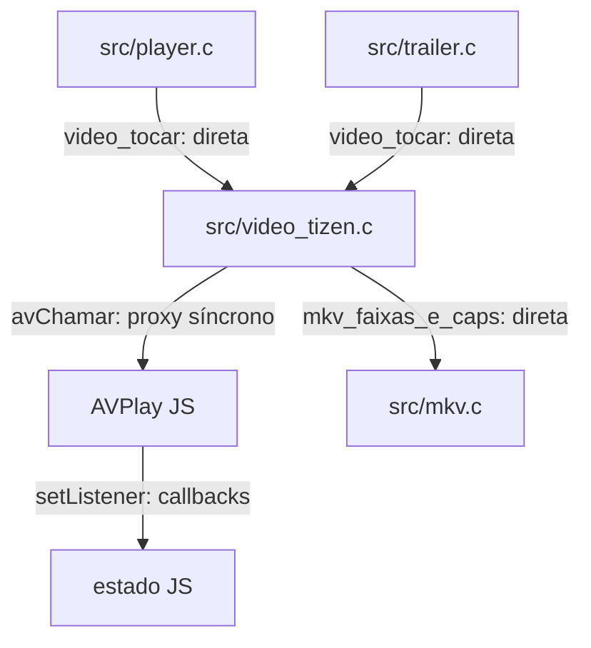
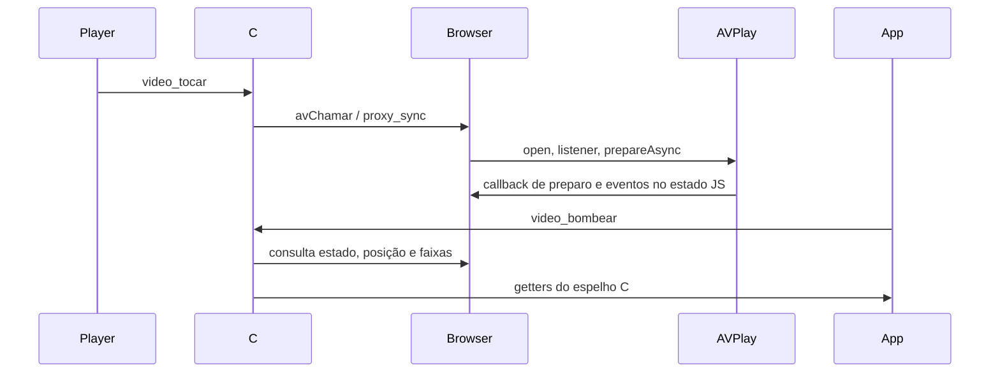

# `src/video_tizen.c` — AVPlay no Samsung .wgt

## Para que serve

Implementa vídeo no alvo `__EMSCRIPTEN__`: C/Wasm conversa com `webapis.avplay` na página. A porta `avChamar` encaminha operações ao fio principal do navegador; callbacks JS alimentam o estado colhido pelo C. Vídeo ocupa plano abaixo do canvas, portanto captura GL não prova imagem da TV. (`src/video_tizen.c:1`).

Base de leitura: `bed3534c`. Referências de linha são desta revisão; histórico e relato de issue não constituem teste executado nesta rodada.

## Funções públicas (`src/video.h`)

Controle pelo app/worker passa por `avChamar`; AVPlay só no fio principal do navegador. `filaUmaVez` inicializa fila; sonda MKV usa pthread. O encaminhamento não protege automaticamente todo estado C. Evidência: `src/video_tizen.c:863`; estados/travas abaixo.

As assinaturas abaixo são as declarações do header quando disponíveis. As pré-condições específicas constam na coluna de contrato; ponteiros de saída não opcionais devem apontar para armazenamento válido. Getters de ponteiro retornam memória emprestada, não transferem ownership.

| Assinatura | O que faz / pré-condições / efeitos | Travas locais e referência |
|---|---|---|
| `int video_iniciar(void)` | Inicializa ponte e recursos locais do backend; conferir registro do host ou disponibilidade AVPlay. | Sem aquisição explícita nesta função; auxiliares seguem contrato acima; `src/video_tizen.c:863`; `src/video.h:22` |
| `int video_iniciar_auto(void)` | Implementação deste backend: `return video_iniciar();`. | Sem aquisição explícita nesta função; auxiliares seguem contrato acima; `src/video_tizen.c:880`; `src/video.h:27` |
| `int video_registro_negado(void)` | Implementação deste backend: `return 0;`. | Sem aquisição explícita nesta função; auxiliares seguem contrato acima; `src/video_tizen.c:881`; `src/video.h:31` |
| `int video_tocar(const char *url)` | Abre URL, reinicializa sessão e configura retomada/reconexão do backend. | Sem aquisição explícita nesta função; auxiliares seguem contrato acima; `src/video_tizen.c:883`; `src/video.h:36` |
| `void video_bombear(void)` | Colhe estado, faixas, sonda MKV e reconexão por quadro; deve continuar enquanto sessão existir. | Sem aquisição explícita nesta função; auxiliares seguem contrato acima; `src/video_tizen.c:1164`; `src/video.h:52` |
| `void video_parar(void)` | Encerra sessão e invalida trabalho pendente conforme backend. | Sem aquisição explícita nesta função; auxiliares seguem contrato acima; `src/video_tizen.c:1266`; `src/video.h:53` |
| `void video_pausar(int pausado)` | Implementação deste backend: `if (!temAvplay &#124;&#124; !ativo) return; if (AVN("pausar", pausado ? 1 : 0) >= 1) tocando = !pausado;`. | Sem aquisição explícita nesta função; auxiliares seguem contrato acima; `src/video_tizen.c:1285`; `src/video.h:54` |
| `void video_volume(int pct)` | Implementação deste backend: `(void)pct;`. | Sem aquisição explícita nesta função; auxiliares seguem contrato acima; `src/video_tizen.c:1279`; `src/video.h:57` |
| `void video_buscar(double segundos)` | Implementação deste backend: `if (!temAvplay &#124;&#124; !ativo) return; if (segundos < 0) segundos = 0; posSeg = segundos; seekAlvo = segundos; seekEm = SDL_GetTicks() + SEEK_REPOUSO_MS;`. | Sem aquisição explícita nesta função; auxiliares seguem contrato acima; `src/video_tizen.c:1297`; `src/video.h:58` |
| `void video_janela(int x, int y, int w, int h)` | Implementação deste backend: `if (w < 1 &#124;&#124; h < 1) return; if (x < 0) { w += x; x = 0; } if (y < 0) { h += y; y = 0; } if (x + w > 1920) w = 1920 - x; if (y + h > 1080) h = 1080 - y; aplicarRect(x, y, w, h);`. | Sem aquisição explícita nesta função; auxiliares seguem contrato acima; `src/video_tizen.c:1334`; `src/video.h:63` |
| `void video_janela_fonte(int sx, int sy, int sw, int sh, int dx, int dy, int dw, int dh)` | Converte recorte de fonte para ROI específico da plataforma. | Sem aquisição explícita nesta função; auxiliares seguem contrato acima; `src/video_tizen.c:1393`; `src/video.h:69` |
| `int video_recorte_fonte(void)` | Implementação deste backend: `return 0;`. | Sem aquisição explícita nesta função; auxiliares seguem contrato acima; `src/video_tizen.c:1527`; `src/video.h:87` |
| `void video_recorte_reaplicar(void)` | Implementação deste backend: `(sem operação)`. | Sem aquisição explícita nesta função; auxiliares seguem contrato acima; `src/video_tizen.c:1280`; `src/video.h:91` |
| `void video_escala_definir(int sw, int sh)` | Implementação deste backend: `(void)sw; (void)sh;`. | Sem aquisição explícita nesta função; auxiliares seguem contrato acima; `src/video_tizen.c:1283`; `src/video.h:95` |
| `const char *video_url_atual(void)` | Implementação deste backend: `return urlAtual;`. | Sem aquisição explícita nesta função; auxiliares seguem contrato acima; `src/video_tizen.c:1453`; `src/video.h:100` |
| `double video_pos(void)` | Implementação deste backend: `return posSeg;`. | Sem aquisição explícita nesta função; auxiliares seguem contrato acima; `src/video_tizen.c:1454`; `src/video.h:101` |
| `double video_duracao(void)` | Implementação deste backend: `return durSeg;`. | Sem aquisição explícita nesta função; auxiliares seguem contrato acima; `src/video_tizen.c:1455`; `src/video.h:102` |
| `double video_creditos(void)` | Implementação deste backend: `double dur; if (creditosNomeado > 1.0) return creditosNomeado; dur = video_duracao(); if (creditosUltimo > 1.0 && dur > 1.0 && creditosUltimo > dur * 0.75) return creditosUltimo; return 0.0;`. | Sem aquisição explícita nesta função; auxiliares seguem contrato acima; `src/video_tizen.c:1482`; `src/video.h:108` |
| `double video_buffer_fim(void)` | Implementação deste backend: `return 0;`. | Sem aquisição explícita nesta função; auxiliares seguem contrato acima; `src/video_tizen.c:1458`; `src/video.h:109` |
| `unsigned video_bufferando_ms(void)` | Implementação deste backend: `return 0;`. | Sem aquisição explícita nesta função; auxiliares seguem contrato acima; `src/video_tizen.c:1460`; `src/video.h:117` |
| `void video_definir_dv(int dv)` | Implementação deste backend: `dvPedido = dv ? 1 : 0; (void)dvPedido;`. | Sem aquisição explícita nesta função; auxiliares seguem contrato acima; `src/video_tizen.c:1548`; `src/video.h:121` |
| `void video_definir_cabecalhos(const char *cabs)` | Implementação deste backend: `(void)cabs;`. | Sem aquisição explícita nesta função; auxiliares seguem contrato acima; `src/video_tizen.c:1546`; `src/video.h:133` |
| `void video_definir_mp4(int ehMp4)` | Implementação deste backend: `fonteMp4 = ehMp4;`. | Sem aquisição explícita nesta função; auxiliares seguem contrato acima; `src/video_tizen.c:1549`; `src/video.h:141` |
| `void video_definir_reconexao(int sim)` | Implementação deste backend: `reconProxima = sim ? 1 : 0;`. | Sem aquisição explícita nesta função; auxiliares seguem contrato acima; `src/video_tizen.c:1461`; `src/video.h:146` |
| `int video_reconectando(void)` | Implementação deste backend: `return nv_recon_ativa(&recon) && (recon.pendente &#124;&#124; !pronto) ? recon.tentativa : 0;`. | Sem aquisição explícita nesta função; auxiliares seguem contrato acima; `src/video_tizen.c:1462`; `src/video.h:156` |
| `int video_tocando(void)` | Implementação deste backend: `return tocando;`. | Sem aquisição explícita nesta função; auxiliares seguem contrato acima; `src/video_tizen.c:1465`; `src/video.h:157` |
| `int video_pausa_confirmada(void)` | Implementação deste backend: `return temAvplay && ativo && pronto && !houveErro && !video_reconectando() && avChamar("pausa_confirmada", NULL, 0, 0, 0, 0, NULL, 0) >= 1;`. | Sem aquisição explícita nesta função; auxiliares seguem contrato acima; `src/video_tizen.c:1290`; `src/video.h:160` |
| `int video_pronto(void)` | Implementação deste backend: `return pronto;`. | Sem aquisição explícita nesta função; auxiliares seguem contrato acima; `src/video_tizen.c:1466`; `src/video.h:161` |
| `int video_ativo(void)` | Implementação deste backend: `return ativo;`. | Sem aquisição explícita nesta função; auxiliares seguem contrato acima; `src/video_tizen.c:1467`; `src/video.h:165` |
| `int video_falhou(void)` | Implementação deste backend: `return houveErro;`. | Sem aquisição explícita nesta função; auxiliares seguem contrato acima; `src/video_tizen.c:1471`; `src/video.h:166` |
| `const char *video_erro_texto(void)` | Implementação deste backend: `return houveErro ? erroTexto : "";`. | Sem aquisição explícita nesta função; auxiliares seguem contrato acima; `src/video_tizen.c:1472`; `src/video.h:171` |
| `int video_decoder_anunciou(void)` | Implementação deste backend: `return 1;`. | Sem aquisição explícita nesta função; auxiliares seguem contrato acima; `src/video_tizen.c:1473`; `src/video.h:176` |
| `int video_audio_nao_suportado(void)` | Implementação deste backend: `return 0;`. | Sem aquisição explícita nesta função; auxiliares seguem contrato acima; `src/video_tizen.c:1475`; `src/video.h:237` |
| `int video_seek_desistiu(void)` | Implementação deste backend: `return 0;`. | Sem aquisição explícita nesta função; auxiliares seguem contrato acima; `src/video_tizen.c:1476`; `src/video.h:238` |
| `int video_terminou(void)` | Implementação deste backend: `return 0;`. | Sem aquisição explícita nesta função; auxiliares seguem contrato acima; `src/video_tizen.c:1479`; `src/video.h:239` |
| `int video_conflito_recurso(void)` | Implementação deste backend: `return 0;`. | Sem aquisição explícita nesta função; auxiliares seguem contrato acima; `src/video_tizen.c:1480`; `src/video.h:242` |
| `int video_n_audio(void)` | Implementação deste backend: `return nAudio;`. | Sem aquisição explícita nesta função; auxiliares seguem contrato acima; `src/video_tizen.c:1491`; `src/video.h:286` |
| `int video_n_legenda(void)` | Implementação deste backend: `return nLeg;`. | Sem aquisição explícita nesta função; auxiliares seguem contrato acima; `src/video_tizen.c:1492`; `src/video.h:287` |
| `const VideoFaixa *video_audio(int i)` | Implementação deste backend: `return (i >= 0 && i < nAudio) ? &faixaAudio[i] : NULL;`. | Sem aquisição explícita nesta função; auxiliares seguem contrato acima; `src/video_tizen.c:1493`; `src/video.h:288` |
| `const VideoFaixa *video_legenda(int i)` | Implementação deste backend: `return (i >= 0 && i < nLeg) ? &faixaLeg[i] : NULL;`. | Sem aquisição explícita nesta função; auxiliares seguem contrato acima; `src/video_tizen.c:1494`; `src/video.h:289` |
| `int video_legenda_ordinal_mkv(int i)` | Implementação deste backend: `return i >= 0 && i < nLeg ? faixaLeg[i].ordinalMkv : -1;`. | Sem aquisição explícita nesta função; auxiliares seguem contrato acima; `src/video_tizen.c:1495`; `src/video.h:290` |
| `int video_mkv_sondado(void)` | Implementação deste backend: `if (!urlAtual[0] &#124;&#124; fonteMp4) return 2; return (mkvPendente &#124;&#124; fioMkvVivo) ? 0 : 1;`. | Sem aquisição explícita nesta função; auxiliares seguem contrato acima; `src/video_tizen.c:1253`; `src/video.h:295` |
| `void video_sondar_mkv_agora(void)` | Implementação deste backend: `if (!mkvPendente &#124;&#124; fioMkvVivo &#124;&#124; !urlAtual[0]) return; mkvPendente = 0; fioMkvVivo = 1; if (pthread_create(&fioMkv, NULL, lerMkv, NULL) != 0) fioMkvVivo = 0; else pthread_detach(fioMkv);`. | Sem aquisição explícita nesta função; auxiliares seguem contrato acima; `src/video_tizen.c:1258`; `src/video.h:297` |
| `int video_audio_atual(void)` | Implementação deste backend: `return audioAtual;`. | Sem aquisição explícita nesta função; auxiliares seguem contrato acima; `src/video_tizen.c:1496`; `src/video.h:298` |
| `int video_legenda_atual(void)` | Implementação deste backend: `return legAtual;`. | Sem aquisição explícita nesta função; auxiliares seguem contrato acima; `src/video_tizen.c:1497`; `src/video.h:315` |
| `void video_escolher_audio(int i)` | Implementação deste backend: `const VideoFaixa *f = video_audio(i); if (!temAvplay &#124;&#124; !ativo &#124;&#124; !f) return; avChamar("faixa", "AUDIO", f->numero, 0, 0, 0, NULL, 0); audioAtual = i;`. | Sem aquisição explícita nesta função; auxiliares seguem contrato acima; `src/video_tizen.c:1551`; `src/video.h:317` |
| `void video_escolher_legenda(int i)` | Seleciona faixa ou desliga com -1; limpa cue e pode adiar envio. | Sem aquisição explícita nesta função; auxiliares seguem contrato acima; `src/video_tizen.c:1560`; `src/video.h:318` |
| `int video_legenda_nativa(char *dst, int tam)` | Copia cue vigente para buffer do chamador; exige destino e tamanho válidos. | Sem aquisição explícita nesta função; auxiliares seguem contrato acima; `src/video_tizen.c:1574`; `src/video.h:323` |
| `void video_legenda_externa(const char *url)` | Encaminha legenda externa quando implementado; verificar fallback ao overlay C. | Sem aquisição explícita nesta função; auxiliares seguem contrato acima; `src/video_tizen.c:1609`; `src/video.h:327` |
| `void video_legenda_estilo(const VideoLegendaEstilo *e)` | Implementação deste backend: `if (!e) return; estilo = *e; temEstilo = 1; (void)estilo; (void)temEstilo;`. | Sem aquisição explícita nesta função; auxiliares seguem contrato acima; `src/video_tizen.c:1625`; `src/video.h:366` |
| `int video_tem_atmos(void)` | Implementação deste backend: `return 0;`. | Sem aquisição explícita nesta função; auxiliares seguem contrato acima; `src/video_tizen.c:1512`; `src/video.h:369` |
| `int video_tem_dolby_vision(void)` | Implementação deste backend: `return 0;`. | Sem aquisição explícita nesta função; auxiliares seguem contrato acima; `src/video_tizen.c:1513`; `src/video.h:372` |
| `const char *video_hdr(void)` | Implementação deste backend: `return "desconhecido";`. | Sem aquisição explícita nesta função; auxiliares seguem contrato acima; `src/video_tizen.c:1514`; `src/video.h:373` |
| `int video_largura(void)` | Implementação deste backend: `return vidW;`. | Sem aquisição explícita nesta função; auxiliares seguem contrato acima; `src/video_tizen.c:1516`; `src/video.h:376` |
| `int video_altura(void)` | Implementação deste backend: `return vidH;`. | Sem aquisição explícita nesta função; auxiliares seguem contrato acima; `src/video_tizen.c:1517`; `src/video.h:377` |
| `int video_pode_forcar_sdr(void)` | Implementação deste backend: `return 0;`. | Sem aquisição explícita nesta função; auxiliares seguem contrato acima; `src/video_tizen.c:1529`; `src/video.h:402` |
| `void video_forcar_sdr(void)` | Implementação deste backend: `(sem operação)`. | Sem aquisição explícita nesta função; auxiliares seguem contrato acima; `src/video_tizen.c:1530`; `src/video.h:406` |
| `int video_velocidade_suportada(void)` | Implementação deste backend: `return 0;`. | Sem aquisição explícita nesta função; auxiliares seguem contrato acima; `src/video_tizen.c:1535`; `src/video.h:418` |
| `void video_velocidade(int centesimos)` | Implementação deste backend: `(void)c;`. | Sem aquisição explícita nesta função; auxiliares seguem contrato acima; `src/video_tizen.c:1536`; `src/video.h:419` |
| `int video_velocidade_atual(void)` | Implementação deste backend: `return 100;`. | Sem aquisição explícita nesta função; auxiliares seguem contrato acima; `src/video_tizen.c:1537`; `src/video.h:420` |
| `void video_velocidade_recusada(void)` | Implementação deste backend: `(sem operação)`. | Sem aquisição explícita nesta função; auxiliares seguem contrato acima; `src/video_tizen.c:1538`; `src/video.h:424` |
| `int video_velocidade_bloqueada(void)` | Implementação deste backend: `return 0;`. | Sem aquisição explícita nesta função; auxiliares seguem contrato acima; `src/video_tizen.c:1539`; `src/video.h:428` |
| `void video_encerrar(void)` | Implementação deste backend: `if (!ligado) return; video_parar(); if (temAvplay) AV0("encerrar"); ligado = 0;`. | Sem aquisição explícita nesta função; auxiliares seguem contrato acima; `src/video_tizen.c:1632`; `src/video.h:430` |
| `static unsigned video_id_fonte(const char *url)` | Implementação deste backend: `unsigned h = 2166136261u; const unsigned char *p = (const unsigned char *)url; if (!p) return 0; while (*p) { h ^= *p++; h *= 16777619u; } return h;`. | Sem aquisição explícita nesta função; auxiliares seguem contrato acima; `src/video_tizen.c:825`; exportação adicional |

A interface comum contém APIs condicionais que não são implementadas neste arquivo. Retomada na abertura (`video_tocar_posicao`, `video_tocar_retomada`, `video_retomada_inicial_estado`) pertence ao ramo Android de `src/video.h:41`; não atribuir esse protocolo ao backend Samsung.

## Estado global (`static`)

| Grupo | Quem escreve / quem lê e sincronização | Evidência |
|---|---|---|
| ligado/temAvplay/ativo/pronto/tocando, posSeg/durSeg e erroTexto | Inicialização/abertura/parada e bombear escrevem; getters leem. | `src/video_tizen.c:796` |
| urlAtual[1024], fonteMp4, dvPedido | Abertura e setters escrevem; sonda/reconexão leem. | `src/video_tizen.c:806` |
| recon*, cópias reconFxA/reconFxL | Bombeamento preserva escolhas/posição ao reabrir. | `src/video_tizen.c:812` |
| faixaAudio/faixaLeg e contadores | lerFaixas e aplicação MKV escrevem; seleção/getters leem. | `src/video_tizen.c:833` |
| janX/Y/W/H, seekAlvo/seekEm, estilo/temEstilo | Janela/seek/estilo escrevem; abertura e bombeamento reaplicam. | `src/video_tizen.c:839` |
| fioMkvVivo/mkvPendente, creditosNomeado/creditosUltimo | Bombeamento/sonda iniciam worker; lerMkv escreve resultado. | `src/video_tizen.c:855` |
| filaPrincipal/filaUmaVez | pthread_once cria; avChamar usa proxy síncrono. Estado JS também reside em window, dentro de nv_av. | `src/video_tizen.c:745` |

## Grafo de chamadas

Recorte das dependências comprovadas, não inventário de todo utilitário chamado. Arestas de registro, callback e ponteiro estão rotuladas.

Evidências das arestas:

- `src/player.c` → `src/video_tizen.c`: `src/player.c:1360`.
- `src/trailer.c` → `src/video_tizen.c`: `src/trailer.c:380`.
- `src/video_tizen.c` → `AVPlay JS`: `src/video_tizen.c:30`.
- `AVPlay JS` → `estado JS`: `src/video_tizen.c:196`.
- `src/video_tizen.c` → `src/mkv.c`: `src/video_tizen.c:1149`.

## Fluxo principal

Ordem extraída das funções acima e dos pontos de chamada do grafo; eventos assíncronos não garantem latência nem imagem física.

## IMPACTOS

| Se você mexer em... | Confira... |
|---|---|
| `video_tocar` (`src/video_tizen.c:883`) | Abertura: preservar prepareAsync e descarte de sessão antiga no JS; conferir contrato do fake AVPlay e player. |
| `video_bombear` (`src/video_tizen.c:1164`) | Não remover bombeamento: getters C dependem dele. Proxy síncrono exige fio do navegador cedendo execução; nunca substituir por chamada JS direta de worker. |
| `video_buscar` (`src/video_tizen.c:1297`) | Seek e unidade: conferir segundos C versus ms AVPlay, debounce e estado permitido. |
| `video_janela_fonte` (`src/video_tizen.c:1393`) | ROI: conferir coordenadas normalizadas e chamadas no estado aceito; fake não prova composição no painel. |
| `video_definir_cabecalhos` (`src/video_tizen.c:1546`) | Cabeçalhos HTTP são ignorados neste backend; não prometer equivalência com Android/.tpk. |
| `video_velocidade` (`src/video_tizen.c:1536`) | Velocidade é indisponível no .wgt; não anunciar trick play inteiro como reprodução acelerada com áudio. |

### Testes

Cobertura identificada por leitura; testes de produto não foram executados nesta tarefa documental.

| Teste | Cobertura |
|---|---|
| `tests/tizen-avplay-contract.cjs` | Executa corpo JS de produção contra fake AVPlay; não cobre parser C nem codecs. (`tests/tizen-avplay-contract.cjs:1`). |
| `tests/velocidade.sh` | Contrato de indisponibilidade de velocidade .wgt. (`tests/velocidade.sh:1`). |

### O que NÃO está demonstrado por esses testes

Proxy Wasm com workers reais, parser C completo, callbacks do firmware, codecs/HDR, ROI físico e rede de CDN.

## Regressões já acontecidas

Histórico consultado com `git log --oneline -- src/video_tizen.c`. Linhas abaixo reproduzem o assunto do commit; merge não é prova adicional de correção. Implementação atual: `src/video_tizen.c:1`.

| Hash | Alteração registrada |
|---|---|
| `c3726d2d` | capitulos do MKV no Android e no .tpk: fio lateral (capmkv), Chapters por SeekHead, abertura/creditos/previa do arquivo no modulo de intro |
| `f0f1963e` | next episode / skip (2.0.3): markers validated against the episode, fixed-time fallback |
| `a8048e0d` | webOS: seek Failure na retomada nao derruba mais a fonte (#246) |
| `9768862e` | feat(start): cut dead waits at stream start and explain the rest in the clock island (#202) |
| `6b6d7533` | player: trust the measured playback speed, not the platform's "ok" (#202) |
| `f9784fb1` | player: playback speed (0.75x-2x) in the audio sheet (#202) |
| `a4dc809d` | Retain confirmed paused VOD for fast island return and shorten transition |
| `cce32484` | video: reconnect the same source when the network drops mid-playback |

### Cruzamento com issues

- **#202**: `docs/issues/mapa.json:4505`; `docs/issues/MAPA.md:373`. Relação de investigação/contrato; só associar um hash ao conserto quando o assunto ou registro da issue o explicita.
- **#385**: `docs/issues/mapa.json:8211`; `docs/issues/MAPA.md:46`. Relação de investigação/contrato; só associar um hash ao conserto quando o assunto ou registro da issue o explicita.
