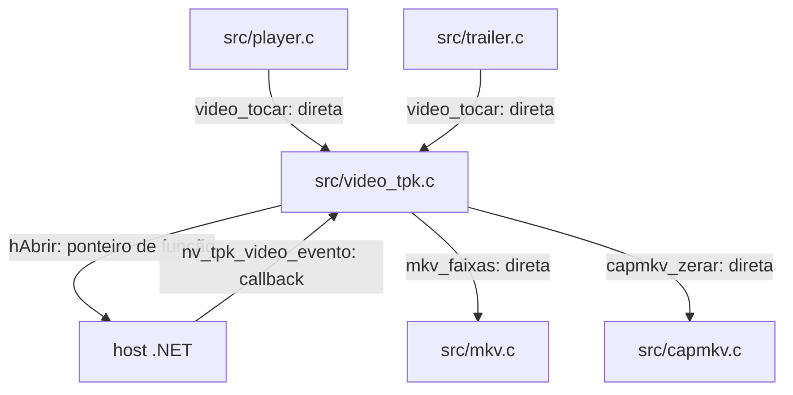

# `src/video_tpk.c` — ponte do player Samsung .tpk

## Para que serve

Implementa `video.h` sob `NV_TPK`, delegando reprodução ao host .NET por ponteiros de função. Guarda estado, faixas, cues e reconexão do player; a TV desenha vídeo abaixo do GL. `NV_TPK40` altera a política de recorte para Tizen 4/5. (`src/video_tpk.c:1`).

Base de leitura: `bed3534c`. Referências de linha são desta revisão; histórico e relato de issue não constituem teste executado nesta rodada.

## Funções públicas (`src/video.h`)

Controle/bombeamento no fio do app; callbacks do host podem vir de outros fios. `travaLeg` protege cue; flags volatile não equivalem a mutex nem provam ausência de corrida. Evidência: `src/video_tpk.c:333`; estados/travas abaixo.

As assinaturas abaixo são as declarações do header quando disponíveis. As pré-condições específicas constam na coluna de contrato; ponteiros de saída não opcionais devem apontar para armazenamento válido. Getters de ponteiro retornam memória emprestada, não transferem ownership.

| Assinatura | O que faz / pré-condições / efeitos | Travas locais e referência |
|---|---|---|
| `int video_iniciar(void)` | Implementação deste backend: `if (!travaLeg) travaLeg = SDL_CreateMutex(); mkvass_aceitar_texto(1); return hAbrir != NULL;`. | Sem aquisição explícita nesta função; auxiliares seguem contrato acima; `src/video_tpk.c:333`; `src/video.h:22` |
| `int video_iniciar_auto(void)` | Implementação deste backend: `return hAbrir != NULL;`. | Sem aquisição explícita nesta função; auxiliares seguem contrato acima; `src/video_tpk.c:339`; `src/video.h:27` |
| `int video_registro_negado(void)` | Implementação deste backend: `return 0;`. | Sem aquisição explícita nesta função; auxiliares seguem contrato acima; `src/video_tpk.c:340`; `src/video.h:31` |
| `int video_tocar(const char *url)` | Abre URL, reinicializa sessão e configura retomada/reconexão do backend. | Sem aquisição explícita nesta função; auxiliares seguem contrato acima; `src/video_tpk.c:370`; `src/video.h:36` |
| `void video_bombear(void)` | Colhe estado, faixas, sonda MKV e reconexão por quadro; deve continuar enquanto sessão existir. | Sem aquisição explícita nesta função; auxiliares seguem contrato acima; `src/video_tpk.c:549`; `src/video.h:52` |
| `void video_parar(void)` | Encerra sessão e invalida trabalho pendente conforme backend. | Sem aquisição explícita nesta função; auxiliares seguem contrato acima; `src/video_tpk.c:596`; `src/video.h:53` |
| `void video_pausar(int pausado)` | Implementação deste backend: `if (hPausar) hPausar(p);`. | Sem aquisição explícita nesta função; auxiliares seguem contrato acima; `src/video_tpk.c:606`; `src/video.h:54` |
| `void video_volume(int pct)` | Implementação deste backend: `if (hVolume) hVolume(pct);`. | Sem aquisição explícita nesta função; auxiliares seguem contrato acima; `src/video_tpk.c:608`; `src/video.h:57` |
| `void video_buscar(double segundos)` | Implementação deste backend: `if (hBuscar) hBuscar((int)(s * 1000.0)); terminou = 0;`. | Sem aquisição explícita nesta função; auxiliares seguem contrato acima; `src/video_tpk.c:609`; `src/video.h:58` |
| `void video_janela(int x, int y, int w, int h)` | Implementação deste backend: `if (hJanela) hJanela(x, y, w, h);`. | Sem aquisição explícita nesta função; auxiliares seguem contrato acima; `src/video_tpk.c:613`; `src/video.h:63` |
| `void video_janela_fonte(int sx, int sy, int sw, int sh, int dx, int dy, int dw, int dh)` | Converte recorte de fonte para ROI específico da plataforma. | Sem aquisição explícita nesta função; auxiliares seguem contrato acima; `src/video_tpk.c:688`; `src/video.h:69` |
| `int video_recorte_fonte(void)` | Implementação deste backend: `return NV_TPK_ZOOM_ROI &#124;&#124; NV_TPK_PLAYER_RECORTE &#124;&#124; zoomRoi;`. | Sem aquisição explícita nesta função; auxiliares seguem contrato acima; `src/video_tpk.c:728`; `src/video.h:87` |
| `void video_recorte_reaplicar(void)` | Implementação deste backend: `if (temRoi) video_janela(ultRoiX, ultRoiY, ultRoiW, ultRoiH);`. | Sem aquisição explícita nesta função; auxiliares seguem contrato acima; `src/video_tpk.c:733`; `src/video.h:91` |
| `void video_escala_definir(int sw, int sh)` | Implementação deste backend: `(void)sw; (void)sh;`. | Sem aquisição explícita nesta função; auxiliares seguem contrato acima; `src/video_tpk.c:857`; `src/video.h:95` |
| `const char *video_url_atual(void)` | Implementação deste backend: `return urlAtual;`. | Sem aquisição explícita nesta função; auxiliares seguem contrato acima; `src/video_tpk.c:734`; `src/video.h:100` |
| `double video_pos(void)` | Implementação deste backend: `return (hPos && pronto) ? hPos() / 1000.0 : 0;`. | Sem aquisição explícita nesta função; auxiliares seguem contrato acima; `src/video_tpk.c:735`; `src/video.h:101` |
| `double video_duracao(void)` | Implementação deste backend: `return durMs / 1000.0;`. | Sem aquisição explícita nesta função; auxiliares seguem contrato acima; `src/video_tpk.c:736`; `src/video.h:102` |
| `double video_creditos(void)` | Implementação deste backend: `return capmkv_creditos(video_duracao());`. | Sem aquisição explícita nesta função; auxiliares seguem contrato acima; `src/video_tpk.c:738`; `src/video.h:108` |
| `double video_buffer_fim(void)` | Implementação deste backend: `return 0;`. | Sem aquisição explícita nesta função; auxiliares seguem contrato acima; `src/video_tpk.c:739`; `src/video.h:109` |
| `unsigned video_bufferando_ms(void)` | Implementação deste backend: `if (nv_recon_ativa(&recon)) return 0; return bufferando ? SDL_GetTicks() - bufferDesde : 0;`. | Sem aquisição explícita nesta função; auxiliares seguem contrato acima; `src/video_tpk.c:740`; `src/video.h:117` |
| `void video_definir_dv(int dv)` | Implementação deste backend: `(void)dv;`. | Sem aquisição explícita nesta função; auxiliares seguem contrato acima; `src/video_tpk.c:745`; `src/video.h:121` |
| `void video_definir_cabecalhos(const char *cabs)` | Implementação deste backend: `snprintf(cabecalhos, sizeof cabecalhos, "%s", c ? c : "");`. | Sem aquisição explícita nesta função; auxiliares seguem contrato acima; `src/video_tpk.c:746`; `src/video.h:133` |
| `void video_definir_mp4(int ehMp4)` | Implementação deste backend: `fonteMp4 = m != 0;`. | Sem aquisição explícita nesta função; auxiliares seguem contrato acima; `src/video_tpk.c:747`; `src/video.h:141` |
| `void video_definir_reconexao(int sim)` | Implementação deste backend: `reconProxima = sim ? 1 : 0;`. | Sem aquisição explícita nesta função; auxiliares seguem contrato acima; `src/video_tpk.c:383`; `src/video.h:146` |
| `int video_reconectando(void)` | Implementação deste backend: `return nv_recon_ativa(&recon) && (recon.pendente &#124;&#124; !pronto) ? recon.tentativa : 0;`. | Sem aquisição explícita nesta função; auxiliares seguem contrato acima; `src/video_tpk.c:384`; `src/video.h:156` |
| `int video_tocando(void)` | Implementação deste backend: `return tocando;`. | Sem aquisição explícita nesta função; auxiliares seguem contrato acima; `src/video_tpk.c:748`; `src/video.h:157` |
| `int video_pausa_confirmada(void)` | Implementação deste backend: `return 0;`. | Sem aquisição explícita nesta função; auxiliares seguem contrato acima; `src/video_tpk.c:607`; `src/video.h:160` |
| `int video_pronto(void)` | Implementação deste backend: `return pronto;`. | Sem aquisição explícita nesta função; auxiliares seguem contrato acima; `src/video_tpk.c:749`; `src/video.h:161` |
| `int video_ativo(void)` | Implementação deste backend: `return ativo;`. | Sem aquisição explícita nesta função; auxiliares seguem contrato acima; `src/video_tpk.c:750`; `src/video.h:165` |
| `int video_falhou(void)` | Implementação deste backend: `return falhou;`. | Sem aquisição explícita nesta função; auxiliares seguem contrato acima; `src/video_tpk.c:751`; `src/video.h:166` |
| `const char *video_erro_texto(void)` | Implementação deste backend: `static char texto[64]; if (!atomic_load(&temErroDetalhe)) return ""; snprintf(texto, sizeof texto, "Samsung player error 0x%08x", atomic_load(&erroDetalhe)); return texto;`. | Sem aquisição explícita nesta função; auxiliares seguem contrato acima; `src/video_tpk.c:848`; `src/video.h:171` |
| `int video_decoder_anunciou(void)` | Implementação deste backend: `return 1;`. | Sem aquisição explícita nesta função; auxiliares seguem contrato acima; `src/video_tpk.c:855`; `src/video.h:176` |
| `int video_audio_nao_suportado(void)` | Implementação deste backend: `return audioNaoSup;`. | Sem aquisição explícita nesta função; auxiliares seguem contrato acima; `src/video_tpk.c:752`; `src/video.h:237` |
| `int video_seek_desistiu(void)` | Implementação deste backend: `return 0;`. | Sem aquisição explícita nesta função; auxiliares seguem contrato acima; `src/video_tpk.c:753`; `src/video.h:238` |
| `int video_terminou(void)` | Implementação deste backend: `return terminou;`. | Sem aquisição explícita nesta função; auxiliares seguem contrato acima; `src/video_tpk.c:754`; `src/video.h:239` |
| `int video_conflito_recurso(void)` | Implementação deste backend: `return conflito;`. | Sem aquisição explícita nesta função; auxiliares seguem contrato acima; `src/video_tpk.c:755`; `src/video.h:242` |
| `void video_tpk_log_host(const char *linha)` | Interpreta linhas do host para conflito de recurso e classificação de erro de rede. | Sem aquisição explícita nesta função; auxiliares seguem contrato acima; `src/video_tpk.c:771`; `src/video.h:244` |
| `int video_tpk_codec_recusado(const char *codecId)` | Implementação deste backend: `return codecId && (!strncmp(codecId, "A_DTS", 5) &#124;&#124; !strncmp(codecId, "A_TRUEHD", 8) &#124;&#124; !strncmp(codecId, "A_MLP", 5));`. | Sem aquisição explícita nesta função; auxiliares seguem contrato acima; `src/video_tpk.c:422`; `src/video.h:245` |
| `void video_tpk_zoom_roi_definir(int ligado)` | Implementação deste backend: `ligado = ligado ? 1 : 0; if (ligado == zoomRoi) return; zoomRoi = ligado; printf("[trailer] tpk zoom ROI (trailer + player): %s (setting)\n", ligado ? "on" : "off"); fflush(stdout);`. | Sem aquisição explícita nesta função; auxiliares seguem contrato acima; `src/video_tpk.c:673`; `src/video.h:248` |
| `int video_tpk_zoom_roi(void)` | Implementação deste backend: `return zoomRoi;`. | Sem aquisição explícita nesta função; auxiliares seguem contrato acima; `src/video_tpk.c:680`; `src/video.h:249` |
| `void video_tpk_trailer_marcar(int sim)` | Implementação deste backend: `emTrailer = sim ? 1 : 0;`. | Sem aquisição explícita nesta função; auxiliares seguem contrato acima; `src/video_tpk.c:672`; `src/video.h:251` |
| `int video_recorte_fonte_trailer(void)` | Implementação deste backend: `return NV_TPK_ZOOM_ROI &#124;&#124; zoomRoi;`. | Sem aquisição explícita nesta função; auxiliares seguem contrato acima; `src/video_tpk.c:729`; `src/video.h:252` |
| `int video_n_audio(void)` | Implementação deste backend: `return nAudio;`. | Sem aquisição explícita nesta função; auxiliares seguem contrato acima; `src/video_tpk.c:790`; `src/video.h:286` |
| `int video_n_legenda(void)` | Implementação deste backend: `return nLeg;`. | Sem aquisição explícita nesta função; auxiliares seguem contrato acima; `src/video_tpk.c:791`; `src/video.h:287` |
| `const VideoFaixa *video_audio(int i)` | Implementação deste backend: `return (i >= 0 && i < nAudio) ? &faixaAudio[i] : 0;`. | Sem aquisição explícita nesta função; auxiliares seguem contrato acima; `src/video_tpk.c:792`; `src/video.h:288` |
| `const VideoFaixa *video_legenda(int i)` | Implementação deste backend: `return (i >= 0 && i < nLeg) ? &faixaLeg[i] : 0;`. | Sem aquisição explícita nesta função; auxiliares seguem contrato acima; `src/video_tpk.c:793`; `src/video.h:289` |
| `int video_legenda_ordinal_mkv(int i)` | Implementação deste backend: `return (i >= 0 && i < nLeg) ? faixaLeg[i].ordinalMkv : -1;`. | Sem aquisição explícita nesta função; auxiliares seguem contrato acima; `src/video_tpk.c:794`; `src/video.h:290` |
| `int video_mkv_sondado(void)` | Implementação deste backend: `if (!urlAtual[0] &#124;&#124; fonteMp4 &#124;&#124; mkvNaoMkv) return 2; if (mkvEstado == 1 &#124;&#124; mkvEstado == 2) return 0; if (faixasNovas && mkvN > 0 && (nAudio &#124;&#124; nLeg)) return 0; return 1;`. | Sem aquisição explícita nesta função; auxiliares seguem contrato acima; `src/video_tpk.c:798`; `src/video.h:295` |
| `void video_sondar_mkv_agora(void)` | Implementação deste backend: `if (mkvEstado == 1) mkvSondarJa = 1;`. | Sem aquisição explícita nesta função; auxiliares seguem contrato acima; `src/video_tpk.c:806`; `src/video.h:297` |
| `int video_audio_atual(void)` | Implementação deste backend: `return audioAtual;`. | Sem aquisição explícita nesta função; auxiliares seguem contrato acima; `src/video_tpk.c:807`; `src/video.h:298` |
| `int video_legenda_atual(void)` | Implementação deste backend: `return legAtual;`. | Sem aquisição explícita nesta função; auxiliares seguem contrato acima; `src/video_tpk.c:808`; `src/video.h:315` |
| `void video_escolher_audio(int i)` | Implementação deste backend: `if (i < 0 &#124;&#124; i >= nAudio) return; audioAtual = i; if (!audioComecou) { audioPend = i; return; } if (hEscolher) hEscolher(0, faixaAudio[i].numero);`. | Sem aquisição explícita nesta função; auxiliares seguem contrato acima; `src/video_tpk.c:809`; `src/video.h:317` |
| `void video_escolher_legenda(int i)` | Seleciona faixa ou desliga com -1; limpa cue e pode adiar envio. | Sem aquisição explícita nesta função; auxiliares seguem contrato acima; `src/video_tpk.c:817`; `src/video.h:318` |
| `int video_legenda_nativa(char *dst, int tam)` | Copia cue vigente para buffer do chamador; exige destino e tamanho válidos. | travaLeg; `src/video_tpk.c:831`; `src/video.h:323` |
| `void video_legenda_externa(const char *url)` | Implementação deste backend: `(void)u;`. | Sem aquisição explícita nesta função; auxiliares seguem contrato acima; `src/video_tpk.c:840`; `src/video.h:327` |
| `void video_legenda_estilo(const VideoLegendaEstilo *e)` | Implementação deste backend: `if (e && hEscolher) hEscolher(2, e->atrasoMs);`. | Sem aquisição explícita nesta função; auxiliares seguem contrato acima; `src/video_tpk.c:842`; `src/video.h:366` |
| `int video_tem_atmos(void)` | Implementação deste backend: `return 0;`. | Sem aquisição explícita nesta função; auxiliares seguem contrato acima; `src/video_tpk.c:843`; `src/video.h:369` |
| `int video_tem_dolby_vision(void)` | Implementação deste backend: `return 0;`. | Sem aquisição explícita nesta função; auxiliares seguem contrato acima; `src/video_tpk.c:844`; `src/video.h:372` |
| `const char *video_hdr(void)` | Implementação deste backend: `return "none";`. | Sem aquisição explícita nesta função; auxiliares seguem contrato acima; `src/video_tpk.c:845`; `src/video.h:373` |
| `int video_largura(void)` | Implementação deste backend: `return largura;`. | Sem aquisição explícita nesta função; auxiliares seguem contrato acima; `src/video_tpk.c:858`; `src/video.h:376` |
| `int video_altura(void)` | Implementação deste backend: `return altura;`. | Sem aquisição explícita nesta função; auxiliares seguem contrato acima; `src/video_tpk.c:859`; `src/video.h:377` |
| `int video_pode_forcar_sdr(void)` | Implementação deste backend: `return 0;`. | Sem aquisição explícita nesta função; auxiliares seguem contrato acima; `src/video_tpk.c:860`; `src/video.h:402` |
| `void video_forcar_sdr(void)` | Implementação deste backend: `(sem operação)`. | Sem aquisição explícita nesta função; auxiliares seguem contrato acima; `src/video_tpk.c:873`; `src/video.h:406` |
| `int video_velocidade_suportada(void)` | Implementação deste backend: `return !velRecusada && hEscolher != NULL;`. | Sem aquisição explícita nesta função; auxiliares seguem contrato acima; `src/video_tpk.c:861`; `src/video.h:418` |
| `void video_velocidade(int centesimos)` | Implementação deste backend: `if (c <= 0 &#124;&#124; c > 400) c = 100; if (!velRecusada) velPedida = c;`. | Sem aquisição explícita nesta função; auxiliares seguem contrato acima; `src/video_tpk.c:862`; `src/video.h:419` |
| `int video_velocidade_atual(void)` | Implementação deste backend: `return velRecusada ? 100 : velPedida;`. | Sem aquisição explícita nesta função; auxiliares seguem contrato acima; `src/video_tpk.c:866`; `src/video.h:420` |
| `void video_velocidade_recusada(void)` | Implementação deste backend: `velRecusada = 1; velPedida = 100; if (ativo && pronto && hEscolher && velEnviada != 100) hEscolher(3, 100); velEnviada = 100;`. | Sem aquisição explícita nesta função; auxiliares seguem contrato acima; `src/video_tpk.c:867`; `src/video.h:424` |
| `int video_velocidade_bloqueada(void)` | Implementação deste backend: `return 0;`. | Sem aquisição explícita nesta função; auxiliares seguem contrato acima; `src/video_tpk.c:872`; `src/video.h:428` |
| `void video_encerrar(void)` | Implementação deste backend: `video_parar();`. | Sem aquisição explícita nesta função; auxiliares seguem contrato acima; `src/video_tpk.c:874`; `src/video.h:430` |

### ABI de callbacks do host

Callbacks podem chegar de outro fio; não confundir este registro com API direta de `video.h` (`src/video_tpk.c:1`).

| Assinatura exportada | Contrato e evidência |
|---|---|
| `void nv_tpk_video_registrar(FnAbrir abrir, FnSemArg parar, FnInt pausar, FnInt buscar, FnInt volume, FnRet janela, FnPos pos)` | Guarda os 7 ponteiros usados pelo C; registrar antes da abertura. FnAbrir recebe URL/cabeçalhos; FnInt transporta inteiro; posição/seek usam ms. `src/video_tpk.c:144` |
| `void nv_tpk_video_registrar_faixas(FnEscolher escolher)` | Guarda hEscolher(tipo, índice); não é seleção imediata. `src/video_tpk.c:151` |
| `void nv_tpk_video_faixa(int tipo, int idx, const char *lingua)` | Acumula uma faixa em novasA/novasL; limita 32, copia idioma e índice do host. Publicar somente ao fim. `src/video_tpk.c:177` |
| `void nv_tpk_video_faixas_fim(int selAudio, int selLeg)` | Publica arrays/contadores; releitura só de áudio preserva legenda; pode restaurar escolhas após reconexão. `src/video_tpk.c:192` |
| `void nv_tpk_video_legenda(const char *texto, int durMs)` | Atualiza cue/validade sob travaLeg, respeitando bloqueio da sessão e seleção. `src/video_tpk.c:228` |
| `void nv_tpk_video_evento(int tipo, int a, int b)` | Atualiza estado a partir do evento do host; erro é anotado para decisão em video_bombear, não reconecta dentro do callback. `src/video_tpk.c:258` |

A interface comum contém APIs condicionais que não são implementadas neste arquivo. Retomada na abertura (`video_tocar_posicao`, `video_tocar_retomada`, `video_retomada_inicial_estado`) pertence ao ramo Android de `src/video.h:41`; não atribuir esse protocolo ao backend Samsung.

## Estado global (`static`)

| Grupo | Quem escreve / quem lê e sincronização | Evidência |
|---|---|---|
| hAbrir/hParar/hPausar/hBuscar/hVolume/hJanela/hPos/hEscolher | Registro do host escreve; controle video_* chama ponteiros. | `src/video_tpk.c:45` |
| faixaAudio/faixaLeg, novasA/novasL e contadores | nv_tpk_video_faixa acumula; faixas_fim publica; getters e seleção leem. | `src/video_tpk.c:54` |
| legTexto[1024], legAte, legCuesBloqueados e diagnóstico de cues | Callback de legenda e seleção/parada escrevem sob travaLeg; legenda_nativa e vigia leem. | `src/video_tpk.c:57` |
| URL[4096], cabeçalhos[2048], flags, posição e erroDetalhe | Abertura, eventos e parar escrevem; bombeamento/getters leem; erro usa atômicos. | `src/video_tpk.c:75` |
| recon*, audioPend/legPend, comecou* | Evento anota erro; video_bombear decide e reabre; escolhasPendentes despacha após início. | `src/video_tpk.c:108` |
| mkvFx/mkvN/mkvEstado/mkvGeracao, audioNaoSup | fioMkv publica se geração coincide; sondaMkv aplica rótulos e avalia áudio. | `src/video_tpk.c:124` |
| zoomRoi, ultRoi*, temRoi | Ajuste e janela_fonte escrevem; consulta/reaplicação leem. | `src/video_tpk.c:668` |

## Grafo de chamadas

Recorte das dependências comprovadas, não inventário de todo utilitário chamado. Arestas de registro, callback e ponteiro estão rotuladas.



Evidências das arestas:

- `src/player.c` → `src/video_tpk.c`: `src/player.c:1360`.
- `src/trailer.c` → `src/video_tpk.c`: `src/trailer.c:380`.
- `src/video_tpk.c` → `host .NET`: `src/video_tpk.c:366`.
- `host .NET` → `src/video_tpk.c`: delegate em `tizen-tpk/Video.cs:51`, emissões em `tizen-tpk/Video.cs:280`, receptor em `src/video_tpk.c:258`.
- `src/video_tpk.c` → `src/mkv.c`: `src/video_tpk.c:409`.
- `src/video_tpk.c` → `src/capmkv.c`: `src/video_tpk.c:598`.

## Fluxo principal

```mermaid
sequenceDiagram
    Host->>C: nv_tpk_video_registrar + registrar_faixas
    Player->>C: video_tocar(url)
    C->>Host: hAbrir (ponteiro)
    Host->>C: nv_tpk_video_evento / faixa / faixas_fim (callbacks)
    App->>C: video_bombear por quadro
    C->>Host: hEscolher: áudio após início; legenda após acomodação
    App->>C: video_parar
    C->>Host: hParar
```

Ordem extraída das funções acima e dos pontos de chamada do grafo; eventos assíncronos não garantem latência nem imagem física.

## IMPACTOS

| Se você mexer em... | Confira... |
|---|---|
| `nv_tpk_video_registrar` (`src/video_tpk.c:144`) | ABI .NET: preservar ordem, tipos e unidade ms dos ponteiros; conferir tizen-tpk/Video.cs e registro do host. |
| `video_escolher_legenda` (`src/video_tpk.c:817`) | Seleção diferida e cue: não enviar legenda antes de temQuadro + LEG_ACOMODAR_MS; não confundir posição retomada com prova física de primeiro quadro. |
| `video_janela_fonte` (`src/video_tpk.c:688`) | ROI: conferir NV_TPK40 e ajuste experimental; manter fallback dentro de 1920x1080 nos aparelhos sem zoom habilitado. |
| `video_bombear` (`src/video_tpk.c:549`) | Reconexão: evento só anota; decisão, seek e restauração de faixas ocorrem no bombeamento. Manter classificação de rede separada de codec. |
| `video_tocar` (`src/video_tpk.c:370`) | Buffers URL 4096/cabeçalhos 2048 e limite de 32 faixas: conferir truncamento, índices e host antes de ampliar. |
| `video_sondar_mkv_agora` (`src/video_tpk.c:806`) | Sonda lateral e geração: resposta antiga não pode atualizar a próxima fonte; conferir capmkv/mkvass e backoff de rede. |

### Testes

Cobertura identificada por leitura; testes de produto não foram executados nesta tarefa documental.

| Teste | Cobertura |
|---|---|
| `tests/tpk-escolha.sh` | Host falso: escolhas diferidas e cues. (`tests/tpk-escolha.sh:1`). |
| `tests/tpk-roi.sh` | Host falso: retângulos normal/canário. (`tests/tpk-roi.sh:1`). |
| `tests/tpk_texto_flag.sh` | Contrato textual de ativação do overlay. (`tests/tpk_texto_flag.sh:1`). |

### O que NÃO está demonstrado por esses testes

Host .NET real, ordem real de eventos entre sessões, ROI no painel, áudio recusado e reconexão com CDN real.

## Regressões já acontecidas

Histórico consultado com `git log --oneline -- src/video_tpk.c`. Linhas abaixo reproduzem o assunto do commit; merge não é prova adicional de correção. Implementação atual: `src/video_tpk.c:1`.

| Hash | Alteração registrada |
|---|---|
| `4151683c` | fix (2.0.3, #385): host do video que recusa conexao poe a leitura lateral em pausa — sem segunda conexao, sem cinco Ranges, sem sonda por cima |
| `c3726d2d` | capitulos do MKV no Android e no .tpk: fio lateral (capmkv), Chapters por SeekHead, abertura/creditos/previa do arquivo no modulo de intro |
| `beb5007a` | tpk 4/5 (#203): botao de aspecto/zoom do player passa a ter efeito |
| `a8048e0d` | webOS: seek Failure na retomada nao derruba mais a fonte (#246) |
| `6ec3907b` | tpk (#269): turn on the plain-text overlay for every session; video_iniciar() never ran there |
| `f45ddc14` | feat(tpk): detect audio the Samsung TV refuses (DTS/TrueHD) and warn instead of silent mute (#313) |
| `b5deeb25` | tpk (#290): the experimental trailer zoom setting also unlocks the player's aspect modes |
| `ce1552cd` | tpk (#269): embedded text subtitles drawn by the app overlay, plus native cue diagnostics |

### Cruzamento com issues

- **#385**: `docs/issues/mapa.json:8211`; `docs/issues/MAPA.md:46`. Relação de investigação/contrato; só associar um hash ao conserto quando o assunto ou registro da issue o explicita.
- **#269**: `docs/issues/mapa.json:5803`; `docs/issues/MAPA.md:112`. Relação de investigação/contrato; só associar um hash ao conserto quando o assunto ou registro da issue o explicita.
- **#313**: `docs/issues/mapa.json:6701`; `docs/issues/MAPA.md:44`. Relação de investigação/contrato; só associar um hash ao conserto quando o assunto ou registro da issue o explicita.
- **#203**: `docs/issues/mapa.json:4534`; `docs/issues/MAPA.md:11`. Relação de investigação/contrato; só associar um hash ao conserto quando o assunto ou registro da issue o explicita.
- **#290**: `docs/issues/mapa.json:6234`; `docs/issues/MAPA.md:112`. Relação de investigação/contrato; só associar um hash ao conserto quando o assunto ou registro da issue o explicita.
