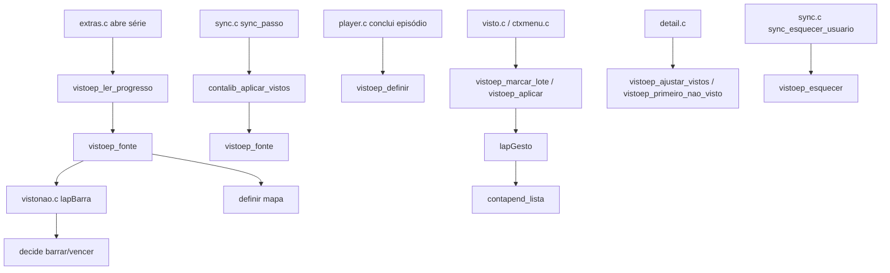
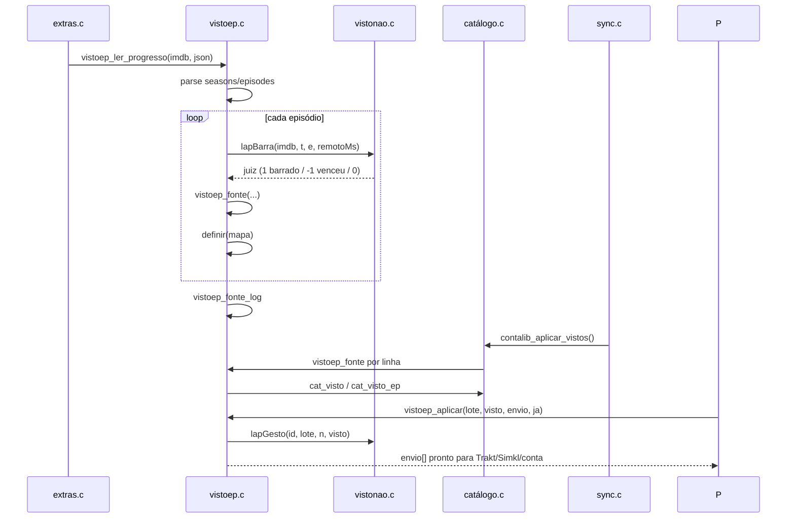

# vistoep.c — Mapa de episódios vistos

## Para que serve

Guarda, por série, quais episódios foram vistos. Alimenta o selo "% assistido", o botão "Marcar como assistido", a lógica de "até aqui"/"temporada inteira" e as escritas para Trakt/Simkl/conta. Roda em todas as plataformas.

## Funções públicas

| Assinatura | O que faz | Fio | Pré-condições | Travas | Efeitos colaterais |
|---|---|---|---|---|---|
| `int vistoep_estado(...)` | -1 desconhecido, 0 não visto, 1 visto. | Qualquer | — | `trava` | — |
| `void vistoep_definir(...)` | Marca episódio localmente; avisa juiz de desmarcações. | Principal | — | `trava` | Altera mapa; pode chamar `lapGesto`; `vistoep.c:105-120`. |
| `int vistoep_contar(...)` | Quantos episódios da obra estão vistos. | Principal | — | `trava` | — |
| `int vistoep_conhecido(...)` | 1 se obra tem alguma entrada no mapa. | Principal | — | `trava` | — |
| `int vistoep_ler_progresso(...)` | Lê `/shows/id/progress/watched` do Trakt; escreve 0 e 1. | Fio de extras | JSON válido. | `trava` | Preenche mapa; loga por fonte. |
| `int vistoep_fonte(...)` | Registra episódio de uma fonte; aplica juiz de desmarcações. | Principal/extras | — | `trava` | Acumula em `VistoFonte`; `vistoep.c:140-162`. |
| `void vistoep_lapides(...)` | Injeta juiz de desmarcações (`vistonao.c`). | Principal (app.c) | — | nenhuma | Seta ponteiros `lapBarra`/`lapGesto`. |
| `void vistoep_titulo_gesto(...)` | Gesto no título inteiro: avisa juiz. | Principal | — | `trava` (para montar lote) | Chama `lapGesto`. |
| `void vistoep_fonte_log(...)` | Loga por fonte quantos entraram/bloqueados. | Qualquer | — | nenhuma | `printf`. |
| `int vistoep_marcar_lote(...)` | Marca lote localmente; avisa juiz. | Principal | — | `trava` | Altera mapa. |
| `int vistoep_ajustar_vistos(...)` | Ajusta contador de vistos baseTrakt + delta, preso a [0, exibidos]. | Principal | — | nenhuma | — |
| `int vistoep_primeiro_nao_visto(...)` | Primeiro episódio não visto. | Principal | — | `trava` | — |
| `int vistoep_total(...)` | Total de entradas da obra no mapa. | Principal | — | `trava` | — |
| `int vistoep_aplicar(...)` | Aplica gesto e devolve em `envio` só os que mudaram. | Principal | — | `trava` | Altera mapa; chama `lapGesto`. |
| `int vistoep_ate_aqui(...)` / `vistoep_temporada(...)` | Montam lote até episódio ou temporada. | Principal | — | `trava` | — |
| `int vistoep_lote(...)` | Junta mapa + catálogo sem repetir. | Principal | — | `trava` | Usa `buf[VE_LOTE]` estático. |
| `unsigned vistoep_revisao(void)` | Sobe a cada mudança de estado. | Qualquer | — | `trava` | — |
| `int vistoep_n(void)` | Total de episódios no mapa (log). | Qualquer | — | `trava` | — |
| `void vistoep_esquecer(void)` | Apaga mapa. | Principal | Logout. | `trava` | `free(mapa)`. |

## Estado global

| Variável | Tipo | Quem escreve | Quem lê |
|---|---|---|---|
| `mapa` | `static Marca*` | `definir` (realloc) | todas as funções de leitura |
| `n`, `cap`, `avisouTeto` | `static int` | `definir` | leituras, `vistoep_n` |
| `revisao` | `static unsigned` | toda mudança de estado | `vistoep_revisao` |
| `trava` | `static pthread_mutex_t` | — | toda função pública |
| `lapBarra`, `lapGesto` | ponteiros estáticos | `vistoep_lapides` | `vistoep_fonte`, `vistoep_definir`, etc. |

## Grafo de chamadas (flowchart)

## Fluxo principal (sequenceDiagram)

## IMPACTOS

- **Se mexer em `definir`**: teto `VE_MAX 8000`; estourado, o mapa para de crescer mas o que entrou continua valendo (`vistoep.c:65-71`).
- **Se mexer em `vistoep_fonte`**: juiz de desmarcações (`lapBarra`) só avalia quando `visto=1` (`vistoep.c:145`); `venceu` conta quando remoto era mais novo que desmarcação.
- **Se mexer em `vistoep_aplicar` / `vistoep_marcar_lote`**: o gesto inteiro (`lote`) vai para `lapGesto`, não só os que mudaram (`vistoep.c:226`, `273`).
- **Se mexer em `vistoep_titulo_gesto`**: "marcar série inteira" solta todas as desmarcações dela (`lapGesto(id, NULL, 0, 1)`); "desmarcar" envia lote dos episódios atualmente vistos (`vistoep.c:283-305`).
- **Se mexer em `vistoep_lote`**: junta mapa + catálogo sem repetir; usa `buf[VE_LOTE]` estático (teto 256); `agT/agE` evita incluir episódios não exibidos (`vistoep.c:360-387`).
- **Se mexer em `vistoep_ler_progresso`**: só afirmações explícitas `true`/`false` de `completed` entram; `last_watched_at` é usado como `remotoMs` para o juiz (`vistoep.c:450-458`).
- **Contratos com Kotlin/.NET/JS**: não há neste módulo.
- **Testes**: `tests/vistoep_corrida.sh`. Não há teste unitário para `vistoep_ler_progresso`, `vistoep_lote` nem juiz de desmarcações.

## Regressões já acontecidas

- **Silo (08/10/2026)** — episódio desmarcado voltava pelo Trakt/conta: introduziu `vistoep_lapides` e juiz de desmarcações (`vistonao.c`) (commit `005b3095`).
- **Log por fonte** (commit `903b41a1`): `VistoFonte` e `vistoep_fonte_log` para dizer quem marcou e o que foi barrado.
- **Botão principal e próximo episódio seguem mapa** (commits `8e6a52f1`, `d39af0d0`).
- **Lote só manda episódios que mudaram** (commit `3ce99022`).
- **Trava do mapa** para corrida entre fios (commit `25988de7`).
